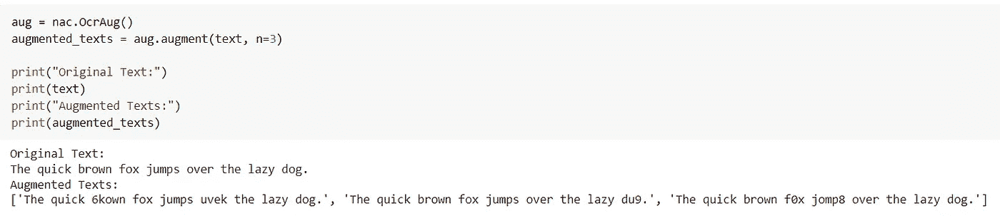
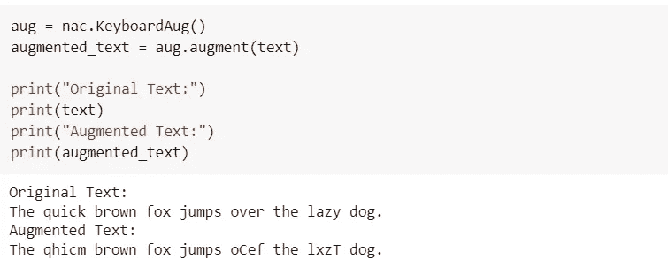
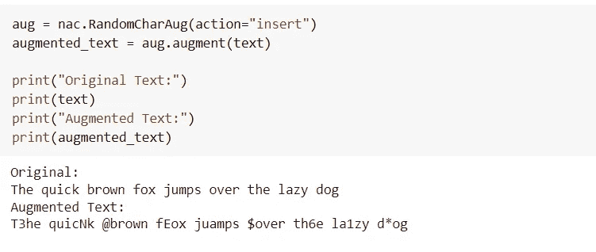
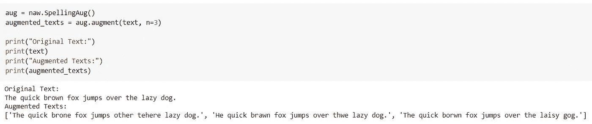
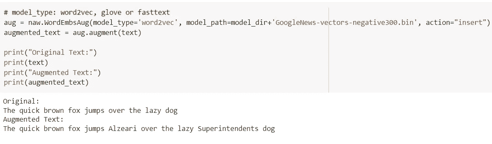
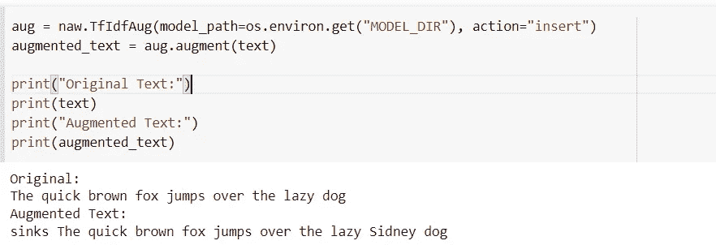
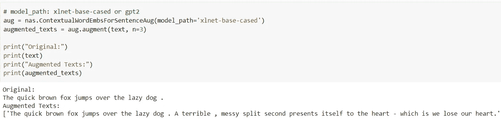

# 几行 Python 代码中的文本扩充

> 原文：<https://towardsdatascience.com/text-augmentation-in-few-lines-of-python-code-cdd10cf3cf84>

## 用 NLPAUG 增强自然语言处理中的数据


图片由 [Pixabay](https://pixabay.com/?utm_source=link-attribution&amp;utm_medium=referral&amp;utm_campaign=image&amp;utm_content=3461405) 的 [Mudassar Iqbal](https://pixabay.com/users/kreatikar-8562930/?utm_source=link-attribution&amp;utm_medium=referral&amp;utm_campaign=image&amp;utm_content=3461405) 提供

图像增强是在训练 CNN 模型之前对原始图像数据执行的常见任务。图像增强是指操纵图像，包括旋转、剪切、翻转、灰度缩放等。由于语义不变变换，CNN 模型的性能提高，因此图像增强是计算机视觉中的重要工具。

类似于图像扩充，可以为 NLP 任务执行文本扩充，以生成文本数据的语义不变变换。在本文中，我们将讨论一个开源 Python 库——NLP aug，它可以用几行 Python 代码执行文本扩充。

# NLPAUG 及其特性？

NLPAUG 是一个 Python 库，帮助开发人员扩充 NLP 任务的文本数据。

> 根据 NLPAUG 的 [GitHub 页面，其主要特点是:](https://github.com/makcedward/nlpaug)

*   生成合成文本数据以提高模型性能
*   支持音频输入
*   用 3 行 Python 代码执行文本扩充
*   易于即插即用到任何机器学习/神经网络框架(例如 scikit-learn、PyTorch、TensorFlow)

文本增强器是 NLP-AUG python 库的一个关键特性。它提供各种针对每个字符，单词，句子，音频，声谱图的增强器。让我们来讨论上述每个增强器的深入实现。

## 安装:

NLPAUG 库是开源的，可以从 PyPI 安装，使用:

```
**pip install nlpaug**
```

# 实施:

## 1.)字符增强器:

字符增强器指的是在字符级别增强数据。可能的场景包括图像到文本和聊天机器人。在从图像中识别文字的过程中，我们需要光学字符识别(OCR)模型来实现，但 OCR 会引入一些错误，如识别“0”和“0”。

NLPAUG 提供 3 个函数来执行字符增强器:

*   **OCR aug:模拟 OCR 引擎错误**



(图片由作者提供)，OCRAug 实现

*   ***键盘 Aug:*** 模拟键盘距离误差



(图片由作者提供)，KeyboardAug 实现

*   ***随机增强:*** 随机应用增强



(图片由作者提供)，RandomAug 实现

## 2.)单词增强器:

除了字符增强，单词级别也很重要。它利用 word2vec、GloVe、fast text、BERT 和 wordnet 来插入和替换相似的单词。

NLPAUG 提供 7 个函数来执行单词增强器:

*   ***拼写错误:*** 根据拼写错误词典替换单词



(图片由作者提供)，SpellingAug 实现

*   ***word mbsaug:***利用 [word2vec](/3-silver-bullets-of-word-embedding-in-nlp-10fa8f50cc5a) 、 [GloVe](/3-silver-bullets-of-word-embedding-in-nlp-10fa8f50cc5a) 或 [fasttext](/3-silver-bullets-of-word-embedding-in-nlp-10fa8f50cc5a) 嵌入来应用增强



(图片由作者提供)，WordEmbsAug 实现

*   ***TfIdfAug:*** 使用 TF-IDF 找出应该如何扩充单词



(图片由作者提供)，TfIdfAug 实现

*   ***contextualwordenmbsaug:***向 [BERT](/how-bert-leverage-attention-mechanism-and-transformer-to-learn-word-contextual-relations-5bbee1b6dbdb) 、DistilBERT、 [RoBERTa](https://medium.com/towards-artificial-intelligence/a-robustly-optimized-bert-pretraining-approach-f6b6e537e6a6) 或 [XLNet](https://medium.com/dataseries/why-does-xlnet-outperform-bert-da98a8503d5b) 语言模型输入环境词，以找出最适合增强的词
*   ***FasttextAug:*** 使用单词嵌入找到最相似的一组单词来替换原来的单词
*   ***BertAug:*** 使用语言模型预测可能的目标词
*   ***WordNetAug:*** 用统计的方式找到一组相似的单词

## 3.)句子增强器:

*   ***contextualwordsforsentenceaug:***根据 [XLNet](https://medium.com/dataseries/why-does-xlnet-outperform-bert-da98a8503d5b) 、 [GPT2](/too-powerful-nlp-model-generative-pre-training-2-4cc6afb6655) 或 DistilGPT2 预测插入句子



(图片由作者提供)，ContextualWordEmb 实现

*   ***【AbstSummAug:***
    用抽象概括的方法概括文章。

# 结论:

在本文中，我们讨论了一个可以扩充文本数据的开源 Python 库。这个 Python 库在处理 NLP 任务时是一个方便的工具。与图像增强相比，NLPAUG 可能有助于提高模型的性能。

NLPAUG 库也执行音频信号的增强。

# 参考资料:

[1] NLPAUG 文档:[https://github.com/makcedward/nlpaug](https://github.com/makcedward/nlpaug)

> 感谢您的阅读