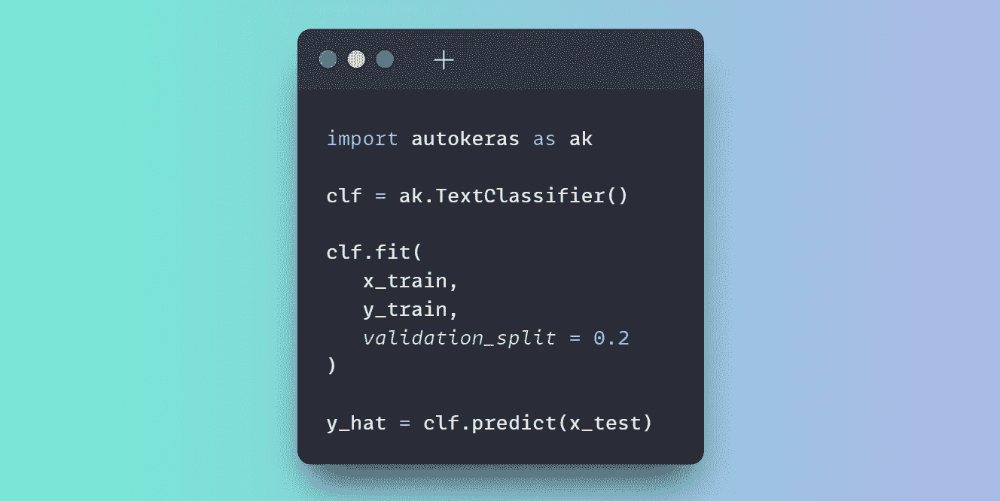
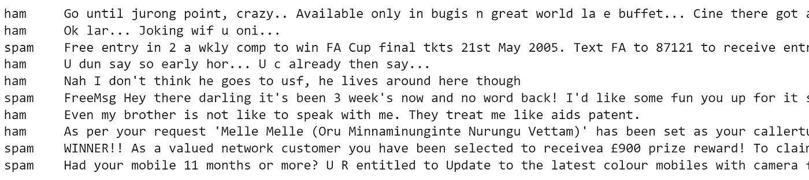
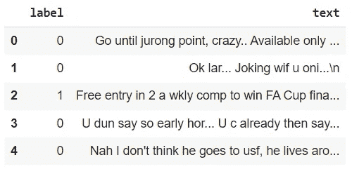
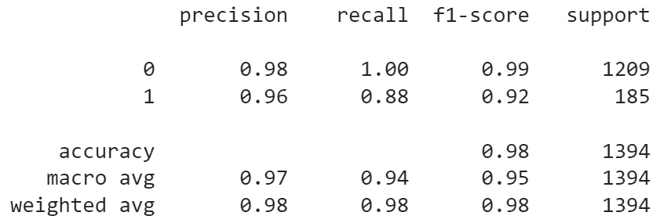
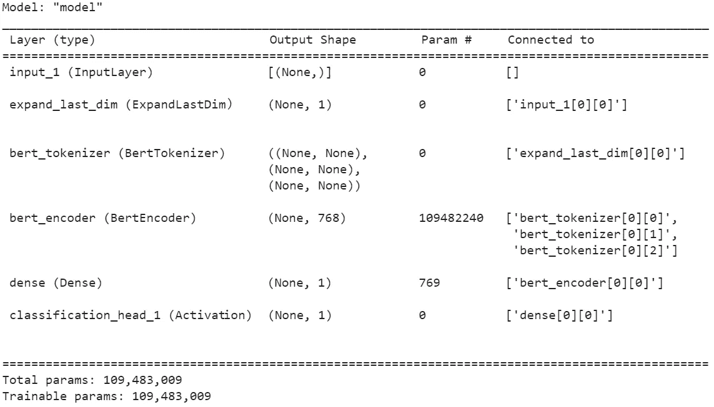

# AutoKeras 简化了文本分类

> 原文：<https://towardsdatascience.com/text-classification-made-easy-with-autokeras-c1020ff60b17>

## 一个利用自动机器学习能力的简单例子



图片作者。

# 目录

1.  [简介](#d320)
2.  [环境设置](#65b1)
3.  [数据准备](#e9c4)
4.  [文本分类](#0e0a)
5.  [导出性能最佳的型号](#e8df)
6.  [结论](#82ea)
7.  [参考文献](#73b5)

# 1.介绍

**自动化机器学习** ( **AutoML** )旨在自动化机器学习解决方案的设计。

特别是，它包括一系列技术来自动确定数据准备、模型和超参数的最佳集合。

AutoML 可以通过更容易地采用机器学习来支持该领域知识有限的用户。此外，它还可以通过加速实验和缩短上市时间来帮助更高级的用户。

在神经网络竞赛中，AutoML 在不同的神经网络架构和超参数中搜索，以找到最佳匹配，这个过程称为**神经架构搜索** ( **NAS** )。

**AutoKeras** 是一个开源库，使用 Keras API 实现了深度学习的 AutoML。

在这篇文章中，我们将使用 AutoKeras 来训练一个文本分类器，能够在几行代码中检测垃圾邮件。特别是，我们将提供代码片段，可以很容易地在⁴.的谷歌实验室复制和执行

# 2.环境设置

让我们从 Colab 笔记本上安装 AutoKeras:

```
!pip install autokeras
```

要在本地环境下安装 AutoKeras，我们应该在官方文档上查看与 Python 和 TensorFlow 的兼容性。让我们导入所需的库:

```
import pandas as pd
import numpy as np
import tensorflow as tf
import autokeras as ak
```

# 3.数据准备

对于这个例子，我们将使用来自⁶.**UCI 机器学习库**的公开可用的**垃圾短信收集数据集** ⁵ 该数据由一个文本文件组成，其中包含一组被标记为垃圾邮件或 ham 的 SMS 消息。

我们进行如下操作:

*   将数据集下载为 zip 文件夹:

```
!wget "https://archive.ics.uci.edu/ml/machine-learning-databases/00228/smsspamcollection.zip"
```

*   打开文件夹:

```
!unzip -o smsspamcollection.zip
```

*   检查数据文件的前几行:

```
!head -10 SMSSpamCollection
```



图片作者。

*   对于每一行，我们注意到标签后面跟着一个制表符和原始文本消息。我们选择处理文件以获得一个`pandas.DataFrame` 对象，因为这种格式代表了数据科学实验中的一个共同起点:

```
fileName = '/content/SMSSpamCollection'df = pd.DataFrame({'label':int(), 'text':str()}, index=[])with open(fileName) as f:
  for line in f.readlines():
    split = line.split('\t')
    df = df.append({'label': 1 if split[0]=='spam' else 0,
                    'text': split[1]},
                   ignore_index = True)df.head()
```



图片作者。

*   `autokeras.TextClassifier` ⁷类需要以`numpy.ndarray`或`tf.data.Dataset`的形式输入数据。因此，我们转换我们的数据，并将它们分成训练集和测试集:

```
from sklearn.model_selection import train_test_splitx = np.array(df.text)
y = np.array(df.label)x_train, x_test, y_train, y_test = train_test_split(x, y, test_size=0.25)
```

# 4.文本分类

为了构建文本分类器，我们只需要创建一个`autokeras.TextClassifier` ⁷类的实例，并将其放在训练数据上:

```
clf = ak.TextClassifier()clf.fit(x_train, y_train)
```

AutoKeras 将**根据验证数据的性能自动确定最佳模型和超参数**。

注意事项:

*   `autokeras.TextClassifier`类接受`max_trials`参数来设置可以尝试的不同 Keras 模型的最大数量。因为默认值是 100，所以为了快速演示，可能需要减小它，例如`clf = autokeras.TextClassifier(max_trials = 3)`。
*   我们之前将标签映射到整数(0: ham，1: spam)。这不是绝对必要的:我们可以使用原始标签作为 well⁷.
*   默认情况下，AutoKeras 使用最后 20%的训练数据作为验证数据。可以使用`validation_split`参数来指定所需的分流比，例如:

```
clf.fit(x_train, 
        y_train,
        validation_split = 0.3)
```

在训练过程之后，我们可以使用最佳分类器对测试集进行预测并评估性能:

```
from sklearn.metrics import classification_reporty_hat = clf.predict(x_test)print(classification_report(y_test, y_hat))
```



测试集评估。图片作者。

# 5.导出性能最佳的模型

可以导出最佳分类器并检查其架构，如下所示:

```
# get the best performing model
model = clf.export_model()# display the architecture of the best performing model
model.summary()
```



运行 max_trials=3 的实验后获得的最佳性能模型的体系结构。图片作者。

重要的是要记住，这个模型来自一个不同的过程，而不是超参数调整。在超参数调整中，模型是已知的，我们通过在给定范围的可能值中搜索来调整一些参数，以提高性能。相反，对于 NAS，我们试图确定模型体系结构本身。因此，其他培训工作可能会导致不同于上面显示的模型架构。

还可以保存和加载模型以备将来使用:

```
from tensorflow.keras.models import load_model# save the model on disk
model.save("text_classifier", save_format = "tf")# load the model from disk
loaded_model = load_model("text_classifier",
                          custom_objects = ak.CUSTOM_OBJECTS)# use loaded model for future predictions on new samples
loaded_model.predict(x_test)
```

# 6.结论

在这篇文章中，我们用几行代码创建了一个强大的文本分类器。我们利用了 AutoML 的强大功能和直观简洁的 AutoKeras 界面。

AutoML 寻求简化机器学习。它通过自动化人类实验中最耗时的阶段来减少人工劳动。它还使缺乏该领域更深知识的观众更容易采用机器学习。

AutoKeras 官方文档包含更多示例和高级主题。

# 7.参考

[1][https://en.wikipedia.org/wiki/Neural_architecture_search](https://en.wikipedia.org/wiki/Neural_architecture_search)

[2][https://autokeras.com/](https://autokeras.com/)

[3]金海峰、宋清泉、； *Auto-keras:一个高效的神经结构搜索系统*；第 25 届 ACM SIGKDD 知识发现国际会议论文集&数据挖掘；ACM2019 ( [环节](https://arxiv.org/abs/1806.10282))

[https://colab.research.google.com/](https://colab.research.google.com/)

[https://archive.ics.uci.edu/ml/datasets/sms+spam+collection](https://archive.ics.uci.edu/ml/datasets/sms+spam+collection)

[https://archive.ics.uci.edu/ml/index.php](https://archive.ics.uci.edu/ml/index.php)

[https://autokeras.com/text_classifier/](https://autokeras.com/text_classifier/)