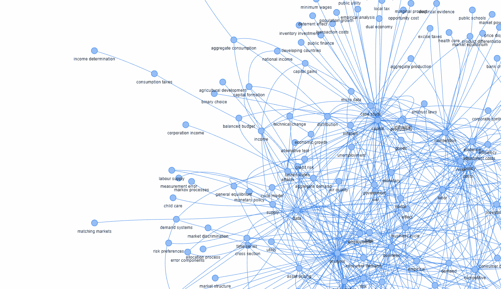
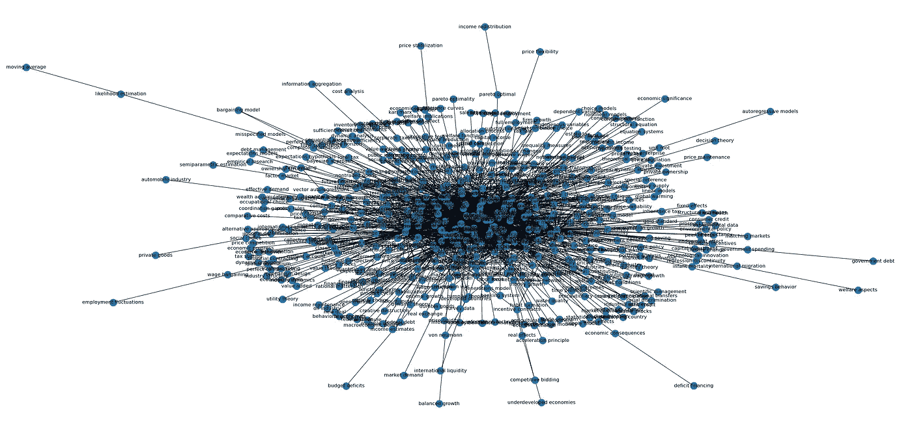
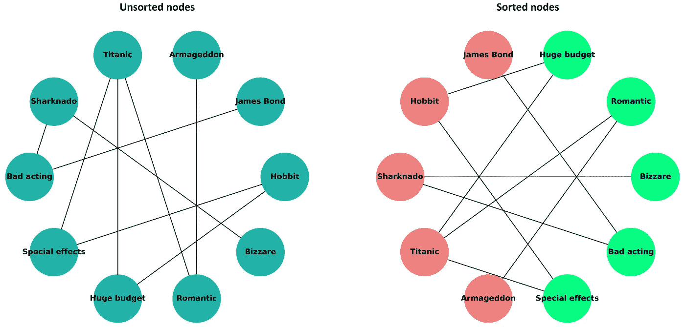
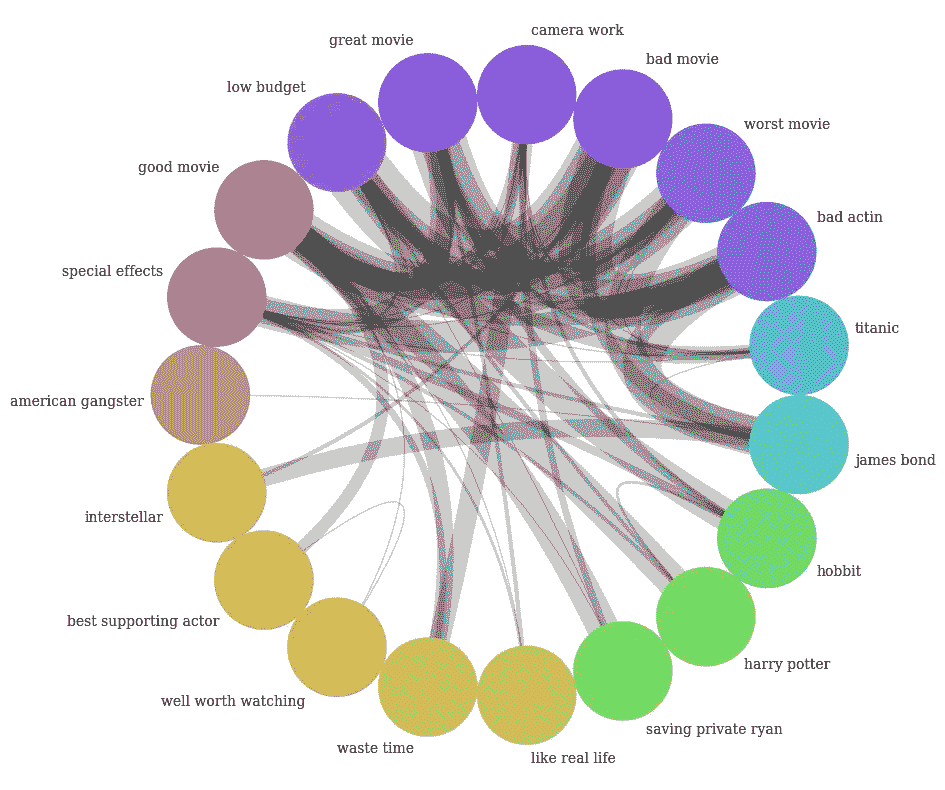
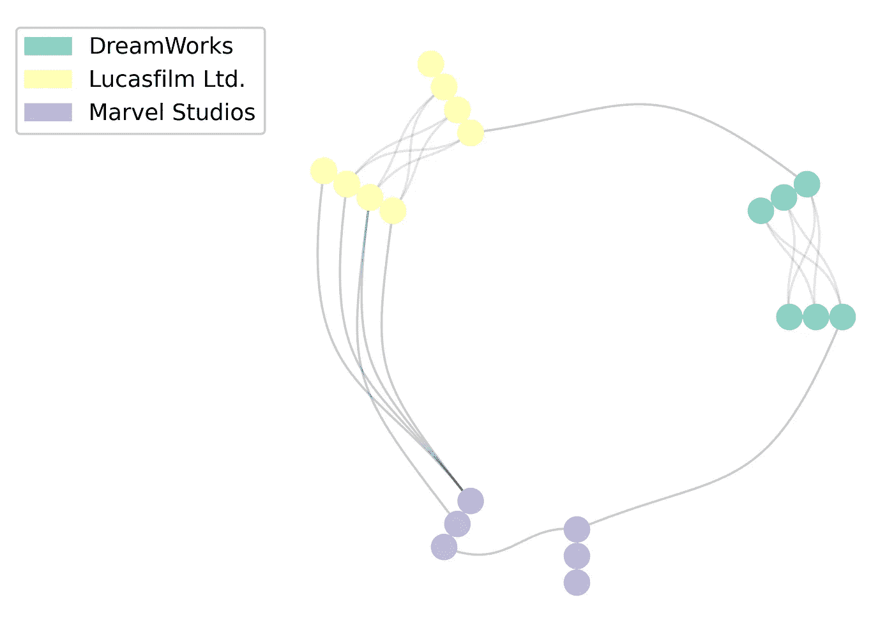
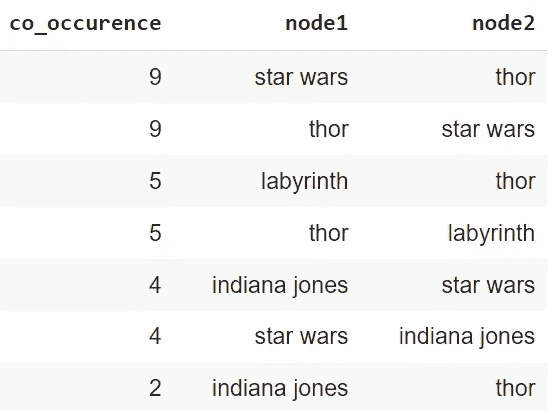
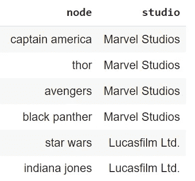
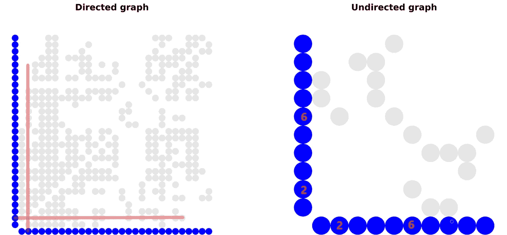

# 文本网络分析:生成美丽的网络可视化

> 原文：<https://towardsdatascience.com/text-network-analysis-generate-beautiful-network-visualisations-a373dbe183ca>

了解如何以圆形、放射状和矩阵形式可视化文本网络:圆形、蜂窝状和矩阵图。同时，学习绘制文本网络的注意事项。

图一。文网图 via [Pyvis](https://pyvis.readthedocs.io/en/latest/) 。作者图片

# 介绍

本文开发了一个关于 Python 文本网络分析的系列。它建立在 [**文本网络分析:理论与实践**](https://medium.com/towards-data-science/text-network-analysis-theory-and-practice-223ac81c5f07) 的基础上，奠定了文本网络的基础，以及 [**文本网络分析:网络构建方法的简明回顾**](/text-network-analysis-a-concise-review-of-network-construction-methods-8e875108f058) ，侧重于数据准备和网络构建策略。

最后一篇文章将构建文本网络的策略分为(I)从原始文本中提取网络，和(ii)网络建立在预处理数据的基础上，边缘和节点定义清晰。在本文中，我们将扩展第二个选项，并使用预处理的经典 [IMDb 50K 电影评论](https://www.kaggle.com/datasets/atulanandjha/imdb-50k-movie-reviews-test-your-bert)(参见[数据许可](http://www.gnu.org/licenses/lgpl-3.0.html))来说明以下网络图形:

*   **circos 图:**以圆形布局可视化网络
*   **蜂巢图:**沿几个轴构建网络图
*   **矩阵绘图:**以矩阵形式绘制网络。

我们将不涉及标准的 [**网络图**](https://www.data-to-viz.com/graph/network.html) ，而是关注更高级的情节。Pyvis 是一个非常方便的 Python 库，支持图形小部件的交互式配置，在这里可以有效地使用。[本教程](/pyvis-visualize-interactive-network-graphs-in-python-77e059791f01)由 [Khuyen Tran](https://medium.com/u/84a02493194a) 提供了一个很好的介绍。另外，构成 circos 基础的 [**圆弧图**](https://ericmjl.github.io/Network-Analysis-Made-Simple/01-introduction/03-viz/) 可以在文本网络上直观地开发。

# 文本网络可视化的最佳实践

第一步，让我们总结一些网络可视化的注意事项，这些事项通常适用于大多数网络结构，而不仅仅是文本网络。尽管有选择性且主要基于个人经验，但遵循这些原则有助于避免绘制网络数据时的一些主要陷阱。

## #1:从目标开始

网络数据结构可能非常复杂。为了使可视化工作成功，在一开始就要弄清楚(1)你想用图形讲述的故事，以及(2)你想突出哪些关系。

## #2:避免“毛球”

图二。毛球——例如。作者图片

> "可视化的目的是洞察力，而不是图片."本·斯奈德曼。

**“毛球”**是一个术语，指的是显示连接的图形，这些连接如此密集，以至于无法有效地可视化。我们可能会遇到这样的情况，我们绘制的图表有大量的节点(一个经验法则是 30 个或更多的节点，就像马(2022 )建议的那样)，可视化的结果是一团乱麻。图 2 给出了一个这样的例子。

可能的解决方案包括:

1.  **对节点进行排序**:将节点数量减少到最重要的节点(例如，只有那些边超过一定权重的节点)
2.  **分组节点** s:对数据进行不同的预处理，将节点分组到特定的类别中
3.  **选择合适的图形:**有些图，比如 circos 图，可以更好的显示节点多的数据
4.  调整**图形属性**:图像大小等。

## #3:优先考虑重要的边缘

在许多情况下，我们对特定的节点和相应的边比其他数据更感兴趣。让我们给它们一个优先级，增加边缘线的宽度，或者使用特定的颜色来区分它们，如果这对您的数据故事有意义的话。

> "图的核心在于它的边，而不在于它的节点."约翰·奎肯布什，哈佛大学公共卫生学院。

这里有一个例子:

> “随着新冠肺炎病毒的传播，接触者追踪变得相当重要。在传染病接触网络中，个体是节点，某种类型的个体之间的接触是边，这个接触网络中的“重要”节点将是被感染的个体，以及在被感染期间与许多人接触的个体。*(马和塞斯，2022)* 。

## #4:节点的位置和颜色很重要

图表中节点的正确定位和着色可能会提高图表的信息价值，同时保持数据结构不变。

> 为了最大程度地提供信息和交流，图形可视化应该首先以一种有意义的方式对节点放置进行优先级排序。【马】(马和塞斯，2022)。

作为一个例子，我们可以从电影评论中看到两个电影网络及其特征(图 3)。左侧未排序的图表可能需要一段时间才能理解。对节点进行排序，将电影标题和特写放在情节的相对侧，并对节点组进行着色，即使对于这样一个小网络也能提高理解。点击查看图形[的代码。](https://github.com/PetrKorab/Text-Network-Analysis-Generate-Beautiful-Network-Visualisations)

图 3。网络图中已排序和未排序的节点。作者图片

# Circos 图—从网络到圆

现在让我们来发现三个建立在网络上的图。一个 **circos plo** t，或者更一般的一个**弦图，**以圆形显示网络。

图 4。Circos 图。来源: [Korab。文本数据分析的高级可视化](/advanced-visualisations-for-text-data-analysis-fc8add8796e2)

circos 图中的边通常被绘制为*弧*，它们的大小与连接的重要性成比例。 [Krzywinski 等人(2009](https://genome.cshlp.org/content/early/2009/06/15/gr.092759.109.abstract) )最初开发了以圆形布局显示关系以可视化基因组数据的想法，并很快在其他领域扎根，例如*劳动经济学* ( [Malhotra 等人，2016](https://www.tandfonline.com/doi/abs/10.1080/00207659.2016.1163989) )和*应用机器学习* ( [Zoabi 等人，2021](https://www.nature.com/articles/s41598-021-99105-2) )。

> 许多修改的核心思想本质上是相同的:以圆形显示节点和边，通常在图形上添加一些更高级的见解。

有很多种工具和库可以实现类似 Circos 类型的图形。在 Python 中分别是 [*Nxviz*](https://github.com/ericmjl/nxviz) *，* [*Circos，*](https://pypi.org/project/Circos/)*[*PCircos*](https://github.com/CJinny/PCircos)*，或者*[*pyCircos*](https://github.com/ponnhide/pyCircos)*。*对于使用预处理文本数据的 python 编码，你可以使用我以前的文章 [**文本数据分析的高级可视化**](/advanced-visualisations-for-text-data-analysis-fc8add8796e2) 作为参考。*

# *蜂巢图-从网络到坐标系*

***蜂巢图**是一种稍微高级一点的网络可视化方法，其中节点根据明确定义的坐标系放置在径向线性轴上。*

**

*图 5。蜂巢情节与预处理电影评论。作者图片*

*在该图中，**节点**被分配给两个(或多个)轴中的一个，这两个轴可以被分成段。**边缘**被绘制成曲线，可以用颜色、厚度或标签进行注释，以传达附加信息。阅读原文 [Krzywinski 等人(2012)](https://academic.oup.com/bib/article/13/5/627/412507) 了解更多基础理论。*

*Hive plot 对于文本挖掘中的数据可视化的明显优势是:*

*   ***组间和组内连接可视化:**一个毛团型网络可以被向下钻取，以发现节点组内和节点组之间的关系。*
*   ***直接网络视觉可比性**:有可能评估两个或更多网络的网络结构，因为蜂巢图是基于网络属性，*而非*美学布局。*

***研究问题**:影评人在影评中主要比较哪些电影公司？*

***数据**被转换成反映电影名称在评论中的同现的节点和边。数据中的每一行都表明这些节点在一次审查中联合出现的频率。数据如下所示:*

**

*此外，我们将为每个节点使用节点属性:*

**

## *履行*

*Python 为 hive plots 提供了几个库——最常见的是 [**Nxviz**](https://ericmjl.github.io/Network-Analysis-Made-Simple/01-introduction/03-viz/) 和[**Hiveplotlib**](https://geomdata.gitlab.io/hiveplotlib/introduction_to_hive_plots.html#Hive-Plots)**。【nxviz 提供编码高效的 hive plot 图形，Hiveplotlib 提供更复杂的解决方案和更好的文档。让我们使用前者，并准备一个回答研究问题的高效解决方案。***

*首先，让我们导入我们需要的所有东西:*

*接下来，让我们读取节点、边及其属性的数据，并创建一个图 *G:**

*最后，这段代码按照节点属性对节点进行分组和着色，并准备一个带注释的配置单元图:*

**从图 5 中的一个基本例子，我们可以看到漫威电影之间很少有组内边缘，而漫威和卢卡斯影业电影之间有很多组间联系。评论者主要比较漫威和卢卡斯的电影，可能是因为这些工作室制作类似类型的电影。**

# *矩阵图—从网络到矩阵*

*矩阵 plo 以矩阵形式显示网络。节点位于 x 轴和 y 轴上，实心正方形表示节点之间的边。*

**

*图 6。有向和无向图。图片由作者使用 [Nxviz](https://ericmjl.github.io/Network-Analysis-Made-Simple/01-introduction/03-viz/) 制作*

*以矩阵形式绘制网络有助于确定图形是有向的还是无向的。让我们用一个堆栈溢出的例子:*

> *“把图形想象成一组泵，当它们连接起来时，可以把液体送到其他人那里。在有向图中，箭头表示液体的来源和流向；在无向图中，它是双向的。”([stackoverflow.com](https://stackoverflow.com/questions/23956467/what-is-the-difference-between-a-directed-and-undirected-graph))。*

*在电影评论中，开发一个有向和无向图的例子是具有挑战性的。大多数情况下，例如，演员在同一部电影中演出，都会产生一个无向图。让我们使用标准网络的一个不同实例:*

> *图 6 中的节点是机场，边是它们之间的航班。在右边的网络中，航班从希思罗机场(节点 2)飞往巴黎戴高乐机场(节点 6)并返回(该图是无向的，该图是对称的)。在左图中，飞机从希思罗机场飞往戴高乐机场，但没有返回(有向图，有些不对称)。*

# *结论*

*本文大部分内容一般指网络可视化，要求将文本数据转换为边和节点。对于文本数据，节点是语义概念、关键字、主题组或其他具有字符串类型的实体。要从评论、电影标题或报纸文章等原始文本中绘制网络，请使用实现[社区检测算法](https://networkx.guide/algorithms/community-detection/)的工具，如 [Infranodus](/infranodus-excellent-tool-for-textual-data-analysis-2b4839e6cd10) 或 [Textnets](https://textnets.readthedocs.io/en/stable/advanced.html#using-alternate-community-detection-algorithms) 。*

*我的 GitHub[GitHub](https://github.com/PetrKorab/Text-Network-Analysis-Generate-Beautiful-Network-Visualisations)上有 Jupyter 笔记本的代码。*

**PS:你可以订阅我的* [*邮件列表*](https://medium.com/subscribe/@petrkorab) *在我每次写新文章的时候得到通知。如果你还不是中等会员，你可以在这里加入*<https://medium.com/@petrkorab/membership>**。***

# **参考**

**[1] Krzywinski，m .，Birol，I .，s .，Jones，s .，J.M .，Marra，m .，A. 2012。蜂巢图——可视化网络的理性方法。 [*生物信息学简介*](https://academic.oup.com/bib/article/13/5/627/412507?login=false) 13(5)。**

**[2] Krzywinski，m .，I .，Schein，j .，e .，Birol，I .，Connors，j .，Gascoyne，r .，Horsman，d .，Jones，s .，j .，Marra，m .，a .，2009 年。比较基因组学的信息美学。 [*基因组研究*](https://genome.cshlp.org/content/early/2009/06/15/gr.092759.109.abstract) 32 卷 6 期。**

**[3]马，鄂 2022。如何看待网络可视化？于 2022 年 7 月 14 日从[https://ericmjl.github.io/nxviz/theory](https://ericmjl.github.io/nxviz/theory/)取回。**

**[4]马，e，塞斯，M. 2022。*简化网络分析:使用 Python 和 NetworkX 介绍网络分析和应用图论*。[精益出版](https://leanpub.com/nams)。2022 年 5 月 16 日。**

**[5]马尔霍特拉，r . s .，2016 年。1960-2000 年亚洲的性别和生育劳动力迁移。<https://www.tandfonline.com/doi/abs/10.1080/00207659.2016.1163989>*国际社会学杂志第 46 卷第 2 期。***

***[6] Zoabi，y .，Kehat，o .，Lahav，d .，Weiss-Meilik，a .，Adler，a .，Shomron，N. 2021。使用机器学习预测血流感染结果。 [*科学报告*](https://www.nature.com/articles/s41598-021-99105-2) 11(20101)。***