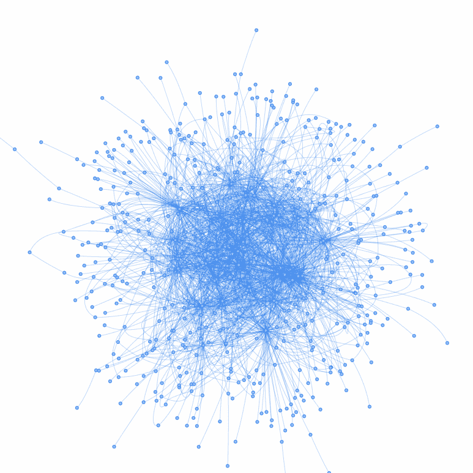
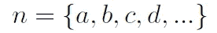
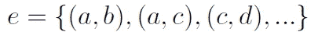
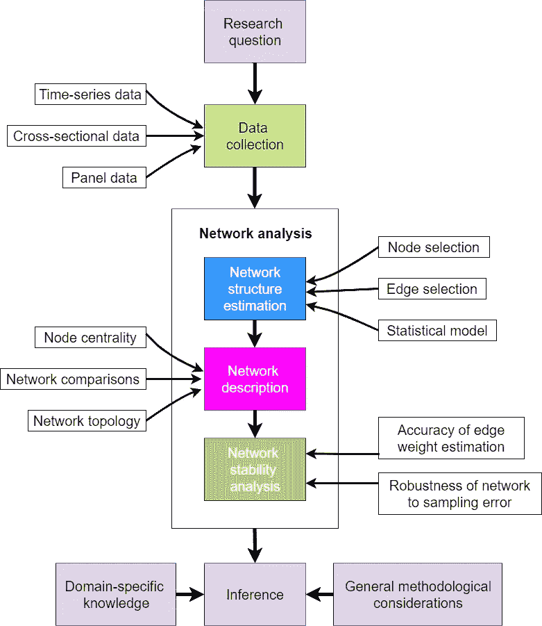

# 文本网络分析:理论与实践

> 原文：<https://towardsdatascience.com/text-network-analysis-theory-and-practice-223ac81c5f07>

## 文本网络分析属于大多数面向文本数据的分析师的更广泛的技能集。

本文开始了探索这个奇妙领域的旅程:从理论、数据准备和网络构建到可视化和预测——这个系列涵盖了 Python 中文本网络的最基本概念。

图一。文网图 via [Pyvis](https://pyvis.readthedocs.io/en/latest/) 。作者图片

20 世纪后期以来的发展，如…

*   社交网络数据的可用性(例如[推特](https://developer.twitter.com/en/docs/twitter-api))，
*   [政客声明](http://kremlin.ru/events/president/transcripts)和[央行行长会议](https://www.ecb.europa.eu/press/key/date/html/index.en.html)文字记录，
*   文本数据库的公共可用 API([Google Trends](https://pypi.org/project/pytrends/)， [RSS feeds](https://ec.europa.eu/eurostat/online-help/public/en/API_08_RSS_en/) ， [Wikipedia](https://www.programmableweb.com/api/wikipedia) ， [Google Ngrams](https://github.com/prasa-dd-vp/google_ngram_api) )
*   大数据处理技术的总体发展

…潜在的许多其他因素导致了大量的文本数据很容易被分析师、学生和研究人员访问。随着时间的推移，科学家们开发了许多复杂的方法来理解文本数据集中的关系，包括文本网络分析。

关于 Python 中文本网络分析的第一篇文章将简要介绍文本网络分析的基础**，文本网络的真实应用**，以及它们在主要数据科学和商业智能(BI)软件中的**实现。**

# 文本网络分析

在学术文献中，网络更正式地称为图。图论更严谨的理论命题可以追溯到 20 世纪 50 年代(Berge，1958)。久而久之，文字网络文学演变成了几大流派:

*   **语义网络:**对概念、主题和关键词的相互联系进行建模( [Netzer et al .，2012](https://pubsonline.informs.org/doi/10.1287/mksc.1120.0713)；[格里菲斯等人，2007 年](https://journals.sagepub.com/doi/10.1111/j.1467-9280.2007.02027.x)
*   **图神经网络:**结合神经网络与网络数据结构([廖等，2021](https://www.sciencedirect.com/science/article/abs/pii/S0045790621001051)；[克伦&泽林格，2020](https://www.pnas.org/doi/10.1073/pnas.1914370116)；[姚等人 2019](http://1.15.185.141/ir2019fall/pdf/wuhaoming.pdf)
*   **网络可视化方法:**提出网络可视化和图发现的新方法( [Paranyushkin，2019](https://noduslabs.com/wp-content/uploads/2019/06/InfraNodus-Paranyushkin-WWW19-Conference.pdf)；[塞拉多&埃弗雷特，2020](https://www.sciencedirect.com/science/article/abs/pii/S0268401218313914)
*   **软件开发和算法实现:**参见下面第三节中的例子。

这一领域在学术研究人员中迅速普及。体现在 JSTOR 数据库中以“网络”为关键词的论文量(链接[此处](https://constellate.org/builder/?keyword=network&unigrams=patients%2C+social))以及 Google Books 中文本网络和语义网络的流行程度(可从[此处](https://books.google.com/ngrams/graph?content=text+network%2C+semantic+network+analysis&year_start=1800&year_end=2019&corpus=26&smoothing=3&direct_url=t1%3B%2Ctext%20network%3B%2Cc0%3B.t1%3B%2Csemantic%20network%20analysis%3B%2Cc0#t1%3B%2Ctext%20network%3B%2Cc0%3B.t1%3B%2Csemantic%20network%20analysis%3B%2Cc00))上。

更正式地说，网络由两组对象组成(马& Seth，2022):

一个**节点**集合:图中的“实体”

一个**边**集合:图中实体之间“关系”的记录。

例如，如果节点集 *n* 由元素组成:

然后，边集 *e* 将被表示为元素对:

如果我们画出一个网络，节点通常表示为形状，如圆形，而边是形状之间的线。在文本挖掘中，边和节点可以表示为:

*   **社交和职业网络** : *节点*-*-*个人用户、*边缘*-*-*“一个用户决定追随另一个用户”
*   **报刊文章中假新闻的识别** : *节点*-*与假新闻报刊文章关联最频繁、最相关的词语，*边缘* - 词语在文章中的同现(Segev，2020)*
*   **发现** [**美国参议员关于弹劾的公开话语**](https://www.jboy.space/blog/enemies-foreign-and-partisan.html) : *节点*-参议员，*边缘* -参议员公开声明的相似之处
*   **通过分析书面文本理解政策沟通** : *书面沟通中的节点*-*-*概念，*边缘*-*-*概念在句子或段落中的同现(Shim et al .，2015)
*   **倡导组织在塑造社交媒体上的对话中的作用:** *节点*-*-*参与关于倡导问题的公共对话的行为者，*边缘*-*-*他们的消息内容的相似性(Bail，2016)。

通常，网络方法中使用的特定工作流程从研究问题的定义开始，并导致推理和决策。在不太复杂的任务中，可以省略几个步骤，但是完整的工作流包括图 2 中的步骤。

图二。网络方法中使用的工作流程示意图。资料来源:[博尔索姆等人，2021 年](https://www.nature.com/articles/s43586-021-00055-w.pdf)。图片由 draw.io

一个有趣的领域是使用文本网络进行**预测的文献流。**图结构在此用作模型，其权重可通过神经网络优化，并用于预测感兴趣的特定变量。[Krenn&zei linger(2020)](https://www.pnas.org/doi/10.1073/pnas.1914370116)利用语义网络和深度学习预测研究课题，未来五年将发表在《量子物理学》上。

# **主流软件中的网络技术**

所有主要的数据科学和 BI 工具都实施了网络分析方法。这里是最常见的库和商业程序的列表。其中一些主要不是为文本数据分析而设计的，但是通过向它们提供正确转换的数据，我们可以显示文本的网络结构:

## Python:

**网络建设:**

*   [*Networkx*](https://pypi.org/project/networkx/)
*   [*猛咬*](https://snap.stanford.edu/snappy/index.html)
*   [*图形*](https://pypi.org/project/GraphiPy/)

**网络可视化:**

*   [*皮维斯*](https://pyvis.readthedocs.io/en/latest/)
*   [*Nxviz*](https://pypi.org/project/nxviz/)

**网络建设和可视化:**

*   [*text nets for Python*](https://textnets.readthedocs.io/en/stable/)
*   [*网络 it*](https://networkit.github.io/)
*   [*Igraph*](https://igraph.org/python/)

## 朱莉娅:

*   [*GraphPlot*](https://github.com/JuliaGraphs/GraphPlot.jl)
*   [*matrix networks*](https://juliapackages.com/p/matrixnetworks)
*   
*   *[*网络*](https://juliapackages.com/p/networks)*
*   *[*生态网络*](http://docs.ecojulia.org/EcologicalNetworks.jl/stable/#EcologicalNetworks)*

## *r:*

*   *[*Textnets for R*](https://github.com/cbail/textnets)*
*   *[*visNetwork*](https://datastorm-open.github.io/visNetwork/)*(这个列表不完整，因为我不是经常使用 R 的用户)**

*由于公司需要理解复杂的网络数据结构，大多数 BI 程序包括网络方法和图形。参见 [Data Surfers (2019)](https://thedatasurfers.com/2019/08/27/how-to-use-gephi-to-create-network-visualizations-for-tableau/) 关于 **Tableau** 的网络可视化教程和 **Power B** I 中的[网络方法列表。对于其他商业和开源软件，我们可能会选择](https://appsource.microsoft.com/en-us/marketplace/apps?search=network&page=1&product=power-bi%3Bpower-bi-visuals)**(*【文字网络分析】*[**Neo4j**](https://neo4j.com/product/)(*【图形数据科学】*)[**ge phi**](https://gephi.org/)**(****)**或[**SocNetV**](https://socnetv.org/)***

# *****我们要去哪里？*****

*****本文是即将推出的用 Python 分析文本网络系列的第一部分。了解以下内容的最新动态:*****

*****[**正文网络分析从零开始#1 —数据准备和网络构建**](https://petrkorab.medium.com/text-network-analysis-a-concise-review-of-network-construction-methods-8e875108f058)*****

*****[**文字网络分析从零开始#2 —制作精美的网络可视化**](/text-network-analysis-generate-beautiful-network-visualisations-a373dbe183ca)*****

*******从头开始文本网络分析#3 —使用网络作为预测模型*******

******PS:你可以订阅我的* [*邮件列表*](https://medium.com/subscribe/@petrkorab) *在我每次写新文章的时候得到通知。而如果你还不是中等会员，可以在这里加入***。*******

# ******参考******

******[1]保释，a，C. 2016。结合自然语言处理和网络分析，研究倡导组织如何刺激社交媒体上的对话。 [*《美国国家科学院院刊》*](https://www.pnas.org/doi/pdf/10.1073/pnas.1607151113) *，*第 113 卷第 42 期。******

******[2 ]贝尔热，1958 年生。图形理论及其应用。巴黎:Dunod Editeur。******

******[3] Borsboom 等人，2021 年。心理科学中多元数据的网络分析。 [*《自然评论方法引论*](https://www.nature.com/articles/s43586-021-00055-w.pdf) ，第 1 卷，第 58 期。******

******[4]塞拉多，l .，埃弗雷特，M. G. 2020。网络文本分析:一种双向分类方法。 [*《国际信息管理杂志*](https://www.sciencedirect.com/science/article/abs/pii/S0268401218313914) 》，第 51 卷，4 月。******

******[5]格里菲斯，t .，l .，斯泰弗斯，m .，Firl，A. 2007。谷歌与思维:用 PageRank 预测流畅性。 [*《心理科学》*](https://journals.sagepub.com/doi/10.1111/j.1467-9280.2007.02027.x) *，*第 18 卷第 12 期。******

******[6]m .克伦，泽林格，2020 年。用语义和神经网络预测研究趋势及其在量子物理中的应用。 [*美国国家科学院院刊*](https://www.pnas.org/doi/10.1073/pnas.1914370116) *，v* ol。117，4 号。******

******[7]廖，曾，刘，魏建平，程，张，张. 2021 .用于文本情感分析的多层图神经网络。 [C *小型机&电气工程*](https://www.sciencedirect.com/science/article/abs/pii/S0045790621001051) ，第 92 卷，6 月。******

******[8]马，e，塞斯，M. 2022。*简化网络分析:使用 Python 和 NetworkX 介绍网络分析和应用图论*。[精益出版](https://leanpub.com/nams)。2022 年 5 月 16 日。******

******[9]o . Netzer，r . Feldman，Goldenberg，j . fres ko，M. 2012 年。挖掘你自己的生意:通过文本挖掘的市场结构监视。 [*《营销科学》*](https://pubsonline.informs.org/doi/10.1287/mksc.1120.0713) ，第 31 卷，第 3 期。******

******[10]帕拉纽什金，2019 年。InfraNodus:使用文本网络分析产生洞察力。在 2019 年 5 月 13 日美国旧金山举行的 WWW '19:网络会议的[会议录中。](https://noduslabs.com/wp-content/uploads/2019/06/InfraNodus-Paranyushkin-WWW19-Conference.pdf)******

******[11]塞格夫，2020 年。文本网络分析:检测国际新闻和社会媒体中的流行主题和偏见。 [*《社会学罗盘*](https://compass.onlinelibrary.wiley.com/doi/abs/10.1111/soc4.12779) 》，第 14 卷第 4 期。******

******[12]辛姆，j .，帕克，c .，威尔丁，m .，2015 年。通过语义网络分析识别政策框架:对六个国家核能政策的检查。 [*《政策科学*](https://link.springer.com/article/10.1007/s11077-015-9211-3) 》，第 48 卷。******

******[13]数据冲浪者。2019.如何使用 Gephi 为 Tableau 创建网络可视化？检索自[https://the data surfers . com/2019/08/27/how-to-use-ge phi-to-create-network-visualizations-for-tableau/](https://thedatasurfers.com/2019/08/27/how-to-use-gephi-to-create-network-visualizations-for-tableau/)2022–5–31。******

******[14]姚，李，毛，陈，罗，杨. 2019 .用于文本分类的图卷积网络。美国夏威夷州第三十三届 AAAI 人工智能会议(AAAI-19) 论文集。******