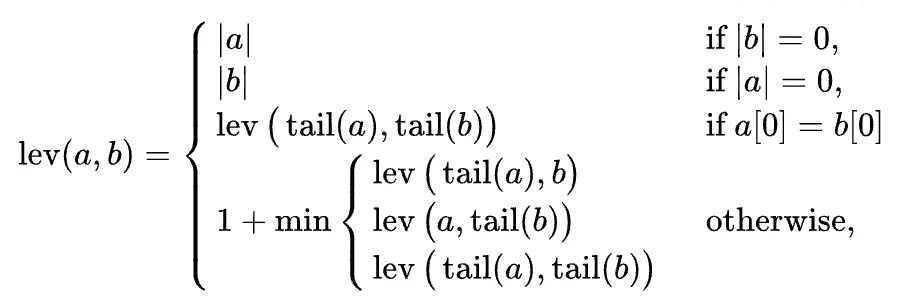
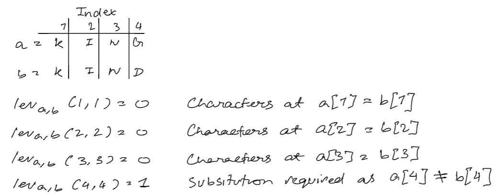
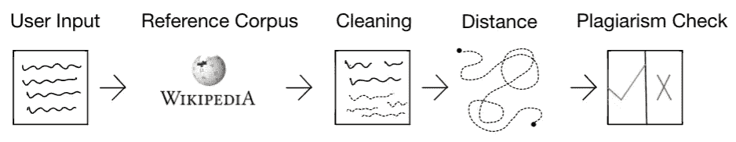
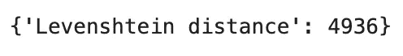
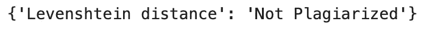

# Python 中带 Levenshtein 距离的文本相似度

> 原文：<https://towardsdatascience.com/text-similarity-w-levenshtein-distance-in-python-2f7478986e75>

## 用 Python 构建抄袭检测管道


图片来自[帕特里克·托马索](https://unsplash.com/@impatrickt)拍摄的 [Unsplash](https://unsplash.com/photos/Oaqk7qqNh_c)

在这篇文章中，我将回顾 Levenshtein 距离是如何工作的，以及如何使用 Levenshtein 距离来建立一个剽窃检测管道。

## 目录

*   文本相似性介绍
*   Levenshtein 距离
    -直觉
    -数学理解
    - Python 实现
*   问题陈述
    -解决方案架构
    -安装要求
*   取数据
*   干净的数据
*   寻找相似之处
*   检查抄袭
*   警告
*   结束语
*   资源

# 文本相似性介绍

识别文本之间的相似性是自然语言处理中的一个常见问题，世界上许多公司都在使用它。文本相似度最常见的应用来自于识别抄袭文本的形式。世界各地的教育机构，从小学、高中、学院到大学，都使用像 Turnitin 这样的服务来确保学生提交的作品是原创的，是他们自己的。文本相似性的其他应用通常由具有类似于栈溢出或栈交换的结构的公司使用。他们希望能够识别和标记重复的问题，以便张贴问题的用户可以引用带有解决方案的原始帖子。这减少了重复问题的数量，增加了平台上独特问题的数量。

文本相似度可以分解为两个部分，[语义相似度](https://en.wikipedia.org/wiki/Semantic_similarity)和[词汇相似度](https://en.wikipedia.org/wiki/Lexical_similarity)。给定一对文本，这对文本的语义相似度指的是文档在意义上有多接近。然而，词汇相似性是词汇重叠的一种度量。如果文档对中的两个文档具有相同的词汇，那么它们的词汇相似度为 1，反之亦然，如果词汇没有重叠的话[2]。

在自然语言处理和数学中，实现真正的语义相似性是一项非常困难且尚未解决的任务。这是一个需要深入研究的领域，提出的许多解决方案都涉及到一定程度的词汇相似性。对于本文的重点，我不会更深入地研究语义相似性，而是更多地关注词汇相似性。

# 莱文斯坦距离

有许多方法可以识别一对文本之间的词汇相似性，我们今天要讨论的一种方法是 Levenshtein 距离。苏联数学家弗拉基米尔·莱文斯坦于 1965 年发明的一种算法。

## 直觉

Levenshtein 距离非常有影响力，因为它不要求两个字符串长度相等才能进行比较。直观来说，Levenshtein 距离相当好理解。

> 非正式地，两个单词之间的 Levenshtein 距离是将一个单词变成另一个单词所需的单个字符编辑(插入、删除或替换)的最小数量。[1]
> -[https://en.wikipedia.org/wiki/Levenshtein_distance](https://en.wikipedia.org/wiki/Levenshtein_distance)

实质上意味着两者之间的输出距离是单个字符编辑的累积和。输出距离越大意味着需要更多的变化来使两个单词彼此相等，而输出距离越小意味着需要的变化越少。例如，给定一对单词`dream`和`dream`，得到的 Levenshtein 距离将是 0，因为这两个单词是相同的。然而，如果单词是`dream`和`steam`，那么 Levenshtein 距离将是 2，因为您需要进行 2 次编辑来将`dr`更改为`st`。

因此，Levenshtein 距离的大值意味着两个文档不相似，距离的小值意味着两个文档相似。

## 数学理解

Levenshtein 距离可以用下面的分段函数来表示:



图片取自 [Levenshtein Distance 维基百科](https://en.wikipedia.org/wiki/Levenshtein_distance)

其中`a`和`b`对应于两个输入字符串，而`|a|`和`|b|`是每个相应字符串的长度。字符串`a`或`b`的`tail`对应于字符串中除第一个字符以外的所有字符。表示`a[0]`和`b[0]`的地方，是第 0 个元素的`a`和`b`中的字符。

让我们通过下面的例子来看看 Levenshtein 距离是如何工作的。



列文斯坦距离的例子。图片由作者提供。

## 履行

与使用动态编程实现 Levenshtein 距离相关的 Python 代码。同样的代码可以通过强力和迭代解决方案来实现(注意，就时间复杂度而言，强力解决方案不是最优的)。

# 问题陈述

类似于 Turnitin 这样的软件，我们希望建立一个管道来识别输入的文章是否抄袭。

## 解决方案架构

要解决这个问题，需要做几件事。首先，我们需要获得管道用户传递的信息，为此我们不仅需要他们想要检查抄袭的文章，还需要与该文章主题对应的关键字标签。为了简化本教程，我们将使用我为本文编写的初始文本，标签为`Levenshtein Distance`。第二，我们需要一个大的文档语料库来比较用户输入的文本。我们可以利用 Wikipedia-API 来访问与用户输入数据的标签相关联的 Wikipedia 文章。然后，我们可以清除用户输入文档中的冗余，如停用词和标点符号，以更好地优化 Levenshtein 距离的计算。我们通过语料库中与用户输入文档相同标签下的每个文档来传递该清理后的文档，并识别是否存在与用户提交的文档非常相似的任何文档。



上述解决方案架构。图片由作者提供

## 安装要求

```
Python=3.8.8
python-Levenshtein=0.12.2
nltk=3.6.1
numpy=1.20.1
Wikipedia-API=0.5.4
```

为了这条管道的目的，我们将使用一个开源包，它将为我们计算 Levenshtein 距离。我们将使用这个包，因为它用 C 实现了 Levenshtein 距离，并且很可能比我们用 Python 编程编写的任何东西都要快。

要下载本教程的 Levenshtein 包，您可以在终端上运行下面的命令:`pip install python-Levenshtein`按照他们的安装指南找到[这里](https://pypi.org/project/python-Levenshtein/) [3]。或者你可以克隆与这个包相关的 [GitHub 库](https://github.com/ztane/python-Levenshtein)并相应地使用它。

为了将用户输入的文章与另一篇文章进行比较，我们将参考维基百科。你可以通过维基百科图书馆很容易地获取维基百科的文本数据。您可以在您的控制台上运行以下命令:`pip install wikipedia`根据安装指南找到[这里](https://pypi.org/project/Wikipedia-API/)。或者你可以克隆与这个包相关的 [GitHub 库](https://github.com/martin-majlis/Wikipedia-API)并相应地使用它。

# 取数据

当用户在标签`Levenshtein Distance`下提交文章时，上面的代码基本上传递了我的文章的初始部分。它还通过维基百科模块获取 Levenshtein 距离的维基百科页面。

# 干净的数据

现在我们可以清除与用户提交和维基百科获取的文章相关的数据。我们将对文本做一些简单的数据预处理，降低文本，删除停用词和标点符号。

# 寻找相似之处



用户输入文章与取自维基百科的内容的距离与标签 Levenshtein 距离相关联。图片由作者提供。

现在这个值对你来说可能看起来比较随意，很难确定这个值是否反映了内容是否抄袭。值越大，基于我们对 Levenshtein 距离的理解，被认为抄袭的可能性就越小。然而，很难确定距离不够大的阈值。

# 检查抄袭

我们将通过一个简单的公式化方法来检查抄袭。首先，我们得到用户提交的文章和内容之间的最大长度。然后我们检查 Levenshtein 距离是否小于或等于该值乘以某个阈值(我用的是 0.4)，那么该用户提交的文章可以被认为是抄袭的。



管道的结果，最初输入的文章被管道归类为“未抄袭”。图片由作者提供。

# 警告

使用上述管道有许多注意事项。

1)该管道不识别哪些区域是抄袭的，哪些区域不是，它仅产生抄袭的总体分数。该过程不考虑正确引用和引述的文本片段。这将误导性地增加整体抄袭分数。很难确定多大或多小的距离才算抄袭。

# 结束语

Levenshtein 距离是一种词汇相似性度量，它标识一对字符串之间的距离。它通过计算从字符串 1 中插入、删除或替换一个字符的次数来使它像字符串 2 一样。配对之间的距离越大，意味着字符串彼此不相似，反之亦然。

我创建这个管道的方式使得它很容易与其他文本相似性度量集成。Levenshtein 距离是用来识别一对文本之间词汇相似性的一个很好的度量，但是它并不意味着没有其他表现良好的相似性度量。特别想到的是 Jaro-Winkler 乐谱，它可以很容易地在这个管道中实现。请注意，Jaro 相似性输出的结果与 Levenshtein 距离的解释不同。你可以在这里找到关于其他模糊字符串匹配的文档，比如 Levenshtein 距离。

你可以在我为这个项目创建的 Jupyter 笔记本中完成这个管道。你可以在我的 GitHub 页面[这里](https://github.com/vatsal220/medium_articles/blob/main/levenshtein_distance/lev_dist.ipynb)找到这个笔记本。

# 资源

*   [1]https://en.wikipedia.org/wiki/Levenshtein_distance
*   [2][https://en.wikipedia.org/wiki/Lexical_similarity](https://en.wikipedia.org/wiki/Lexical_similarity)
*   [https://pypi.org/project/python-Levenshtein/](https://pypi.org/project/python-Levenshtein/)

如果你喜欢这篇文章，这里还有一些你可能也会喜欢的:

[](/text-summarization-in-python-with-jaro-winkler-and-pagerank-72d693da94e8) [## 用 Jaro-Winkler 和 PageRank 实现 Python 中的文本摘要

### 用 Jaro-Winkler 和 PageRank 构建一个文本摘要器

towardsdatascience.com](/text-summarization-in-python-with-jaro-winkler-and-pagerank-72d693da94e8) [](/word2vec-explained-49c52b4ccb71) [## Word2Vec 解释道

### 解释 Word2Vec 的直观性&用 Python 实现它

towardsdatascience.com](/word2vec-explained-49c52b4ccb71) [](/link-prediction-recommendation-engines-with-node2vec-c97c429351a8) [## 使用 Node2Vec 的链接预测推荐引擎

### 在 Python 中使用节点嵌入进行链接预测

towardsdatascience.com](/link-prediction-recommendation-engines-with-node2vec-c97c429351a8) [](/bayesian-a-b-testing-explained-344a6df88c1a) [## 贝叶斯 A/B 测试解释

towardsdatascience.com](/bayesian-a-b-testing-explained-344a6df88c1a) [](/mining-modelling-character-networks-part-ii-a3d77de89638) [## 挖掘和模拟字符网络—第二部分

### 本文将介绍挖掘和建模字符网络的 Python 实现

towardsdatascience.com](/mining-modelling-character-networks-part-ii-a3d77de89638) [](/optimize-training-predicting-sk-learn-models-in-python-with-sparse-matrices-1612072a025d) [## 使用稀疏矩阵优化 Python 中 SK-Learn 模型的训练和预测

### 使用稀疏矩阵训练 SK-Learn 模型的速度提高了 40 倍

towardsdatascience.com](/optimize-training-predicting-sk-learn-models-in-python-with-sparse-matrices-1612072a025d) [](/identifying-tweet-sentiment-in-python-7c37162c186b) [## 在 Python 中识别推文情感

### 如何使用 Tweepy 和 Textblob 识别推文情感

towardsdatascience.com](/identifying-tweet-sentiment-in-python-7c37162c186b)