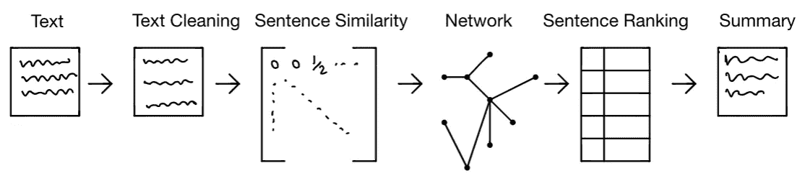
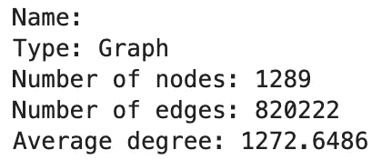
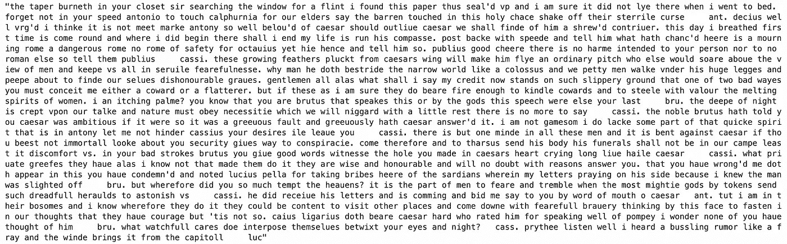

# 用 Jaro-Winkler 和 PageRank 实现 Python 中的文本摘要

> 原文：<https://towardsdatascience.com/text-summarization-in-python-with-jaro-winkler-and-pagerank-72d693da94e8>

## 用 Jaro-Winkler 和 PageRank 构建一个文本摘要器


由
[纳迪·博罗迪纳](https://unsplash.com/@borodinanadi)从 [Unsplash](https://unsplash.com/photos/gETBUi_oRgQ) 拍摄的图像

**目录**

*   文本摘要介绍
*   文本摘要的难点
*   架构概述
*   问题陈述
    -安装要求
    -数据
*   实现
    -加载文本
    -清理文本
    -创建网络
    -生成摘要
*   结束语
*   资源

# 文本摘要介绍

在现代社会中，由于需要以快速的格式摄取信息，文本摘要是许多人日常使用的基本工具。像 [Blinkist](https://www.blinkist.com/) 这样的知名初创公司提供大量书籍的简短摘要。这为他们的用户节省了几个小时甚至几天的阅读时间。许多其他公司也使用他们专有的文本摘要软件来节省用户的时间。其他形式的总结(尽管是在不同的媒体上)以体育赛事的精彩片段或电影摘要的形式出现。

有两种主要的文本摘要方法，即抽取的和抽象的。抽取解决方案需要从文本主体中选择特定的句子来生成最终的摘要。抽取解决方案的一般方法是根据句子在正文中的重要性对句子进行排序，并将最重要的句子返回给用户。然而，文本摘要的抽象解决方案包括创建新的句子来捕捉原始文本背后的上下文和含义。尽管这是人类处理文本摘要的方式，但是归纳并教给机器却是一件非常困难的事情。文本压缩技术通常用于解决文本摘要中的抽象方法[4]。

在这篇文章中，我将向你展示如何使用提取方法构建一个算法文本摘要器。我将依靠两个主要算法，首先，Jaro-Winkler 距离来测量一对句子之间的距离。最后，网页排名算法，它将根据句子在网络中的影响力对句子进行排名。

# 文本摘要的难点

解决摘要问题是相当棘手的。有很多注意事项，很难归纳出一个适用于任何文本的解决方案。在文本摘要中存在各种因素，这些因素改变了摘要可能对原始故事的影响。我在下面列出了几个组件，它们使得摘要在 NLP 中成为一项非常困难的任务:

1.  摘要必须包含的理想句子数量是多少？一个太大的数字可能没有用，因为你实际上是在阅读整个文本。太小的数字可能会在摘要中产生很大的后果，跳过重要的细节和情节主线。摘要越短，它能容纳的信息就越少。
2.  你如何在总结中给出上下文？当提供故事中次要情节的概要时，上下文是最重要的部分。这使得摘要有用，在摘要中保持上下文是一项非常困难的任务。这个问题在抽取式解决方案中比抽象式更突出。

# 架构概述

我提议的提取解决方案将具有以下架构:



本文提出的摘要架构。图片由作者提供。

这将是一个 6 步解决方案:

1.  获取输入文本
2.  清除输入文本中的某些标点符号、停用词等。
3.  生成句子相似度邻接矩阵
4.  创建句子网络(节点是句子，边保存一对句子的相似性)
5.  使用页面排名或其他排名度量来对网络中的节点进行排名
6.  基于排名前 N 位的节点(句子)生成摘要。

# 问题陈述

给定一个文本主体，我们将创建一个管道，该管道将生成输入文本主体的摘要。对于上面概述的解决这个问题的方法，这个管道需要以下 python 模块和版本。

**安装要求**

```
Python=3.8.8
jaro-winkler=2.0.1
networkx=2.5
nltk=3.6.1
numpy=1.20.1
```

通过下面的命令`!pip install jaro-winkler`来安装 Jaro 包，或者你可以在这里参考安装文档[。](https://pypi.org/project/jaro-winkler)

## 数据

我将本教程设置为任何文本都可以输入到管道中。用我选择的文本继续这个教程，或者用你自己的。下面是一组你可以通过 NLTK 图书馆和 Gutenberg 项目轻松下载的书籍。所有这些书都可以免费使用，因为它们是公共领域的一部分。

出于本教程的目的，我将使用莎士比亚关于朱利叶斯·凯撒的戏剧。请注意，威廉·莎士比亚写的这篇文章和所有其他文章都在[公共领域](https://en.wikipedia.org/wiki/Public_domain)，因为这些文章是在任何版权限制[2]存在之前创作的。

# 履行

## 加载文本

下面是 book 变量的输出示例:


我们从中导入的图书的子集。图片由作者提供。

## 干净的文本

在本节中，我们将清理刚刚导入的文本。为此，我们主要是要删除停用词和某些标点符号，以便管道中的后续程序在计算时更加高效和准确。

清理完正文后，我们只剩下`1289`个句子来创建一个网络。

## 创建网络

在这一节中，我们将通过不同句子的相似性创建一个邻接矩阵。句子的相似度将使用 [Jaro-Winkler 距离](https://en.wikipedia.org/wiki/Jaro%E2%80%93Winkler_distance)【3】来计算。该距离测量的输出将是介于值 0 和 1 之间的浮点数。这个数字越接近 1，表示这一对句子越相似。数字越接近 0，表示这对句子越不相似。

这个邻接矩阵将允许我们创建一个加权网络(通过 NetworkX)。请记住你输入文本的大小，因为相似度矩阵需要为每对句子分配一个分数，如果你的文本非常大(> 2000 个句子)，这对你的计算机来说将是一个漫长而疲惫的过程。

在创建的网络中，节点将是与书中的句子相关联的索引，并且连接句子的边将基于一对句子的相似性来加权。然后，我们可以在该加权网络上运行页面排名算法，以识别具有与其相关联的大排名的节点。

在非常高的层面上，页面排名算法背后的直觉是通过使用[随机行走](/random-walks-with-restart-explained-77c3fe216bca)来识别高度流行的节点。这是一个非常流行的基于网络的算法 Larry Page，它曾被 Google 用来在其搜索引擎结果中对网页进行排名。在我们示例的上下文中，页面排名会告诉我们网络中极具影响力的句子。然后，我们可以将前 N 个最有影响力的句子连接在一起，并以原文摘要的形式返回给用户。请注意，有许多方法可以对节点进行排序，尽管我建议使用页面排序，但像特征向量中心性、度中心性、介数中心性等排序方法也适用于此管道。

给定`1289`个句子，用`~2 minutes`创建相似度矩阵。网络的创建和网页排名分数的计算几乎是瞬间完成的。以下是所创建网络的摘要:



句子图表统计。图片由作者提供。

内置的 page rank 函数将输出一个字典，其中的键是节点(在我们的例子中是句子索引),值是该节点的相关页面排名分数。


页面排名计算输出。键是节点，值是与该节点相关联的页面排名分数。图片由作者提供。

请记住，我们希望将句子索引映射回原始句子，而不是用于创建网络的干净句子。这样，当包含停用词、标点符号等时，生成的摘要将更容易理解。

## 生成摘要

既然我们已经根据句子的页面排名分数对句子进行了排名，那么我们可以根据用户输入的他们希望包含在摘要中的句子数量来生成一个摘要。

出于本文的目的，我选择了 25 个句子来总结本文。这是相关的输出:



莎士比亚的《尤利乌斯·凯撒》用 25 句话总结。图片由作者提供。

# 结束语

摘要的结果因文本而异，对于给定的任务，某些文本的正文可能比其他的更好。总的来说，对朱利叶斯·凯撒的总结还算不错。它勾勒了布鲁图斯(凯撒的朋友)试图暗杀凯撒的主要情节线。

你可以在我的 GitHub [这里](https://github.com/vatsal220/medium_articles/blob/main/graph_summarizer/summary.ipynb)找到与这个管道实现相关的 Jupyter 笔记本。

# 资源

*   [1]https://en.wikipedia.org/wiki/PageRank
*   [2]https://en.wikipedia.org/wiki/Public_domain
*   [3][https://en.wikipedia.org/wiki/Jaro%E2%80%93Winkler_distance](https://en.wikipedia.org/wiki/Jaro%E2%80%93Winkler_distance)
*   [https://arxiv.org/pdf/1707.02268.pdf](https://arxiv.org/pdf/1707.02268.pdf)

如果你喜欢这篇文章，你可能也会喜欢。

</link-prediction-recommendation-engines-with-node2vec-c97c429351a8>  </word2vec-explained-49c52b4ccb71>  </recommendation-systems-explained-a42fc60591ed>  </optimize-training-predicting-sk-learn-models-in-python-with-sparse-matrices-1612072a025d>  <https://pub.towardsai.net/dynamic-time-warping-explained-fbb24c1e079b>  </mining-modelling-character-networks-part-ii-a3d77de89638>  </monte-carlo-method-explained-8635edf2cf58>  </bayesian-a-b-testing-explained-344a6df88c1a> [## 贝叶斯 A/B 测试解释

towardsdatascience.com](/bayesian-a-b-testing-explained-344a6df88c1a)