# 使用 NLP 的文本摘要:TextRank vs Seq2Seq vs BART

> 原文：<https://towardsdatascience.com/text-summarization-with-nlp-textrank-vs-seq2seq-vs-bart-474943efeb09>


作者图片

## 使用 Python、Gensim、Tensorflow、Transformers 进行自然语言处理

## 摘要

在这篇文章中，我将使用 NLP 和 Python 解释 3 种不同的文本摘要策略:老式的 *TextRank* (带有 *gensim* )、*著名的 *Seq2Seq (* 带有 *tensorflow* )和尖端的 *BART* (带有 *transformers* )。*

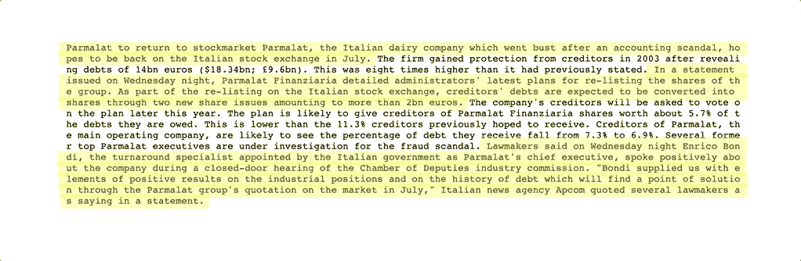

作者图片

[**【NLP(自然语言处理)**](https://en.wikipedia.org/wiki/Natural_language_processing) 是人工智能领域，研究计算机与人类语言之间的交互，特别是如何给计算机编程以处理和分析大量自然语言数据。最困难的 NLP 任务是输出不是单个标签或值(如分类和回归)，而是一个全新的文本(如翻译、摘要和对话)。

**文本摘要**是在不改变文档含义的情况下，减少文档的句子和单词数量的问题。从原始文本数据中提取信息并将其用于摘要模型有不同的技术，总体来说，它们可以分为**提取型**和**抽象型。**提取方法选择文本中最重要的句子(不一定理解意思)，因此结果摘要只是全文的子集。相反，抽象模型使用高级 NLP(即单词嵌入)来理解文本的语义，并生成有意义的摘要。因此，抽象技术很难从头开始训练，因为它们需要大量的参数和数据。

本教程比较了老派的方法 *TextRank* (提取)、流行的编码器-解码器神经网络 *Seq2Seq* (抽象)和最先进的基于注意力的*变形金刚*(抽象)，它们已经彻底改变了 NLP 领域。

我将展示一些有用的 Python 代码，这些代码可以很容易地应用于其他类似的情况(只需复制、粘贴、运行)，并通过注释遍历每一行代码，以便您可以复制这个示例(下面是完整代码的链接)。

[](https://github.com/mdipietro09/DataScience_ArtificialIntelligence_Utils/blob/master/natural_language_processing/example_text_summarization.ipynb) [## data science _ artificial intelligence _ Utils/example _ text _ summary . ipynb at master…

### 数据科学项目和人工智能用例的示例…

github.com](https://github.com/mdipietro09/DataScience_ArtificialIntelligence_Utils/blob/master/natural_language_processing/example_text_summarization.ipynb) 

我将使用“**CNN Daily Mail**”**数据集，其中为您提供了 CNN 和《每日邮报》记者用英语撰写的数千篇新闻文章，以及每篇文章的摘要(以下链接)。**

**[](https://huggingface.co/datasets/cnn_dailymail) [## cnn_dailymail 拥抱脸的数据集

### 我们正在通过开源和开放科学来推进和民主化人工智能的旅程。

huggingface.co](https://huggingface.co/datasets/cnn_dailymail) 

特别是，我将经历:

*   设置:导入包，读取数据，预处理。
*   用 *gensim* 拟合 *TextRank* 以构建基线，并使用 ROUGE 指标和数据可视化评估结果。
*   用 *tensorflow/keras* 拟合 *Seq2Seq* 来训练深度学习模型。
*   通过 HuggingFace 使用预训练的 *BART* 和*变形金刚*库。** 

## **设置**

**首先，我需要导入以下库:**

```
**## for data** import **datasets** #(1.13.3)import **pandas** aspd  #(0.25.1)
import **numpy** #(1.16.4)**## for plotting**
import **matplotlib**.pyplot as plt  #(3.1.2)
import **seaborn** as sns  #(0.9.0)**## for preprocessing**
import **re**
import **nltk** #(3.4.5)
import **contractions** #(0.0.18)**## for textrank**
import **gensim** #(3.8.1)**## for evaluation** import **rouge ** #(1.0.0)
import **difflib****## for seq2seq**
from **tensorflow**.keras import callbacks, models, layers, preprocessing as kprocessing #(2.6.0)**## for bart**
import **transformers** #(3.0.1)
```

**然后我通过 HuggingFace 使用[专用库加载数据集:](https://huggingface.co/docs/datasets/)**

```
**## load the full dataset of 300k articles** dataset = **datasets**.load_dataset("cnn_dailymail", '3.0.0')
lst_dics = [dic for dic in dataset["train"]]**## keep the first N articles if you want to keep it lite** 
dtf = **pd**.DataFrame(lst_dics).rename(columns={"article":"text", 
      "highlights":"y"})[["text","y"]].head(20000)
dtf.head()
```

**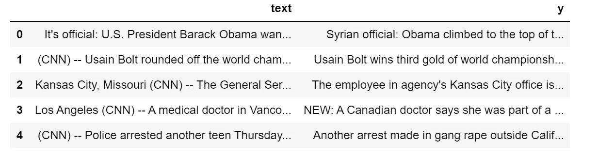**

**作者图片**

**让我们看一个随机的例子:**

```
i = 1
print("--- Full text ---")
print(dtf["text"][i])
print("--- Summary ---")
print(dtf["y"][i])
```

**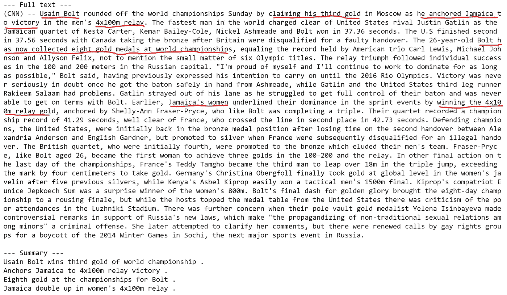**

**来自 CNN 每日邮件数据集的文本**

**在这里，我用红色手动标记了摘要中提到的信息。体育文章对机器来说很难，因为没有太多的空间来解释什么是重要的，什么是不重要的…标题必须报道主要结果。我将把这个例子放在测试集中来比较模型。**

```
dtf_train = dtf.iloc[i+1:]
dtf_test = dtf.iloc[:i+1]
```

## **文本排名**

**[*text rank*](https://web.eecs.umich.edu/~mihalcea/papers/mihalcea.emnlp04.pdf)(2004)是一个基于图的文本处理排名模型，基于 [**Google 的 *PageRank***](https://en.wikipedia.org/wiki/PageRank) 算法，在一个文本中寻找最相关的句子。 *PageRank* 是 1998 年 Google 搜索引擎使用的第一个对网页进行排序的算法。简而言之，如果页面 A 链接到页面 B，页面 C，页面 B 链接到页面 C，排序将是页面 C，页面 B，页面 A。**

**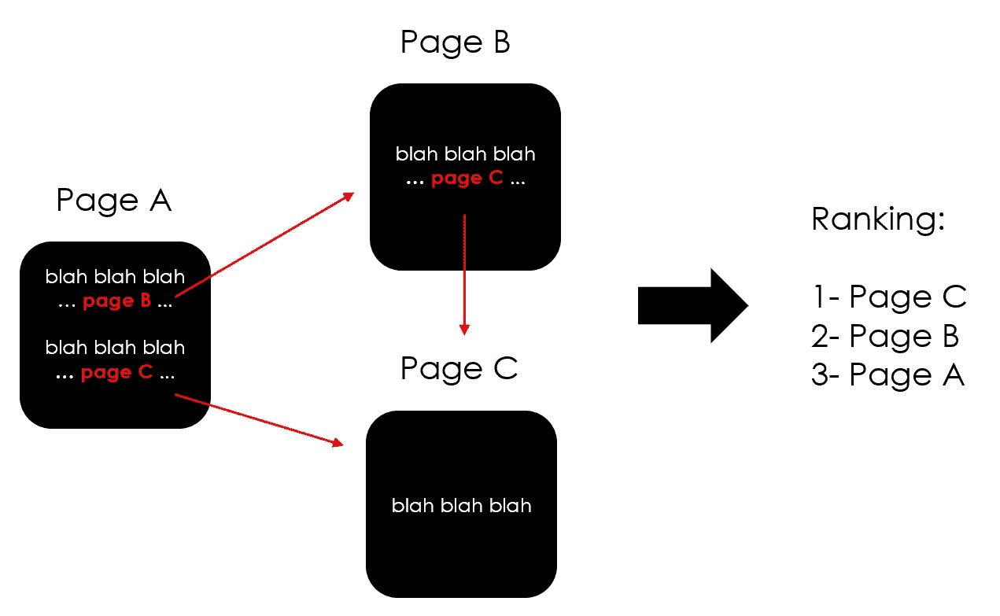**

**作者图片**

**TextRank 非常容易使用，因为它是无人监管的。首先，整个文本被分割成句子，然后该算法建立一个图，其中句子是节点，重叠的单词是链接。最后， *PageRank* 确定这个句子网络中最重要的节点。**

**使用 [*gensim*](https://radimrehurek.com/gensim/) 库，您可以轻松地将 *TextRank* 算法应用于您的数据:**

```
**'''
Summarizes corpus with TextRank.
:parameter    
    :param corpus: str or list - dtf["text"]    
    :param ratio: length of the summary (ex. 20% of the text)
:return    
    list of summaries
'''**
def **textrank**(corpus, ratio=0.2):    
    if type(corpus) is str:        
       corpus = [corpus]    
    lst_summaries = [**gensim**.summarization.summarize(txt,  
                     ratio=ratio) for txt in corpus]    
return lst_summaries **## Apply the function to corpus**
predicted = **textrank**(corpus=dtf_test["text"], ratio=0.2)
predicted[i]
```

**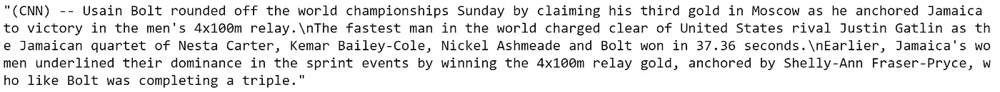**

**作者图片**

**如何才能**评价**这个结果呢？通常，我用两种方式来做:**

1.  **[**ROUGE metrics**](https://en.wikipedia.org/wiki/ROUGE_(metric)#:~:text=ROUGE%2C%20or%20Recall%2DOriented%20Understudy,software%20in%20natural%20language%20processing.)**(面向回忆的 Gisting 评估替角):
    通过重叠 *n-grams* 将自动生成的摘要与参考摘要进行比较的一组度量。****

```
****'''
Calculate ROUGE score.
:parameter    
    :param y_test: string or list    
    :param predicted: string or list
'''**
def **evaluate_summary**(y_test, predicted):    
   rouge_score = **rouge**.Rouge()    
   scores = rouge_score.get_scores(y_test, predicted, avg=True)       
   score_1 = round(scores['rouge-1']['f'], 2)    
   score_2 = round(scores['rouge-2']['f'], 2)    
   score_L = round(scores['rouge-l']['f'], 2)    
   print("rouge1:", score_1, "| rouge2:", score_2, "| rougeL:",
         score_2, "--> avg rouge:", round(np.mean(
         [score_1,score_2,score_L]), 2))**## Apply the function to predicted** i = 5
**evaluate_summary**(dtf_test["y"][i], predicted[i])**
```

********

****作者图片****

****结果显示，31%的 *unigrams* (ROUGE-1)和 7%的 *bigrams* (ROUGE-2)出现在两个摘要中，而*最长公共子序列* (ROUGE-L)匹配了 7%。总的来说，平均分 20%。请注意，胭脂分数并不衡量总结的流畅程度，因为我通常使用善良的老人类的眼睛。****

****2.**可视化**:显示两个文本，即摘要和原文，或预测摘要和真实摘要，并突出显示匹配部分。****

****我想你会发现这个功能非常有用，因为它可以在笔记本上突出显示两个文本的匹配子字符串。它可以用于单词级:****

```
**match = **display_string_matching**(dtf_test["y"][i], predicted[i], both=True, **sentences=False**, titles=["Real Summary", "Predicted Summary"])from **IPython.core.display** import display, HTML
display(HTML(match))**
```

****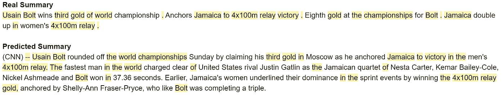****

****作者图片****

****或者您可以设置 *sentences=True* ，它将在句子级别而不是单词级别匹配文本:****

```
**match = **display_string_matching**(dtf_test["text"][i], predicted[i], both=True, **sentences=True**, titles=["Full Text", "Predicted Summary"])

from **IPython.core.display** import display, HTML
display(HTML(match))**
```

****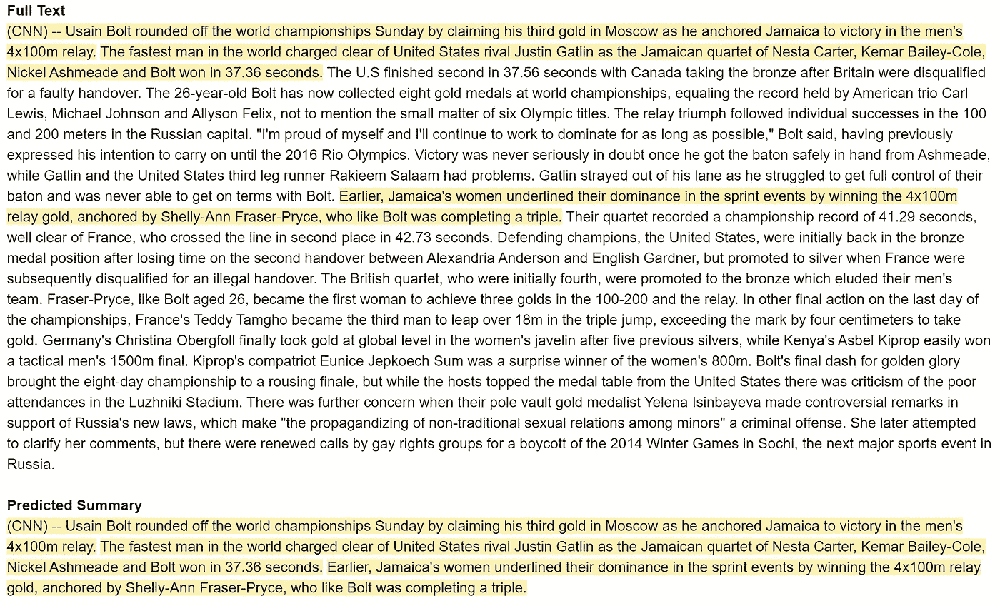****

****作者图片****

****该预测具有原始摘要中提到的大部分信息。正如提取算法所预期的，预测的摘要完全包含在文本中:该模型认为这 3 个句子是最重要的。我们可以将此作为下面抽象方法的基线。****

## ****Seq2Seq****

****[序列对序列模型](https://en.wikipedia.org/wiki/Seq2seq) (2014)是以特定领域(即文本词汇)的序列为输入，输出另一领域(即摘要词汇)的新序列的神经网络。 *Seq2Seq* 车型通常具有以下关键特征:****

*   ******序列作为语料库**:将文本填充成长度相同的序列，得到特征矩阵。****
*   ******单词嵌入** **机制**:特征学习技术，将词汇表中的单词映射到实数向量，这些向量是根据每个单词出现在另一个单词之前或之后的概率分布计算的。****
*   ******编码器-解码器结构:**编码器处理输入序列，并返回其自身的内部状态，作为解码器的上下文，解码器在给定前一个字的情况下，预测目标序列的下一个字。****
*   ******用于训练的模型和用于预测的模型**:用于训练的模型不直接用于预测。事实上，我们将编码两个神经网络(都具有编码器-解码器结构)，一个用于训练，另一个(称为“推理模型”)通过利用来自训练模型的一些层来生成预测。****

****让我们从一些**数据分析**开始，这是下一个特征工程所需要的。由于我们要将文本转换成单词序列，我们必须在这里做出两个决定:****

1.  ****正确的序列大小，因为我们的语料库有不同的长度****
2.  ****我们的模型必须记住多少单词，因为罕见的单词应该被排除在外****

****我将清理和分析数据来解决这两点。****

```
****## create stopwords**
lst_stopwords = **nltk**.corpus.stopwords.words("english")
**## add words that are too frequent**
lst_stopwords = lst_stopwords + ["cnn","say","said","new"] **## cleaning function**
def **utils_preprocess_text**(txt, punkt=True, lower=True, slang=True, lst_stopwords=None, stemm=False, lemm=True):
    **### separate sentences with '. '**
    txt = re.sub(r'\.(?=[^ \W\d])', '. ', str(txt))
    **### remove punctuations and characters**
    txt = re.sub(r'[^\w\s]', '', txt) if punkt is True else txt
    **### strip**
    txt = " ".join([word.strip() for word in txt.split()])
    **### lowercase**
    txt = txt.lower() if lower is True else txt
   ** ### slang**
    txt = contractions.fix(txt) if slang is True else txt   
    **### tokenize (convert from string to list)**
    lst_txt = txt.split()
    **### stemming (remove -ing, -ly, ...)**
    if stemm is True:
        ps = nltk.stem.porter.PorterStemmer()
        lst_txt = [ps.stem(word) for word in lst_txt]
    **### lemmatization (convert the word into root word)**
    if lemm is True:
        lem = nltk.stem.wordnet.WordNetLemmatizer()
        lst_txt = [lem.lemmatize(word) for word in lst_txt]
    **### remove Stopwords**
    if lst_stopwords is not None:
        lst_txt = [word for word in lst_txt if word not in 
                   lst_stopwords]
    **### back to string**
    txt = " ".join(lst_txt)
    return txt **## apply function to both text and summaries** dtf_train["**text_clean**"] = dtf_train["text"].apply(lambda x: **utils_preprocess_text**(x, punkt=True, lower=True, slang=True, lst_stopwords=lst_stopwords, stemm=False, lemm=True))dtf_train["**y_clean**"] = dtf_train["y"].apply(lambda x: **utils_preprocess_text**(x, punkt=True, lower=True, slang=True, lst_stopwords=lst_stopwords, stemm=False, lemm=True))**
```

****现在我们可以通过统计单词来看看长度分布:****

```
****## count**
dtf_train['**word_count**'] = dtf_train[column].apply(lambda x: len(**nltk**.word_tokenize(str(x))) )**## plot**
**sns**.distplot(dtf_train["**word_count**"], hist=True, kde=True, kde_kws={"shade":True})**
```

****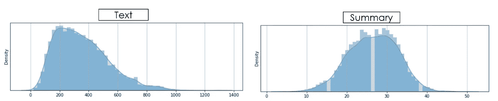****

****作者的图片(对 X 和 y 运行相同的代码)****

```
**X_len = 400
y_len = 40**
```

****我们来分析一下词频:****

```
**lst_tokens = **nltk**.tokenize.word_tokenize(dtf_train["**text_clean**"].str.cat(sep=" "))
ngrams = [1]

**## calculate**
dtf_freq = pd.DataFrame()
for n in ngrams:
   dic_words_freq = nltk.FreqDist(**nltk**.ngrams(lst_tokens, n))
   dtf_n = pd.DataFrame(dic_words_freq.most_common(), columns=
                        ["word","freq"])
   dtf_n["ngrams"] = n
   dtf_freq = dtf_freq.append(dtf_n)
   dtf_freq["word"] = dtf_freq["word"].apply(lambda x: " 
                         ".join(string for string in x) )
   dtf_freq_X= dtf_freq.sort_values(["ngrams","freq"], ascending=
                         [True,False])

**## plot**
**sns**.barplot(x="freq", y="word", hue="ngrams", dodge=False,
 data=dtf_freq.groupby('ngrams')["ngrams","freq","word"].head(30))
plt.show()**
```

****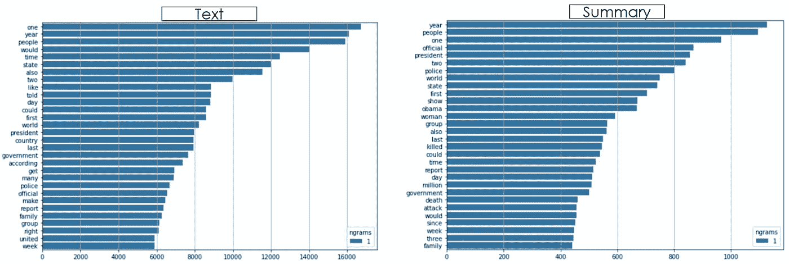****

****作者的图片(对 X 和 y 运行相同的代码)****

```
**thres = 5 **#<-- min frequency**
X_top_words = len(dtf_freq_X[dtf_freq_X["freq"]>thres])
y_top_words = len(dtf_freq_y[dtf_freq_y["freq"]>thres])**
```

****之后，我们就有了继续进行**特征工程**所需的一切。通过使用 *tensorflow/keras* 将预处理的语料库转换成序列列表来创建特征矩阵:****

```
**lst_corpus = dtf_train["text_clean"]**## tokenize text**
tokenizer = kprocessing.text.**Tokenizer**(num_words=**X_top_words**, lower=False, split=' ', oov_token=None, 
filters='!"#$%&()*+,-./:;<=>?@[\\]^_`{|}~\t\n')
tokenizer.fit_on_texts(lst_corpus)
dic_vocabulary = {"<PAD>":0}
dic_vocabulary.update(tokenizer.word_index)**## create sequence**
lst_text2seq= tokenizer.texts_to_sequences(lst_corpus)**## padding sequence**
X_train = kprocessing.sequence.**pad_sequences**(lst_text2seq, 
                    maxlen=15, padding="post", truncating="post")**
```

****特征矩阵 *X_train* 的形状为 *N 个文档 X 个序列最大长度*。让我们想象一下:****

```
****sns**.heatmap(X_train==0, vmin=0, vmax=1, cbar=False)
plt.show()**
```

****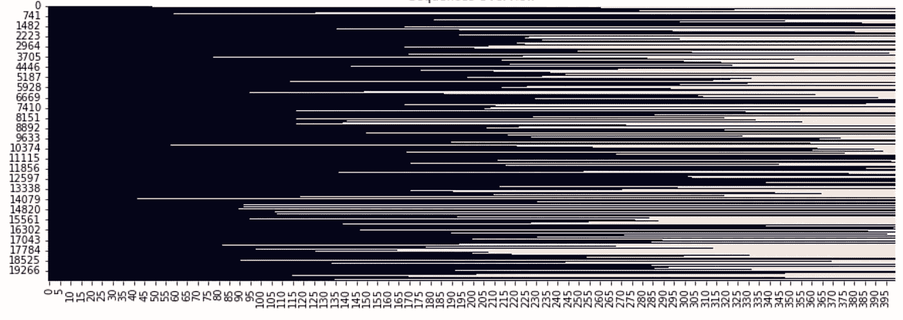****

****作者图片( *N 个文档 x 个序列最大长度)*****

****在继续之前，不要忘记使用 fitted tokenizer 对测试集进行同样的特征工程:****

```
****## text to sequence with the fitted tokenizer**
lst_text2seq = **tokenizer**.texts_to_sequences(dtf_test["**text_clean**"])**## padding sequence**
X_test = kprocessing.sequence.**pad_sequences**(lst_text2seq, maxlen=15,
             padding="post", truncating="post")**
```

****现在让我们来看看总结。在应用相同的特征工程策略之前，我们需要在每个摘要中添加两个特殊的标记来确定文本的开始和结束。****

```
****# Add START and END tokens to the summaries (y)**
special_tokens = ("<START>", "<END>")
dtf_train["y_clean"] = dtf_train['y_clean'].apply(lambda x: 
                     special_tokens[0]+' '+x+' '+special_tokens[1])
dtf_test["y_clean"] = dtf_test['y_clean'].apply(lambda x: 
                     special_tokens[0]+' '+x+' '+special_tokens[1])**# check example**
dtf_test["y_clean"][i]**
```

****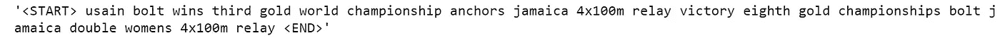****

****作者图片****

****现在，我们可以通过利用与之前相同的代码来创建带有摘要的特征矩阵(因此，创建一个新的标记器、填充器，并用合适的标记器转换测试集)。如果你打印出词汇表，你会在顶部看到特殊的记号。稍后，我们将使用*开始*标记开始预测，当*结束*标记出现时，预测的文本将停止。****

****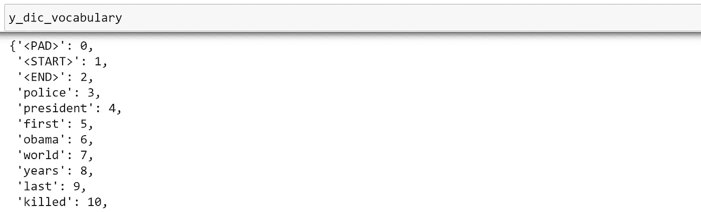****

****作者图片****

****我们可以继续进行单词嵌入。这里有两个选择:从头开始训练我们的单词嵌入模型，或者使用预先训练好的模型。如果你走的是后者，那就按照这部分走，否则可以跳过，直接跳到模型设计。在 Python 中，你可以像这样从[*genism-data*](https://github.com/RaRe-Technologies/gensim-data)*加载一个预先训练好的单词嵌入模型:*****

```
***import **gensim_api**nlp = gensim_api.load(**"glove-wiki-gigaword-300"**)***
```

*****我推荐斯坦福大学的 [*GloVe*](https://en.wikipedia.org/wiki/GloVe_(machine_learning)) ，这是一种在维基百科、Gigaword 和 Twitter 语料库上训练的无监督学习算法。您可以通过将任何单词转换为向量来测试它:*****

```
***word = "home"
nlp[word].shape**>>> (300,)*****
```

*****这些单词向量可以在神经网络中用作权重。为了做到这一点，我们需要创建一个嵌入矩阵，使得 id 为 *N* 的单词的向量位于第*N*行。*****

```
*****## start the matrix (length of vocabulary x vector size) with all 0s**
X_embeddings = np.zeros((len(X_dic_vocabulary)+1, 300))for word,idx in X_dic_vocabulary.items():
    **## update the row with vector**
    try:
        X_embeddings[idx] =  nlp[word]
    **## if word not in model then skip and the row stays all 0s**
    except:
        pass***
```

*****该代码生成从语料库 x 向量大小中提取的词汇的形状*长度的矩阵(300)。语料库矩阵将用于编码器嵌入层，而摘要矩阵将用于解码器嵌入层。输入序列中的每个 id 将被用作访问嵌入矩阵的索引。这个嵌入层的输出将是一个 2D 矩阵，对于输入序列中的每个单词 id 有一个单词向量(序列长度×向量大小)。让我们以句子“我喜欢这篇文章”为例:******

*****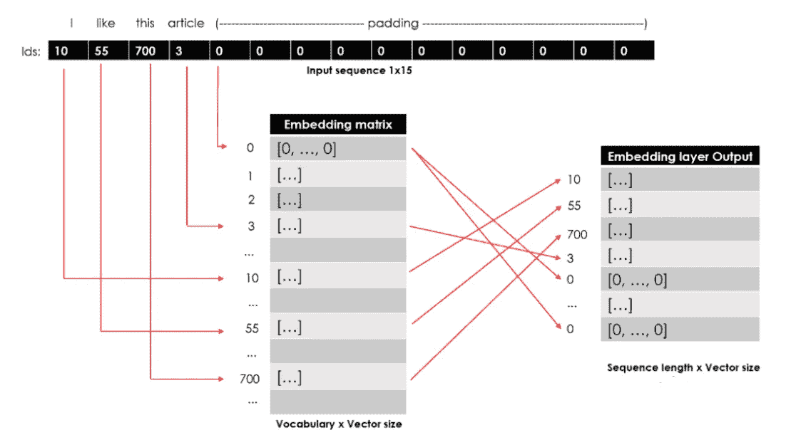*****

*****作者图片*****

*****终于到了构建**编码器-解码器模型的时候了。**首先，我们需要清楚什么是正确的输入和输出:*****

*   *****输入是 *X* (文本序列)加上 *y* (摘要序列)，我们将隐藏摘要的最后一个单词*****
*   *****目标应该是没有*开始*标记的 *y* (概要序列)。*****

*****基本上，您将输入文本交给编码器以理解上下文，然后您向解码器展示摘要如何开始，模型学习预测它如何结束。这是一种称为“教师强制”的训练策略，它使用目标而不是网络生成的输出，以便它可以学习预测 *start* token 之后的单词，然后是下一个单词，依此类推(为此，您必须使用时间分布密集层)。*****

*****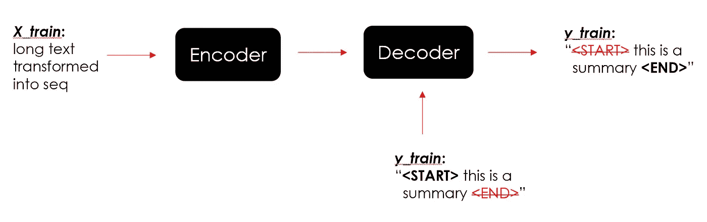*****

*****作者图片*****

*****我将提出两个不同版本的 Seq2Seq。下面是你能得到的最简单的算法:*****

*   *****一个嵌入层，它将从头开始创建一个单词嵌入，就像前面描述的那样。*****
*   *****一个单向 *LSTM* 层，返回一个序列以及单元格状态和隐藏状态。*****
*   *****最终的时间分布密集层，它将相同的密集层(相同的权重)应用于 *LSTM* 输出，每次一个时间步长，这样输出层只需要一个连接到每个 *LSTM* 单元。*****

```
***lstm_units = 250
embeddings_size = 300 **##------------ ENCODER (embedding + lstm) ------------------------##** x_in = layers.Input(name="x_in", shape=(X_train.shape[1],))**### embedding**
layer_x_emb = layers.Embedding(name="x_emb", 
                               input_dim=len(X_dic_vocabulary),
                               output_dim=embeddings_size, 
                               trainable=True)
x_emb = layer_x_emb(x_in)**### lstm** 
layer_x_lstm = layers.LSTM(name="x_lstm", units=lstm_units, 
                           dropout=0.4, return_sequences=True, 
                           return_state=True)
x_out, state_h, state_c = layer_x_lstm(x_emb) **##------------ DECODER (embedding + lstm + dense) ----------------##** y_in = layers.Input(name="y_in", shape=(None,))**### embedding**
layer_y_emb = layers.Embedding(name="y_emb", 
                               input_dim=len(y_dic_vocabulary), 
                               output_dim=embeddings_size, 
                               trainable=True)
y_emb = layer_y_emb(y_in)**### lstm** 
layer_y_lstm = layers.LSTM(name="y_lstm", units=lstm_units, 
                           dropout=0.4, return_sequences=True, 
                           return_state=True)
y_out, _, _ = layer_y_lstm(y_emb, initial_state=[state_h, state_c])**### final dense layers**
layer_dense = layers.TimeDistributed(name="dense",          layer=layers.Dense(units=len(y_dic_vocabulary), activation='softmax'))
y_out = layer_dense(y_out) **##---------------------------- COMPILE ---------------------------##**
model = models.Model(inputs=[x_in, y_in], outputs=y_out, 
                     name="Seq2Seq")
model.compile(optimizer='rmsprop',
              loss='sparse_categorical_crossentropy', 
              metrics=['accuracy'])
model.summary()***
```

*****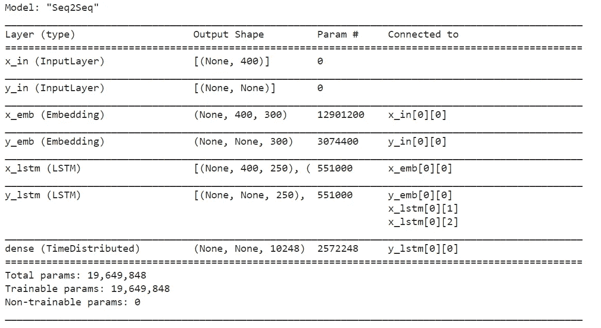*****

*****作者图片*****

*****如果这对你来说还不够，下面是之前的 *Seq2Seq* 算法的一个高级(并且非常重)版本:*****

*   *****嵌入层，利用来自*手套*的预训练权重。*****
*   *****3 个双向 *LSTM* 层，在两个方向上处理序列。*****
*   *****最终时间分布密集层(同前)。*****

```
***lstm_units = 250 **##-------- ENCODER (pre-trained embeddings + 3 bi-lstm) ----------##**
x_in = layers.Input(name="x_in", shape=(X_train.shape[1],))**### embedding**
layer_x_emb = layers.Embedding(name="x_emb",       
          input_dim=X_embeddings.shape[0], 
          output_dim=X_embeddings.shape[1], 
          weights=[X_embeddings], trainable=False)
x_emb = layer_x_emb(x_in)**### bi-lstm 1**
layer_x_bilstm = layers.Bidirectional(layers.LSTM(units=lstm_units, 
                 dropout=0.2, return_sequences=True, 
                 return_state=True), name="x_lstm_1")
x_out, _, _, _, _ = layer_x_bilstm(x_emb)**### bi-lstm 2**
layer_x_bilstm = layers.Bidirectional(layers.LSTM(units=lstm_units, 
                 dropout=0.2, return_sequences=True, 
                 return_state=True), name="x_lstm_2")
x_out, _, _, _, _ = layer_x_bilstm(x_out)**### bi-lstm 3 (here final states are collected)**
layer_x_bilstm = layers.Bidirectional(layers.LSTM(units=lstm_units, 
                 dropout=0.2, return_sequences=True, 
                 return_state=True), name="x_lstm_3")
x_out, forward_h, forward_c, backward_h, backward_c = layer_x_bilstm(x_out)
state_h = layers.Concatenate()([forward_h, backward_h])
state_c = layers.Concatenate()([forward_c, backward_c]) **##------ DECODER (pre-trained embeddings + lstm + dense) ---------##**
y_in = layers.Input(name="y_in", shape=(None,))**### embedding**
layer_y_emb = layers.Embedding(name="y_emb", 
               input_dim=y_embeddings.shape[0], 
               output_dim=y_embeddings.shape[1], 
               weights=[y_embeddings], trainable=False)
y_emb = layer_y_emb(y_in)**### lstm**
layer_y_lstm = layers.LSTM(name="y_lstm", units=lstm_units*2, dropout=0.2, return_sequences=True, return_state=True)
y_out, _, _ = layer_y_lstm(y_emb, initial_state=[state_h, state_c])**### final dense layers**
layer_dense = layers.TimeDistributed(name="dense", 
              layer=layers.Dense(units=len(y_dic_vocabulary), 
               activation='softmax'))
y_out = layer_dense(y_out) **##---------------------- COMPILE ---------------------------------##** model = models.Model(inputs=[x_in, y_in], outputs=y_out, 
                     name="Seq2Seq")
model.compile(optimizer='rmsprop',   
              loss='sparse_categorical_crossentropy',
              metrics=['accuracy'])
model.summary()***
```

*****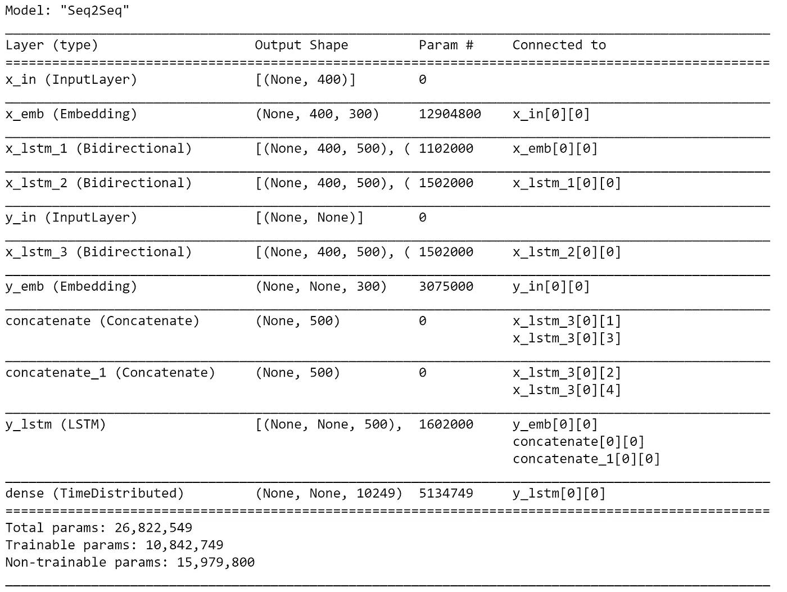*****

*****作者图片*****

*****在实际测试集上进行测试之前，我将保留一小部分训练集进行验证。*****

```
*****## train**
training = model.fit(x=[X_train, y_train[:,:-1]], 
                     y=y_train.reshape(y_train.shape[0], 
                                       y_train.shape[1], 
                                       1)[:,1:],
                     batch_size=128, 
                     epochs=100, 
                     shuffle=True, 
                     verbose=1, 
                     validation_split=0.3,
                     callbacks=[callbacks.**EarlyStopping**(
                                monitor='val_loss', 
                                mode='min', verbose=1, patience=2)]
                      )**## plot loss and accuracy**
metrics = [k for k in training.history.keys() if ("loss" not in k) and ("val" not in k)]
fig, ax = plt.subplots(nrows=1, ncols=2, sharey=True)ax[0].set(title="Training")
ax11 = ax[0].twinx()
ax[0].plot(training.history['loss'], color='black')
ax[0].set_xlabel('Epochs')
ax[0].set_ylabel('Loss', color='black')
for metric in metrics:
    ax11.plot(training.history[metric], label=metric)
ax11.set_ylabel("Score", color='steelblue')
ax11.legend()ax[1].set(title="Validation")
ax22 = ax[1].twinx()
ax[1].plot(training.history['val_loss'], color='black')
ax[1].set_xlabel('Epochs')
ax[1].set_ylabel('Loss', color='black')
for metric in metrics:
     ax22.plot(training.history['val_'+metric], label=metric)
ax22.set_ylabel("Score", color="steelblue")
plt.show()***
```

*****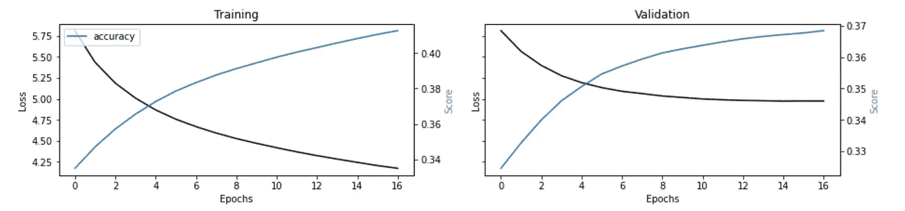*****

*****作者图片*****

*****请注意，我在回调中使用了 [*提前停止*](https://www.tensorflow.org/api_docs/python/tf/keras/callbacks/EarlyStopping) 工具，当受监控的指标(即验证损失)停止改善时，该工具应停止训练。这对节省自己的时间特别有用，尤其是像这样漫长而痛苦的训练。我想补充的是，在不利用 GPU 的情况下运行 *Seq2Seq* 算法是非常困难的，因为你同时在训练 2 个模型(编码器-解码器)。用有[NVIDIA GPU](/installing-tensorflow-with-cuda-cudnn-and-gpu-support-on-windows-10-60693e46e781)或者 [Google Colab](https://colab.research.google.com/notebooks/gpu.ipynb) 的电脑会更好。*****

*****即使训练完成了，也还没结束！为了测试 *Seq2Seq* 模型，作为最后一步，我们需要构建**推理模型来生成预测。**预测编码器将新序列( *X_test* )作为输入，并返回最后一个 LSTM 层的输出及其状态。*****

```
*****# Prediction Encoder**
encoder_model = models.Model(inputs=x_in, outputs=[x_out, state_h, state_c], name="Prediction_Encoder")encoder_model.summary()***
```

*****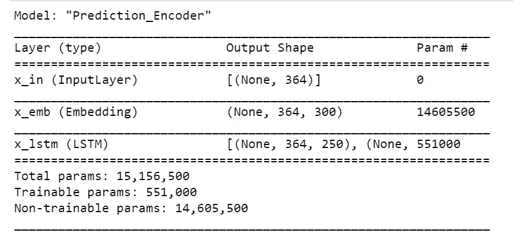*****

*****作者图片*****

*****另一方面，预测解码器将*开始*标记、编码器的输出及其状态作为输入，并返回新的状态以及词汇表上的概率分布(概率最高的单词将是预测)。*****

```
*****# Prediction Decoder****## double the lstm units if you used bidirectional lstm** lstm_units = lstm_units*2 if any("Bidirectional" in str(layer) for layer in model.layers) else lstm_units**## states of the previous time step** encoder_out = layers.Input(shape=(X_train.shape[1], lstm_units))
state_h, state_c = layers.Input(shape=(lstm_units,)), layers.Input(shape=(lstm_units,))**## decoder embeddings**
y_emb2 = layer_y_emb(y_in)**## lstm to predict the next word**
y_out2, state_h2, state_c2 = layer_y_lstm(y_emb2, initial_state=[state_h, state_c])**## softmax to generate probability distribution over the vocabulary**
probs = layer_dense(y_out2)**## compile**
decoder_model = models.Model(inputs=[y_in, encoder_out, state_h, state_c], outputs=[probs, state_h2, state_c2], name="Prediction_Decoder")decoder_model.summary()***
```

*****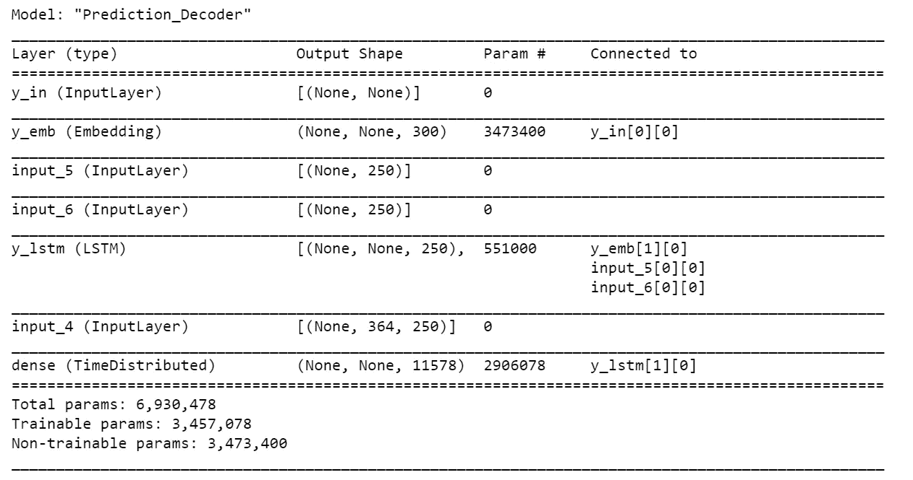*****

*****作者图片*****

*****在利用*开始*令牌和编码器状态进行第一次预测之后，解码器使用生成的字和新状态来预测新字和新状态。该迭代将继续进行，直到模型最终预测到*结束*标记或者预测的摘要达到其最大长度。*****

*****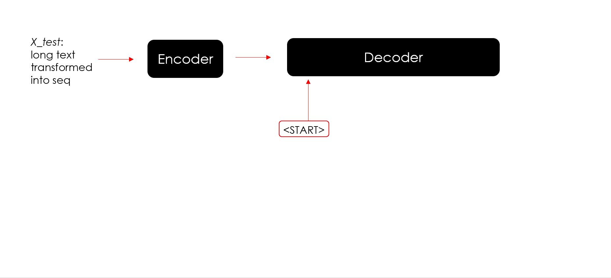*****

*****作者图片*****

*****让我们对上述循环进行编码，以生成预测并测试 *Seq2Seq* 模型:*****

```
*****# Predict** max_seq_lenght = X_test.shape[1]
predicted = []
for x in X_test:
   x = x.reshape(1,-1) **## encode X**
   encoder_out, state_h, state_c = **encoder_model**.predict(x) **## prepare loop**
   y_in = np.array([fitted_tokenizer.word_index[special_tokens[0]]])
   predicted_text = ""
   stop = False
   while not stop: **## predict dictionary probability distribution**
        probs, new_state_h, new_state_c = **decoder_model**.predict(
                          [y_in, encoder_out, state_h, state_c])

        **## get predicted word**
        voc_idx = np.argmax(probs[0,-1,:])
        pred_word = fitted_tokenizer.index_word[voc_idx]

        **## check stop**
        if (pred_word != special_tokens[1]) and 
           (len(predicted_text.split()) < max_seq_lenght):
            predicted_text = predicted_text +" "+ pred_word
        else:
            stop = True

       ** ## next**
        y_in = np.array([voc_idx])
        state_h, state_c = new_state_h, new_state_c predicted_text = predicted_text.replace(
                    special_tokens[0],"").strip()
   predicted.append(predicted_text)***
```

*****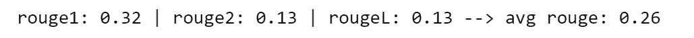*****

*****作者图片*****

*****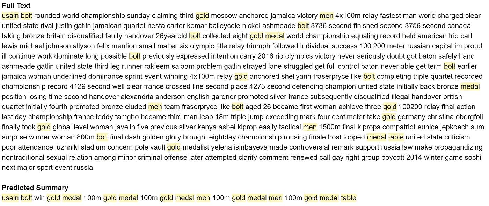*****

*****作者图片*****

*****该模型理解上下文和关键信息，但它对词汇的预测很差。这是因为我在这个实验的完整数据集的一个小子集上运行了 *Seq2Seq "* lite"。如果你有一个强大的机器，你可以添加更多的数据和提高性能。*****

## *****变形金刚(电影名)*****

*****变形金刚是谷歌的论文 [*提出的一种新的建模技术*](https://arxiv.org/abs/1706.03762)*【2017】*在该论文中，展示了顺序模型(如 *LSTM* )可以完全被注意力机制取代，甚至获得更好的性能。这些语言模型可以通过同时处理序列和映射单词之间的依赖关系来执行任何 NLP 任务，而不管它们在文本中相距多远。因此，在他们的单词中嵌入同一个单词可以根据上下文有不同的向量。最著名的语言模型有 Google 的*[*BERT*](https://en.wikipedia.org/wiki/BERT_(language_model))和 OpenAI 的*[*GPT*](https://en.wikipedia.org/wiki/GPT-3)，用数十亿个参数进行训练。*********

******脸书的 [***巴特***](https://huggingface.co/transformers/model_doc/bart.html) (双向自回归变换器)使用标准的 *Seq2Seq* 双向编码器(像*伯特*)和左右自回归解码器(像 *GPT* )。基本上，*巴特* = *伯特* + *GPT* 。******

******变形金刚模型的主库是 [*变形金刚*](https://huggingface.co/transformers/) 通过[拥抱面](https://huggingface.co/):******

```
******'''
Summarizes corpus with Bart.
:parameter    
   :param corpus: list - dtf["text"]    
   :param max_len: length of the summary
:return    
    list of summaries
'''**
def **bart**(corpus, max_len):    
    nlp = **transformers**.pipeline("summarization")    
    lst_summaries = [nlp(txt,               
                         max_length=max_len
                         )[0]["summary_text"].replace(" .", ".")                    
                     for txt in corpus]    
    return lst_summaries **## Apply the function to corpus** predicted = **bart**(corpus=dtf_test["text"], max_len=y_len)****
```

******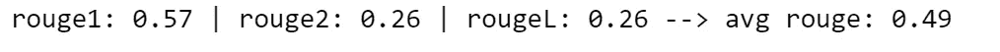******

******作者图片******

************

******作者图片******

******预测简短但有效。对于大多数 NLP 任务来说，Transformer 模型似乎是表现最好的。******

## ******结论******

******这篇文章是演示**如何将不同的 NLP 模型应用到文本摘要用例**的教程。我比较了 3 种流行的方法:无监督的 *TextRank* ，基于单词嵌入的两种不同版本的有监督的 *Seq2Seq* ，以及预训练的 *BART* 。我经历了特征工程，模型设计，评估和可视化。******

******我希望你喜欢它！如有问题和反馈，或者只是分享您感兴趣的项目，请随时联系我。******

> ******👉[我们来连线](https://linktr.ee/maurodp)👈******

> ******本文是系列文章 **NLP 与 Python** 的一部分，参见:******

******[](/text-classification-with-nlp-tf-idf-vs-word2vec-vs-bert-41ff868d1794) [## 基于自然语言处理的文本分类:Tf-Idf vs Word2Vec vs BERT

### 预处理、模型设计、评估、词袋的可解释性、词嵌入、语言模型

towardsdatascience.com](/text-classification-with-nlp-tf-idf-vs-word2vec-vs-bert-41ff868d1794) [](/text-analysis-feature-engineering-with-nlp-502d6ea9225d) [## 使用自然语言处理的文本分析和特征工程

### 语言检测，文本清理，长度，情感，命名实体识别，N-grams 频率，词向量，主题…

towardsdatascience.com](/text-analysis-feature-engineering-with-nlp-502d6ea9225d) [](/text-classification-with-no-model-training-935fe0e42180) [## 用于无模型训练的文本分类的 BERT

### 如果没有带标签的训练集，请使用 BERT、单词嵌入和向量相似度

towardsdatascience.com](/text-classification-with-no-model-training-935fe0e42180) [](/ai-chatbot-with-nlp-speech-recognition-transformers-583716a299e9) [## 带 NLP 的 AI 聊天机器人:语音识别+变形金刚

### 用 Python 构建一个会说话的聊天机器人，与你的人工智能进行对话

towardsdatascience.com](/ai-chatbot-with-nlp-speech-recognition-transformers-583716a299e9)******