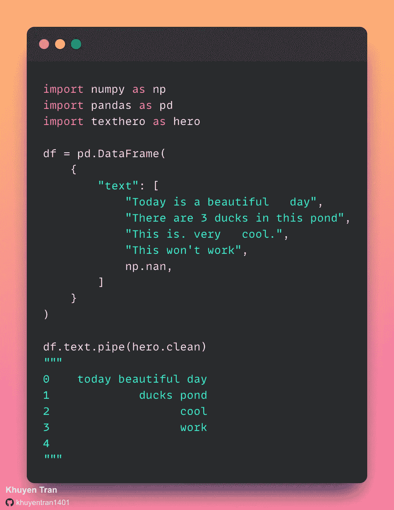
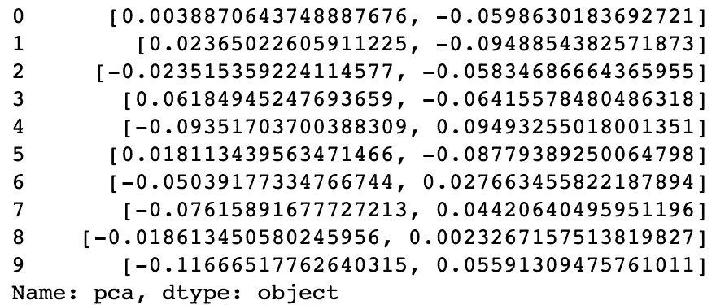
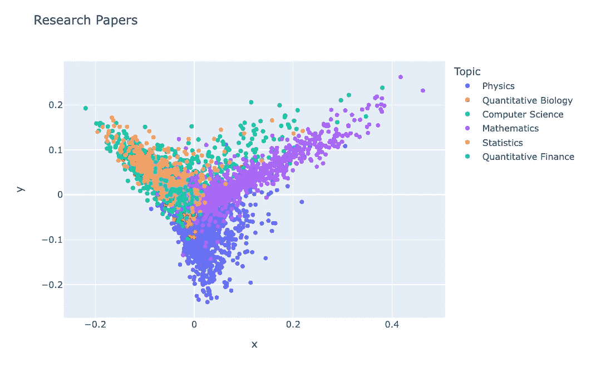
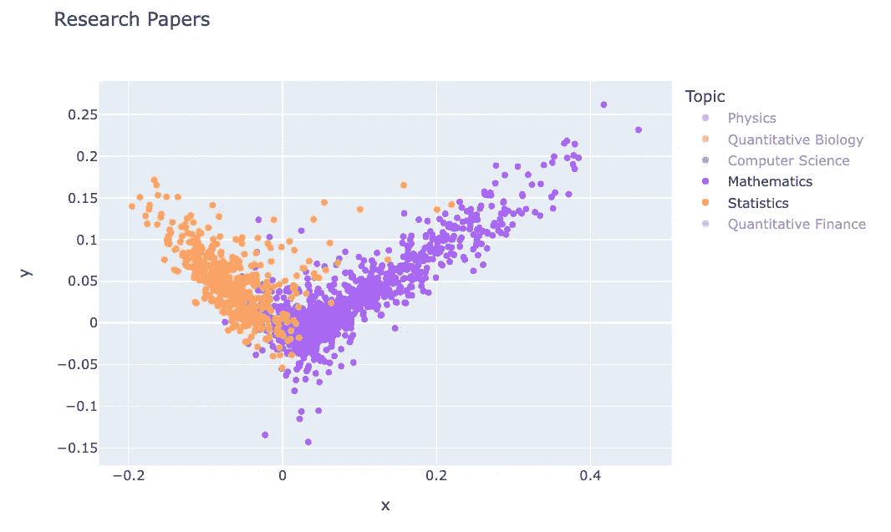

# Texthero:熊猫数据帧的文本预处理、表示和可视化

> 原文：<https://towardsdatascience.com/texthero-text-preprocessing-representation-and-visualization-for-a-pandas-dataframe-525405af16b6>

## 用一行 Python 代码处理您的文本


作者使用 Midjourney 创建的图像

# 动机

在将文本用于 ML 模型或可视化之前，您可能希望通过以下方式清理文本:

*   用空格替换 NA 值
*   小写所有文本
*   移除数字
*   删除标点符号
*   删除停用词
*   删除空白

您可能需要一段时间来编写上述所有步骤来处理您的文本。这使得您分析数据和训练 ML 模型的速度变慢。

如果您能像下面这样用一行代码处理您的文本，那不是很好吗？



作者图片

这就是 Texthero 派上用场的时候。

# 什么是 Texthero？

[Texthero](https://github.com/jbesomi/texthero) 是一个 Python 库，允许你高效地处理熊猫数据帧中的文本数据。

要安装 Texthero，请键入:

```
pip install texthero
```

为了了解 Texthero 是如何工作的，让我们从一个简单的例子开始。

# 流程文本

假设您有一个数据框架，其中有一个杂乱的文本列，如下所示:

要清除这个文本，只需使用`hero.clean`方法:

```
0    today beautiful day
1             ducks pond
2                   cool
3                   work
4
```

这真漂亮！在一行代码中，texthero:

*   用空格替换 NA 值
*   小写所有文本
*   删除所有数字块
*   删除所有标点符号
*   删除所有停用词
*   删除单词之间的所有空格

多酷啊。

# 创建自定义管道

如果您不喜欢`hero.clean`管道中的默认处理方法，您可以创建一个自定义管道:

```
0    Today beautiful day
1           brackets fun
```

# 为您的文本创建表示

Texthero 还允许您轻松:

*   将每个文档映射到一个向量
*   减少向量的维数

让我们在[研究文章数据集](https://www.kaggle.com/datasets/blessondensil294/topic-modeling-for-research-articles?select=train.csv)(可通过 Creative Common license 获得)上尝试这些功能。在[取消旋转表格](https://github.com/khuyentran1401/Data-science/blob/master/nlp/texthero/process_data.ipynb)后，我们有以下数据帧:

从处理每篇论文的摘要开始:

为每个抽象创建一个 [TF-IDF](https://monkeylearn.com/blog/what-is-tf-idf/) 表示，然后使用 [PCA](https://builtin.com/data-science/step-step-explanation-principal-component-analysis) 进行降维:

查看 PCA 列:



作者图片

# 可视化文本

在降维步骤之后，我们可以开始使用散点图来可视化数据点:



作者图片

点击了解如何阅读这个情节[。一般来说，两个文档越接近，它们就越相似。](https://blog.bioturing.com/2018/06/14/principal-component-analysis-explained-simply/)

为了减少噪音，我们可以取消选择右边栏中的一些主题。我们可以看到，与数学相关的文章和与统计相关的文章有明显的区别。



作者图片

# 结论

恭喜你！您刚刚学习了如何使用 Texthero 处理和可视化 pandas 数据框架中的文本数据。使用 Texthero，您可以在文本处理上花费更少的时间，而有更多的时间为您的数据寻找最佳模型。

随意发挥，并在这里叉这篇文章的源代码:

<https://github.com/khuyentran1401/Data-science/tree/master/nlp/texthero>  

我喜欢写一些基本的数据科学概念，并尝试不同的数据科学工具。你可以通过 [LinkedIn](https://www.linkedin.com/in/khuyen-tran-1401/) 和 [Twitter](https://twitter.com/KhuyenTran16) 与我联系。

如果你想查看我写的所有文章的代码，请点击这里。在 Medium 上关注我，了解我的最新数据科学文章，例如:

</pregex-write-human-readable-regular-expressions-in-python-9c87d1b1335>  </supercharge-your-python-string-with-textblob-2d9c08a8da05>  </predict-movie-ratings-with-user-based-collaborative-filtering-392304b988af>  </shap-explain-any-machine-learning-model-in-python-24207127cad7>  

# 参考

研究论文的主题建模。01–04–2017.布莱森·登西尔。
CC0:公共领域。于 2022 年 8 月 22 日从[https://www . ka ggle . com/datasets/blessondesil 294/topic-modeling-for-research-articles](https://www.kaggle.com/datasets/blessondensil294/topic-modeling-for-research-articles)中检索