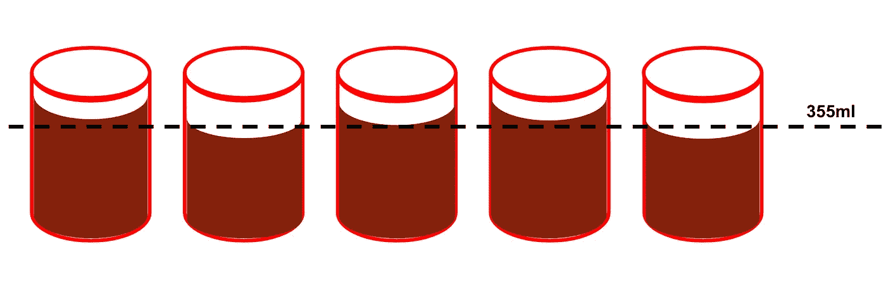
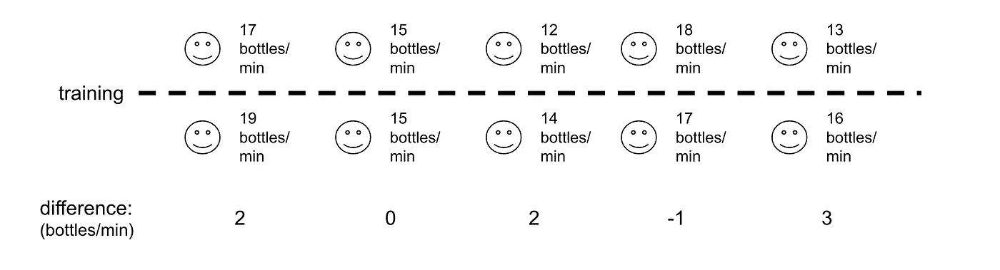

# 数据科学家的 3 t 测试

> 原文：<https://towardsdatascience.com/the-3-t-tests-for-data-scientists-e24e4ef61>

约翰·额外的照片在 [Unsplash](https://unsplash.com?utm_source=medium&utm_medium=referral) 上

t 检验是一种统计技术，它告诉人们两组之间的差异有多显著。简而言之，它通过将信号的量(通过样本或总体平均值之间的差异测量)与这些样本中的噪声量(或变化)进行比较来实现这一点。有许多关于数据科学的[有用的](/statistical-tests-t-test-andanova-674b242a5274) [文章](/how-to-perform-a-one-sample-t-test-by-hand-and-in-r-test-on-one-mean-70f867c4aa1)深入描述了它们，告诉你什么是 t-test 以及它如何工作，但是没有多少材料讨论 t-test 的不同变体以及何时使用它们。本文将介绍 t-test 的 3 种变体，何时使用它们，以及如何在 Python 中运行它们。

# 单一样本 t 检验

## 这是什么？

单样本 t 检验将样本数据的平均值与一个特定值进行比较。这方面的一个例子可能是，如果可口可乐公司希望确保装瓶厂在每罐饮料中倒入适量的苏打水。领导知道他们想要每罐 355 毫升，所以他们可以从罐中取样并测量倒入每个罐中的确切毫升数。由于机械过程不精确，一些罐可能超过 355 毫升，一些可能更少。然后，可以用罐的样本进行单样本 t 检验，以检验机器是否向每个罐中注入了统计上显著不同的量，而不是 355 ml 的液体。

作者图片

## 它是如何工作的？

1.  陈述无效假设和替代假设。零假设(H0)是样本均值与特定值(总体均值)没有差异，而另一个假设(H1)是有差异。按照上面的例子，它们应该是这样的:

> H0:平均每罐可乐有 355 毫升。H1:平均每罐可乐中含有超过 355 毫升的二氧化碳。

*注意:由于我选择了一个方向(即“每罐超过 355 毫升”)，这就变成了一个单边 t 检验，而不是一个双边 t 检验，其中一个只是说数量不是 355 毫升。*

2.确定你的显著性水平:显著性水平，通常被称为 alpha (α)，是当它实际上是真的时候拒绝你的零假设的概率。通常使用 0.05 的 alpha，这意味着您有 5%的风险得出样本之间存在统计显著差异的结论，而实际上这只是由于噪声。

3.收集以下数据:要检验的值(μ)、样本均值(x̄)、样本标准差(s)、样本观察值(n)并将它们放入以下公式中以计算 t 统计量:

作者图片

4.将您的 t 统计和自由度插入到 t 表中，以获得相应的 p 值。将 p 值与您选择的 alpha 值进行比较，如果它较小，您可以拒绝零假设。

请注意，要使这种测试有效，有 3 个必要的假设:

> 1)样本是独立的
> 2)数据近似正态分布
> 3)样本是随机收集的

## 代码示例

Scipy 的 stats 库有一个方便的 **ttest_1samp** 方法，当给定一个数据样本和一个总体均值进行比较时，该方法将计算 t-stat 和 p 值。下面的代码演示了如何使用函数为上面的示例运行单样本 t-test。

在这里，我创建了两个来自工厂 A 和工厂 B 的 30 罐假数据样本。对于工厂 A，数据的平均值为 355，并添加了噪声项，但对于工厂 B，数据的平均值为 353，并添加了噪声项。对两者进行单样本 t 检验，我们看到工厂 A 的 p 值为 0.71，工厂 B 的 p 值为 0.0004。工厂 A 的 p 值远高于标准 alpha 值 0.05，但工厂 B 的 p 值低于该阈值，因此我们可以拒绝零假设。

# 双样本 t 检验

## 这是什么？

双样本 t 检验不是将数据样本的平均值与单个值(总体平均值)进行比较，而是比较两个独立数据样本的平均值。同样的例子，如果可口可乐公司的领导层想要比较工厂 A 和工厂 b 之间罐装液体的平均量，就可以使用这个方法。

作者图片

## 它是如何工作的？

1.  类似于单样本 t 检验，我们陈述零假设和备择假设。以两个工厂为例，它们是:

> H0:两家工厂的平均灌装量没有显著差异
> H1:两家工厂的平均灌装量有显著差异

*注意:重要的是要记住零假设和替代假设总是关于总体，而不是从中抽取的样本*

2.选择一个显著性水平(我们还是用 0.05)

3.计算两个样本的平均值(x̄)、标准偏差(s)和样本量(n ),并将其代入以下公式，以获得 t 统计量

作者图片

4.将 t 统计量和自由度插入到 t 表中，以获得相应的 p 值。将 p 值与所选α水平进行比较，如果它更小，则可以拒绝零假设。

像单样本 t-检验一样，该检验也必须满足一些假设:

> 1)两个样本独立
> 2)两个样本近似正态分布
> 3)两个样本具有近似相同的方差

## 代码示例

Scipy 的 [**ttest_ind**](https://docs.scipy.org/doc/scipy/reference/generated/scipy.stats.ttest_ind.html) 方法接受两个数据样本，并且与 **ttest_1samp 类似，**从测试中返回 t 统计量和相应的 p 值。下面的代码演示了如何使用函数来运行上面的用例示例。

由于该检验的 p 值为 0.0026，低于 0.05 的标准α值，因此无效假设被拒绝。

# 配对 t 检验

## 这是什么？

配对 t 检验比较同一实体的两个测量值，通常是在一段时间内。这方面的一个例子是，如果可口可乐公司想要测试装瓶培训计划的有效性，对于每个员工，他们可以比较他们参加培训前后的平均装瓶率。

## 它是如何工作的？

与一个和两个样本 t-检验相似，必须陈述无效假设和备选假设，选择显著性水平，计算 t-统计量，并将其与 t-表中的自由度一起使用，以获得 p 值。t 统计的公式也不同，如下所示，其中 d 是每个配对值的差值，n 是样本数。

作者图片

另一种思考这种测试的方式是，配对 t 检验本质上只是对每个配对样本的差异进行单样本 t 检验！在这种情况下，零假设是配对样本差异等于零。

## 代码示例

Scipy 的 **ttest_rel** 方法接受两个成对数据数组，并且与 ttest_1samp & ttest_ind 函数类似，返回 t 统计量和相应的 p 值。在下面的代码中，我首先定义了一个雇员装瓶率数组，每分钟随机装瓶量在 10 到 20 之间。然后，我用“应用培训”功能模拟了一次培训，该功能可以将生产率降低 1 瓶/分钟，或者提高到 4 瓶/分钟。与前面的两个例子类似，我将训练前后的生产率数组输入到 scipy 的 ttest_rel 函数中，并打印输出。

另外，我演示了配对 t 检验与配对差异的单样本 t 检验是如何相同的。在下面的代码片段中，我获取了 post_training 和 pre_training 数组之间的差异，并针对总体均值为 0 的差异运行了单样本 t 检验(因为零假设是样本之间没有差异)。正如所料，t 统计量和 p 值与配对 t 检验完全相同！

感谢阅读！要注册中等会员，看[这里](https://eonofrey.medium.com/membership)！