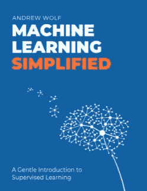
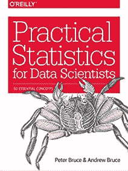
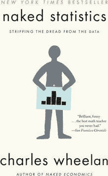
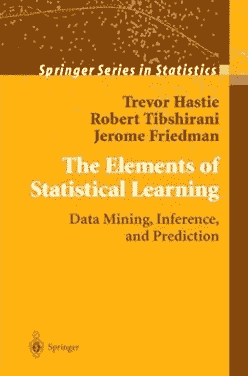
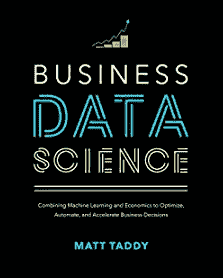

# 2022 年你应该阅读的 5 本最佳数据科学书籍

> 原文：<https://towardsdatascience.com/the-5-best-data-science-books-you-should-read-in-2022-9209616c203f>

## 以下是我喜欢的最好的数据科学书籍

照片由 [Unsplash](https://unsplash.com/s/photos/books?utm_source=unsplash&utm_medium=referral&utm_content=creditCopyText) 上的[尼克·费因斯](https://unsplash.com/@jannerboy62?utm_source=unsplash&utm_medium=referral&utm_content=creditCopyText)拍摄

> **请务必点击** [**订阅此处**](https://terenceshin.medium.com/membership) **千万不要错过另一篇关于数据科学指南、技巧和提示、生活经验等的文章！**

你好！我知道我已经有一段时间没有发表文章了，但是我很兴奋能够回来🙂。我的许多追随者经常问我的一个问题是“最好的数据科学书籍是什么？”

虽然这是一个主观的问题，但我会尽我所能以客观和系统的方式回答这个问题。当我评估一本非小说类书籍的质量时，我会考虑四个标准:

1.  **深度**:让读者感兴趣的书深入讨论主题的细节和复杂性是很重要的。如果我能从一本书中学到(几乎)我需要的一切，我会说它有很高的深度。
2.  **全面性**:同时，这本书也要简明扼要。如果一本书提供了不必要的细节或者在解释复杂的概念方面做得不好，那么它就不是一本全面的书。
3.  **可读性:**一般来说，一本书如果写得好，应该是容易读懂的。这在某种程度上与全面性有关，但也考虑了书的流程——例如，一本关于机器学习的初学者书籍可能应该在深入随机森林之前解释什么是决策树。
4.  适用性:对我来说最重要的最后一个标准是适用性。如果这本书能够将原始知识与如何在现实世界中应用联系起来，它会使这本书的价值成倍增加。

说了这么多，下面是我推荐你在 2022 年读的五本最好的数据科学书籍！

## 1.[机器学习简体](https://themlsbook.com/)

深度:4/5
全面性:4.5/5
可读性:4.5/5
适用性:5/5

榜单上第一本书叫[机器学习简体](https://themlsbook.com/)。这是今年出版的一本涵盖机器学习基础的新书，我必须说，与其他书相比，这本书的独特性给我留下了深刻的印象！无论您是数据科学新手还是需要复习，这本书都因以下几个原因而脱颖而出:

1.  它全面涵盖了与数据准备和数据建模相关的所有核心概念，并深入解释了这些概念背后的数学原理。因此，它不仅回答了*什么*而且还回答了*如何。*
2.  它用可应用的和直观的例子解释复杂的概念和算法，使想法更少概念性和更实际。
3.  最重要的是，这本书补充了一个 [GitHub 库](https://github.com/5x12/themlsbook)，其中包含了它讨论的每个主题的**实际** python 代码实现。

## 2.[数据科学家实用统计](https://www.amazon.com/Practical-Statistics-Data-Scientists-Essential/dp/1491952962)

深度:4.5/5
全面性:4/5
可读性:3.5/5
适用性:5/5

《数据科学家实用统计学》与第一本书相似，既全面又详细，不同之处在于这本书侧重于统计学，而不是机器学习。

这本书涵盖了所有你需要知道的统计学的核心概念，包括描述统计，抽样分布，假设检验和 A/B 检验，以及预测。

此外，这本书还包括 R 和 Python 中的代码片段，最终让您将理论概念与实际应用联系起来。

> **请务必点击** [**订阅此处**](https://terenceshin.medium.com/membership) **千万不要错过另一篇关于数据科学指南、技巧和提示、生活经验等的文章！**

## 3.[赤裸裸的统计——从数据中剥离恐惧](https://www.amazon.com/Naked-Statistics-Charles-Wheelan-audiobook/dp/B00CH7FWWU/ref=sr_1_1?keywords=naked+statistics&qid=1648144756&s=books&sprefix=naked+%2Cstripbooks-intl-ship%2C136&sr=1-1)

深度:3/5
全面性:4/5
可读性:5/5
适用性:4/5

《赤裸裸的统计》以一种随意的方式，用现实生活中的例子解释核心统计概念，回答诸如“网飞怎么知道你会喜欢哪部电影？”以及“是什么导致了自闭症发病率的上升？”

虽然我不会说它在统计理论中潜得太深，但它在解释基本统计概念方面做得很好，使其直观且易于记忆。

总的来说，我想说这是一本非常有趣又有教育意义的书！

## 4.[统计学习的要素](https://www.amazon.com/Elements-Statistical-Learning-Prediction-Statistics/dp/0387848576/ref=sr_1_1?crid=W9O41TYJ309W&keywords=elements+of+statistical+learning&qid=1648144790&s=audible&sprefix=elements+of+statistical+learning%2Caudible%2C113&sr=1-1)

深度:5/5
全面性:4/5
可读性:3.5/5
适用性:3.5/5

《统计学习的要素》是关于机器学习基础的最完整的教科书，涵盖了监督学习方法、非监督学习方法、图形模型、高维问题等等。

虽然它可能不像其他书提到的那样简洁，但你可以打赌，这本书将用数学解释、可视化和证明彻底解释所有概念。

这本书也是[免费](https://hastie.su.domains/Papers/ESLII.pdf)的，是赠品！

> **请务必点击** [**订阅此处**](https://terenceshin.medium.com/membership) **千万不要错过另一篇关于数据科学指南、技巧和提示、生活经验等的文章！**

## 5.[商业数据科学:结合机器学习和经济学来优化、自动化和加速商业决策](https://www.amazon.com/Business-Data-Science-Combining-Accelerate/dp/1260452778/ref=sr_1_1?crid=1IAQMTZ8YON82&keywords=Business+Data+Science%3A+Combining+Machine+Learning+and+Economics+to+Optimize%2C+Automate%2C+and+Accelerate+Business+Decisions&qid=1648144815&sprefix=elements+of+statistical+learning%2Caps%2C439&sr=8-1)

深度:3/5
全面性:4/5
可读性:5/5
适用性:5/5

业务数据科学从业务角度解释了中的基本数据科学概念，使一切都适用于业务环境。我喜欢这本书，因为我觉得它解决了许多书未能解决的主要问题，即数据科学如何为企业带来**价值**。

通过这本书，你将学习机器学习的基础，如何在商业环境中应用这些概念，以及如何编写 R 代码来实现这些解决方案。

# 感谢阅读！

> ***务必*** [***订阅此处***](https://terenceshin.medium.com/membership) ***千万不要错过另一篇关于数据科学指南、诀窍和技巧、生活经验等的文章！***

不确定接下来要读什么？我为你挑选了另一篇文章:

</over-100-data-scientist-interview-questions-and-answers-c5a66186769a>  

**还有一个:**

</5-things-that-i-actually-did-at-work-as-a-data-scientist-in-2021-e46d3a0d6dab>  

# 感谢阅读！

> ***如果你喜欢这篇文章，请务必点击*** [***订阅此处***](https://terenceshin.medium.com/membership) ***千万不要错过另一篇关于数据科学指南、技巧和提示、生活经验等的文章！***

我希望你觉得这很有趣，很有见地。在评论里让我知道你最喜欢的 2022 年的数据可视化是什么！

不确定接下来要读什么？我为你挑选了另一篇文章:

</over-100-data-scientist-interview-questions-and-answers-c5a66186769a>  

**或者你可以查看我的介质页面:**

<https://terenceshin.medium.com/>  

# 特伦斯·申

*   [***Fellow @ Saturn cloud***](https://saturncloud.io/?utm_source=TerenceShinMedium+&utm_medium=Medium&utm_campaign=TerenceShinFellow&utm_term=5-best-data-science-books)
*   [***订阅我的媒体***](https://terenceshin.medium.com/membership)
*   [***跟我上***](https://medium.com/@terenceshin)
*   [***在领英上关注我***](https://www.linkedin.com/in/terenceshin/)