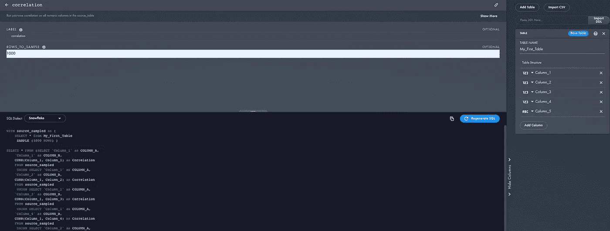
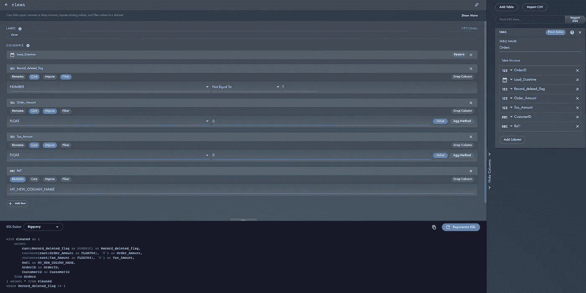
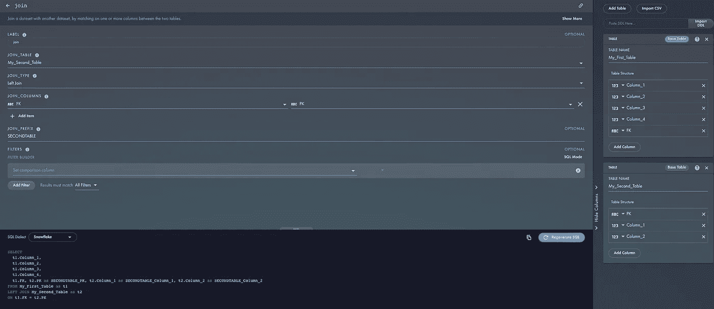
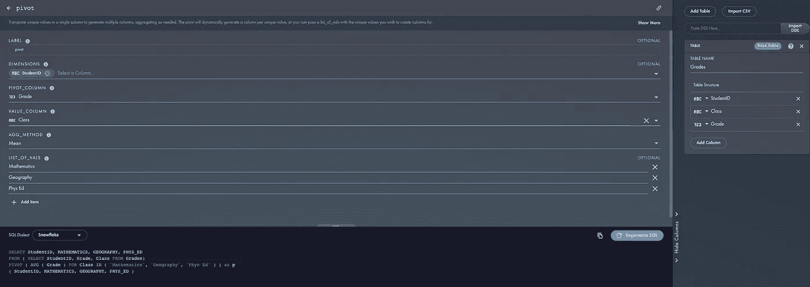
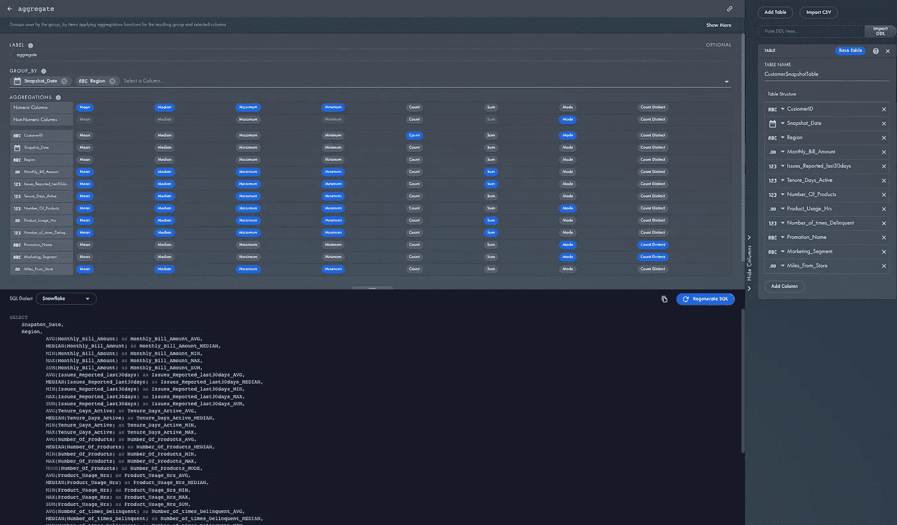

# 5 种最流行的 SQL 转换

> 原文：<https://towardsdatascience.com/the-5-most-popular-sql-transforms-ca1f977ef2b2>

## SQL 生成器的用法分析

由 [Austin Distel](https://unsplash.com/@austindistel?utm_source=medium&utm_medium=referral) 在 [Unsplash](https://unsplash.com?utm_source=medium&utm_medium=referral) 上拍摄的照片

# 介绍

在以前的帖子中，我提到过 [SQL 生成器](https://app.rasgoml.com/sql)网站，它是分析师快速生成复杂 SQL 的有用工具。本周，我获得了数据，这样我们可以看看哪些是最受欢迎的转变。

# 基本分析

数据本身相当有限。由于该网站对所有人免费开放，因此没有可供分析的用户数据。我们只有某人点击“生成 SQL”时的时间戳，以及它是什么类型的转换。

截至本文发布时，该网站已有 76 个不同的转换。让我们快速浏览一下最流行的转换，并讨论一下 SQL。

## #5:相关性(3%)

我惊讶地看到[相关性](https://tinyurl.com/8uej86k5)进入了前 5。这个转换从表中的数字列创建每一个可能的对，并运行`CORR()` SQL 函数。

这相当简单，但是我认为为每一对列编写 SQL 是非常耗时和乏味的。因此，用户通过使用 SQL 生成器进行这种类型的转换来节省时间是有意义的。

对于数字列，表结构(右)被自动分析，并且每个成对组合被构建到 SQL(下)中

## #4:清洁(3%)

[clean](https://tinyurl.com/kcfmjhbh) 转换是估算、过滤、转换和重命名的组合。它允许您对数据的每一列进行一次或多次这样的转换。

在这个例子中，我使用 Clean()混合并匹配了一些不同的转换:

*   移除了`Load_Datetime`
*   将`Record_Deleted_Flag`转换为一个数字，并在不等于 1 的地方进行过滤
*   铸造订单和税收金额为`FLOAT`并用 0 代替缺失
*   将栏目`Ref1`更名为`MY_NEW_COLUMN_NAME`

“清除”允许您同时应用删除、重命名、转换、估算和过滤器

## 第三:加入(4%)

[加入](https://tinyurl.com/2gqekbk3)如此受欢迎的事实也让我大吃一惊。我假设连接很常见并且很容易配置，但这可能是因为我在过去的 20 年里一直在编写 SQL。

除非您已经[将](https://docs.rasgoml.com/rasgo-docs/quickstart/connecting-your-database) Rasgo 连接到您的数据仓库，否则 SQL 生成器将看不到您的真实数据库，这需要您在页面的右侧配置您的表结构。但是，您可以设置任意多的表，然后使用该界面来设置您的连接并为您编写 SQL。

设置联接需要表定义

## 第二名:支点(5%)

事实上 [pivot](https://tinyurl.com/2nqy35tn) 是第二流行的转换并不奇怪。众所周知，Pivot 很难处理，尤其是因为每个 RDBMS 都决定使用稍微不同的语法。

然而，这仍然需要一些设置，因为您必须配置`LIST_OF_VALS`，它是您希望作为列进行透视的唯一值。如果您省略这个参数，Rasgo 将尝试为您查询不同的值*。(参见:将 Rasgo 连接到上面的数据仓库)*

**

*如果 Rasgo 没有连接到您的数据仓库，则必须配置 VALS 列表。*

## *第一名:合计(17%)*

*[聚合](https://tinyurl.com/2gmurrz2)是迄今为止最流行的转换，很容易看出为什么。该界面允许您轻松选择多种类型的聚合，并为您生成 SQL。*

*此外，一些 RDBMS(我正看着你呢，BigQuery)忽略了添加流行的函数，如`MEDIAN`和`MODE`，这使得编写 SQL 变得混乱和乏味。*

*你自己试试吧！在 SQL 生成器中打开 [this example](https://tinyurl.com/2gmurrz2) ，将 dialect 下拉菜单更改为 BigQuery，并观察 BigQuery SQL 的生成。*

**

*Aggregate 有一个易于使用的接口，这使它成为最流行的 SQL 转换*

# *关于帕累托原理的一个旁注*

*关于这些数据，最让我吃惊的一件事是所有的使用是如何分散的。经典的“80/20 法则”在这里并不适用。*

*80/20 规则，通常称为 Pareto 原则，表明 80%的使用将占 20%的转换。具体来说，这意味着 76 个 SQL 转换中的 15 个应该占使用量的 80%。*

*实际上，SQL 的用法似乎比这要多得多。我们看到前 15 个转换只占了 50%的使用量。因此，我们有一个 50/20 规则，而不是 80/20 规则。*

*不幸的是，帕累托原则与“80/20 法则”混淆了。事实上，帕累托法则只是告诉我们大多数事情并不是均匀分布的。80 加 20 等于 100 是一个普遍的误解。如果你想了解帕累托原则，我强烈推荐[我最喜欢的作家之一](https://betterexplained.com/articles/understanding-the-pareto-principle-the-8020-rule/)[卡利德·阿扎德](https://medium.com/u/20ff95fabf37?source=post_page-----ca1f977ef2b2--------------------------------)的这个博客/视频。*

# *结论*

*我从这一分析中看到两个要点:*

1.  *SQL Generator 更受欢迎的是自动化繁琐的 SQL，而不是复杂的逻辑*
2.  *SQL 的用法是多种多样的——换句话说，我们不可能只学了 5 样东西就突然成为专家。*

*我希望你和我一样对此感兴趣。如果您对您认为常见的其他 SQL 转换有建议或意见，您可以在[local Optimistic](https://locallyoptimistic.com/community/)和 [DataTalks 中找到我。俱乐部](https://datatalks.club/)。*