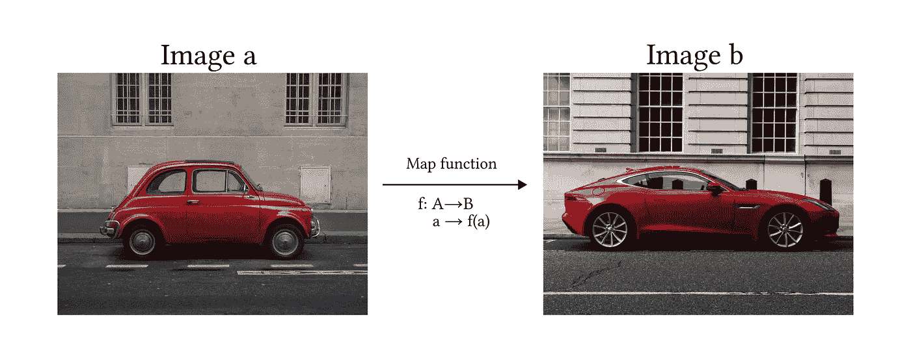
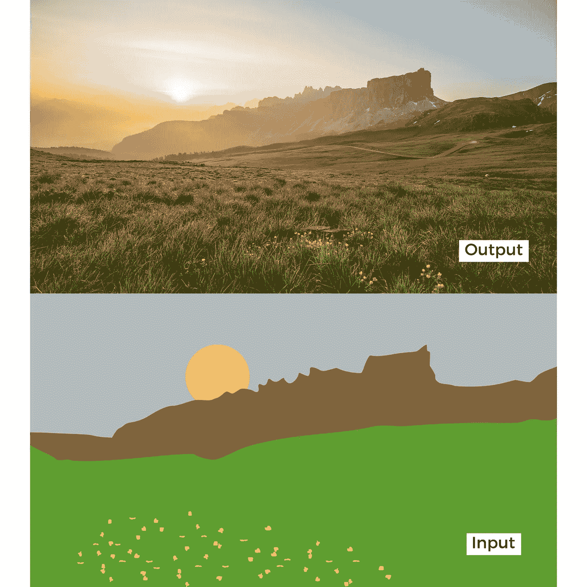
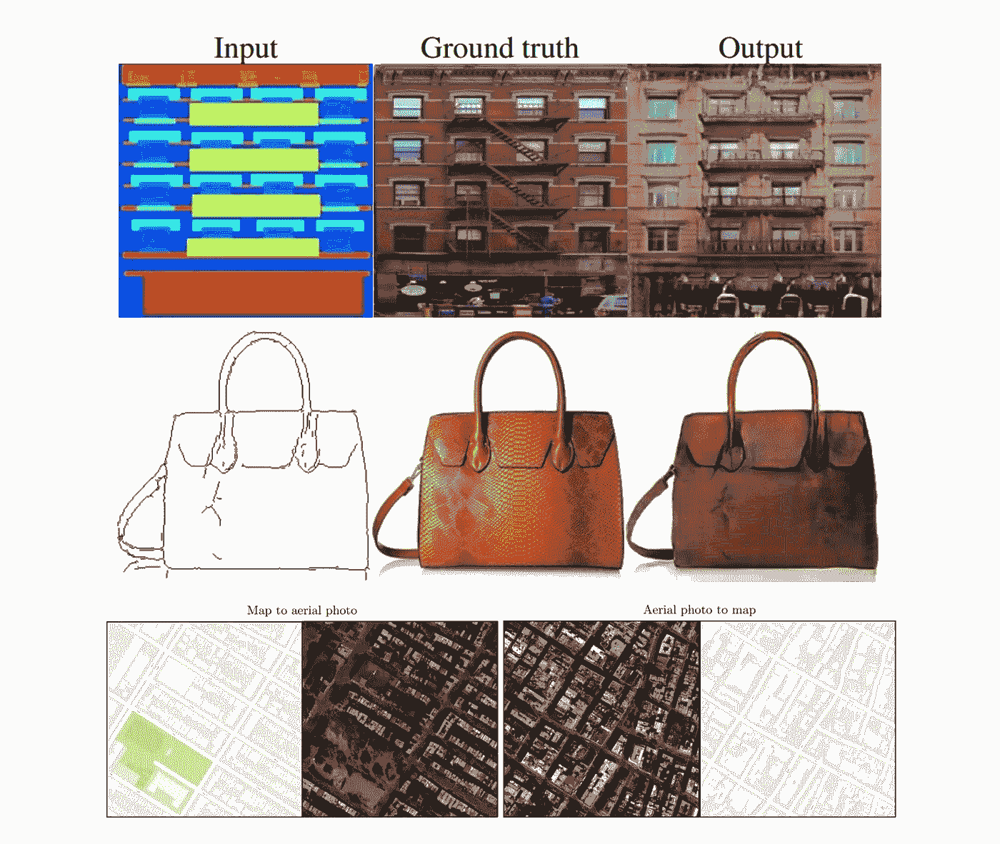
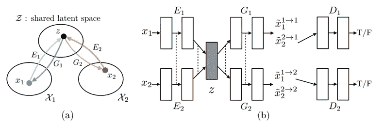
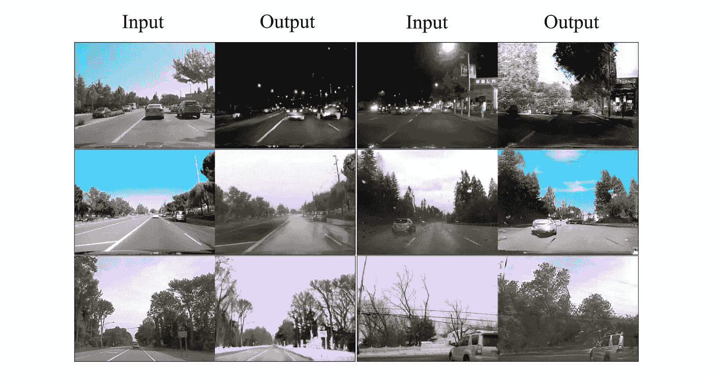
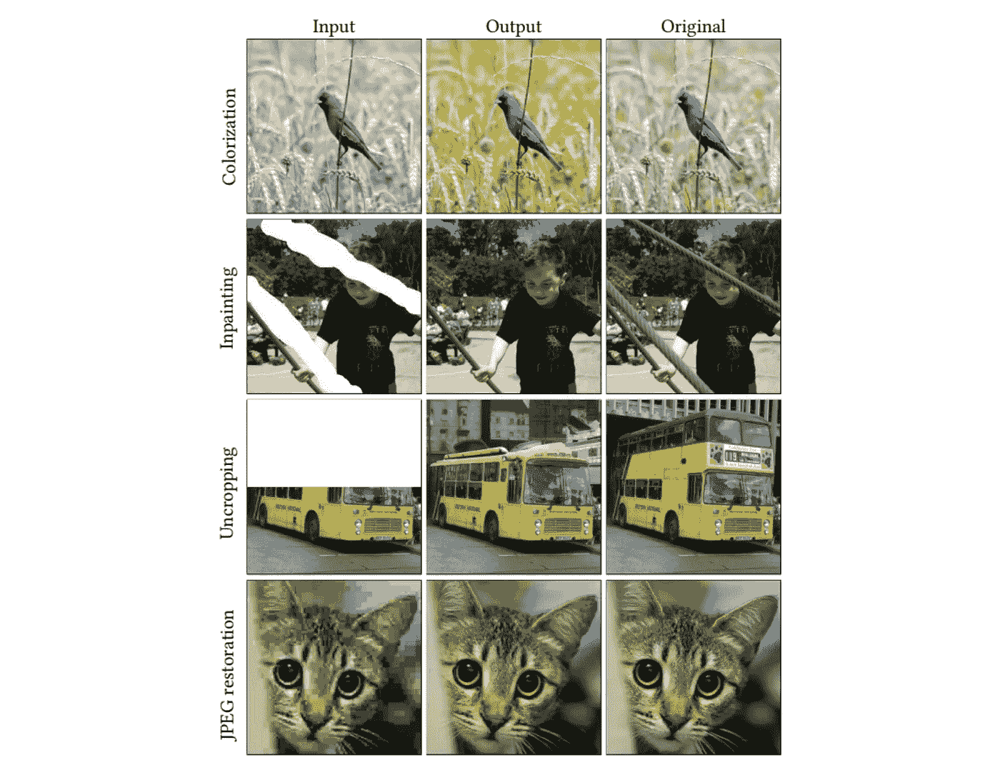
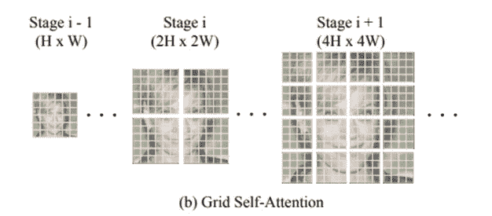
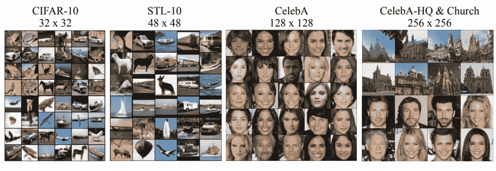

# 5 个最有前途的图像翻译人工智能模型

> 原文：<https://towardsdatascience.com/the-5-most-promising-ai-models-for-image-translation-de2677e526e6>

## 从其他图像生成图像的最新模型的技术水平

# 图像到图像的翻译

A 根据 Solanki，Nayyar 和 Naved 在[1]中的定义，*图像到图像的翻译是将图像从一个域转换到另一个域的过程，其目标是学习输入图像和输出图像之间的映射。*

换句话说，我们希望模型能够通过学习映射函数 f 将图像“a”转换为另一个图像“b”。

映射函数 f 获取图像“a ”,并将其转换为图像“b”。所有图像 A 的集合称为 A 的定义域，所有图像 b 的集合称为 b 的定义域。照片由[肖恩·惠兰](https://unsplash.com/@sswhelan?utm_source=unsplash&utm_medium=referral&utm_content=creditCopyText)(左)和[马特乌斯·德勒加茨](https://unsplash.com/@21w8y?utm_source=unsplash&utm_medium=referral&utm_content=creditCopyText)(右)在 [Unsplash](https://unsplash.com/?utm_source=unsplash&utm_medium=referral&utm_content=creditCopyText) 上拍摄。作者编辑

人们可能会想这些模型有什么用，它们在人工智能世界中有什么相关性。然而，它的应用非常广泛，不仅仅局限于艺术或平面设计。例如，能够拍摄一幅图像并将其转换成另一幅图像对于**创建合成数据**非常有用，比如分割图像来训练自动驾驶汽车模型。另一个经过测试的应用是**地图设计**，其中模型能够执行两种转换(卫星视图到地图，反之亦然)。图像转换模型也可以应用于**架构**，其中模型可以就如何完成未完成的项目提出建议。

图像翻译最引人注目的应用之一是将简单的图画转换成美丽的风景或绘画。图片由作者编辑

# 5 个最有前途的图像翻译人工智能模型

在过去的几年中，已经开发了几种方法来利用生成模型解决图像到图像的翻译问题。最常用的方法基于以下架构:

*   生成对抗网络
*   可变自动编码器(VAE)
*   扩散模型
*   变形金刚(电影名)

## Pix2Pix

Pix2Pix [2]是基于**条件 GAN 的模型**。这意味着它的结构由一个发生器网络(G)和一个鉴别器(D)构成。两个网络都在一个对抗性的游戏中接受训练，其中 G 的目标是生成看起来与数据集相似的新图像，而 D 必须决定图像是生成的(假的)还是来自数据集(真的)

Pix2Pix 和其他 GAN 模型之间的主要区别是:( 1)第一个的生成器将图像作为输入来开始生成过程，而普通 GAN 使用随机噪声，以及(2) Pix2Pix 是一个完全监督的模型，这意味着数据集由来自两个域的成对图像组成(输入和地面真实图像)

文中描述的架构由一个用于发生器的 U-Net 和一个用于鉴别器的马尔可夫鉴别器或补丁鉴别器定义:
*** U-Net** :由两个模块组成:*下采样*和*上采样*。使用卷积层将输入图像缩减为一组更小的图像(称为特征图),然后通过转置卷积进行上采样，直到达到原始输入维数。在*下采样*和上采样之间存在跳跃连接。
***补丁鉴别器**:卷积网络，其输出是一个矩阵，其中每个元素都是对图像的一个部分(补丁)进行评估的结果。它包括生成的图像和地面真实图像之间的 L1 距离，以确保生成器学习映射给定输入图像的正确函数。也称为马尔可夫，因为它依赖于来自不同片的像素是独立的假设。

Pix2Pix 结果。图片来自报纸[2]

## 无监督的图像到图像转换(单位)

在 Pix2Pix 中，训练过程是完全监督的(即我们需要成对的图像输入-背景事实)。单元方法[3]旨在学习将图像 A 映射到 B 的函数，而不需要两个成对的图像用于训练。

该模型从两个域(A 和 B)共享一个**公共潜在空间** ( ***Z*** )的假设出发。直观地说，我们可以将这个潜在空间视为图像域 A 和 b 之间的中间阶段。因此，使用绘画到风景的例子，我们可以使用相同的潜在空间后退并生成绘画图像，或者前进以看到令人惊叹的风景(见图 X)。

图一。(一)共享潜在空间。(b)单元建筑:X1 是一幅图画，X2 是一幅美丽的风景；E1，E2 是从两个领域(绘画和风景)获取图像并将它们映射到共享潜在空间 Z 的编码器；G1，G2 发电机，和 D1，D2 鉴别器。虚线表示网络之间的共享层。图片来自报纸[3]

单元模型是在一个**耦合 VAE-甘架构**(见图 1)下开发的，其中编码器的最后一层(e 1，E2)和生成器的第一层(G1，G2)是共享的。

单位结果。图片来自报纸[3]

## 调色板

Palette [4]是加拿大 Google 研究团队开发的一个**条件扩散模型**。该模型被训练来执行与图像转换相关的 4 个不同的任务，实现高质量的结果:
**(i)着色**:向灰度图像添加颜色
**(ii)修补**:用逼真的内容填充图像的用户指定区域
**(iii)去剪裁**:放大图像帧
**(iv) JPEG 恢复**:恢复受损的 JPEG 图像

在这篇文章中，作者探讨了多任务通用模型和多个专门化模型之间的差异，两者都是针对 1M 迭代训练的。该模型的架构基于 [Dhariwal 和 Nichol 2021](https://arxiv.org/pdf/2105.05233.pdf) 的类调节 U-Net 模型，并使用 1024 个图像的批量大小进行 1M 训练步骤。噪声时间表作为超参数被预先设置和调整，使用不同的时间表进行训练和预测。

调色板结果。图片来自报纸[4]

## 视觉变形金刚(ViT)

> **注**。虽然下面的两个模型不是明确为图像翻译而设计的，但它们是将变形金刚等强大模型引入计算机视觉领域的一个明显进步。

视觉变压器(ViT) [5]是对变压器架构( [Vaswani et al. 2017](https://arxiv.org/pdf/1706.03762.pdf) ) **的修改，为图像分类**而开发。该模型将图像作为输入，并输出属于每个定义的类别的概率。

主要问题依赖于这样一个事实，即变换器被设计成接受一维序列作为输入，而不是 2D 矩阵。为了解决这一障碍，作者建议将图像分割成小块，**将图像视为序列**(或 NLP 中的句子)**，而小块则视为记号**(或单词)

作为一个快速总结，我们可以将整个过程分为 3 个阶段:
1)嵌入:分割小块并展平它们→应用线性变换→添加类别令牌(该令牌将充当分类所考虑的图像摘要)→位置嵌入

2)变换器-编码器块:将嵌入的补丁馈入一系列变换器编码器块。注意力机制知道应该关注图像的哪些部分

3)分类 MLP 头:将类别令牌通过输出属于每个类别的图像的最终概率的 MLP 头。

**使用 ViT 的好处**:排列不变。与 CNN 相比，Transformer 不受图像平移(元素位置变化)的影响

**缺点**:训练需要大量的标记数据(至少 14M 的图像)

## TransGAN

TransGAN [6]是一个基于**变换的 GAN 模型**，专为不使用任何卷积层的图像生成而设计。相反，发生器和鉴别器由一系列通过上采样和下采样模块连接的变压器构成。

发生器的正向处理采用 1D 阵列的随机噪声样本，并将其通过 MLP。直观地说，**我们可以把数组想象成一个句子，把像素值想象成单词**(注意，一个 64 个元素的数组可以被重新整形为一个 1 通道的图像 8✕8)接下来，作者应用一系列变换块，每个变换块后面都有一个上采样层，使数组(图像)的大小加倍。

TransGAN 的一个关键特性是 ***网格——自我关注*** 。当到达高维图像(即，非常长的阵列 32✕32 = 1024)时，应用变形器会导致自关注机制的爆炸性成本，因为您需要将 1024 阵列的每个像素与可以占据该位置的所有 255 个可能的像素(RGB 比例)进行比较。由于这个原因，*网格自关注将全尺寸特征图划分成几个不重叠的网格，并且在每个局部网格内计算标记交互，而不是计算给定标记和所有其他标记之间的对应关系。*【参见图 2】
鉴别器架构与之前引用的 ViT 非常相似

图二。网格自我关注来自原论文[5]。现在，我们输入多个句子，一次一个，而不是用一个长句来填充变压器。图片来自报纸[6]

不同数据集上的 TransGAN 结果，图像来自论文[6]

# 参考

**【1】**[***【生成对抗网络】进行意象到意象的翻译***](https://www.sciencedirect.com/book/9780128235195/generative-adversarial-networks-for-image-to-image-translation) 。Arun Solanki、Anand Nayyar 和 Mohd Naved。爱思唯尔(2021)

[**【2】有条件对抗网络的意象到意象翻译**](https://arxiv.org/pdf/1611.07004.pdf) 。菲利普伊索拉朱俊彦廷辉周阿列克谢。2018

**【3】**[**无监督的图像到图像翻译网络**](https://arxiv.org/pdf/1703.00848.pdf) 。刘明宇，托马斯·布雷尔，扬·考茨。2018

**【4】**[**调色板:图像间扩散模型**](https://arxiv.org/pdf/2111.05826.pdf) 。奇万·萨哈利亚、陈伟霆、张惠文、克里斯·李、乔纳森·何、蒂姆·萨利曼斯、戴维·J·弗利特、穆罕默德·诺鲁齐。2022

**【5】**[**一幅图像抵得上 16x16 的文字:变形金刚在尺度上的图像识别**](https://arxiv.org/pdf/2010.11929.pdf) 。Alexey Dosovitskiy、Lucas Beyer、Alexander、Dirk Weissenborn、翟晓华、Thomas Unterthiner、Mostafa Dehghani、Matthias Minderer、Georg Heigold、Sylvain Gelly、Jakob Uszkoreit、Neil Houlsby。2021

**【6】**[**trans GAN:两个纯变形金刚可以做一个强 GAN，而且那个可以放大**](https://arxiv.org/pdf/2102.07074.pdf) 。、张、王 1。2021