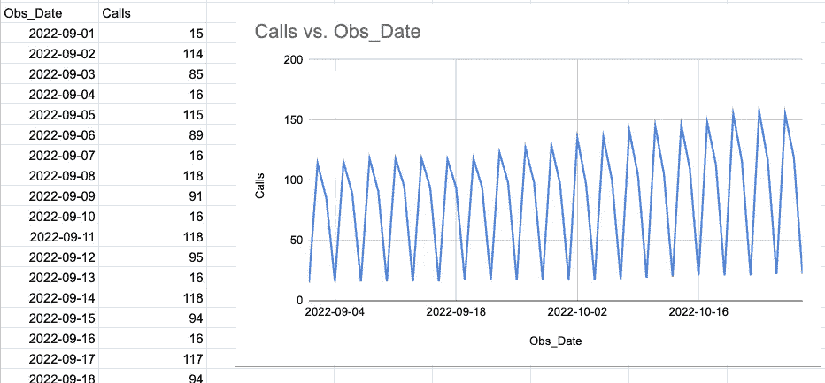
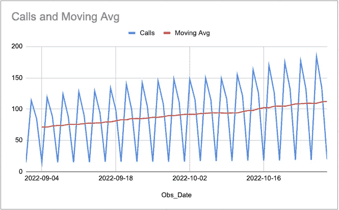

# 要开始使用的 5 个 SQL 转换

> 原文：<https://towardsdatascience.com/the-5-sql-transforms-to-start-using-296ca7987921>

## 鲜为人知的 SQL 转换以及它们为什么有用

照片由 [akiragiulia](https://pixabay.com/users/akiragiulia-1597753/) 在 [Pixabay](https://pixabay.com/photos/cellar-bottles-wine-red-wine-rack-2080318/) 上拍摄

# 介绍

在以前的帖子中，我分析了来自 [SQL Generator 5000](https://app.rasgoml.com/sql) 的数据，并概述了 5 种最流行的 SQL 转换。这一次，我反其道而行之，看看最不受欢迎的 5 个。

当我最初回顾最不受欢迎的转换时，我很惊讶，因为它们中的大多数都非常有用。所以，我联系了一些我认识的用户，和他们讨论这个问题。

根据这些对话，我了解到很少使用这些转换的主要原因有两个:

1.  有些是非常**情境化的**——`aggregate`和`join`几乎在每个 SQL 查询中都使用，`Moving Average`只在处理时序数据时使用
2.  其中一些转换是 SQL Generator 特有的——很少使用只是因为**不知道它们的存在**

因此，我将遍历 5 个最不常用的转换，并和 SQL 代码一起解释每一个都有用的情况。

# #5 最小-最大缩放器

## 这是什么？

定标器是改变数值范围的方法。两个最常见的是:`min_max_scaler`和`standard_scaler.`一般来说，缩放是以一种新的范围落在 0 和 1 之间的方式进行的。另一方面，标准化是以平均值为 0，标准偏差为 1 的方式进行的。有时候，术语*正常化*会在关于这些技术的对话中出现。Normalize 可以有非常具体的含义，但通常它是一个通用术语，可能意味着缩放、标准化(或其他什么！).为了避免混淆，不要使用术语*规格化*。

## 如何使用？

缩放数据有几种常见的情况:

*   相对比较用不同单位测量的事物
*   基本分割
*   机器学习的预处理
*   在同一个图表上一起绘制指标

假设您有一些关于患者的数据，其中每个变量都在不同的范围内:

原始数据

由于`Age`是以年计量的，`Glucose`是以 mg/DL 计量的，我们很难对患者进行比较。缩放该数据的公式要求我们知道值的`MIN()`和`MAX()`。同样，`standard_scaler`要求我们知道`AVG()` 和`STDEV()`。

请注意 [SQL](https://tinyurl.com/2j2le6uz) 是如何以动态计算的方式编写的。

最小-最大缩放的 SQL

缩放数据

# 最新排名第四

## 这是什么？

Latest 是一个 SQL 转换，它返回一组有序值中的最后一个值。虽然大多数 SQL 函数一次只“查看”一行，但这个函数使用所谓的窗口函数来查看其他行。因此，只有当您的数据具有固有的顺序时，才使用它。

## 如何使用？

有许多方法可以使用最新的，但最常见的是:

*   分析系统日志，或者只在值发生变化时才记录值的系统
*   当传感器有时不报告时分析传感器数据(这在传感器数据中很常见)
*   分析“快照”数据—查找期末值
    (月末销售额、日终通话等。)
*   时间序列或预测模型的预处理

假设您有传感器数据，但温度读数有时会丢失:

每小时传感器数据(原始)

下面是可定制的 SQL[用最新的先前值替换任何空白值。](https://tinyurl.com/2lgsgvn7)

最适合这种转换的函数叫做`LAST_VALUE().`，它通过声明一个搜索窗口来工作，该窗口根据 RDBMS 有不同的默认行为。因此，我总是建议您显式声明`ROWS BETWEEN`定义，以使您的代码更容易理解。

> 注意:我写了一篇较长的教程，介绍如何使用这种技术来填补时间序列数据中的空白。

# #3 移动平均线

## 这是什么？

移动平均变换是另一个窗口函数，它要求数据具有内在的顺序。移动平均线可以用来告诉我们过去 7 天的平均销售额，而不是今天的销售额。

## 如何使用？

移动平均线主要用于确定一个趋势。如果你的价值观变化很大，他们也可以“消除”波动。它是最古老和最常用的技术指标之一。甚至在 Excel 中也有！如果您在 Excel 中绘制时间序列，您可以通过右键单击并“添加趋势线”来添加移动平均值

它最常用于:

*   金融和交易分析
*   趋势分析
*   仪表板和图表覆盖

假设您的数据具有戏剧性的季节性模式:

季节性模式的示例数据

我制作了这张图表，这样你就可以看到有轻微的增长趋势。然而，量化这一趋势可能很困难，因为数字到处都是。

使用[移动平均转换](https://tinyurl.com/2p94gu5l)，我们可以创建添加移动平均的 SQL。

当我们绘制结果时，我们可以看到一个良好的、稳定的、增长的趋势。

# #2 熵

## 这是什么？

熵是一种聚合分类数据并表示其分散程度的方法。它来自信息论领域，经常在机器学习算法的幕后使用。

## 如何使用？

我们当前对 SQL 生成器的分析是一个很好的例子，说明了`entropy`的用处。假设用户 A 和用户 B 各使用了 SQL 生成器 100 次，并且他们只使用了两个最流行的转换，`aggregate`和`pivot`。

用户 A: `aggregate` **50** 次，`pivot` **50** 次
用户 B: `aggregate` **99** 次，`pivot` **1** 次

如果我们只对`COUNT()`和`COUNT(DISTINCT)`进行聚合，我们将无法区分这两个用户的行为，但是他们的行为非常不同。

这就是测量熵有帮助的地方。用户 A 和 B 明显不同，因为他们的使用分布不同。熵将显示用户 A 的熵为 1，因为`aggregate`和`pivot`之间的分布尽可能分散。另一方面，用户 B 将具有非常低的熵，因为他们主要仅使用单个变换。

没有直接的 SQL 函数来计算`entropy`，但是 SQL 生成器会为您编写执行这个聚合的逻辑。[自己试试](https://tinyurl.com/2lram69f)！

# #1 直方图

## 这是什么？

直方图是一种图表，所以 SQL 工具的用户不觉得这种转换很流行也就不足为奇了。与熵类似，直方图也通过将一个数字列分解成多个柱，然后绘制它们出现的频率来测量离差。然而，直方图是一个可视化的图表——SQL 不能制作图表，那么这个 SQL 转换到底是为了什么呢？

## 如何使用？

直方图本身非常有用。它们允许用户快速回答问题，例如:

*   出货时间多久超过 48 小时？
*   总订单量的分布是怎样的？

分析师通常使用 BI 工具或 python 包来自动汇总数据并创建图表。*这个 SQL 转换只是为了聚合数据*。这是因为与实际绘制的集合相比，基础数据可能非常大。

例如，如果您有 5 亿个订单，并且您想要绘制一个`total_order_amount`的直方图，那么将所有的 5 亿行都移动到您的笔记本电脑中，只是将它聚合成 100 行以绘制直方图，这在计算上是很浪费的。这个 SQL 将直接从仓库中产生聚集的行，所以绘制直方图变得很快&容易。

这里有一个例子:

通过用直方图配置 [SQL 生成器，我们可以选择使用多少个库(在本例中为 100)。](https://tinyurl.com/2efd26xs)

SQL 生成如下:

# 结论

简单回顾一下，上周我们看了 5 个最受欢迎的转变，我们接着看了 5 个最不受欢迎的转变。

> ***最流行的***——*关联、清理、连接、透视、聚合*
> 
> ***最不受欢迎*** — *最小最大缩放器、最新、移动平均值、熵、直方图*

正如您所看到的，流行的转换似乎是简单、乏味的，而最不受欢迎的似乎是最专业、最复杂的。

根据我与用户的交谈，很明显，许多人并不知道这些专门的转换是用来做什么的。所以，希望我已经分享了一些很少使用的有用的上下文，这样如果你发现自己处于这些罕见的情况中，你就已经有了为你编写的代码。