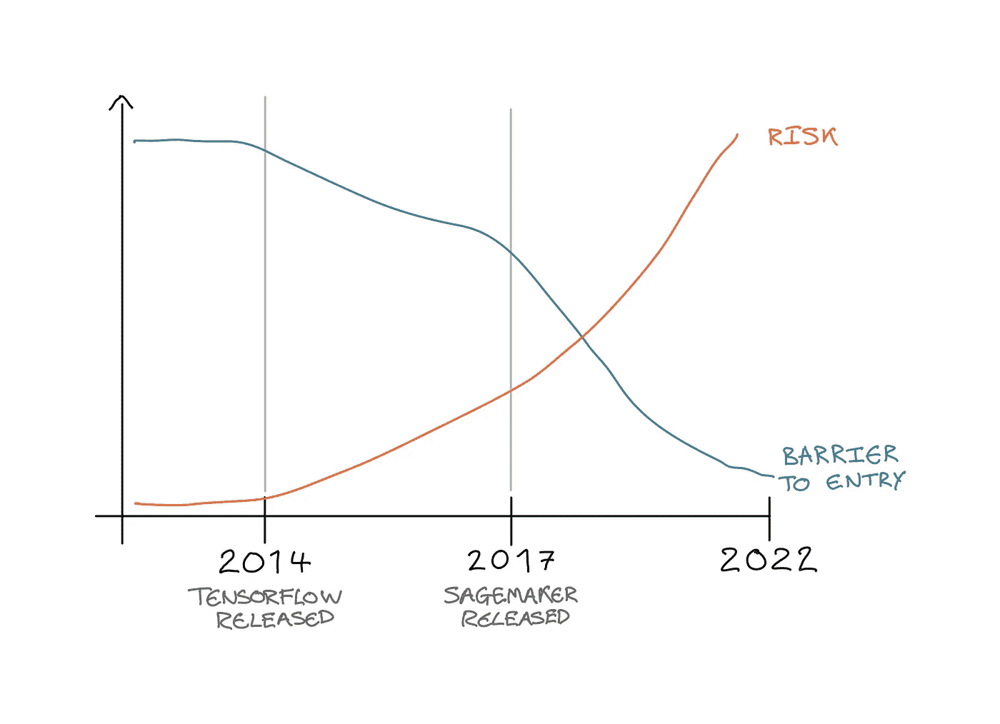
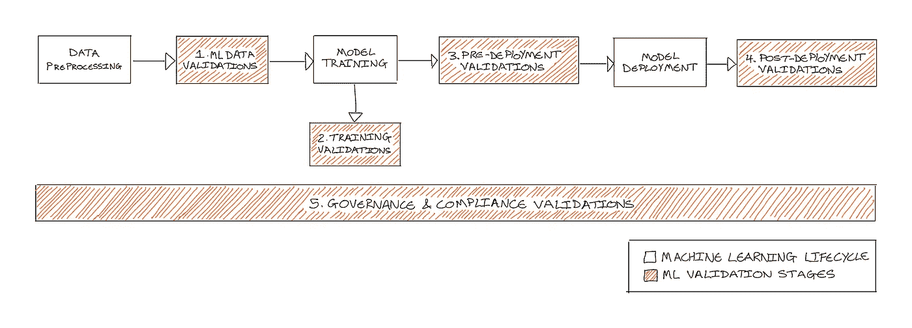
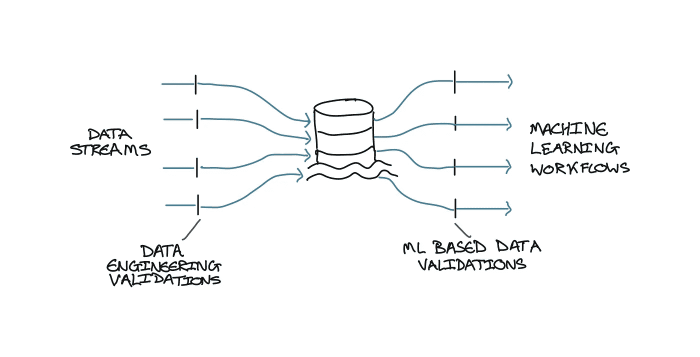
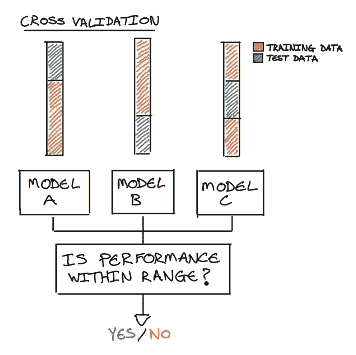
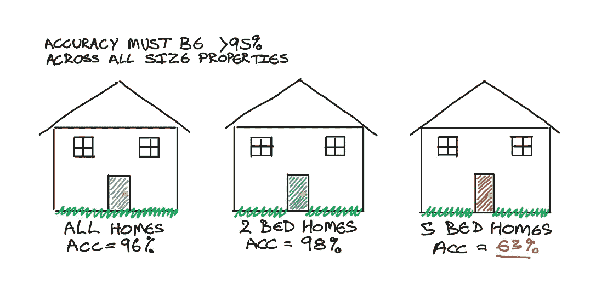
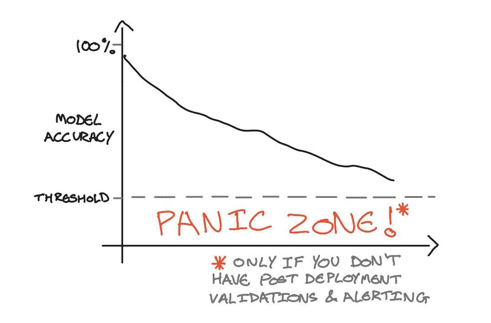

# 机器学习验证的 5 个阶段

> 原文：<https://towardsdatascience.com/the-5-stages-of-machine-learning-validation-162193f8e5db>

## 确保跨 ML 生命周期的高质量机器学习

质量管理是一个静态图像。信用[尼科埃尔尼诺](https://www.istockphoto.com/portfolio/NicoElNino?mediatype=photography)，股票照片 ID:1357020474

# 介绍

机器学习近年来蓬勃发展。它越来越融入我们的日常生活，并为各行各业的企业提供了巨大的价值。普华永道预测，到 2030 年，人工智能将为全球经济贡献 15.7 万亿美元。这听起来好得难以置信…

然而，鉴于全球经济和社会的潜在附加值如此之大，为什么我们如此频繁地听到人工智能发生灾难性错误的故事？以及一些最大的、技术最先进的企业。

我相信你已经看到了头条新闻，包括亚马逊和苹果的性别偏见[招聘工具](https://www.reuters.com/article/us-amazon-com-jobs-automation-insight-idUSKCN1MK08G)和[信用卡产品](https://www.bbc.co.uk/news/business-50365609)，这不仅影响了他们各自的公司声誉，也可能对整个社会产生巨大的负面影响。此外，Zillow 著名的 iBuying 算法，由于不可预测的市场事件，导致该公司将其房地产投资组合的价值减少了 5 亿美元。

回到大约 8 年前，在出现诸如 [Tensorflow](https://www.tensorflow.org/) 、 [PyTorch](https://pytorch.org/) 和 [XGBoost](https://xgboost.readthedocs.io/en/stable/) 等工具之前，数据科学领域的主要焦点是如何实际构建和训练机器学习模型。在创建了上面列出的工具以及更多工具之后，数据科学家能够将他们的理论付诸实践，并开始构建机器学习模型来解决现实世界的问题。

在解决了模型构建阶段之后，近年来的很多焦点都是通过将模型投入生产来开始产生真实世界的价值。许多大型端到端平台，如 [Sagemaker](https://aws.amazon.com/pm/sagemaker/) 、 [Databricks](https://www.databricks.com/) 和 [Kubeflow](https://www.kubeflow.org/) 已经做了很好的工作，为部署机器学习模型提供了灵活和可扩展的基础设施，以供更广泛的企业和/或公众使用。

现在，工具和基础设施可以有效地构建和部署机器学习，企业将机器学习提供给外部客户或用于做出商业决策的障碍已经大大减少。因此，像上面这样的故事发生得越来越频繁的风险变得越来越大。

这就是机器学习验证的用武之地…

图 1: *图表对比了过去 8 年 AI/ML 的准入门槛和相关风险。图片作者。*

# 内容

*   介绍
*   什么是机器学习验证？
*   机器学习验证的 5 个阶段
    - ML 数据验证
    -培训验证
    -部署前验证
    -部署后验证
    -治理&合规性验证
*   拥有 ML 验证策略的好处

# TL；速度三角形定位法(dead reckoning)

*   机器学习系统不能用传统的软件测试技术来测试。
*   机器学习验证是评估机器学习系统质量的过程。
*   已经确定了 5 种不同类型的机器学习验证:
    - **ML 数据验证** : 评估 ML 数据的质量
    - **训练验证** : 评估用不同数据或参数训练的模型
    - **部署前验证** : 部署前的最终质量测量
    - **部署后验证** :
*   **实施机器学习验证过程将确保 ML 系统以高质量构建，符合要求，并被企业接受以增加采用。**

# **什么是机器学习验证？**

**由于机器学习的概率性质，很难像测试传统软件一样测试机器学习系统(即单元测试、集成测试等)。).由于模型周围的数据和环境会随着时间的推移而频繁变化，因此只测试模型的特定结果并不是好的做法。作为今天展示一组正确验证的模型，明天可能会非常错误。**

**此外，如果在模型或数据中发现了错误，解决方案不能只是简单地实施修复。同样，这是由于机器学习模型周围不断变化的环境和重新培训的需要。如果解决方案只是一个模型修正，那么下次重新训练模型或者更新数据时，修正将会丢失并且不再被考虑。因此，应该实施模型验证来检查某些模型行为和数据质量。**

**值得注意的是，当我们在这里谈论验证时，我们不是指在机器学习生命周期的训练阶段执行的典型验证。我们所说的机器学习验证是指在传统软件测试手段之外，测试机器学习系统以验证系统质量的过程。应该在机器学习生命周期的所有阶段进行测试，以在机器学习系统投入生产之前验证其质量。以及持续监控生产中的系统健康状况，以检测任何潜在的恶化。**

# **机器学习验证的 5 个阶段**

**如下图**图 2** 所示，机器学习验证的 5 个关键阶段已经确定:**

1.  **ML 数据验证**
2.  **培训验证**
3.  **部署前验证**
4.  **部署后验证**
5.  **治理和合规性验证**

**本文的剩余部分将进一步分解每个阶段，概述它是什么，验证的类型和每个类别的例子。**

****

***图 2:图表显示了机器学习验证的 5 个阶段在典型的机器学习生命周期中的位置。图片作者。***

# **1.ML 数据验证**

**最近，出现了向以数据为中心的机器学习发展的巨大转变。这凸显了用高质量数据训练机器学习模型的重要性。机器学习模型根据它接受训练的数据来学习预测某种结果。因此，如果训练数据是目标状态的不良表示，则模型将给出不良预测。简单来说，垃圾进，垃圾出。**

**数据验证评估用于训练和测试模型的数据集的质量。这可以分为两个子类别:**

*   ****数据工程验证** —基于基本理解和规则，识别数据集中的任何一般问题。这可能包括检查整个数据中的空列和 NAN 值，以及已知的范围。例如，确认“年龄”特征的数据应该在 0-100 之间。**
*   ****基于 ML 的数据验证** —评估用于训练机器学习模型的数据质量。例如，确保数据集均匀分布，这样模型就不会有偏差，或者对于某个要素或值具有更高的性能。**

**如下面的 ***图 3*** 所示，最佳实践是在您的机器学习管道之前完成数据工程验证。因此，只有基于 ML 的数据验证应该在机器学习管道本身中执行。**

****

***图 3:显示两种不同类型的数据验证在数据流程中所处位置的图表。图片作者。***

# **2.培训验证**

**训练验证包括任何需要重新训练模型的验证。通常，这包括在一次培训工作中测试不同的模型。这些验证是在模型开发的培训/评估阶段执行的，通常作为实验代码保存，不会最终投入生产。**

**实践中如何使用培训验证的几个例子包括:**

****超参数优化** —寻找最佳超参数集的技术(如网格搜索)经常使用，但未经验证。将经过超参数优化的模型的性能与包含一组固定超参数的模型的性能进行比较是一种简单的验证。通过测试调整单个超参数对模型性能的预期结果的影响，可以增加该过程的复杂性。**

****交叉验证** —对数据的不同分割进行训练可以转化为验证，例如验证每个模型的性能输出在给定的范围内，确保模型具有良好的通用性。**

****

***图 4:展示如何将交叉验证转化为简单验证的例子。图片作者。***

****特性选择验证** —理解某些特性的重要性或影响力也应该是贯穿模型生命周期的一个连续过程。示例包括从训练集中移除特征或添加随机噪声特征，以验证这对性能/特征重要性等指标的影响。**

# **3.部署前验证**

**模型训练完成并选定模型后，应在训练验证流程之外验证最终模型的性能和行为。这包括围绕可测量的度量创建可操作的测试。例如，这可能包括重新确认性能指标是否高于某个阈值。**

**评估模型的性能时，通常会查看准确性、精确度、召回率、F1 分数或自定义评估指标等指标。但是，我们可以更进一步，在整个数据集的不同数据片中评估这些指标。例如，对于一个简单的房价回归模型，在预测一个 2 居室和一个 5 居室的房价时，模型的性能如何比较。这些信息很少与模型的用户共享，但对于理解模型的优点和缺点来说，这些信息非常有用，因此有助于增加对模型的信任。**

****

***图 5:显示如何进一步分解简单模型性能指标——准确性的示例，以验证不同数据片的性能。图片作者。***

**额外的性能验证还可以包括，将模型与随机基线模型进行比较，以确保模型实际上与数据相符；或者在开发低延迟用例时，测试模型推理时间是否低于某个阈值。**

**还可以包括性能之外的其他验证。例如，应该通过检查单边情况来验证模型的稳健性，或者验证模型在最小数据集上的准确预测。此外，可解释性度量也可以转化为验证，例如检查一个特性是否在前 N 个最重要的特性中。**

**重要的是要重申，所有这些部署前验证都采用可测量的指标，并将其构建到通过/失败测试中。在模型用于生产之前，验证作为最终的“通过/不通过”。因此，这些验证作为一种**预防措施**来确保一个高质量和透明的模型将被用于制定它所建立的商业决策。**

# **4.部署后验证(模型监控)**

**一旦模型通过了预部署阶段，它就被提升到生产阶段。由于模型随后做出实时决策，部署后验证用于持续检查模型的健康状况，以确认它仍然适合生产。因此，部署后验证作为**反应措施**。**

**由于机器学习模型根据其接受训练的历史数据预测结果，即使模型周围环境的微小变化也可能导致非常不正确的预测。模型监控已经成为行业内广泛采用的实践来计算活动模型度量。这可能包括滚动性能指标，或者实时数据和训练数据分布的比较。**

**与部署前验证类似，部署后验证是采用这些模型监控指标并将其转化为可操作测试的实践。通常，这涉及到报警。例如，如果实时准确性指标低于某个阈值，就会发送警报，触发某种操作，如通知数据科学团队，或调用 API 启动再培训管道。**

****

***图 6:显示模型性能随时间衰减的图表，其中可以添加一个阈值来触发操作。图片作者。***

**部署后验证包括:**

*   ****滚动性能计算** —如果机器学习系统有能力收集预测正确与否的反馈，性能指标就可以即时计算出来。然后，可以将现场表现与训练表现进行比较，以确保它们在某个阈值内并且不会下降。**
*   ****异常值检测** —通过获取模型训练数据的分布，可以根据实时请求检测异常。通过了解数据点是否在训练数据分布的特定范围内。回到我们的年龄示例，如果新请求包含“年龄=105”，这将被标记为异常值，因为它超出了训练数据的分布(我们之前定义为范围从 0 到 100)。**
*   ****漂移检测** —识别模型周围的环境何时发生变化。常用的技术是将实时数据的分布与训练数据的分布进行比较，并检查它是否在某个阈值内。再次使用“年龄”示例，如果实时数据输入突然开始接收大量年龄为> 100 的请求，则实时数据的分布将会改变，并且具有比训练数据更高的中值。如果该差值大于某个阈值，将会识别出漂移。**

****A/B 测试** —在将新模型版本推广到生产中之前，或者为了在实时数据中找到性能最佳的模型，可以使用 A/B 测试。A/B 测试向模型 A 发送一个流量子集，向模型 B 发送一个不同的流量子集。通过使用选定的性能指标评估每个模型的性能，可以选择性能更高的模型并将其推广到生产中。**

# **5.治理和合规性验证**

**在生产中建立并运行一个模型，并确保它生成高质量的预测是非常重要的。然而，同样重要的是(如果不是更重要的话),确保模型以公平和合规的方式进行预测。这包括满足管理机构制定的法规，以及与您组织的特定公司价值观保持一致。**

**正如引言中所讨论的，最近的新闻文章显示，一些世界上最大的组织犯了非常错误的错误，并将有偏见/歧视的机器学习模型引入现实世界。**

**GDPR、欧盟人工智能法案(EU Artificial Intelligence Act)和 GxP 等法规开始制定政策，以确保组织以安全和公平的方式使用机器学习。**

**这些政策包括以下内容:**

*   **理解和识别人工智能系统的风险(分为不可接受的风险、高风险和有限和最小风险)**
*   **确保 PII 数据不会被不当存储或使用**
*   **确保性别、种族或宗教等受保护特征不被使用**
*   **确认模型所依据的数据的新鲜度**
*   **确认模型经常接受再培训并且是最新的，并且有足够的再培训流程**

**组织应定义自己的 AI/ML 合规政策，该政策应符合这些官方的政府 AI/ML 合规法案及其公司价值观。这将确保组织在开发任何机器学习系统时，都有必要的流程和保护措施。**

**验证过程的这个阶段适用于上面讨论的所有其他验证阶段。拥有一个适当的 ML 验证过程将提供一个框架来报告一个模型在每个阶段是如何被验证的。因此满足符合性要求。**

# **拥有 ML 验证策略的好处**

**在机器学习管道的所有五个阶段实施合适的验证流程将确保:**

1.  **机器学习系统是由高质量的，**
2.  **这些系统完全兼容，使用安全，**
3.  **所有利益相关者都可以看到模型是如何验证的，以及机器学习的价值。**

**企业应该确保他们有正确的流程和政策来验证他们的技术团队正在提供的机器学习。此外，数据科学团队应该在其机器学习系统的范围界定阶段包括验证设计。这将决定机器学习模型必须通过的测试，以移动并保持在生产中。**

**这不仅可以确保企业的机器学习系统产生大量的价值，还可以让非技术企业用户和利益相关者对正在交付的机器学习应用程序产生信任。因此，在组织中增加机器学习的采用。**

***如果您想了解更多关于机器学习验证的信息，或者需要在您的组织内定义 ML 验证政策的帮助，请随时通过* [*Linkedin*](https://www.linkedin.com/in/joel-hodgson-6459ab151/) *或* [*电子邮件*](mailto:joel.hodgson@trubrics.com) *与我们联系。***