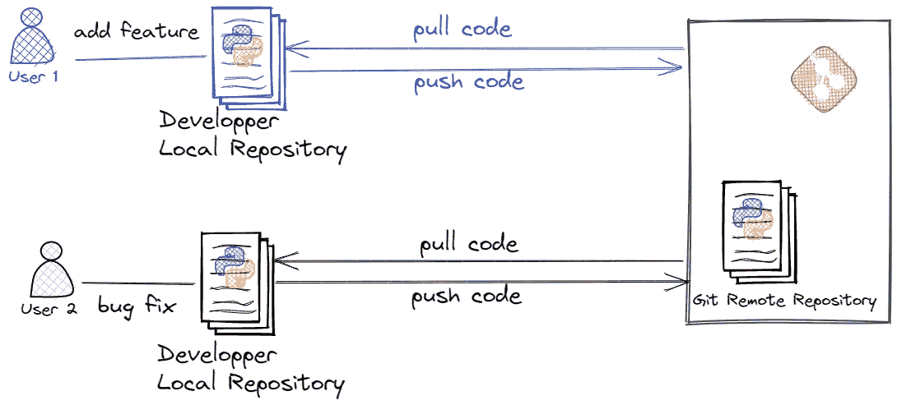
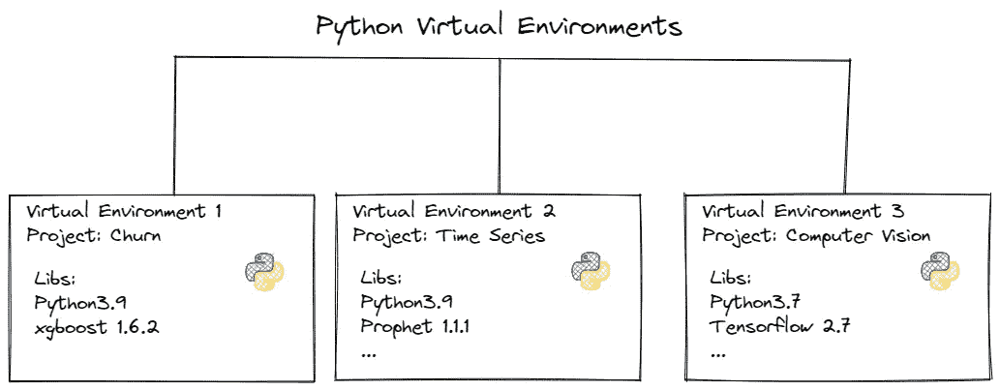
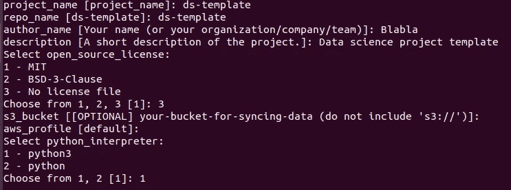
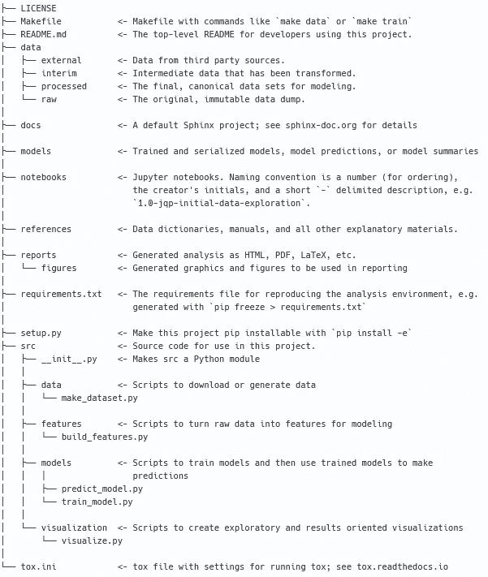
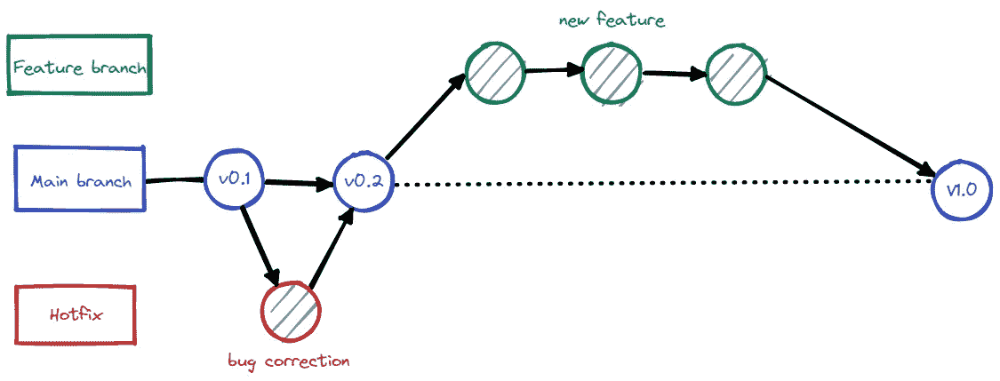

# 使用 Python 将机器学习项目更快投入生产的 7 个最佳实践

> 原文：<https://towardsdatascience.com/the-7-best-practices-to-move-your-machine-learning-projects-into-production-faster-using-python-72bff93216af>

## 设计可用于生产的机器学习算法的实用建议


马特·里德利在 [Unsplash](https://unsplash.com/s/photos/production?utm_source=unsplash&utm_medium=referral&utm_content=creditCopyText) 上的照片

# 动机

如果没有适当的基础设施、工具和知识，在生产中部署是很难的**。在大多数情况下，数据科学家主要参与实验，分析数据并选择最符合用户要求的机器学习(ML)算法。到目前为止，一切看起来都很好。客户很高兴并且迫不及待地想让它的算法投入生产。神奇的词是**生产。**大家都假设生产是最容易的部分。然而不幸的是，道路仍然漫长。不到 30%的 ML(例如企业 2022 中的 [AI 采用)项目最终在生产中成功运行，获得商业价值。为了更快地进入生产阶段，本文提出了一个 7 **最佳实践的列表**，供数据科学家从项目一开始就考虑。](https://www.oreilly.com/radar/ai-adoption-in-the-enterprise-2022/)**

# **最佳实践**

## **1.不要混合太多的编程语言**

**在没有充分理由的情况下，避免在 ML 项目中混合太多的语言(Scala、Python、Java、SQL、Bash)。坚持使用单一的编程语言可以增强团队成员之间的协作，并减少维护时间。**

**如果你的选择是 Python，那就坚持下去。**

**例如，在我的案例中，所有混合了 Bash、Python、Java 和 Scala 等几种语言的 ML 项目最终都难以维护，因为团队对 Python 最有信心。最后，我们甚至不得不放弃这个项目，或者用 Python 重写模块。这一努力得到了回报，因为我们在维护上花费的时间减少了，团队有更多的时间关注 ML 和代码质量。**

## **2.您代码版本**

**教您的数据科学家同事将他们的工作版本化(包括笔记本！).版本控制有助于跟踪所有的代码变更。在实验阶段，我们每天都要进行改进和修正，由于错误的操作或回滚，很可能会丢失我们的部分工作。随着时间的推移，跟踪所有的代码更改会使代码操作变得更加容易。我建议你开始使用 [**Git**](https://git-scm.com/) 进行版本控制，因为它是最流行的版本控制框架，功能强大，易于使用。在我的案例中，开始使用代码版本控制的数据科学家变得更有效率，也更容易合作。**

**请在下面找到一个简化的 Git 概述。**

****

**作者图片**

## **3.使用 Python 虚拟环境**

***什么是虚拟环境？这是一个 Python 工具，可以确保依赖性管理和项目隔离。***

**每当我不得不在 Python 中处理一个任务时，首先，我确保我创建了一个虚拟环境，使开发环境与我的发行版完全隔离。这样，我可以轻松地与团队共享我的应用程序，而不用担心依赖冲突。请注意，在生产环境中，隔离是必须的。**

**下图显示了 Python 虚拟环境的轮廓。**

****

**作者图片**

**查看[**第二步在我之前的文章**](https://medium.com/towards-data-science/how-to-set-up-custom-vertex-ai-pipelines-step-by-step-467487f81cad) ，里面解释了****如何在 Jupyter 中创建一个虚拟环境并激活它。******

## ******4.定义项目结构******

******不要每次都从头开始创建一个项目。为你的团队提出一个模板项目。它有助于数据科学家和数据工程师同事在 ML 项目之间做出贡献和快速切换。它支持代码组织，并有助于代码调试。例如，我所在的团队中，每个 ML 项目都有独特的结构，很难在项目之间快速切换，当然，新成员也会感到困惑。由于该团队使用了独特的项目结构，该过程是透明且轻松的。******

******请随意使用开源的 [**cookiecutter**](https://drivendata.github.io/cookiecutter-data-science/) 模板生成器。用法非常简单。******

****使用以下内容安装软件包****

****`pip install cookiecutter`****

****并使用以下命令启动一个新项目:****

****`cookiecutter [https://github.com/drivendata/cookiecutter-data-science](https://github.com/drivendata/cookiecutter-data-science)`。****

****Cookiecutter 将要求您提供项目名称、存储库名称、作者、团队、组织、许可类型以及您计划使用的 python 解释器。见下面我的配置。****

********

****转到生成的目录:****

```
**cd ds-template**
```

****生成的项目结构如下所示:****

********

****[https://github.com/drivendata/cookiecutter-data-science](https://github.com/drivendata/cookiecutter-data-science)****

## ****5.识别 Python 开源库****

****我建议花一些时间选择适合您的 ML 项目的 python 库。选择稳定、安全和通用的库。我处理过团队由于基于亲缘关系而不是团队策略的库选择而产生分歧的情况。因此，我最终会浪费时间去维护生产中被弃用的或不稳定的库，只是因为它们有很酷的特性。****

****请查看我的以下建议:****

> *******代码分析&格式化:*******
> 
> ****[F **lake8**](https://pypi.org/project/flake8/) :执行静态代码分析，根据 [PEP8](https://peps.python.org/pep-0008/) 、错误和圈复杂度检查您的代码风格。****
> 
> ****[**Pylint**](https://pypi.org/project/pylint/)**:**执行静态代码分析，查找错误，检查名称约定，代码气味，并提出重构建议。****
> 
> ****[**黑色**](https://pypi.org/project/black/) 格式化代码。****
> 
> *******测试你的代码:*******
> 
> ****[**Pytest**](https://pypi.org/project/pytest/)**是一个功能强大且易于使用的测试框架。******
> 
> ******[**覆盖率**](https://pypi.org/project/coverage/) 测量测试覆盖率。******
> 
> ******安全分析:******
> 
> ****[**Bandit**](https://pypi.org/project/bandit/) 寻找常见的安全问题，将代码转化为抽象语法树(AST)。****
> 
> ****[**安全**](https://pypi.org/project/safety/) 检查 Python 依赖关系中已知的*安全*漏洞。****
> 
> ****[**Clair**](https://pypi.org/project/clair/) 寻找 docker 容器中的安全漏洞。****

## ****6.为所有项目定义一个简化的 Git 工作流****

*****什么是 git 工作流？它定义了管理 Git 分支的策略。*****

****复杂的分支系统需要掌握版本控制的机制，这在团队层面上很难实现。因此，数据科学家往往缺乏代码版本管理经验，我建议使用一种简化的策略来管理 Git 分支，如下所示:****

********

****作者图片****

*******主分支*** —是默认分支。这是生成新的 Git 存储库时创建的第一个分支。在旧版本的 Git 中，您可能会发现“ *master* ”这个名字。每当一个代码新特性或者一个 bug 被合并到主分支时，推荐自动生成一个标签(版本)。该分支包含可以在生产中自动发布的生产就绪代码。****

*******功能分支****&****热修复分支*** *—* 都是临时分支。特性分支是为了开发产品的特性。*hot fix 分支是用来快速修正 bug。一旦开发准备就绪，代码应该被合并到主分支中。*****

*****实现一个简化的 git 工作流帮助我的团队一致地利用 git，并且高效快速地交付(管理更少的 Git 冲突)。*****

## *****7.强制 Python 代码质量*****

*****代码质量代表了所开发代码的可维护性和功能性。*****

*****从短期和长期来看，代码质量非常重要。意识到代码质量实践帮助我交付易于维护和调试的现成 ML 代码。*****

*****为了提高代码质量，您应该考虑以下建议:*****

> *****尊重**[**PEP 8**](https://peps.python.org/pep-0008/)的风格和命名约定。*******
> 
> *******避免长代码行**。*****
> 
> *****尽量让**可读，模块化代码**。*****
> 
> *****us**e**[**doc strings**](https://peps.python.org/pep-0257/)。*****
> 
> *****避免使用通用名称，如 data_XXX、dictionary_XX 等*****
> 
> *****使用 [**测井**](https://docs.python.org/3/library/logging.html) ，用*测井*代替*打印*。*****
> 
> *****使用棉绒和自动套用格式。就我个人而言，我很欣赏 linters[**flake 8**](https://flake8.pycqa.org/en/latest/)/[**Pylint**](https://pypi.org/project/pylint/)和 auto formatters[**Kite**/](https://kite.com/)[**Tabnine**](https://www.tabnine.com/)**。*******
> 
> *****记录你的代码。 [**更多详情可以参考我的教程**](https://medium.com/towards-data-science/document-your-machine-learning-project-in-a-smart-way-35c68aa5fc0e) 。*****

# *******重述*******

*****为了加速将 ML 项目转化为产品的过程，了解行业最佳实践并加以利用是至关重要的。*****

*****在本文中，我讨论了使用通用编程语言、代码版本控制、标准项目结构、虚拟环境、简化的 git 工作流、众所周知的 Python 库和 Python 代码质量标准的重要性。*****

# *****感谢您的阅读！*****

*****如果你想在收件箱里收到我未来的故事，别忘了订阅。*****

*****如果您喜欢阅读我的故事，并希望支持我成为一名作家，请考虑注册成为 Medium 会员，并获得数千篇数据工程和数据科学文章。*****

*****[](https://medium.com/@anna.bildea/membership)  

*在*[*LinkedIn*](https://www.linkedin.com/in/ana-bildea-phd-2339b728/)*和* [Twitter](https://twitter.com/AnaBildea) 上找我！

查看我收集的 MLops 文章


比尔迪亚安娜

## MLOps

[View list](https://medium.com/@anna.bildea/list/mlops-04b6c81c50c8?source=post_page-----72bff93216af--------------------------------)4 stories*****