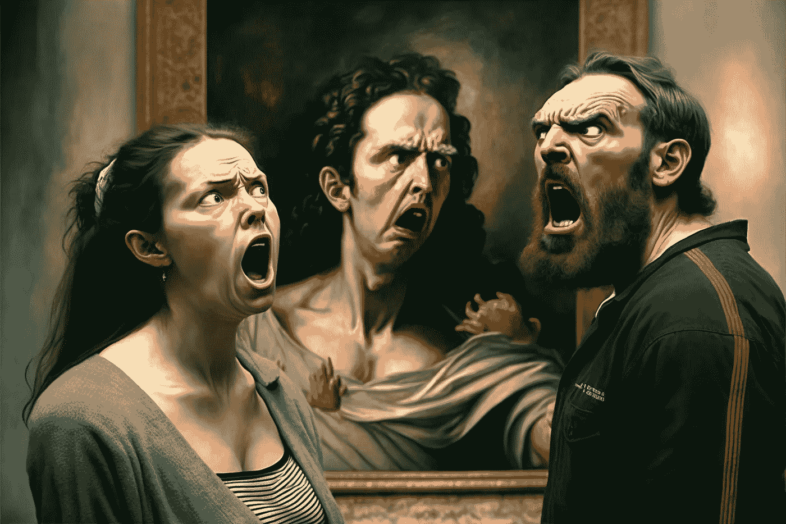

# 人工智能艺术辩论:兴奋、恐惧和伦理

> 原文：<https://towardsdatascience.com/the-ai-art-debate-excitement-fear-and-ethics-c04d30f338da>

## 意见

## 看看围绕人工智能生成的图像及其对艺术家的影响的伦理辩论。

由作者执导的《旅途中》图片。

像许多人一样，我一直在关注人工智能工具在 2022 年的爆炸式发展。[中途](https://www.midjourney.com/home/?callbackUrl=/app/)、[稳定扩散](https://stability.ai/blog/stable-diffusion-public-release)、 [DALL E](https://openai.com/dall-e-2/) 、 [ChatGPT](https://chat.openai.com/auth/login) 和许多其他工具都是使用机器学习模型(为了简化和 SEO，我称之为“AI ”)的工具，这些模型在[大规模数据集](https://laion.ai/blog/laion-400-open-dataset/)上训练，根据人类提供的文本提示、参数或图像的组合来生成独特的图像或文本。

当它运行良好时，感觉就像魔法一样。感觉*太容易了*。

# 文化战争

自从 DALL E 和 MidJourney 吸引了主流的注意力，在艺术和技术世界的交汇处就有了一场激烈的辩论。这场辩论主要围绕人工智能生成的图像对工作艺术家的负面影响展开。这场辩论感觉完全两极化，双方的声音在很大程度上互相超越。这感觉就像是“艺术家与科技兄弟”的对决，与去年 NFT 的演讲很相似(有很多重叠的声音)。

并不是所有的“中间派”，但我觉得有点夹在这些阵营中间。我想，这是一种谨慎的乐观主义，带有一大堆警告和担忧。我已经使用 Midjourney 生成了 4000 多张图片，其中一些我很喜欢，许多图片很糟糕，但我也认为目前该行业的许多做法相当粗糙，而且存在问题。

我将尽我所能总结一些我认为有根据并值得深入讨论的观点，同时指出一些我认为没有根据或被误导的观点。这并不是一个详尽的问题列表，我可能会在以后写更多的内容。

# 什么是艺术？

不知何故，这是开始的最好和最差的地方。试图给艺术下定义是一项有趣的理论工作，具有很大的价值，但我认为达成一个共同的艺术定义是毫无意义的，并且不可避免地以排斥性大于包容性而告终。

我希望我们都能同意，艺术对很多人来说可以是很多东西，而且是最重要的，主观的。两个人对贴在墙上的香蕉是否是“艺术”意见不一，这没什么。

一件艺术品可以在头脑中有一个意图(或者根本没有意图)的情况下创作，然后用另一种观点来解释。它可以是美观的，也可以是丑陋的。它可以是一种劳动密集型的磨练和实践的工艺，也可以是一个短暂的想法的快速草图。它可以是随机性的表现。我不认为某样东西需要有特定的意图，或者很难或很费时才能被认为是艺术。

许多人(肯定不是所有人)似乎承认，人工智能生成的图像*在许多情况下可以被视为一种艺术形式，但更有争议的问题是，在这种情况下，*谁是艺术家或作者*？人类，人工智能，两者都有(但是在什么角色和什么程度上)，或者以上都没有？*

# 作者和信用

我不认为自己是艺术家。我是个设计师，这是我谋生的方式。当然，像许多人一样，我以前也创作过我认为是艺术或本质上是艺术的东西。我写过音乐，但不要称自己为音乐家。我拍过照片，但我不称自己为摄影师。我每天都做饭，但我不是厨师。

我用 Midjourney 创作图像，但我不是艺术家。

有一个非常合理的论点是，当涉及到作者和信用时，人工智能生成的图像应该被区别对待。欺骗人们，让他们认为你比实际上更多地参与了某件事情的创造，是不会有任何收获的。

关注我一段时间的读者会知道，我更多地使用生成的图像作为我文章的编辑类型图像，而不是免费的库存照片。我享受这个过程，还有那种乱七八糟的不完美的审美。

我经历了几次迭代，试图找出一种合理、透明、公平的方式来评价这些。在交谈中，我试着用不同的方式和人们谈论这件事，最终根据我使用的语言产生了不同的感受。

*   我创作的一些艺术作品感觉是最卑鄙的。
*   “我生成的图像”稍微好一点，但没有上下文仍然不透明。
*   基于我的提示和迭代而生成的中途图像过于机械，谁会这么说？

比如改变你谈论任何事情的方式(比如从说“伙计们”转变为“伙计们”)，一开始会觉得奇怪和尴尬，但随着时间的推移会变得越来越自然。

幸运的是，在对话之外，演职员表不需要听起来像对话。

我目前在该上下文中使用的行是:

> 由作者执导的《旅途中》图片。

以前的一些尝试是“作者的图像，由 Midjourney 生成”，暗示 Midjourney 只是一种工具，就像 3D 艺术家可能会说“作者的图像，在 Zbrush 中雕刻，在 Substance Painter 中纹理化”。我回避了这个问题，因为我坚信这两者根本不等同。艺术指导感觉更像是一个平行的东西，尤其是像“修复”这样的工具，它允许你替换图像的特定部分，并且更细粒度的即时迭代继续发展。

讨论应该继续，人们应该尝试他们觉得好的东西，*和*不会让其他人觉得被贬低。无论结论是什么，在我看来，目前“由[你的名字]”独自一人是不道德的，不管你对这个领域的热情或怀疑态度如何，都应该予以劝阻。

# 分门别类

继续这一思路，目前我认为人工智能图像应该在任何展示艺术的网站上有特定的人工智能类别、标签或区域，当然在任何类型的艺术奖项中也是如此。在比赛环境中比较艺术，并决定一件艺术作品比另一件“更好”的想法对我来说有点困惑，但最终它帮助并支持了艺术家。艺术家作为一个群体，对社会有着巨大的、被大大低估的积极影响，这种影响在薪酬或知名度方面没有得到足够的体现。

我们不应该继续围绕那幅在科罗拉多州博览会艺术竞赛中为[杰森·艾伦](https://www.smithsonianmag.com/smart-news/artificial-intelligence-art-wins-colorado-state-fair-180980703/)赢得几百美元的中途作品引发的争论。从一个明确的“人工智能艺术”类别开始，并从那里开始。

我们经常对摄影这样做，有时(尽管越来越不常见)，对数字艺术也是如此。这样，关心它的人就可以关心它，其余的人就更容易忽略它。

# 使市场饱和

另一个主要问题是，包含艺术家姓名提示的图像(例如“以[格雷格·鲁特科夫斯基](https://www.artstation.com/rutkowski)的风格”)随后被发布在网络上，并且是可抓取的，从实际的艺术家那里窃取 SEO，并使人们在搜索由真人格雷格·鲁特科夫斯基创作的实际艺术时感到困惑，这可能是许多艺术家的主要收入来源。

> “刚刚过了一个月。一年后呢？我可能无法在那里找到我的作品，因为(互联网)将被人工智能艺术淹没。这令人担忧。”——Greg Rutkowski，[接受《麻省理工科技评论》采访](https://www.technologyreview.com/2022/09/16/1059598/this-artist-is-dominating-ai-generated-art-and-hes-not-happy-about-it/)

# 不道德的数据使用

在我看来，最大的问题是如何收集和使用源数据的道德问题。目前，许多模型完全或部分使用数据集(如 LAION5B)作为其源数据。LAION 从数十亿张图片和相应的文本描述中创建了巨大的数据集，这些图片和文本描述是由一个名为 [Common Crawl](https://commoncrawl.org/) 的非营利组织从 alt-text 和 web 链接中收集的。这些数据集的明确意图是用于*研究目的*，而不是商业应用。

鉴于这些数据集的庞大规模，它们包含了大量有版权的图像，以及属于活着的、正在工作的艺术家(或其他人)的图像。

这些由 Common Crawl 搜集、由 LAION 曝光的图像最初是由各自的作者发布的，具有广泛的预期用途，但可以肯定地说，“训练机器学习模型让自己失业”并不是一个共同的意图。

常见到艺术家暗示生成的艺术是抄袭或窃取他们的作品。这被比作“搜索谷歌图片”并冒充自己的作品。我认为这是一种过于简化、不准确的描述机器学习模型如何生成图像的方式，但这并不特别重要，因为它并不真正影响解决方案。

**我认为人工智能图像唯一真正合乎道德的前进方式是创建一个开放的训练数据集，人们可以主动选择加入。**财务方面需要解决，但最初提交用于训练数据的图像可能会有小额付款，可能会有某种基于明确使用艺术家姓名的提示的版税系统(以及商业作品中使用的任何东西的高得多的版税)？这可以通过某种 CC-BY 类型的许可证来扩展，这种许可证明确用于 AI 训练数据，以某种方式通过图像元数据公开。

也许像这样的系统增加了一个更精确的开放数据集，该数据集排除了来自 Behance、Dribbble、ArtStation、DeviantArt 等来源的数据。，但仍然可以学习诸如“这是人类的样子”，“这是树的样子”之类的东西。

*注:ArtStation 最近因没有做足够的工作来保护艺术家的利益而受到艺术家* *的攻击* [*。ArtStation 以“*](https://arstechnica.com/information-technology/2022/12/artstation-artists-stage-mass-protest-against-ai-generated-artwork/) [*NoAI*](https://magazine.artstation.com/2022/12/noli-tag/) *”标记倡议做出了回应，该倡议允许用户选择退出在训练模型中使用他们的作品，但选择退出还不够，社区正在让他们知道这一点。*

# 最后

*这个空间正在快速移动*。技术进步可能令人兴奋(尤其是那些感觉像魔术一样的)，但人们和整个行业可能会在这个过程中受到伤害。在许多情况下，比如从煤制天然气到可再生能源的转变，技术进步在很大程度上是积极的。对抗气候变化的好处与失业的人力成本或行业利润相比是很容易证明的。

不过，这里的情况不一样。被淘汰的人只是艺术家，用机器整体取代艺术家对人类来说是负面的。我们应该考虑如何使用这种技术来增加和增强工具，帮助创造新的美学，但要着眼于以人为中心，保持他们所有的想象力、意图和复杂性不变。

总的来说，我认为人们应该考虑以下几点:

*   让 Midjourney、LAION 和 StabilityAI 这样的公司知道**一个替代的、伦理的数据集需要被投资**。如果你在这个领域工作，倡导它，建设它。这是一个有待解决的有趣问题。
*   **在用于非商业用途时，对人工智能生成的图像进行适当的认证和标记**。在这个过程中，不要夸大你的作用。
*   不要提示使用艺术家的名字。句号。
*   **互相倾听。**面对批评时要尊重，善意地给予批评。仅仅说“我不认为这里有道德问题”是不够的。这并不总是关于你。如果别人说有道德问题，那是有道理的，你应该考虑听他们的，多读一些。
*   **寻找帮助人们从人工智能艺术过渡到传统艺术的方法。**吉他英雄激励了许多人(包括我在内)学习吉他，这是一个帮助人们从人工智能一代过渡到实际技术的机会。解构人工智能图像的美学，什么可行，什么不可行，以及你可能如何使用其他技术来接近相同的图像。
*   支持你喜欢的艺术家。购买印刷品，分享他们的作品，支付佣金。支持概念艺术协会，该协会正在游说帮助[保护艺术家免受人工智能技术的侵害](https://www.gofundme.com/f/protecting-artists-from-ai-technologies)。

感谢阅读。如果你对此感兴趣，请考虑[订阅剪辑内容](https://clipcontent.substack.com/)，每周撰写关于设计系统、技术、领导力的文章，并直接发送到你的收件箱。