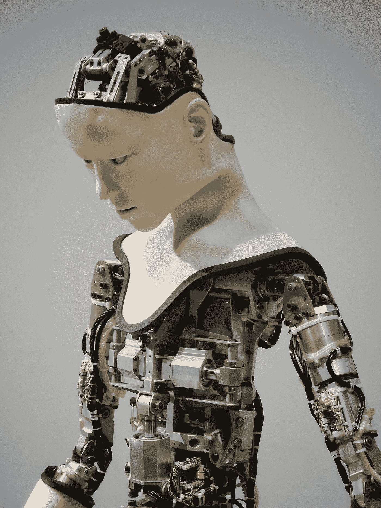

# 一个小国在全球巨人中的人工智能定位以及人工智能系统与人类的未来互动——蒂博尔·博斯教授深度访谈

> 原文：<https://towardsdatascience.com/the-ai-positioning-of-a-tiny-country-amongst-global-giants-and-future-interactions-between-ai-d06cff5226d6>

[附身摄影](https://unsplash.com/@possessedphotography?utm_source=medium&utm_medium=referral)在 [Unsplash](https://unsplash.com?utm_source=medium&utm_medium=referral) 上拍照

*引领人工智能(AI)发展和应用的国家将塑造技术的未来，并显著提高其经济竞争力。与此同时，落后者可能会遭受损失。*

美国已经成为人工智能的早期领跑者，但中国正在挑战它的领先地位。与此同时，欧盟继续落后，在欧盟国家中，荷兰缺乏研究成果。人工智能研究人员在所有研究人员中的比例远低于平均水平，其对全球人工智能研究的贡献也是如此。然而，2013 年至 2018 年间，荷兰的人工智能出版物增长了 115%，是全球增长最快的国家之一(仅次于美国和日本，分别增长了 151%和 135%)。此外，荷兰的平均引用影响得分为 2.08，是全球人工智能研究质量最高的国家之一(仅次于美国、加拿大和英国，分别为 2.63、2.19 和 2.09)。许多小国面临与荷兰类似的问题，因此可以借鉴荷兰的案例。

在与 Tibor Bosse 教授的采访中，我们评估了荷兰人工智能的现状以及人工智能系统与人类之间的未来互动。Bosse 教授是 NL 人工智能联盟战略团队的成员，该团队旨在通过激励、支持和组织荷兰的人工智能活动来加强荷兰的地位。此外，他是 NWA 路线大数据的名义领导人，也是 BNVKI 的代理主席。在他的研究中，Bosse 教授专注于社交人工智能，即人类和人工智能之间的互动。

【Bosse 教授，荷兰的 AI 玻璃杯是半满还是半空？

你在介绍中已经相当准确地描述了情况。的确，对全球人工智能研究的贡献百分比并没有那么大。但是我们的引用的影响在各种列表和排名中仍然是最高的。此外，玻璃的完整部分也与荷兰的 AI 研究在历史上一直非常强大有关。与许多其他国家不同，人工智能作为一个领域已经存在了 30 多年。如果你看看 BNVKI，我们的协会，我们最近庆祝了 40 岁生日。这表明我们已经活跃了几十年。由于历史悠久，这个领域组织得相对较好。此外，我们对人工智能的哪些分支学科位于哪里有很好的概述，我们知道我们的优势，我们有良好的基础设施，我们有很长一段时间的强大教育。后者是荷兰区别于其他国家的一个显著区别。我们有明确的教育，人工智能不仅仅是计算机科学的一个分支学科，而是独立存在，长期以来在各种排名中得分很高。

原则上，这使我们处于有利地位。然而，发展如此之快，以至于人工智能的定义与 30 年前完全不同。例如，这些投资与美国和中国等其它国家不可同日而语，与它们竞争是艰难的。那是玻璃杯的空的部分。

最终，我是乐观的，所以杯子是半满的。

**NL AI 联盟(NLAIC)和策略团队是什么？**

NLAIC 是一个大型的公私合作项目，旨在加速和连接荷兰的人工智能发展。它涉及荷兰政府和数百家致力于人工智能发展的公司、知识机构和社会合作伙伴。我们的口号是*‘适合所有人的算法’*，强调让人工智能变得可及的目标。当我们在 2019 年成立时，我们的目标是刺激荷兰的经济增长，并使荷兰成为人工智能强国。最近，NLAIC 向荷兰国家增长基金提交了一份投标，并获得了一大笔预算，用于在从基础研究到应用的整个知识链上投资人工智能。

我们将为未来几年制定的战略与战略团队保持一致。然而，我们的作用只是提供咨询，我们没有决定权。我在战略团队中的角色是代表科学领域，这是我和另外两名代表一起做的。

增长基金分配的资金帮助我们实现目标。然而，这也是我们必须与整个国家分享的钱。所以我的目标是确保研究预算用得其所。

**战略团队目前提出了哪些问题？**

战略团队就战略、政策、利益相关者管理和投资激励准备等问题提供建议。此外，我们对照其目标评估 NLAIC 活动的进展。我们的许多问题都与金融工具有关，比如对增长基金的竞标。例如，我们重视吸引新人才，这对学术界至关重要。我们必须为“人才外流”提供答案，即学术人才离开荷兰学术界，去国外或行业中获得更好的职位。我们的奖学金计划是一种金融工具，旨在让大学留住或吸引有才华的人工智能研究人员。此外，我们还有欧洲水平的金融工具。除了关注 AI 的技术方面，我们也很看重 AI 的人性一面。因此，最近已向 ELSA(道德法律社会方面)实验室拨款。最后，我们组织活动来联系社会和荷兰公民。

NLAIC 专注于五个构建模块。您能描述一下这些建筑模块以及荷兰的现状吗？

NLAIC 旨在将其活动分为五个主题:人力资本、研究和创新、数据共享、以人为本的人工智能以及创业和扩大规模。这些构件对于社会和经济应用领域的突破性影响至关重要。每个构件都有自己的工作组，参与者在其中应对跨部门的挑战。例如，数据共享工作组旨在打破共享数据的障碍。没有数据，机器学习是不可能的，可用的相关数据量越大，预测价值越好。然而，在荷兰，数据通常被锁起来，主要是出于法律或商业原因。因此，工作组旨在更好地负责任地组织数据共享。同样，其他工作组也试图应对其他相关挑战。

**Rathenau 研究所发表了一份报告，比较了不同国家的人工智能优势和重点领域。是什么驱动着一个国家的焦点？**

每个国家都不一样。在荷兰，这主要是一种自下而上的方法。传统上，一些大学在某些领域很强，并继续关注。有一些群体一直专注于机器学习，现在已经转向深度学习。其他人有自然语言处理的优势，但代理系统和逻辑也是一些荷兰大学的强项。

总体而言，议程制定机制存在显著差异。在美国，许多创新都是由大型科技公司推动的。而在中国，政府的目标是到 2030 年成为全球人工智能的领导者，并相应地投入资金。相比之下，欧洲没有遵循这两种方法，这或许可以解释为什么我们在过去几年中落后了。欧洲由许多不同的国家组成，这些国家有各自的定位，创造一个共同的战略并不容易。然而，我们的位置让我们能够更专注于人工智能的人性方面。发表的研究主题很大程度上取决于方法是自下而上还是自上而下。由于不同的国家遵循不同的方法，我们也看到了更广泛的出版物。

这些差异是什么？

自下而上的方法通常比自上而下的方法赋予人类价值更多的价值。因此，隐私和透明度等基本问题在这里更为重要。这为面向技术和社会的人工智能研究设定了议程。例如，由于透明度在人工智能中是一个至关重要的问题，我们需要理解算法是如何做出决定的。这种重要性将我们的议程引向“可解释的人工智能”的基础研究和调查人们在什么条件下接受和信任算法答案的社会研究。在美国和中国，这种研究不那么明显。

**荷兰的国际人工智能定位在战略团队的决策中起什么作用？**

历史上，荷兰一直是 AI 的重要玩家。荷兰大学 40 年来一直在进行强有力的人工智能研究，我们国家有几个优秀的教育人工智能项目和良好的生态系统。然而，由于最近的全球发展和建立国家人工智能战略的延迟，我们正逐渐落后。我们最近有很多人才流失到其他国家，那里的工作条件和薪水有时更有吸引力。因为如果我们过度依赖国外的发展将是非常有害的，我们试图更好地利用机会，在人工智能研究和产业方面为荷兰建立和保持一个强大和独特的地位。

**许多报告使用出版物的数量作为一个国家人工智能成功的代表。然而，科学是开放的，我们也可以从国外的出版物中获益。我们真的需要很多出版物吗？**

近年来有出版过多的趋势。但是，说到底，质量比数量更重要；论文要看，要有影响。为了更好的质量，我们需要强调数据和算法共享，而不是关注数量。在某种程度上，后者已经在发生了。NWO 和 KNAW 这两个老牌的荷兰研究委员会投入更多的资金来改进系统质量。科学家现在更有可能根据反映影响力的其他因素获得晋升，而不是出版物的数量。

荷兰是全球规划和决策的领导者。怎么会这样

从人工智能技术的角度来看，这是被认为是优势的关键领域之一。几年前，我在负责荷兰人工智能宣言的工作组中，我们在宣言中描绘了荷兰的风景。我们确定的七个优势是代理系统、计算机视觉、信息检索、机器学习、知识表示、自然语言处理以及规划和决策。

**荷兰应该专注于一个领域，加强其全球领导者的地位，还是应该分散我们的关注点？**

作为“VSNU·肯尼斯塔费尔”(一个联合所有荷兰大学人工智能代表的工作组)的一员，我已经就这种权衡进行了各种讨论。传统上，荷兰遵循基于共识的决策模式，这种文化已经根植于我们的讨论中。在我们的讨论中，很难就一种方法达成一致。

在我看来，专注于一两个关键领域是行不通的。但话虽如此，我们需要专注于某些领域，以获得政府的资助，如果我们朝着这个方向前进，我们将处于更有利的位置。

**在战略团队中，不同利益相关者的愿景在多大程度上是一致的？**

工业目标并不总是与学术目标一致，但这就是为什么我们有来自所有部门的代表。几个策略团队成员都是大公司的代表，我的目标是守护学术界的利益。然而，即使在学术界，利益也不统一。测试版的、面向技术的人工智能研究人员(历史上拥有该学科)与更面向社会和伦理的人工智能研究人员之间存在持续的“竞争”。对于每一种观点应该给予多大程度的重视，一直存在争论。

你主要关注以人为中心的一面，这种说法正确吗？

我对双方都有经验，这是独一无二的，也可能解释了为什么我被要求扮演这个角色。25 年来，我一直在计算机科学系工作。我经常说，我小时候只对计算机感兴趣，但随着时间的推移，我对人类越来越感兴趣。我在某个时候做了一个转变，现在我在一个社会科学系工作。然而，我的研究仍然是相对技术性的，我专注于人类和智能系统之间的交互，既通过开发新的算法，也通过实验评估它们。

你能举一个利益相关者利益不一致的例子吗？

通常情况下，行业预期的步伐会比学术界和政府更快。后者倾向于在实现新算法之前先测试和信任它们。相比之下，工业政党更注重经济增长。在学术层面，我们讨论面向技术和面向人的研究。

**对经济增长的关注是否解释了美国的巨大增长？**

事实上，这有很大的不同，我们在欧洲没有这些大型科技公司。

**除了重点领域，NLAIC 还促进有益的社会效果。它是怎么做到的？**

我们试图创建一个基础设施，将工业层面的发展嵌入到关于社会价值的讨论中，例如数据共享。此外，我们还组织活动来教育和培训人们。因为人工智能即将到来，我们需要人们来处理这些算法。此外，我们希望培训在日常生活中面临人工智能的人，以提高“人工智能素养”。

在你的就职演说中，你提到了社会科学和技术科学之间的协同作用。你能详细说明一下吗？

在很高的层面上，这种说法是人工智能是巨大的，影响着我们日常生活的方方面面。同时，它太复杂了，不能只从一个角度来研究。我们需要专注于开发、改进和扩展算法的技术人员。然而，我们也需要人们理解算法对人的影响，我们如何接受它们，以及它们如何影响我们的生活。

我的目标是在我的研究中连接这两种观点，我专注于社交 AI，它涉及人类和类似人类的智能系统之间的所有社交互动。

你有一个最吸引你的话题或想法吗？

我对拟人化很感兴趣，这是一种给计算机赋予类似人类的属性，而我们知道它们并不具备这些属性的现象。在我的研究中，我从两个角度探讨这一现象。在技术方面，我试图通过处理语音和阅读非语言行为，制造更好的算法，给人以机器人像人的印象。在社会科学方面，我们也需要测试这些新算法的影响。后者为未来的算法提供了输入，创造了技术和人的共同进化。

需要回答哪些领域的问题才能让你满意地结束多年后的学术生涯？

地平线上的点是我们与社交人工智能系统完全自然交互的情况，我们几乎忘记了它们只是人工制品。

从技术角度来说，这意味着我们需要新的算法。我们有算法产生有点像人类的语言或检测面部情绪。但是这些系统很容易被愚弄，在实际应用中实现它们会在某些时候出错。

需要注意的一点是，我们的目标永远不会是完全复制或取代人类。我们可以让互动更顺畅，但仍然承认机器人不是人，有优点和缺点。

**如果你不想取代人类，为什么要让它们更自然呢？**

我期待这样的智能系统更加有效；如果他们理解你的意思，有一个心理理论，并且理解你的需求，发出命令会更容易。但是他们不应该试图在所有层面上模仿人类。例如，机器人不需要看起来像人类，这可能会引起错误的期望。

社交人工智能系统可以在许多领域帮助我们的日常生活。例如，在医疗保健领域，他们可以从医生那里接管重复性的任务，让医生有时间专注于更复杂的任务。

**你认为智能系统可以移情或情绪化吗？**

一般来说，移情和情感有几个组成部分。其中一个因素是纯粹的行为因素，比如表达同情。这个组件相对容易达到，机器人甚至可能比人类更好地表达同情。然而，该表达并不意味着机器人有任何感觉。第二个组成部分集中在情绪的经验部分，这是一种主观现象。这个组件要复杂得多，关于这能否在机器中实现，还有一场哲学讨论。我不排除这一选择，但我没有看到这方面有多大进展。因此，我更相信移情和情感智能系统的微弱概念；他们可以学会“理解”用户的问题，并感同身受地表达自己，而无需体验同理心。

那些认为机器人可以在经验层面上拥有同理心和情感的人使用了什么论据？

我的推理可能是简单化了，但它归结为以下几点。

人类有同理心，有情感。

人类只是信息处理系统。

计算机也只是信息处理系统。

因此，人工系统也没有理由不能经历同样的事情。由于经验是一个涌现的过程，从大脑中神经元之间的所有局部相互作用中，情绪的经验涌现出来；一些哲学家也认为这种现象在计算机系统中是可能的。然而，还没有人做到这一点。

**我们怎么知道人类有这些感觉；我们只是怀疑我们有，因为我们表达了这些感觉？**

事实上，科学方法缺乏正确的工具来客观地衡量这一点。这一切都是基于自省；我们内心感受到这些情绪，并与他人分享。因此，我们假设我们都有。

**开发带有体验成分的智能系统会有好处吗？**

一个好处是我们可以更好地理解人类的经验和意识。如果我们能够复制这一点，这将是人类的一大突破。它将解开意识之谜。然而，我不能立即想到任何实际的好处。我们的星球上已经有足够多的有意识的生物了。为什么要创造更多？

在你的一篇出版物中，你提到了机器人需求的概念。机器人有需求吗，我们需要考虑吗？

我不认为机器人和人类有相似的生理需求。它所有的需求都是被编程的，机器人不会经历它们。有趣的是，人类有时会考虑机器人的需求，尽管我们知道它们没有任何感觉。例如，人们在与聊天机器人交谈时往往很有礼貌。或者，当人们看机器人被分解的电影时，他们可能仍然对机器人感同身受。问题是我们是否应该这样感同身受。

答案是双重的。在某些情况下，它会阻碍我们。例如，我们可能会错误地认为我们的同伴机器人关心我们，导致不切实际的期望。然而，在一个机器人无处不在的世界里，如果我们有许多我们虐待的机器人，我们可能会开始更糟糕地对待人类。然后，我们可能会变得更加以自我为中心，不再考虑他人的情绪。

面试到此结束。你最后还有什么想说的吗？

在关于人工智能角色的讨论中，我发现有必要注意以下几点。原则上，人工智能是一项非常强大的发明，影响了许多人，带来了许多好事，也可能带来坏事。有必要强调的是，我们应该将其视为人类智能的补充方法，而不是取代人类。我们应该寻找一个社会，在这个社会中，除了人类的智能之外，还可以使用算法来造福他们。

*本次采访是代表* [*BNVKI*](http://www.bnvki.org/) *比荷卢人工智能协会进行的。我们汇集了来自比利时、荷兰和卢森堡的人工智能研究人员。*