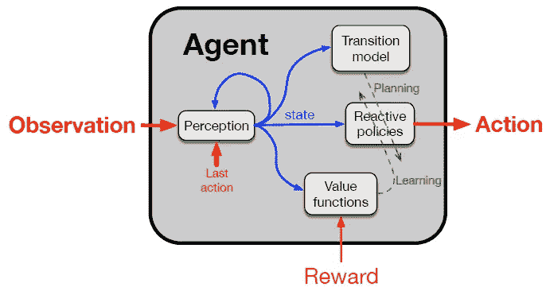
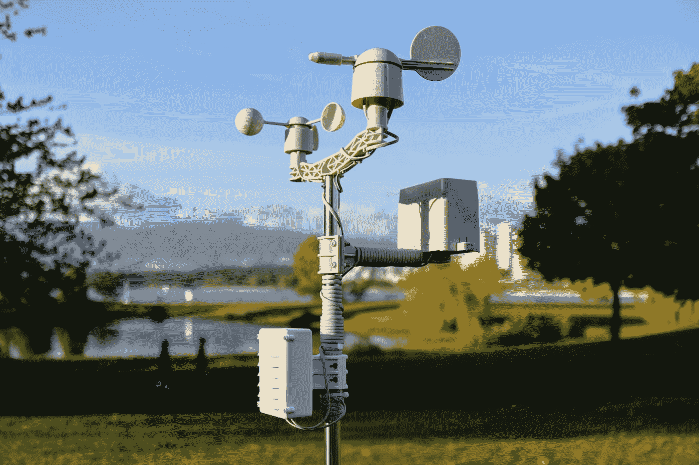

# 阿尔伯塔计划:萨顿的人工智能研究愿景

> 原文：<https://towardsdatascience.com/the-alberta-plan-suttons-research-vision-for-artificial-intelligence-a1763088da04>

## 强化学习专家理查德·萨顿概述了未来五到十年的研究方向

照片由[张诗钟·戈伦德](https://unsplash.com/@johnygoerend?utm_source=medium&utm_medium=referral)在 [Unsplash](https://unsplash.com?utm_source=medium&utm_medium=referral) 拍摄

对于任何熟悉强化学习的人来说，很难不知道理查德·萨顿是谁。萨顿&巴尔托教科书被认为是该领域的典范。我总是觉得研究真正的思想领袖的观点非常鼓舞人心。因此，当他们提出一个新的研究愿景时，我准备好去倾听。

今年夏天，Sutton 和他的同事 Bowling 和 Pilarski 概述了人工智能的**研究愿景**，为他们未来 5 到 10 年的研究承诺设计了蓝图。全文只有 13 页，写得很全面，看看也无妨。

研究愿景的首要主题是达到对智力的全面理解。虽然与直接应用无关，但研究计划的成功完成将意味着人工智能和我们生活的复杂现实之间真正互动的实质性一步。

# 基础代理

大纲的基础是“智能代理的通用模型”，作者用它来导出他们所谓的“基础代理”:

基本代理有四个组件，每个组件都可以基于状态信号学习:(I)感知，(ii)转换模型，(iii)反应策略和(iv)价值函数。[资料来源:[萨顿等人，2022 年](https://paperswithcode.com/paper/the-alberta-plan-for-ai-research)

在这种表示中，有四个可以学习的组件:

*   **感知**:过去经验的再现，塑造观察被感知的方式。本质上，现实世界被转化为决策所需的抽象状态(包含适当的特征)。
*   **反应策略**:根据状态采取行动。通常，该政策旨在最大化累积奖励，但也可以包含其他目标。
*   **价值函数:**将预期的未来回报附加到状态和动作上的函数。价值函数指导反应策略的训练，并且还可以嵌入多种类型的价值。
*   **转换模型**:基于当前状态和动作预测未来状态的[函数。该模型代表了代理对现实世界系统的理解，也可能反映不确定性。](/the-five-building-blocks-of-markov-decision-processes-997dc1ab48a7)

虽然基本代理表示对熟悉强化学习或相邻领域的人来说并不令人震惊，但它确实有一些有趣的含义。

例如，萨顿*等人*提出，转换模型可以**将选项而不是动作作为输入。**根据终止条件采取行动的机会是金融从业者众所周知的，但也与许多在不确定情况下做出的现实决策有关。

另一个丰富是选择创建策略和价值函数集。传统上，人们会有一个将状态映射到动作的单一函数和测量单一度量的值函数。相反，基本代理表示允许**多个策略和值并行存在**。这种表现更接近真实生活的复杂性和矛盾性。

研究愿景还深化了**计划**的概念，利用过渡模型来测试和评估各种场景。作者声明这个过程应该在*背景*中运行，不妨碍其他元素。同时，在*前台*中操作的学习过程应该基于最近的事件进行更新，可能由短期记忆支持。

总之，Sutton *等人*似乎提倡**在 AI** 中更丰富的代理表现，更接近现实世界中存在的各种更好的细节和复杂性。由于对这类主题的研究很少，所以可以从基础代理那里获得大量的灵感。

# 信号处理随时间的变化

照片由 [Jorge Ramirez](https://unsplash.com/@jorgedevs?utm_source=medium&utm_medium=referral) 在 [Unsplash](https://unsplash.com?utm_source=medium&utm_medium=referral) 上拍摄

研究愿景将人工智能定义为随时间推移的信号处理。潜在的前提是，我们的**基础代理不断地与一个极其复杂的现实世界**互动。为了有意义地预测和控制输入信号，智能体必须基于现实的抽象继续学习。

在此背景下，有助于形成研究愿景的四个独特点被提炼出来:

## I .使用真实的观察结果

当涉及到用于训练的观察时，许多人工智能模型依赖于大量的微调。专门的训练集，利用人类领域的知识和结合现实的知识是司空见惯的。然而，这种支持可能会妨碍通用性和长期可伸缩性。因此，作者更喜欢**简单地使用来自现实**的观察结果。这将使学习更具挑战性，但最终对于各种各样的应用程序来说更加稳健。

## 二。时间一致性

算法经常和时间耍花招，学习效率更高。例如，我们经常在更新之前收集成批的观察数据，一旦价值函数出现收敛就降低学习率，或者对某些类型的奖励赋予不同的权重。萨顿*等人*鼓励**同样对待每个时间点**，通常是在新事件到来时直接处理。

一致性是关键。例如，如果我们在稳定的环境中降低学习率，我们也应该允许在观察到不稳定时提高学习率。特别是在随时间变化的环境中，或者在处理元学习应用时，这种对时间更全面的态度有望开花结果。

## 三。利用计算能力

摩尔定律依然如日中天，计算能力大约每两年翻一番。然而，结果是纯粹的**计算能力本身成为代理性能**越来越强的决定因素**。想想用于学习计算机游戏的算法，需要数百万次模拟运行来训练大规模神经网络。**

也许自相矛盾的是，计算能力的指数级增长意味着我们应该更小心地利用它，专注于随计算能力而扩展的**方法。另一方面，不可扩展的方法，如领域专家和人类标记，应该得到较少的研究关注。**

## 四。多代理环境

许多设置包括多个智能代理。在一个环境中放置多个代理的影响可能具有实质性的影响，因为代理可以响应彼此的决策和源于通信、合作和竞争的信号。因此，**代理本身帮助塑造他们的环境**。在多人游戏中，这一概念非常明显，但由此产生的非平稳性在不太程式化的问题设置中也非常重要。

多智能体环境的一个吸引人的子领域是**智能放大**，其中人类的表现通过软件智能体得到增强，反之亦然。在这种共生关系中，从一个代理人那里学到的知识被用来改进另一个代理人的行动和理解。萨顿*等人*表示，这条研究途径是释放人工智能全部力量的关键途径。

# 结束语

对于那些真正对具体研究活动感兴趣的人来说，原始文章(见下文)提供了详细的路线图。这些主题不容易浓缩，而且技术细节相当密集，所以我决定在本文中省略一个摘要。

该研究愿景提供了一个有趣的窥视，让我们看到未来十年我们可能期待的人工智能发展，至少是来自加拿大艾伯塔省的发展。尽管对所有讨论的主题都有一些研究，但很明显，在未来几年里还有一些重大的空白需要填补。

以最大化性能和碾压基准的方式为特定问题定制人工智能算法是很诱人的。然而，从研究的角度来看，灌输一些简化(例如，关于时间和观察)是有意义的，以驱动可用于各种复杂问题的鲁棒算法的设计。这一研究愿景似乎是朝着这个方向迈出的深思熟虑的一步。

我个人对研究愿景的看法是，人工智能算法应该:

*   更好的**符合真实世界环境的复杂性和特征**，以及
*   提供更加通用和健壮的方法来解决各种问题，而无需过多的设计工作。

实现这些目标的具体方法包括在状态(即特性)和时间(即选项)中找到合适的抽象。同时，应确保规划能够有效地执行。结合更丰富的政策和价值观的表征，AI 与现实的差距越来越小。

# 来源

  

*喜欢这篇文章吗？你可能也会喜欢以下几个:*

       