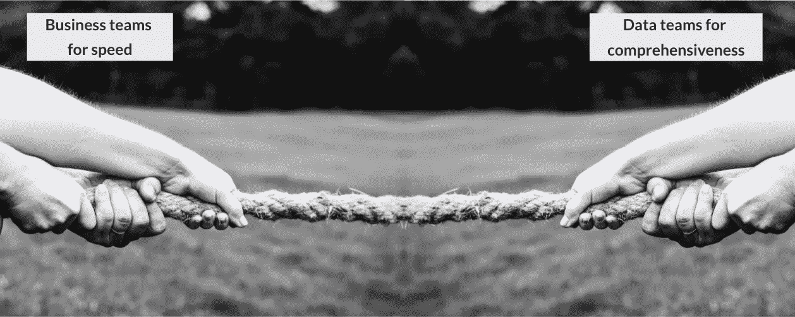
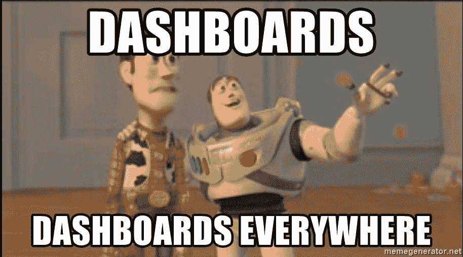
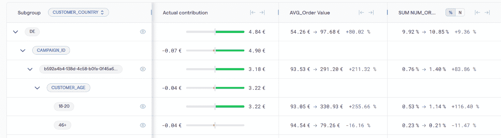
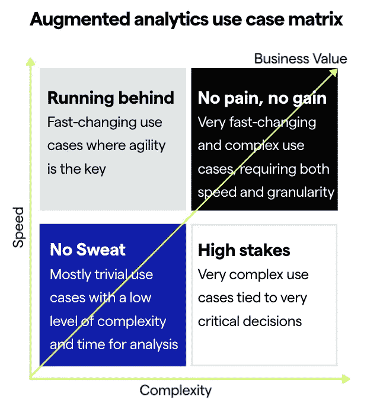

# 分析师的困境——数据太多，时间太少

> 原文：<https://towardsdatascience.com/the-analysts-dilemma-too-much-data-too-little-time-9b8774f74e20>

## 如何通过增强分析解决这个问题

对于数字优先的企业来说，观察和了解其客户和业务的唯一方式是通过数据。有人会认为，有了公司手头的丰富数据，数据驱动的决策就会变得简单。但是数据不仅在大小上增加了，而且在复杂性上也增加了。如今，公司收集了许多关于雇佣、销售、渠道等方面的数据点。因此，使用传统的 BI 工具，分析很快就会变成一项令人望而生畏且毫无结果的任务。好消息是，也有更简单的工具和过程来促进数据转换和可视化。然而，这些增强分析工具/方法(也称为机器学习驱动的诊断分析)的采用水平仍然很低。

# 为什么您应该关注增强分析？

我们生产和积累数据的方式以及人类注意力的局限性给分析师造成了一个巨大的困境——数据太多，时间太少。为了从数据中创造价值和业务影响，团队需要以业务的速度提供全面的可操作的见解。然而，考虑到新的环境和遗留的 BI 工具，大多数团队最终会在以下两者之间进行权衡:

*   **速度**——没有足够快地获得答案以做出有效和及时的决策
*   **全面性** —错过了洞察力，因为他们只是触及表面，并在粒度级别查看数据。

rawpixel.com 在 Freepik 上的图片

结果，可诉性受到损害。收集的答案不是真正的见解，或者这些见解没有被发现得足够快，不足以推动业务行动。

为了更具体地说明这一点，让我们仔细看看当前的分析挑战:

1.  **有限的人类注意力**

我经常听到这些:

> “有如此多的数据和指标，我们不可能全部监控”。
> 
> “我每天必须筛选 15 个仪表板，以评估业务是否照常”
> 
> “我们需要花几天时间来检查我们的工具，并以一种全面的方式回答为什么”

使用 memegenerator 创建的视觉效果

数据存储和转换能力不再是瓶颈。然而，我们一直在使用相同的商业智能界面——仪表板。正如*司马贺所说，当前的限制是人类的注意力 *:**

> “在一个信息丰富的世界里，信息的丰富意味着其他东西的匮乏:信息所消耗的东西的匮乏。信息消耗的东西相当明显:信息接收者的注意力。因此，大量的信息造成了注意力的匮乏，需要在可能消耗注意力的过多信息源中有效地分配注意力”

由于仪表板无法将我们的注意力引向最重要的地方，许多团队只分析一部分可用数据，这是最常见的不良分析实践之一([阅读文章以找出其他 5 个](/breaking-6-analytics-habits-to-unlock-value-d33fec9c90ee))。

**2。快速变化的环境**

商业变化比以往任何时候都快。因此，指标变化的速度超过了我们解释为什么使用传统的基于仪表板的工作流的能力。与此同时，公司需要采用敏捷决策来保持竞争优势。

正如 Dave Girouard 所说:

> “速度是商业中的终极武器。在其他条件相同的情况下，任何市场中最快的公司都会胜出。”

# 为什么仪表板不能解决分析师的困境

仪表板非常适合描述性分析(即了解发生了什么)和指标监控。它们还支持高层次的探索，以确定一段时间内的主要趋势。然而，它们在诊断分析方面存在不足(即，为什么会发生)。

# 错过的机会

由于基于仪表板的工作流，企业错过了机会，因为决策是:

*   **反应型—** 当事情发生变化时，业务团队会要求数据团队去调查或者构建专门的仪表盘。团队对变化做出反应。
*   **缓慢** —数据和业务团队之间的票证循环使得诊断分析非常缓慢。此外，在仪表板中执行根本原因分析非常耗时。
*   **消息不灵通** —团队通常只对少数场景进行表面测试，忽略了大部分场景，因为仪表盘不能进行全面的根本原因分析。

# 人工智能和 ML 的作用

机器擅长执行重复的任务和大规模的计算。事实上，在许多领域，人工智能不再被视为与工人竞争的一种方式，而是给他们增压。

机器可以轻松地实时分析数百万个假设，消除重复的切片和切块工作，让团队等待洞察力。通过运行统计测试并带来以影响为中心的视图，AI 和 ML 可以消除人类的偏见，并将人类的注意力指向相关的东西。

Kausa 的图片——机器可以测试这些组合，并过滤掉相关的内容

在下面的例子中，增强分析可以显示德国的一个特定营销活动(跨越数百个)正在推动年轻客户在 AOV 的显著增长。用手动的方式找到这些洞见就像大海捞针。

*Kausa 拍摄的图像——碰撞对驾驶员的影响*

然而，机器没有上下文来解释数据，将点与业务中正在发生的事情联系起来，并分享见解。谁能弥合这一差距？人类。他们能够查看相关信息，筛选相关信息，并将这些信息联系起来，推动行动。

# 人在回路中的主动分析

大多数数据科学家高估了 AI 和 ML 的能力，低估了上下文和领域专业知识的重要性。

机器可以进行统计测试，并在几秒钟内计算出许多数字。然而，他们(还)不能解释结果并将这些点与业务中发生的事情联系起来(例如，采取的行动、季节性、外部因素等)。人类应该决定关注哪些见解，有效地沟通它们，并推动行动以完成最后一英里的分析。

# 你站在哪一边？

根据具体的业务用例，增强分析有多种应用和优势。这些可以基于两个关键维度来划分:

*   *速度* —环境的变化有多快，决策的频率有多高。例如，绩效营销通常变化非常快，因为营销经理几乎每天都要采取行动来调整活动/投标和优化营销支出。另一方面，产品功能决策通常很少，数据分析可能需要更长时间。
*   *复杂度* —相关维度和相关度量的数量。一些用例本质上非常复杂，因为它们包含大量的相关维度和相关指标。例如，考虑到存储的大量事件，游戏内优化涉及非常广泛和复杂的数据集。另一方面，一个营销经理只在一个特定的渠道和国家开展几个活动，管理的复杂性很小。

基于这些元素，人们可以将用例分组到下面的矩阵中，根据用传统方法处理它们的感觉来命名。

用例矩阵—由作者开发

## 1)毫不费力

这些用例相对来说是琐碎的(即，少量的相关维度和相关度量)。团队处理低水平的复杂性，并有大量的时间进行数据分析。

一个例子可能是一个小的电子商务公司在一个地区经营，并运行一对夫妇的营销活动。每月或每季度都会采取行动，这是一个缓慢移动的市场。

最有可能的是，传统的 BI 工具对于这种低复杂性和缓慢的业务动态来说已经足够了，而不会让团队感到紧张。

## 2)落后运行

这些用例变化非常快，敏捷性是关键。团队需要每天或每周做出决策。因此，利益相关者需要快速全面的洞察力。

我非常熟悉的一个典型用例是效果营销/用户获取。通常，小团队会在不同的国家、渠道、媒体来源和平台上开展许多活动，以各种信息和创意瞄准多个受众。他们试图通过快速识别哪些有效，哪些无效来优化 roa(广告支出的回报)。

*应用:*增强分析平台可以测试数据中的每一个假设，并指出哪些是最重要的子群体。这使得团队能够快速确定是什么在推动发展，然后通过查看相关指标(例如，美国 Vungle 的 iOS 活动中的 CPI 增长)来了解原因。

*结果:*营销活动的表现在几分钟内就能被了解，而不是几小时或几天，节省下来的时间被重新分配到创造性和战略性工作中。

## **3)一分耕耘一分收获**

这些用例变化非常快，非常复杂。团队需要每天或每周做出决策。他们压力很大，因为同时要测试许多潜在的相关维度和相关指标。使用传统方法，他们经常处于救火模式，需要花费大量时间来获得真正的见解，但他们的工作通常不会受到重视，因为分析需要太长时间。这个桶对应于最困难的用例，例如利用游戏数据来塑造功能、推动参与度和保持度，或者平衡游戏经济。

*应用:这个群体不能在速度和全面性之间妥协。他们实际上可以充分利用自动化。他们可以使用增强的分析在几分钟内确定要深入的地方，并以主动的方式发现潜在的机会。*

*结果:*随着探索性分析揭示何处寻找，并确保团队以业务的速度获得可操作的见解，局面将会扭转。他们将从一个几乎被请求困扰的状态，转变为可信任的顾问，预测业务团队的关注点。

## 4)高风险

这些用例非常复杂，需要分析大量数据点和交互，并将其与重大决策联系起来。

一个潜在的用例可能是网络分析或支持游戏中的产品开发。虽然由于执行时间的原因，你不想每天对你的网站或游戏关卡进行更改，但你所做的更改对业务绩效至关重要。在团队做出这些决定之前，需要收集包含大量变量的非常复杂的数据。与“没有付出就没有收获”的用例相比，从事这些用例的团队由于速度较慢而有了更多的喘息空间，但是由于高风险，他们仍然承受着很大的压力。由于数据的复杂性，即使速度较慢，他们也只能测试通常的嫌疑人，将真正的机会发现留给运气。

*应用:*增强分析平台使团队能够通过组合多个来源来利用每个数据点，从而发现可操作的见解。更快地完成这种分析，团队将有时间超越峰值和下降值，还可以研究有助于制定战略的有趣见解。

*成果:*精细且可操作的洞察将带来高价值的决策和改进的指标。通过研究每一个场景，不让任何机会被浪费，团队将更有信心告知这些关键决策，并将在决策桌上获得一席之地。

# 增强分析是解决方案

增强分析将技术(如机器学习)、流程和人结合在一起，帮助人类利用机器规模的速度和能力，同时结合自己的流程和背景，以更快的速度和规模做出更好的决策。这是缩小[诊断分析差距](/the-diagnostic-analytics-gap-3f9d0a44e8f8)的方法。

—

*想法？伸出手去* [*若昂索萨*](https://www.linkedin.com/in/joaoantoniosousa/)*局长成长处* [*考萨*](http://www.kausa.ai/) *。敬请关注更多关于如何确定诊断分析和增加数据价值的帖子。*