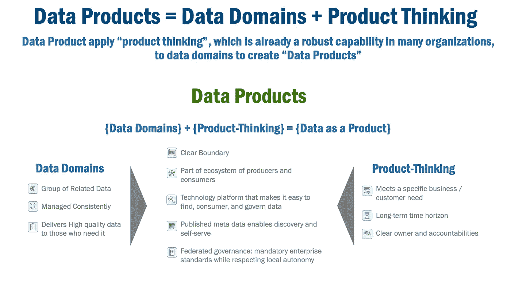
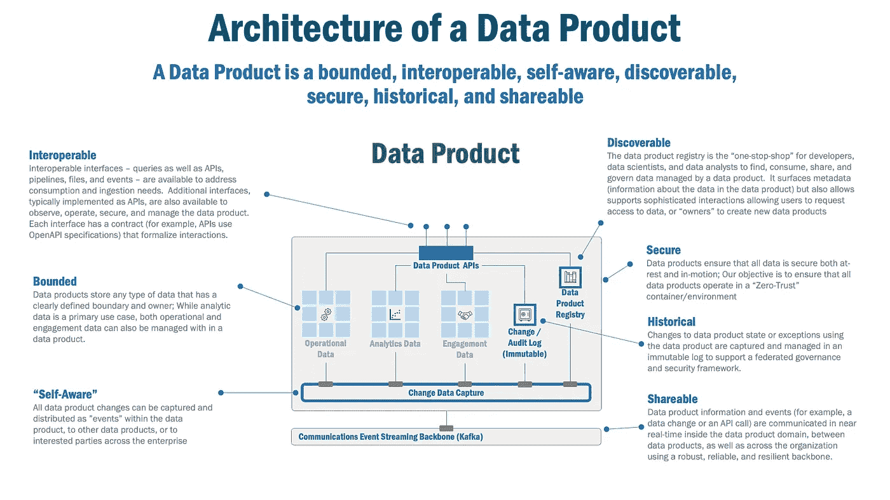
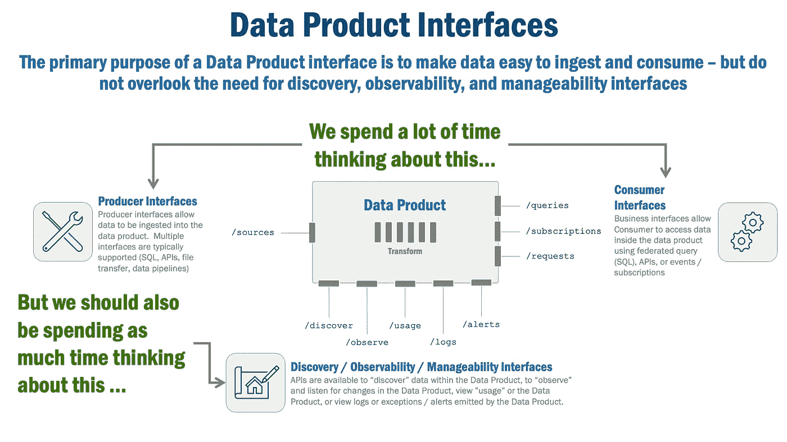
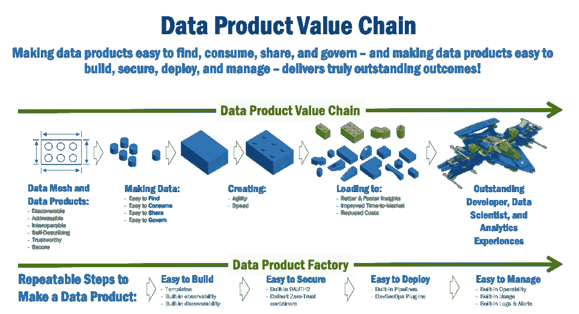
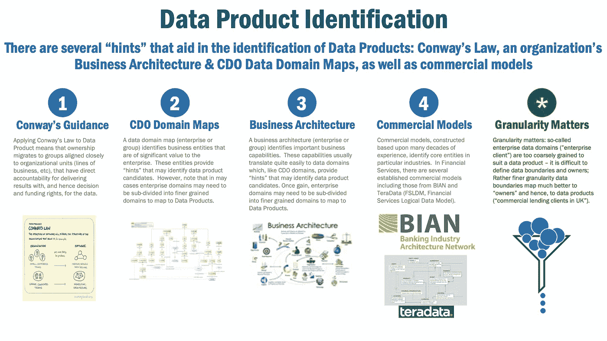
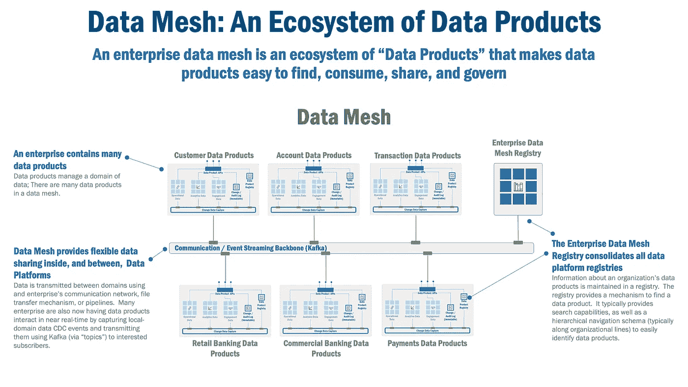

# 数据产品的剖析

> 原文：<https://towardsdatascience.com/the-anatomy-of-a-data-product-d3140f068311>

数据产品是企业数据网的基础构建块。但是，数据产品到底是什么，它们是如何工作的，如何识别它们，以及如何快速构建它们？

照片由[熊伟·桑多斯](https://unsplash.com/@vtrsnts?utm_source=unsplash&utm_medium=referral&utm_content=creditCopyText)在 [Unsplash](https://unsplash.com/s/photos/desk-paper?utm_source=unsplash&utm_medium=referral&utm_content=creditCopyText) 上拍摄

# 让数据易于查找、共享、使用和管理

我根据数据产品为组织提供的价值来考虑数据产品:数据产品(以及它们在其中运行的数据网格)使数据易于查找、消费、共享和治理。为了实现这一价值，作为从业者，我们的工作是使数据产品易于构建、部署、保护和管理。

在本文中，我将回答两个关键问题:

*   数据产品是如何设计的，它们如何工作以使数据易于查找、消费、共享和管理？
*   为了使数据产品易于构建、部署、保护和管理，需要建立哪些功能、API 和生命周期？

简而言之，如果您能够回答这些问题，那么，首先，您将能够解释为什么数据产品是您的数据网格之旅的基础，其次，您将了解在您的企业数据网格中加速采用和构建数据产品所必需的能力。

在开始之前，本文假设您对数据网格有较高的理解。如果您需要一些关于数据网格的背景信息，这里有一些很棒的文章可供选择:这里的(模式)、这里的(架构)、这里的(原则)和这里的(经验教训)。对于感兴趣的读者，全套数据网格模式可从[这里](/data-mesh-solution-and-accelerator-patterns-acffbf6e350)和[这里](/data-mesh-architecture-patterns-98cc1014f251)获得。

# 数据产品=数据领域+产品思维

Zhamak Dehghani 在她精彩的书《数据网格，大规模交付数据驱动的价值》中说，数据产品是数据网格中的“架构量子”。他们是“可以独立部署和管理的最小的架构师单元。”她接着说，数据产品是“可发现的、可理解的、可信赖的、可寻址的、可互操作的、可组合的、安全的、自然可访问的，并且本身就有价值”。

我可以提供一个补充定义:数据产品是“数据领域”和“产品思维”的结合。

*图 1，数据产品=数据领域+产品思维*

让我们从“产品思维”开始解开这个谜团。我喜欢《哈佛商业评论》最近的一篇[文章](https://hbr.org/2020/04/bring-product-thinking-to-non-product-teams)中的一些见解:首先，一个产品集合了一个组织的生产能力来“传递和获取价值”。第二，有一个“购买和使用该产品的最终客户”。最后，一个产品有一个所有者和团队，他们创建一个长期计划，以确保“产品可以不断改进，使它们更成功”，由一个专注于“结果而不是产出”的团队交付。

换句话说，产品思维意味着确保您的产品满足特定的业务需求，并提供一些切实的价值，具有长期的时间范围，并有一个明确和授权的所有者，不仅符合企业的利益，也符合客户的利益。

不幸的是，定义“数据域”并不简单，因为这个术语在大型企业中往往非常模糊。对于首席数据官来说，治理、监管和隐私是导致粗粒度域的主要关注点:例如，所有客户而不是当前客户或加拿大客户。

类似地，数据架构师可能会将客户视为“团体”领域的子集，包括当前客户和潜在客户。并且应用程序开发者可以将客户视为链接客户账户和交易的唯一标识符。

出于本文的目的，我将数据域定义为一组可识别的、真实的、相关的数据，这些数据得到一致的管理，并且具有一定的质量和准确性。

那么，现在让我们结合这些想法，创建一个数据产品的实际定义。数据产品具有/是:

*   **明确界限**，建立一套可识别的相关数据
*   **授权所有者**，提供使数据变得有价值和可信所需的组织资源和决策，并提供产品发展的长期观点
*   **消费者和生产者生态系统的一部分**，它要求数据的互操作性、一致性和质量，以便为企业提供价值
*   **通过平台**实现，使数据可被发现、可寻址、可访问和可互操作
*   **发布元数据**，实现发现和自助服务，同时使数据可理解
*   **联合治理**，认识到本地自治在实施企业政策和确保数据安全方面的力量

# 数据产品的架构

有了这个定义，让我们来探索数据产品的架构。

*图 2，数据产品的架构*

数据产品架构师需要具备以下要素:

*   **可互操作**:可互操作的接口——查询以及 API、管道、文件和事件——可用于满足消费和接收需求。通常实现为 API 的附加接口也可用于观察、操作、保护和管理数据产品。每个接口都有一个契约(例如，API 使用 OpenAPI 规范)来形式化交互。
*   **有界**:数据产品存储任何类型的数据，有明确定义的边界和所有者；虽然分析数据是一种主要的使用情形，但是运营数据和参与数据也可以在数据产品中进行管理。
*   **自我感知**:自动捕捉自身的变化和信息；所有数据产品变更都可以被捕获，并作为数据产品中的“事件”分发给其他数据产品或整个企业中感兴趣的各方。
*   **可发现:**每个数据产品都包含其自己的“注册表”，该注册表发布其数据产品元数据、所有权信息、策略和任何其他支持行为；数据产品注册中心是开发人员、数据科学家和数据分析师查找、使用、共享和管理由特定数据产品管理的数据的“一站式商店”。它也是特定于该数据产品的行为的切入点，支持复杂的交互，允许用户请求访问数据，或“所有者”创建新的数据产品。
*   **安全**:数据产品确保所有静态和动态数据的安全；我们的目标是确保所有数据产品在“零信任”容器/环境中运行。
*   **历史和时间**:使用数据产品对数据状态或异常的更改被捕获并在一个不可变的日志中管理，以支持联合治理、安全问题诊断，并(当数据状态更改被聚集时)提供数据沿袭。
*   **可共享的**:一个数据产品有“端口”，允许该数据产品管理的数据被摄取或消费。信息和事件(例如，数据更改或 API 调用)可以使用批量管道或在数据产品域内、数据产品之间以及使用健壮、可靠和有弹性的主干网在整个组织内进行接近实时的通信。

# 数据产品互操作接口:核心数据产品使能器

当我们想到可互操作的接口时，首先想到的有两个:将数据接收到数据产品中的接口(管道、API 等)，以及用于消费数据产品中的数据的查询。

然而，在大型企业中，可互操作的接口有几个期望(在某些情况下是强制性的要求):

*   **正式合同**:每一条摄取或消费路径——管道、查询、API 或事件——都应该由正式的公开合同来定义。在某些情况下，契约将特定于所使用的工具(DBT 等)，但在其他情况下——API 或事件——诸如 OpenAPI 和 JSON 模式之类的正式规范是常见的。
*   **正式版本化**:契约应该被版本化，从而允许向后兼容。现在，公平地说，在只有少数参与者共享数据的小型环境中，这可能并不重要。然而，在数据被广泛共享的大型企业中，确保上游系统改变数据格式时下游系统不会阻塞是至关重要的。
*   形式安全:这很棘手——每种工具可能提供不同的安全方法，更糟糕的是，有些工具可能没有健壮或完整的安全模型。尽管如此，这并没有否定保护生产者和消费者接口的需要——相反，它只是使这变得更加困难。

*图 3，数据产品接口*

虽然生产者和消费者接口很重要，但是我们不应该忽视接口的本质，即支持发现、可观察性和可管理性。事实上，大多数这些接口都是作为 API 实现的，这意味着您可以利用 OpenAPI 规范提供的功能:

*   **正式契约** : OpenAPI 和 AsyncAPI 规范提供了文档完善、经过实战检验的规范，作为正式的同步/异步契约在企业内部使用。
*   **正式版本化** : OpenAPI 规范允许一种灵活的版本化 API 的方法，以便随着时间的推移优雅地管理合同变更。
*   **形式安全** : OpenAPI 规范提供了一种健壮的、易于理解的、有良好文档记录的方法来定义安全模式，这些模式定义了直接映射到角色的“作用域”;通过一点尽职调查，这些范围可以使用 OAUTH2(一种常见的安全方法)实现，并连接到企业的身份记录簿。

# 数据产品价值链

数据产品的价值随着其在企业中的使用成比例增加。在最初阶段，数据产品(在数据网格中)是可发现的、可寻址的、可互操作的、自描述的、可信任的和安全的。数据网格的创始人 Zhamak Dehghani 认为，这些是数据产品的基本特征，构成了数据产品提供的所有后续价值的组成部分。

有了这些基本属性，就可以开始在企业中使用数据产品了。如果设计得好，那么数据产品现在可以使数据易于查找、使用、共享和管理。随着数据更容易、更频繁地被消费和共享，新发现的敏捷性和速度随之而来。凭借这种灵活性和速度实现真正的商业价值:

*   **更快更好的洞察力**，这是创造卓越客户体验或快速应对不断变化的市场需求的关键。
*   **缩短上市时间**，尤其是对于严重依赖数据的终端消费产品。
*   **降低交付成本**，因为速度和灵活性缩短了交付持续时间。

*图 4，数据产品价值链*

但是，如何快速、一致、安全地交付数据产品呢？这就是“数据产品工厂”的由来。

数据产品工厂建立可重复的步骤来制造数据产品:

*   **易于构建**，通过提供简化数据产品构建的模板；这些模板生成的微服务/API 具有内置的可发现性(“/discover”端点)和可观察性(“/observe”、“/usage”、“/logs”和“/alerts”端点。
*   **易于保护**，通过提供对前述模板的扩展，为每个 API/微服务启用基于 OAUTH2 的安全性；经过更多的尽职调查，这些模板还可以针对我们的数据产品 APIs 微服务及其数据的“零信任”运行时环境。
*   **易于部署**，通过为上述模板提供扩展，将 APIs 微服务(如果需要，还包括数据)生成到“容器”(例如 Docker)或 Kubernetes Pod 中，从而可以轻松地将数据产品部署到内部或云环境中，并相对容易地包含在 DevSecOps 管道中。
*   **易于管理**，通过将生成的 APIs 微服务(例如“/logs”和“/alerts”端点)挂接到企业管理和监控工具中。

# 数据产品识别

现在，我们可以看到为什么数据产品在我们的数据网格之旅中如此重要。我们还看到了如何利用我们的工厂加快数据产品的交付。

*图 5，数据产品标识*

因此，显然数据产品很有意义！但是我们如何识别它们呢？幸运的是，有很多提示可以帮助我们在企业中找到数据产品:

*   **康威定律**:将康威定律(换句话说，您的系统和数据将遵循您的组织结构)应用于数据产品，意味着所有权转移到与组织单位(业务线等)密切相关的团队，这些团队对数据有深刻的了解，并直接负责交付数据的结果，因此拥有决策权和资金权。
*   **CDO 数据域**:数据域图(企业或集团)识别对企业有重要价值的业务实体。这些实体提供了可以识别候选数据产品的“提示”。但是，请注意，在许多情况下，企业域可能需要细分为更细粒度的域，以映射到数据产品。
*   **业务架构**:业务架构(企业或团体)识别重要的业务能力。这些功能通常很容易转化为数据域，就像 CDO 域一样，提供可以识别候选数据产品的“提示”。同样，企业域可能需要细分为更细粒度的域，以映射到数据产品。
*   **行业/商业模型**:基于数十年经验构建的商业模型，识别特定行业的核心实体。在金融服务领域，有一些成熟的商业模型，包括来自 BIAN 和 Teradata 的模型(FSLDM，金融服务逻辑数据模型)。

但是有一个经验教训是我不能不分享的:**粒度很重要**！所谓的企业数据域——例如:“企业客户端”——粒度太粗，不适合数据产品，因此很难定义数据边界和所有者。更细粒度的数据边界更好地映射到“所有者”，从而映射到数据产品(“英国的商业贷款客户”)。

# 数据网格:数据产品的生态系统

没有任何数据产品是孤立的。相反，所有的数据产品都是生态系统的一部分，并在生态系统中运行。我们称这个生态系统为“数据网”。

*图 6，数据网格:数据产品的生态系统*

通过这个简单的观察，我们现在可以将几个简单而具体的职责委托给企业数据网格。

*   **数据网格概念的首席预言家**:数据网格首先是一个概念——营销信息、执行命令、企业数据之旅的分界——其主要目的是描述和传达将数据产品绑定到生态系统的组织结构和逻辑架构抽象。
*   **数据产品可发现性的代理** : Data Mesh 是“企业数据产品注册中心”的所有者，使数据产品易于查找、消费、共享和管理。
*   **数据产品协议的维护者**:数据网格建立了数据产品内部、数据产品之间以及与更广泛的组织之间共享数据的协议。因此，成为企业公共通信、管道和/或事件流主干中的关键消费者和/或利益相关者。

# 总结想法

在本文中，我讨论了数据产品是如何使数据易于查找、使用、共享和管理的。我还介绍了“数据产品工厂”，它使数据产品易于构建、部署、保护和管理。

我希望通过这篇文章的这些见解，首先，您将能够解释为什么数据产品是您的数据网格之旅的基础；其次，您将了解在您的企业数据网格中加速采用和构建数据产品所必需的能力。

***

*除非另有说明，本文中的所有图片均由 Eric Broda(本文作者)创作。图像中使用的所有图标都是普通的 PowerPoint 图标和/或不受版权保护。*

*本文表达的观点仅代表我个人，不一定代表我的客户的观点。*