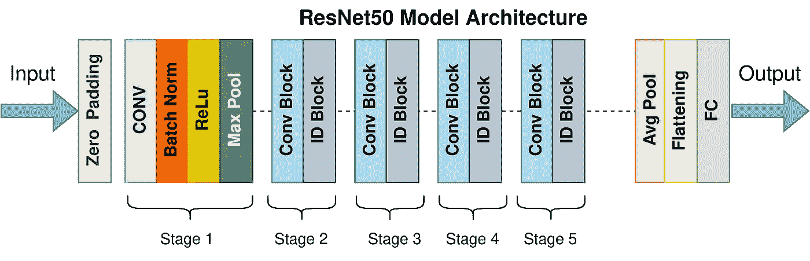
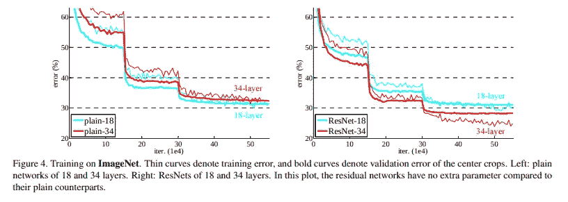
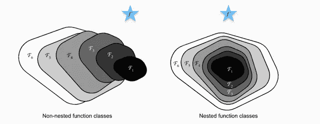
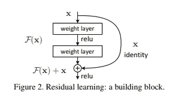
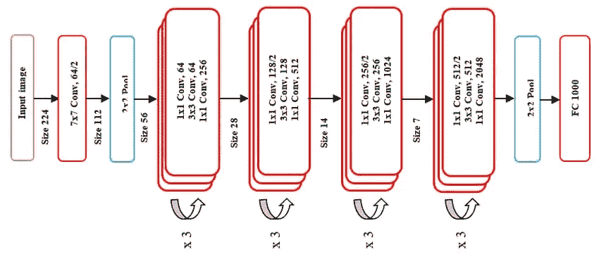
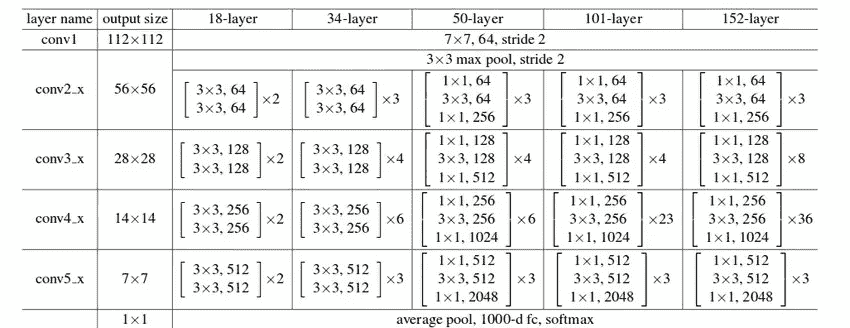

# 带注释的 ResNet-50

> 原文：<https://towardsdatascience.com/the-annotated-resnet-50-a6c536034758>

## 解释 ResNet-50 的工作原理以及它如此受欢迎的原因



[Resnet-5](https://commons.wikimedia.org/wiki/File:ResNet50.png) 0 模型架构

# 介绍

ResNet 架构被认为是最流行的卷积神经网络架构之一。剩余网络(ResNet)是微软研究院在 2015 年提出的，在何的论文[中首次提出时就打破了多项记录。et。艾尔](https://arxiv.org/pdf/1512.03385.pdf)。

# 为什么是 ResNet？

对像 ResNet 这样的模型的需求是由于当时现代网络中的许多缺陷而产生的。

1.  **深度神经网络训练难度:**随着模型层数的增加，模型中的参数数量呈指数增长。对于每个卷积层，总共有((*高度(内核* )⋅ *宽度(内核)* ⋅ *滤波器(输入)* )+1)⋅ *滤波器(输出)*被添加到账单中。具体来说，从 *3* 通道到 *32* 通道的一个简单的 *7x7* 内核卷积层添加了 *4736* 参数。为了进行实验而增加层数会导致训练模型的复杂度同样增加。然后训练需要更大的计算能力和记忆。
2.  **更具表现力，差异性更小**:神经网络通常被认为是一个函数逼近器。它能够在给定输入、目标以及函数输出和目标之间的比较的情况下对函数进行建模。向网络中添加多层使其更有能力模拟复杂的功能。但是论文中发表的结果表明，18 层平面神经网络的性能比 34 层平面神经网络好得多，如下图所示。



[(何等，2015)](https://arxiv.org/abs/1512.03385)

增加层可以看作是功能空间的扩展。例如，多个层加在一起可以看作是一个函数 *F* 。这个函数 *F* 可以表示为它可以到达/建模的函数空间 *F* 的表示。

在 *F`* 中拥有你想要的功能将是一个幸运的机会，但通常情况并非如此。在这里加层可以让我们围绕函数空间 *F`* 展开变化，可以让我们在由可想象宇宙中所有可能的函数组成的更大的母函数空间中覆盖更大的空间。但是这种方法有一个固有的缺陷。随着函数空间变大，不能保证我们更接近我们的目标函数。事实上，很有可能在实验阶段，你离开了可能有你实际需要的功能的功能空间。

行话让你困惑了吗？我们来打个针和干草堆的比方。
让这根针成为神经网络的完美权重，或者如前所述，成为一个函数。让干草堆成为所有可能的功能。

一种是从一个单一的搜索区域开始，并试图从那里对准指针。添加图层相当于移动你的搜索区域，让它变大。但这也带来了离开针头实际所在位置的风险，同时也使我们的搜索更加耗时和困难。干草堆越大，就越难找到完美的针。那么，解决办法是什么？

实际上，非常简单和优雅。嵌套您的功能空间。

这样做有几个简单的原因。最重要的一点是，它允许您确保当模型添加层来增加功能空间的大小时，您不会最终降低模型的质量。这保证了虽然我们的模型可以用更多的层做得更好，但它不会做得更差。

回到我们的干草堆类比，这相当于使我们的搜索空间更大，但确保我们不离开我们当前的搜索空间。



[(张等，2021)](https://arxiv.org/abs/2106.11342)

3.**消失/爆炸梯度**:这是困扰大型/深度神经网络训练的最常见问题之一，是网络参数数值稳定性方面疏忽的结果。
在反向传播过程中，当我们不断从深层向浅层移动时，微分的链式法则使我们乘以梯度。通常，这些梯度很小，在 10^{-5}10−5 量级或更大。

根据一些简单的数学，随着这些小数字不断相乘，它们会变得越来越小，对重量的影响几乎可以忽略不计。

在光谱的另一端，存在梯度达到 10⁴或更高的量级的情况。随着这些大梯度彼此相乘，这些值趋向于无穷大。允许如此大范围的值处于权重的数值域中使得收敛难以实现。

这个问题通常被称为消失/爆炸梯度问题。ResNet 由于其架构，根本不允许这些问题发生*。为什么跳跃连接(前面描述过)不允许这种情况，因为它们作为梯度高速公路，允许其流动而不被大幅度改变。*

# *什么是跳过连接？*

*ResNet 论文推广了使用[跳过连接](https://medium.com/blogging-guide/medium-subscript-text-and-medium-superscript-format-c169a8717ecf)的方法。如果你还记得，解决函数空间问题的方法是嵌套它们。就将它应用到我们的用例而言，它是在输出中引入了一个简单的 identity 函数。*

*在数学术语中，它意味着*y*=*x*+*F*(*x*)，其中 y 是该层的最终输出。*

**

*[(何等，2015)](https://arxiv.org/abs/1512.03385)*

*就体系结构而言，如果任何一层最终损害了普通网络中模型的性能，则由于存在跳过连接，该层会被跳过。*

# *体系结构*

**

*[ResNet-50 架构](http://dx.doi.org/10.11591/ijeecs.v18.i2.pp1015-1027)*

*ResNet-50 架构可以分为 6 个部分*

1.  *输入预处理*
2.  *`Cfg[0]`街区*
3.  *`Cfg[1]`区块*
4.  *`Cfg[2]`街区*
5.  *`Cfg[3]`街区*
6.  *全连接层*

*ResNet 体系结构的不同版本在不同级别使用不同数量的 Cfg 块，如上图所示。下面是一份详细的信息清单。*

**

*[(何等，2015)](https://arxiv.org/abs/1512.03385)*

# *给我看看代码！*

*理解这个概念的最好方法是通过一些代码。下面的实现是在 Keras 中完成的，使用标准的 ResNet-50 架构(ResNet 有几个版本，网络深度不同)。我们将在斯坦福 AI 著名的[斯坦福狗数据集上训练模型。](http://vision.stanford.edu/aditya86/ImageNetDogs/)*

# *导入标题*

```
*!pip install **-**q tensorflow_datasets
import tensorflow **as** tf
from tensorflow import keras
import tensorflow_datasets **as** tfds
import os
import PIL
import pathlib
import PIL.Image
import warnings
warnings**.**filterwarnings**(**"ignore"**)**
from datetime import datetime*
```

# *数据集下载和预处理*

*我们使用 [**Tensorflow 数据集(稳定)**](https://www.tensorflow.org/datasets/catalog/stanford_dogs) 下载斯坦福狗数据集，并将其分成训练、验证和测试集。*

*除了图像和标签，我们还获得了一些元数据，为我们提供了关于数据集的更多信息。它存储在`ds_info`并以人类可读的方式打印出来。*

*我们还利用`tfds.show_examples()`从数据集中打印一些随机的示例图像和标签。*

*我们运行`tfds.benchmark()`来对`tf.data.Dataset`提供的迭代器进行基准测试*

*我们在`tf.data.Dataset`对象上执行以下最佳实践步骤，以提高其效率:*

*   *`batch(BATCH_SIZE)`:允许我们在数据集内准备小批量。请注意，批处理操作要求所有图像都具有相同的大小和相同的通道数*
*   *`map(format_image)`:将图像转换为`tf.float32`张量，归一化范围[0，1][0，1]中的所有值，使用`lanczos3`内核方法将图像从其原始形状调整为模型输入形状(224，224，3)(224，224，3)*
*   *`prefetch(BUFFER_SIZE)`:在处理当前批次的同时，预取会将训练期间的下一批数据集带入内存，从而减少 I/O 时间，但需要更多的 GPU 内存*
*   *`cache()`:缓存第一批迭代器，以减少加载时间，类似于预取，区别只是缓存将加载文件，而不是推入 GPU 内存*

```
***(**train_ds**,** valid_ds**,** test_ds**),** ds_info **=** tfds**.**load**(**
    'stanford_dogs'**,** 
    split**=[**'train'**,** 'test[0%:10%]'**,** 'test[10%:]'**],** 
    shuffle_files**=True,** with_info**=True,**
    as_supervised**=True**
**)***print***(**"Dataset info: \n"**)**
*print***(**f'Name: {ds_info**.**name}\n'**)**
*print***(**f'Number of training samples : {ds_info**.**splits**[**"train"**].**num_examples}\n'**)**
*print***(**f'Number of test samples : {ds_info**.**splits**[**"test"**].**num_examples}\n'**)**
*print***(**f'Description : {ds_info**.**description}'**)**
tfds**.**show_examples**(**train_ds**,** ds_info**)**CLASS_TYPES **=** ds_info**.**features**[**'label'**].**num_classes
BATCH_SIZE **=** 4*print***(**'Benchmark results'**)**
tfds**.**benchmark**(**train_ds**)****def** **format_image(**image**,** label**):** image **=** tf**.**cast**(**image**,** tf**.**float32**)**
    image **=** image **/** 255.0
    image **=** tf**.**image**.**resize_with_pad**(**image**,** 224**,** 224**,** method**=**'lanczos3'**,** antialias**=True)**
    **return** image**,** label**def** **prepare_ds(**ds**):**
    ds **=** ds**.**map**(**format_image**)**
    ds **=** ds**.**batch**(**BATCH_SIZE**)**
    ds **=** ds**.**prefetch**(**tf**.**data**.**AUTOTUNE**)**
    ds **=** ds**.**cache**()**
    **return** dstrain_ds **=** prepare_ds**(**train_ds**)**
valid_ds **=** prepare_ds**(**valid_ds**)**
test_ds **=** prepare_ds**(**test_ds**)***
```

*输出:*

```
*Downloading and preparing dataset 778.12 MiB (download: 778.12 MiB, generated: Unknown size, total: 778.12 MiB) to /root/tensorflow_datasets/stanford_dogs/0.2.0...
Dataset stanford_dogs downloaded and prepared to /root/tensorflow_datasets/stanford_dogs/0.2.0\. Subsequent calls will reuse this data.
Dataset info:Name: stanford_dogsNumber of training samples : 12000Number of training samples : 8580Description : The Stanford Dogs dataset contains images of 120 breeds of dogs from around
the world. This dataset has been built using images and annotation from
ImageNet for the task of fine-grained image categorization. There are
20,580 images, out of which 12,000 are used for training and 8580 for
testing. Class labels and bounding box annotations are provided
for all the 12,000 images.Benchmark results************ Summary ************Examples/sec (First included) 787.00 ex/sec (total: 12000 ex, 15.25 sec)
Examples/sec (First only) 10.34 ex/sec (total: 1 ex, 0.10 sec)
Examples/sec (First excluded) 791.95 ex/sec (total: 11999 ex, 15.15 sec)*
```

# *增大*

```
*imageAug **=** keras**.**Sequential**([**
    keras**.**layers**.**RandomFlip**(**"horizontal_and_vertical"**),**
    keras**.**layers**.**RandomRotation**(**0.2**),**
    keras**.**layers**.**RandomContrast**(**0.2**)**
**])***
```

*我们进行了一些数据扩充，使我们的模型更加稳健。一个*随机翻转*、*随机旋转*和*随机对比度*用于使图像组更加多样。函数的参数是概率，即图像经历所选变换的机会。*

# *Cfg0 块*

*该区块包含 1 个 Conv 层和 2 个身份层。为了有助于数值稳定性，我们指定了一个核约束，以确保所有的权重以恒定的间隔被归一化。在两个后续层之间，我们还包括一个批处理标准化层。代码以一种明确的方式被有意地写出来，以帮助读者理解在每个阶段做出了什么样的设计选择。*

*   *输入形状:(56，56，64)*
*   *输出形状:(56，56，256)*

# *Cfg1 模块*

*该区块包含 1 个 Conv 层和 2 个身份层。这类似于 Cfg0 块，区别主要在于 Conv 和身份层中的`out_channels`的数量更多。*

*   *输入形状:(56，56，256)*
*   *输出形状:(28，28，512)*

# *Cfg2 模块*

*该区块包含 1 个 Conv 层和 5 个身份层。对于 ResNet 来说，这是一个更重要的块，因为模型的大多数版本在这个块空间上都有所不同。*

*   *输入形状:(28，28，512)*
*   *输出形状:(14，14，1024)*

# *Cfg3 块*

*该区块包含 1 个 Conv 层和 2 个身份层。这是网络中最后一组卷积层块。*

*   *输入形状:(14，14，1024)*
*   *输出形状:(7，7，2048)*

# *分类器块*

*这个区块包含一个`AveragePooling`层、一个`Dropout`层和一个`Flatten`层。在此块中，要素地图最终被展平并推入完全连接的图层，该图层随后用于生成预测。Softmax 激活用于生成逻辑/概率。*

*   *输入形状:(7，7，2048)*
*   *输出形状:(1，CLASS_TYPES)*

# *构建 ResNet 模型*

*现在，我们将所有的模块连接在一起，创建最终的 ResNet 模型。在我们的整个过程中，我们使用了 Keras Functional API，这是 Tensorflow 的最佳实践。*

*我们还执行一些可视化，即`model.summary()`打印出模型层的结构，以及`keras.utils.plot_model()`绘制模型的可视化有向无环图，Tensorflow 将在后端使用该图来简化执行。*

```
*Model: "resnet50"
_________________________________________________________________
 Layer (type)                Output Shape              Param #   
=================================================================
 input (InputLayer)          [(None, 224, 224, 3)]     0         

 sequential (Sequential)     (None, 224, 224, 3)       0         

 conv2d_28 (Conv2D)          (None, 112, 112, 64)      9472      

 max_pooling2d (MaxPooling2D  (None, 56, 56, 64)       0         
 )                                                               

 cfg0_block (Functional)     (None, 56, 56, 256)       148480    

 cfg1_block (Functional)     (None, 28, 28, 512)       665600    

 cfg2_block (Functional)     (None, 14, 14, 1024)      2641920   

 cfg3_block (Functional)     (None, 7, 7, 2048)        10526720  

 classifier (Functional)     (None, 120)               3932280   

=================================================================
Total params: 17,924,472
Trainable params: 17,893,752
Non-trainable params: 30,720
_________________________________________________________________
None*
```

# *定义回调*

*在`model.fit()`中，我们可以为模型定义回调，这些回调在训练期间以预定的间隔被调用。我们定义了一个模型检查点回调，它在每个时期完成时创建模型的快照。*

```
*callbacks_list **=** **[**
    keras**.**callbacks**.**ModelCheckpoint**(**
        filepath**=**'resnet50_model/checkpoint_{epoch:02d}.hdf5'**,**
        monitor**=**'val_loss'**,**
        verbose**=**0**,**
        save_best_only**=True,**
        mode**=**'auto'**,**
        save_freq**=**'epoch'**,**
        options**=None,**
        initial_value_threshold**=None**
    **)**
**]**history **=** model**.**fit**(**
    x**=**train_ds**,**
    validation_data**=**valid_ds**,**
    callbacks**=**callbacks_list**,**
    epochs**=**20
**)***
```

*如果我们希望使用先前保存的模型，我们也可以这样做。*

```
**## If using Google Colaboratory, one can upload checkpoints onto Google Drive and use it directly.*from google.colab import drive
drive**.**mount**(**'/content/gdrive'**)**
model **=** keras**.**models**.**load_model**(**'/content/gdrive/My Drive/checkpoint_18.hdf5'**)***## If using local Jupyter Notebooks, one can use checkpoints from local drives itself.*model **=** keras**.**models**.**load_model**(**'./resnet50_model/checkpoint_18.hdf5'**)***
```

# *获取模型历史*

*我们打印模型历史以获得关于训练过程的更多信息*

```
**print***(**history**)***
```

# *预测结果*

*我们采用经过训练的模型，并使用它对测试集进行预测，以及计算一些指标，如损失和准确性*

```
*results **=** model**.**evaluate**(**test_ds**)**
*print***(**f"Results : {results}"**)***
```

# *结论*

*上面，我们已经访问了残差网络架构，浏览了它的显著特征，从头实现了一个 ResNet-50 模型，并训练它在斯坦福狗数据集上进行推理。*

*作为一个模型，ResNet 同时在计算机视觉和深度学习领域带来了一场革命。它还赢得了 2015 年 ImageNet 大规模视觉识别挑战赛和 COCO 比赛。但这只是产生更好结果的许多有趣变化的垫脚石。查看下面有趣的链接部分，找到一些伟大的博客和研究论文。*

# *参考*

1.  *何刚，张，徐，任，孙(2015)。*用于图像识别的深度残差学习*。*
2.  *张，李，张，李，米，斯莫拉，A. J. (2021)。潜入深度学习。 *ArXiv 预印本 ArXiv:2106.11342* 。*

# *有趣的链接*

1.  *[resnet 及其变体的概述](/an-overview-of-resnet-and-its-variants-5281e2f56035)*
2.  *[关于 ResNet 变体多尺度集合的论文](https://link.springer.com/chapter/10.1007/978-3-030-64340-9_13)*
3.  *[在云 TPU 上训练 ResNet-50](https://cloud.google.com/tpu/docs/tutorials/resnet)*

*更多信息，请访问我的博客[这里](https://suvadityamuk.github.io/portfolio/)或者通过[电子邮件](http://suvadityamuk@gmail.com)或 [GitHub](https://github.com/suvadityamuk) 联系我！*