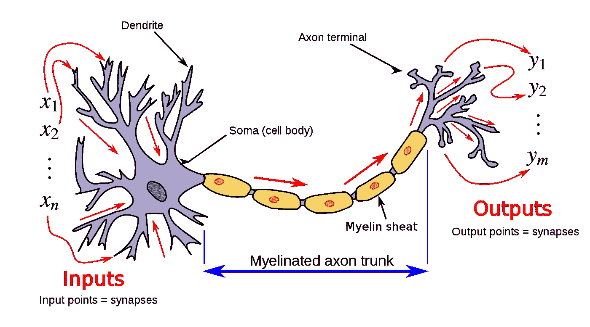
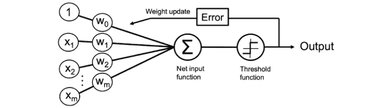
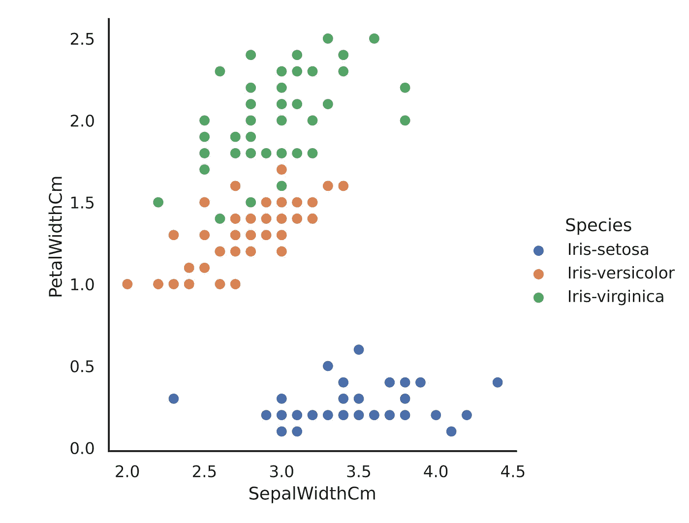

# Python 中人工神经元在虹膜数据集上的应用

> 原文：<https://towardsdatascience.com/the-application-of-an-artificial-neuron-on-the-iris-dataset-in-python-9fb4275fadd>

## 无深度学习库的单层神经网络预测花卉品种


信用额度[线材](https://www.freepik.com/wirestock)@[Freepik.com](https://www.freepik.com/)

# 介绍

答人工神经网络(ann)非常强大。最近的发展使科学家创造出比人脑连接更多的神经网络。给你一个概念，据估计，一个普通的大脑有 860 亿个神经元和 1000 亿个突触。另一方面，2022 年最大的 NN“威震天-图灵 NGL 530B (MT-NGL)”，单片变压器语言模型，拥有**5300 亿个参数**。尽管如此，人类的大脑精通不止一个领域，MT-NGL 只是专门从事语言处理。

> 我们是如何走到这一步的？

## 人工神经元

> “一个**人工神经元**是一个数学函数，被设想为一个生物神经元的模型，一个神经网络。人工神经元是人工神经网络的基本单元[1]。”

1943 年，麦卡洛克和皮茨发表了第一个被称为麦卡洛克-皮茨(MCP)神经元的简化脑细胞概念，这是神经系统发展的一个里程碑。这两位神经科学家试图理解人类大脑如何通过使用相互连接的神经元产生复杂的模式。

[](https://en.wikipedia.org/wiki/Artificial_neuron#/media/File:Neuron3.svg)

神经元和有髓轴突，信号从树突的输入流向轴突末端的输出(维基百科，2022)

如果你看到 MCP 的结构，有三个主要结构，树突，胞体和轴突。简而言之，树突接收在胞体中积累的多种信号。当信号强度超过某一阈值后，神经元向轴突产生输出信号。

这两位科学家试图根据他们从研究生物神经元中学到的知识来模拟人工神经元。工作完成后，他们意识到有局限性。人工神经元缺乏“学习”成分[2]。

被称为深度学习之父的美国心理学家弗兰克·罗森布拉特进一步发展了麦卡洛克和皮茨的工作，增加了缺失的部分。1957 年，Rosenblatt 构思了**感知器**，这是一个单层神经网络，它计算**最佳权重系数**，然后乘以输入特征，目的是进行分类。结果用来决定一个神经元是否传递信号。Rosenblatt 为人工神经网络奠定了基础，当新信息出现时，人工神经网络可以被训练并产生输出[3]。

本文旨在从头开始用 Python **创建一个感知器**，并在 Iris 数据集上进行训练和测试。最终目标是部署这个**单层神经网络**，并以令人满意的精度预测新记录。

## 人工神经元背后的数学

正如你所想象的，在一个**感知机**中涉及到一些统计公式。本节想要描述从开始到最终输出的整个流程。单层神经网络由以下 5 个元素组成:

*   **输入 *x1，x2，x3，…，xn****；*对算法进行训练然后测试的单个值
*   **权重 *w1，w2，w3 …，wn****；*也称为突触权重，是算法从训练过程中“记忆”的方式。新记录将需要通过权重，以从网络输入函数中分配一个数值
*   **净输入功能**；它是输入矩阵乘以权重矩阵。这是感知器对训练和测试记录进行分类的方式
*   **阈值函数**；它在一个数值范围内对网络输入函数给出的结果进行标准化
*   **错误**；该算法在训练阶段使用它来了解与理想结果相差多少，然后相应地重新调整权重



感知机的过程(Raschka，s .，& Mirjalili，v .，2014 年)

该图显示了感知器接收输入并将其与权重相结合的过程。事实上，在训练之后，感知器确定了一组权重。新记录可以通过净输入功能，其定义如下:

*z* 是输入的**加权平均值**。另一方面，存在不同的阈值函数，包括但不限于线性、单位步长、分段线性和高斯函数。为了这个项目，我们将使用 **Sigmoid** 函数。sigmoid 以 *z* 为输入，输出 0-1 范围内的值:

概括地说，数据集特定列下的每个输入 *x* 乘以每个权重。然后将结果 *z* 输入到 sigmoid 函数中进行归一化。**归一化**一个结果意味着每一个可能的输出都在一个特定的范围内。高于 0.5 的每个结果都是类“1”的一部分，而低于 0.5 的每个结果都是类“0”的一部分。

## 数据集

鸢尾花数据集是罗纳德·费雪在 1936 年构想的多元数据集。费希尔是英国统计学家和生物学家。他以厘米为单位记录了三种不同花的萼片和花瓣的长度和宽度:刚毛鸢尾、海滨鸢尾和杂色鸢尾。记录总数为 150 个，每个物种 50 个。数据集的列组织如下:

下面你可以找到通过组合数据集的两个特征生成的**散点图**，更具体地说是每个物种的花瓣和萼片宽度。从这个图像，你可以对三个品种有一个整体的了解，这是一个很好的场合来介绍一个根本的概念。感知器需要训练的数据必须是**线性可分的**。线性可分性是两组点的一个性质。如果平面上至少有一条线将这两组点分开，那么它们是线性可分的。例如，变色鸢尾和海滨鸢尾的记录不是线性可分的，而刚毛鸢尾和变色鸢尾符合这一规则。



包含虹膜数据集两个特征的散点图—图片由作者提供

# 代码部署

在“简短”的介绍之后，我们现在拥有了继续代码部署所需的所有元素。第一个主要步骤是获得可以用来训练感知器的数据集。可以在下面的[链接](https://archive.ics.uci.edu/ml/machine-learning-databases/iris/iris.data)找到。

*   然后我们可以导入诸如 *os* 、 *pandas* 和 *sklearn* 等库用于训练和测试分割；
*   *os* 加入我之前提供给你的数据集的链接，熊猫读取它。导入的数据没有标题，然后列名被重命名。
*   感知器不能读取字符串，品种的名称被映射到整数，鸢尾被分配到 0，鸢尾杂色被分配到 1，鸢尾被分配到 2；
*   *X* 和 *y* 被定义为训练和测试变量。您会注意到，我只选择了前 100 条记录，它们只包含鸢尾和杂色鸢尾品种。这需要发生两个主要原因:**线性可分性**和**二元分类**。正如我们之前提到的，杂色鸢尾和海滨鸢尾不是线性可分的，除此之外，感知器是一个二元分类器，它每次只能处理两个类；
*   *train_test_split* 命令在训练和测试之间划分数据，随机选择记录。

现在是时候创建人工神经元，根据可用数据对其进行训练并记录其表现了。Numpy 是这个过程的基础，因为我们要处理很多矩阵，它是算法中唯一的库。Python 中感知机的设计由 [jonasbostonen](https://github.com/jonasbostoen) 提供:

*   *self.synaptic_weights* 与 *np.random.seed(1)* 命令一起生成随机数并将其分配给权重，这是作者的选择，您甚至可以为每个权重分配一个特定的值。Synaptic 权重接受 4 个输入，每个输入对应数据集的一个特征，并返回一个输出，即类；
*   然后定义 *sigmoid* 和 *sigmoid_derivative* 函数。它们是关于结果标准化和我们对现有权重的信心的基础；
*   *训练*功能利用了神经网络中称为反向传播的概念。通过使用*sigmoid _ derivative*，该技术使用梯度下降来最小化成本函数。换句话说，命令 *train* 通过比较 sigmoid 导数的先前值和新值来重新迭代或重新调整，直到它达到成本函数的最小值；
*   *think* 负责通过神经网络传递输入并返回最终输出，预测一个新记录是属于一个类还是另一个类；
*   *训练 _ 输入*和*训练 _ 输出*需要分别分配给 *X_train* 和 *y_train* 给模型输入数据；
*   将迭代次数设置为 1000 次后，我们可以打印突触权重，看看它们是如何从随机分配的值变化的。这段话告诉我们训练是否奏效，模型是否收敛；
*   最终，我们可以通过运行命令*neural _ network . think(X _ test)*来预测新的记录，并为下一步将它们转换成 pandas 数据帧。

下面的终端输出显示了训练前后的突触权重值。每个突触权重都与该位置的特征相关联。例如，每个新记录的萼片长度需要乘以-9.52，萼片宽度需要乘以-6.52，依此类推。

```
Random synaptic weights:  
[[-0.16595599]  
[ 0.44064899]  
[-0.99977125]  
[-0.39533485]] 
Synaptic weights after training:  
[[-9.52461914]  
[-6.52013852]  
[-2.58998186]  
[-0.37790606]]
```

当我们执行*预测*命令时，新记录会发生以下情况:

啊哦！这是一个变色鸢尾(1)记录，已被归类为鸢尾(0)。在这种情况下，我不期望模型在测试记录上表现良好。

可以使用 sklearn 库 *classification_report* 来分析性能，但首先要注意的是，sigmoid 函数不会返回 1 和 0，而是这些值的近似值。因此，我们需要将值转换成类。

使用 *getResult* 函数，每个高于 0.5 的输出被分类为 1，而每个低于 0.5 的输出被分类为 0。lambda 函数帮助我们在测试数据集的每个记录上应用 *getResult* ，而 *classification_record* 给了我们感知的准确性。

```
precision        recall  f1-score   support

           0       0.50     1.00     0.67     10
           1       0.00     0.00     0.00     10

    accuracy                         0.50     20
   macro avg       0.25     0.50     0.33     20
weighted avg       0.25     0.50     0.33     20
```

正如预期的那样，准确性根本不令人满意，该模型似乎对 Iris Setosa 记录极其敏感，并对每个新数据点进行分类，从而实现 50%的总体准确性。

重要的是要强调特征以及它们的顺序会极大地影响最终结果。数据集中的所有列都被使用的情况经常发生，但并不总是这样。

经过一段时间的试验后，我注意到两种花卉的萼片宽度有一个清晰的模式，所以这次我只使用三个变量按照以下顺序重新运行代码:

```
##Defining input and target variables for both training and testing
X = df.iloc[:100,[1,2,3]].values
y = df.iloc[:100,[4]].values
```

我相应地修改了第一个神经网络的类函数，这次它只接受三个特征而不是四个:

```
def __init__(self):
   np.random.seed(1)
   self.synaptic_weights = 2*np.random.random((3,1)) - 1
```

正如你可能想象的那样，突触权重在通常的 1000 次迭代后已经改变了。

```
Random synaptic weights:  
[[-0.16595599]  
[ 0.44064899]  
[-0.99977125]] 
Synaptic weights after training:  
[[-10.97823329]  
[ 10.71483544]  
[  3.74420857]]
```

我要用之前的记录再试一次，看看这次模型是否分类正确。

大家可以看到，有些权重经过调整转正，也使得最终结果转正。提醒一下，这个记录属于鸢尾，这次分类器预测正确。我对这个模型有更好的感觉。

```
precision        recall  f1-score   support

           0       1.00     1.00     1.00     10
           1       1.00     1.00     1.00     10

    accuracy                         1.00     20
   macro avg       1.00     1.00     1.00     20
weighted avg       1.00     1.00     1.00     20
```

正如预期的那样，性能得到了令人眩晕的提高，报告显示两个类在 20 个测试记录中获得了 100%精度的满分，这正是我们想要的结果。

# 结论

我希望你觉得这篇文章很有见地，很吸引人。目标是通过分析神经网络算法的基本单元来揭穿其复杂性。现在想象一个感知器，但有更多层，其中前一层的输出代表下一层的输入，这是一个多层人工神经网络，它是 MT-NGL 的基本概念，你刚才看到它用大约 130 行 Python 编码和部署。

*最后，如果您喜欢该内容，请考虑添加一个关注，以便在新文章发布时得到通知。如果你对这篇文章有什么要考虑的，写在评论里吧！我很想读读它们:)谢谢你的阅读！*

*PS:如果你喜欢我写的东西，如果你能通过* [*这个链接*](https://giovanni-valdata.medium.com/membership) *订阅一个中等会员，那对我来说就是全世界。这是一种间接的支持我的方式，你会得到媒体文章提供的惊人价值！*

参考

[1]麦卡洛克，W. S .，&皮茨，W. (1943)。神经活动中固有观念的逻辑演算。*《数学生物物理学通报*， *5* (4)，115–133。

[2]维基百科贡献者。(2022 年 2 月 10 日)。*人工神经元*。维基百科；维基媒体基金会。检索自:[https://en.wikipedia.org/wiki/Artificial_neuron](https://en.wikipedia.org/wiki/Artificial_neuron)

[3]罗森布拉特，F. (1961 年)。*神经动力学原理。感知机和大脑机制理论*。纽约布法罗康奈尔航空实验室公司。

[4]费希尔，R. A. (1936 年)。分类问题中多重测量的使用。*《优生学年鉴》*， *7* (2)，第 179–188 页。

[5] Raschka，s .，& Mirjalili，V. (2014 年)。*朴素贝叶斯和文本分类 I 导论和理论*。从 https://arxiv.org/pdf/1410.5329.pdf[取回](https://arxiv.org/pdf/1410.5329.pdf)

[6] R.A .费希尔(1936 年)。https://archive.ics.uci.edu/ml/datasets/Iris 的 UCI 机器学习库。加州欧文:加州大学信息与计算机科学学院。