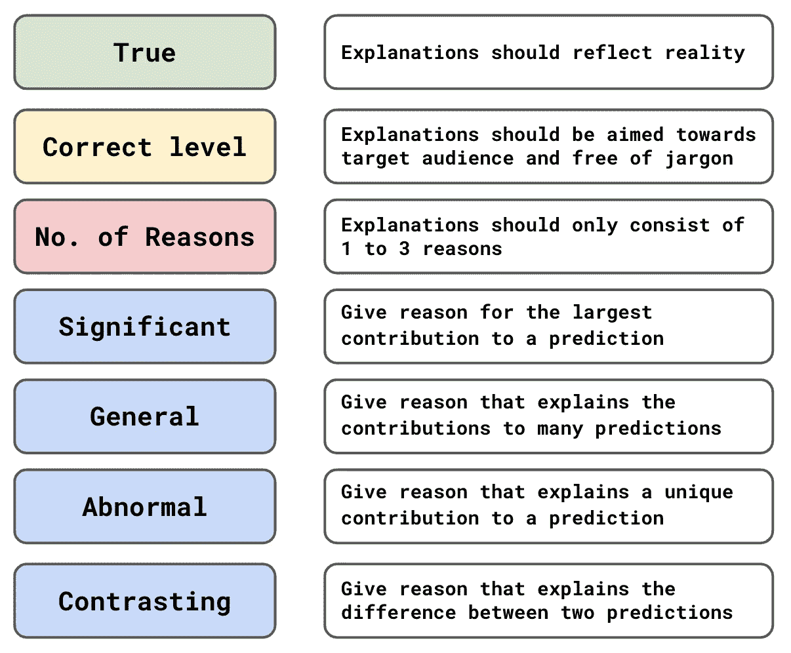
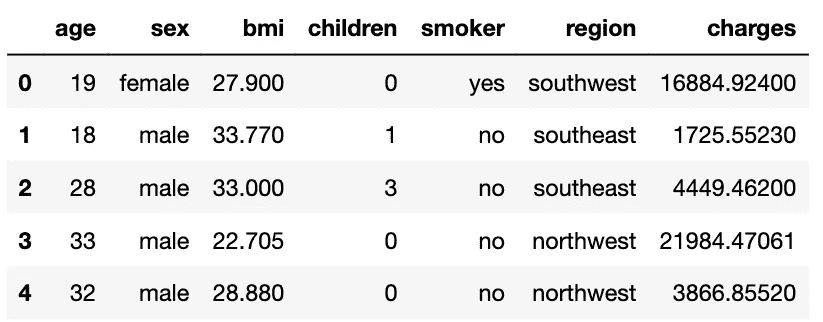
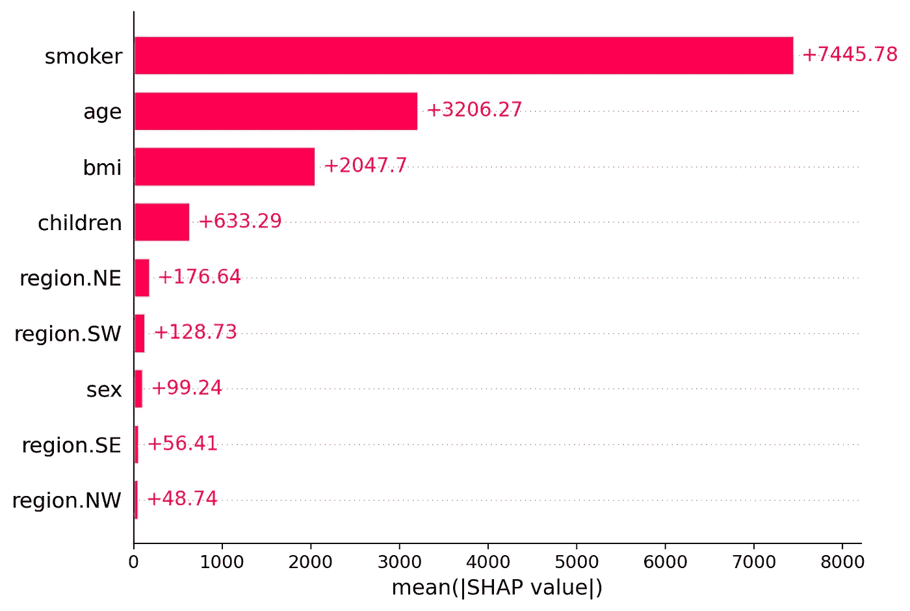
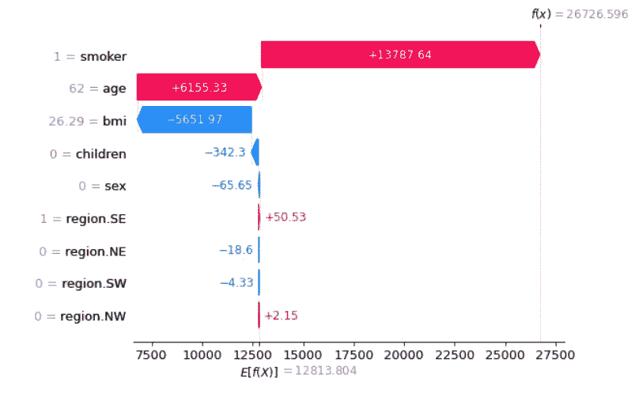
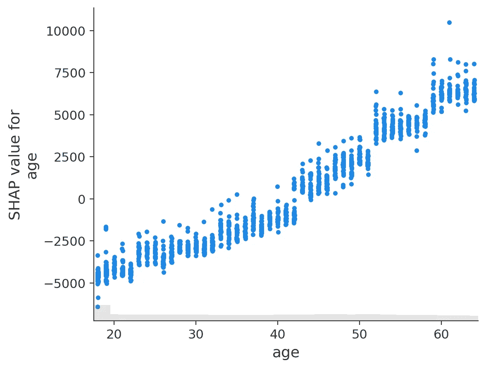
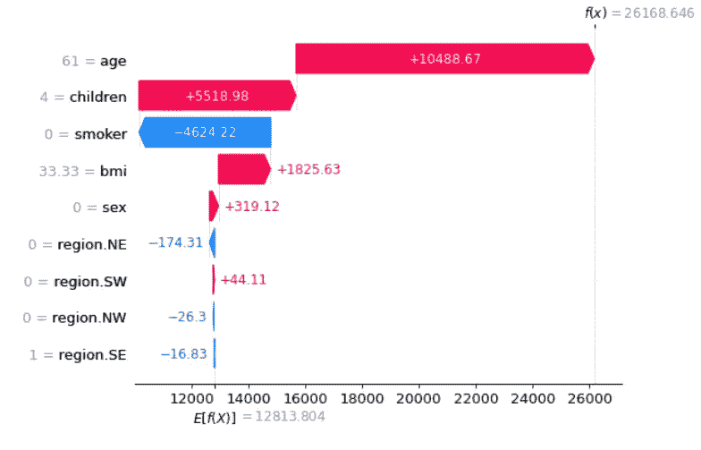

# 解释预言的艺术

> 原文：<https://towardsdatascience.com/the-art-of-explaining-predictions-22e3584ed7d8>

## 如何以人性化的方式解释你的模型

杰森·古德曼在 [Unsplash](https://unsplash.com?utm_source=medium&utm_medium=referral) 上的照片

数据科学家角色的一个重要部分是解释模型预测。通常，接受解释的人是非技术人员。如果你开始谈论成本函数、超参数或 p 值，你会遇到茫然的目光。我们需要把这些技术概念翻译成通俗易懂的语言。这个过程可能比构建模型本身更具挑战性。

我们将探索如何给出人性化的解释。我们将通过讨论一个好的解释的一些关键**特征来做到这一点。重点将放在解释个别预测上。最后，我们将通过解释一个使用 **SHAP 值**的模型来应用这些知识。我们会看到，当你想给人以友好的解释时，SHAP 是非常有用的。**

# 本地与全球解释

在我们深入讨论之前，让我们先讨论一下**你在解释什么**以及**你在向谁**解释。作为一名数据科学家，你可能需要与各种各样的人交流。这包括同事、监管者或客户。这些人都有不同程度的技术专长。所以你需要根据他们的专业知识来调整你的解释水平。

在某些情况下，您可能会被要求从整体上解释模型。我们称之为**全局解释**。我们希望了解模型总体上捕捉到了哪些趋势。我们可能需要回答诸如“哪些特性是最重要的？”或者“特征 X 与目标变量有什么关系？”

在其他情况下，我们将需要给出**局部解释**。这是我们解释单个模型预测的时候。事实上，我们通常需要解释由模型预测产生的决策。这些解释也可以是对诸如“我们为什么拒绝这个贷款申请？”或者“为什么会给我这个电影推荐？”

(来源: [flaticon](https://www.flaticon.com/free-icon/interpretation_1935181) )

与同事或监管者交谈时，你可能需要给出更多的技术性解释。相比之下，客户会期待更简单的解释。你也不太可能需要给客户一个全面的解释。这是因为他们通常只关心影响他们个人的决策。我们将集中讨论这个场景。这是向一个非技术人员解释个人预测。

# 好的解释的特征

当我们谈论一个好的解释时，我们指的是一个容易被接受的解释。换句话说，它应该让观众相信一个决定是正确的。要给出这样的解释，你需要考虑一些关键的方面。您可以在**图 1** 中看到这些内容的总结。在本节的其余部分，我们将深入讨论每一个问题。

图 1:一个好特性的特征概述(来源:作者)

## 真实的

这似乎是显而易见的，但一个好的解释应该是**真的**。当你考虑我们正在解释的东西时，这可能比预期的更难。那就是我们正在为模型预测给出解释。问题是这些预测可能是不正确的。例如，我们的模型可能过度拟合。这意味着预测可能会反映已经建模的噪声。对这些预测的解释不能反映数据中真实的潜在关系。

(来源: [flaticon](https://www.flaticon.com/) )

当给出解释时，我们需要考虑我们的模型在多大程度上代表了现实。我们可以通过评估模型的性能来做到这一点。例如通过使用交叉验证准确性。即使整体表现良好，一些预测可能比其他预测更不确定。例如，概率为 0.5 左右的逻辑回归预测。在你的解释中，我们可能要提到这种不确定性。

## 瞄准目标受众

你表达事情的方式很重要。我们拒绝了你的贷款，因为——“你是一名加密货币交易员”、“你在一个高风险的行业工作”或“你的收入太不稳定”。这些都是相同的原因，但措辞不同。一些表达事物的方式会更好地表达你的观点。有些人可能还会觉得某些方式令人不快。比如第一种解释，可能会带个人色彩。

你也应该避免任何技术或商业术语。“收入在我们的模型中有一个正参数，而你的收入值很低。所以，你被拒绝了，因为你的收入价值大大增加了你的违约风险。”这是一个不好的解释，因为我们使用了技术术语(即“模型”和“参数”)。我们也有一些商业术语(如“违约风险”)。

选择最佳的解释方式才是真正的艺术所在。这可能是解释一个预测最困难的部分。这也不是数据科学课程或大学能很好涵盖的内容。最终，这种技能将来自经验和与客户发展关系。

## 原因数量

人们只想要事件的主要原因。“为什么通货膨胀这么高？”——“因为油价上涨了。”事实上，通胀可能是由工资增长、政府支出增加或汇率等因素综合造成的。然而，这些可能没有能源成本上升的影响大。

当谈到 ML 时，人们不想知道每个模型特征是如何影响预测的。一般来说，说明 **1 到 3** 特征的贡献就足够了。问题是你选择解释哪些贡献？接下来的 4 个特征可以帮助你选择最合适的原因。

(来源: [flaticon](https://www.flaticon.com/) )

## 有意义的

我们应该选择**最重要的**原因。换句话说，我们只会解释那些有重大影响的因素。对于我们的通货膨胀的例子，我们会给出引起最大增长的原因。这些原因比那些影响较小的原因更容易被接受。

对于 ML，我们想要解释对预测贡献最大的特征。我们确定这些特征的方式将取决于所使用的模型。对于线性模型，我们可以看参数权重和特征值。稍后我们将看到 SHAP 值如何用于非线性模型。

## 一般

一个好的理由可以解释许多决定。“你为什么拒绝我的贷款申请？”——“因为你现有的债务很多。”假设这是拒绝很多贷款申请的理由。这个原因更容易被接受，因为它的贡献已被广泛理解。

对于 ML，我们可以通过查看一些特征重要性的度量来找到一般性的解释。例如，排列特征重要性。有了 SHAP 值，我们可以看到平均绝对 SHAP。无论如何衡量，高值表示某个特性总体上做出了重大贡献。

## 反常的

在其他情况下，一个好的理由可能是**不常见的**。这些将能够解释对特定决策的重要贡献。然而，一般来说，他们无法解释决策。“你为什么拒绝我的贷款申请？”-“因为你是一个加密货币交易商”这些类型的原因可能会被接受，因为它们更个人化。也就是说，人们能够理解它对他们产生了怎样的具体影响。

对于 ML，我们可以通过查看特征重要性和对个体预测的贡献的组合来找到异常原因。这些是不具有高特征重要性的特征。但是，对于一个具体的预测，他们做出了很大的贡献。

(来源: [flaticon](https://www.flaticon.com/) )

## 对比

通常我们需要解释一个决定**和另一个决定**。客户可能不会问“为什么我的申请被拒绝？”但是“为什么我的申请被拒而他们的申请被接受？”可能是两个客户都有很高的现有债务。第一个问题可能接受了这个理由，但第二个问题没有。换句话说，我们需要给出一个理由来区分这两个决定。

对于 ML，这意味着我们需要将我们的解释建立在对两个客户具有不同价值的特性的基础上。该特征还需要在某种程度上有所不同，从而导致不同的预测。例如，我们可能会发现第一个客户的收入更高。收入特征不同，但这不是一个好的理由。也就是说，较高的收入不会导致申请被拒。

这最后四个特征似乎相互矛盾。一个不正常的原因不可能是普遍的。异常或一般原因可能不是最重要的。一个相反的原因可能既不重要，一般或异常。然而，在我们的解释中，我们可以使用多种原因的组合。你选择的理由将取决于问题、人和你认为最有说服力的东西。

# 和 SHAP 一起解释一个模型

如果你刚到 SHAP，那就看看下面**的**视频**。**如果想要更多，那就来看看我的 [**SHAP 课程**](https://adataodyssey.com/courses/shap-with-python/) **。**注册我的 [**简讯**](https://mailchi.mp/aa82a5ce1dc0/signup) :)即可免费获取

现在让我们将其中的一些特征付诸实践。我们将尝试解释一个用于预测保险费用的模型。您可以在**表 1** 中看到这个数据集的快照。我们的模型特征基于前 6 列。比如**子女**就是被赡养人数。

表 1:数据集快照(来源:作者)(数据集: [kaggle](https://www.kaggle.com/datasets/mirichoi0218/insurance) )(许可证—数据库:开放数据库)

我们不会检查代码，但是你可以在 GitHub 上找到完整的项目。总而言之，我们从做一些特性工程开始。我们将**的性别**和**的吸烟者**转换成二元特征。**区域**可以采用 4 个不同的值，因此我们从该列创建 4 个虚拟变量。这样，我们总共有 9 个模型特征。我们使用这些来训练 XGBoost 模型以预测**电荷。**一旦我们的模型经过训练，我们就可以计算每个预测的 SHAP 值。

对于每个预测，每个要素都有一个 SHAP 值。SHAP 值给出了该要素对预测的贡献。换句话说，该特性增加或减少了多少预测的**费用**。为了理解哪些特性是重要的，我们可以看一下图 2 。这里我们取了所有预测的 SHAP 值的绝对平均值。高平均值表示该特征通常对预测有很大的贡献。

图 2:均值 SHAP 图(来源:作者)

我们可以使用**图 2** 来帮助确定好的一般或异常原因。比如我们可以看到**吸烟者**的绝对均值很高。这告诉我们，一般来说，这个特征将为预测提供一个很好的理由。绝对值较低的特征可以提供很好的异常原因。也就是说，对于一个特定的预测，他们有很大的贡献。

让我们试着解释一下我们的第一个预测。你可以在图 3 中看到这个预测的 SHAP 瀑布图。查看 x 轴，我们可以看到基值是 E[f(x)] = 12813。这是所有客户的平均预计**费用**。结束值是 f(x) = 26726。这是该特定客户的预计**费用**。SHAP 值是介于两者之间的所有值。它们告诉我们，与平均预测相比，每个特征是如何增加或减少预测的。

图 3:第一次预测的 SHAP 瀑布(来源:作者)

查看图 3 中的**我们可以看到**吸烟者**是最显著的特征。也就是说，它将预测的**费用**增加了最大的数量。y 轴给出了特征值。例如，我们可以看到“1 =吸烟者”表示该客户吸烟。因此，如果客户问“为什么我的保险费这么高？”，一个好的解释可能是“你是一个吸烟者”。我们还看到，在**图 2** 中，这是一个很好的一般原因。**

因此，吸烟既是一个重要的原因，也是一个普遍的原因。这可能足以让这个人相信保险费用是正确的。如果我们想确定，我们可以提到第二个最重要的特征。看 y 轴我们可以看到这个人是 62 岁。因此，我们可以接着问第二个原因，“你老了。”(我们可能想用更好的方式表达这一点。)

对于第二个原因，我们已经猜到了与目标变量的关系。那就是随着**年龄**增加你的**费用**增加。其他特征的关系可能不那么明显。这意味着要给出好的理由，我们需要一些特征值的上下文。为此，我们可以使用 SHAP 值的散点图。查看**图 4，**我们可以看到我们的猜测是正确的。随着**年龄**的增加，SHAP 值增加。换句话说，预测的**费用**增加。

图 4: SHAP 对年龄的价值观(来源:作者)

在**图 5** 中，可以看到第二次预测的瀑布图。为了解释这一点，我们可以直接跳到客户的年龄。然而，请注意**孩子**也做出了重大贡献。记住，我们在**图 2** 中看到，这个特性通常并不重要。换句话说，依赖者的数量可能是一个很好的异常原因。相反，我们可能更愿意将此作为主要原因。

图 5:第二个预测的 SHAP 瀑布

本质上，SHAP 价值观允许你给出相反的解释。然而，这只是在我们想要将预测与平均预测进行比较的情况下。像“为什么我的收费比平均水平高？”这样的问题很容易回答。来回答诸如“为什么我的收费比我的姐妹们高？”将需要更多的工作。还有其他计算 SHAP 值的方法可以简化这一过程。例如，基线 SHAP 将计算特定预测的值。

我们一直关注用 SHAP 值来解释个人预测。它们也可以用来给出全局的解释。这解释了模型作为一个整体是如何工作的。我们通过聚合 SHAP 值和创建不同的地块来做到这一点。我们已经看过一个——卑鄙的 SHAP 阴谋。我们将在下面的文章中详细讨论。我们还将讨论用于计算 SHAP 值和创建这些图的 Python 代码。

  

我希望这篇文章对你有帮助！你可以成为我的 [**推荐会员**](https://conorosullyds.medium.com/membership) **来支持我。**你可以接触到 Medium 上的所有文章，我可以得到你的一部分费用。

  

你可以在|[Twitter](https://twitter.com/conorosullyDS)|[YouTube](https://www.youtube.com/channel/UChsoWqJbEjBwrn00Zvghi4w)|[时事通讯](https://mailchi.mp/aa82a5ce1dc0/signup)上找到我——注册免费参加 [Python SHAP 课程](https://adataodyssey.com/courses/shap-with-python/)

## 图像来源

所有图片都是我自己的或从[www.flaticon.com](http://www.flaticon.com/)获得。在后者的情况下，我拥有他们的[保费计划](https://support.flaticon.com/hc/en-us/articles/202798201-What-are-Flaticon-Premium-licenses-)中定义的“完全许可”。

## 资料组

米（meter 的缩写））Choi，**医疗费用个人数据集**(License-Database:Open Database)[https://www . ka ggle . com/Datasets/mirichoi 218/insurance/metadata](https://www.kaggle.com/datasets/mirichoi0218/insurance/metadata)

## 参考

C.Molnar、**可解释机器学习** *、* 2021、[https://christophm . github . io/Interpretable-ml-book/explain . html](https://christophm.github.io/interpretable-ml-book/explanation.html)

T.米勒，**人工智能中的解释:来自社会科学的洞见**，2017，[https://arxiv.org/abs/1706.07269](https://arxiv.org/abs/1706.07269)

南 Lundberg & S. Lee，**解释模型预测的统一方法，** 2017，[https://arxiv.org/pdf/1705.07874.pdf](https://arxiv.org/pdf/1705.07874.pdf)