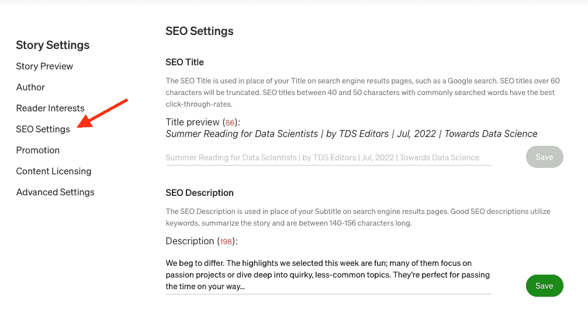
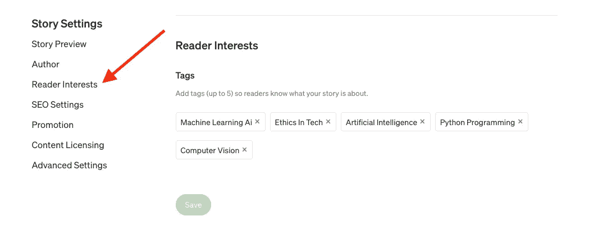

# 促销的艺术

> 原文：<https://towardsdatascience.com/the-art-of-promotion-2498fafdac0d>

## [作家工作室](https://towardsdatascience.com/tagged/writersworkshop)

## 我们获得更广泛受众的技巧

杰洛特在 [Pixabay](https://pixabay.com/illustrations/earth-network-blockchain-globe-3537401/) 上的照片

几周的写作和编辑终于有了回报，你的文章现在发表在《走向数据科学》上。你自豪地向你的朋友圈和同事宣布，在我们的首页向他们展示你的文章，并分享我们的 Twitter 和 LinkedIn 帖子。你看着掌声和关注，期待着看到两者都成长为数千人，就像你在我们一些最受欢迎的作家身上看到的那样。但是在最初的兴趣爆发之后，事情就停滞了。发生了什么事？

每篇新发表的文章都会在我们的网站和社交媒体账户上成为焦点。但是要想真正成功，作者需要在推广他们的作品中发挥作用。许多作者不知道从哪里开始，所以我们分享我们关于推广的顶级技巧。虽然他们不一定会让你成为一个明星 TDS 作者，但他们会让你走上成功之路。

## **联网**

即使你还没有写一个字，建立你的人际网络也是很重要的，因为单独传播这个词是很困难的。你的同事、朋友和家人是一个很好的起点，但是要真正扩大你的人际网络，你需要接触陌生人。

**社交媒体账户。**这是作者最熟悉的推广形式。这是一个很大的话题，所以我们将在我们的作家工作室系列中提供一个单独的帖子。这里我们会提到，要增加你的关注者，你往往要先关注别人。关注 TDS 社区的其他成员，以及您所在领域的领导者。

**教育供应商。如果你正在学习或已经从教育项目毕业，在 Twitter 上与他们联系。许多学校积极支持学生和校友的推广活动。这些机构中的一些还会提供机会在他们的时事通讯和出版物中宣传你的工作，所以它们值得一探究竟。**

**用户组、专业协会和会议。**这是一个经常被忽视的建立关系网的机会。例如，如果你是 Python 专家，就去 Python 论坛找找看。不要忘记软件公司——许多公司提供年会和网络活动，在那里你会找到志同道合的同事。

**网站。有些作者创建了自己的网站，虽然这可能很有效，但需要努力，并且需要自己的推广，因为你必须吸引人们来这个网站。如果你决定走这条路，保持你的网站及时更新，内容丰富，易于浏览。还记得利用你的中型简介传记提及和链接到您的网站。**

**分发名单。从对你的工作感兴趣的人那里收集联系信息是另一种流行的社交策略。而且理由很充分！这些人*喜欢*你的工作并期待更多，所以他们已经在支持你的努力了。我们让你很容易建立你的通讯组列表，我们在下面的一个单独的部分解释了这一点并提供了一些很好的建议。**

**其他作者**。接近一个你不认识的人可能会不舒服，但要记住他们中的许多人，尤其是其他作者，曾经站在你的立场上。他们也不得不从零开始建立他们的网络，因此，你可能会惊讶地发现这比你想象的要容易得多！考虑联系那些写类似主题的作者，或者直接在你的文章中添加作者[提及](https://help.medium.com/hc/en-us/articles/215194537-Using-the-story-editor)。当涉及到其他作者时，运用良好的判断力是很重要的；仔细选择你提到的作者，不要走极端。

## **确保你的文章被找到**

人们热切期待杂志和期刊的印刷版的日子已经一去不复返了，所有的杂志和期刊都是从头到尾阅读的。相反，互联网搜索识别感兴趣的文章，你想在顶部的结果。

搜索引擎使用专有算法来决定什么先出现，这使得搜索引擎优化成为每篇发表文章的一个重要方面。TDS 作者受益于成熟平台的 SEO 提升，因为我们是世界上最受欢迎和阅读量最大的数据科学博客之一，拥有+60 万中等关注者。但是作者自己可以做更多的事情。

基本上，我们希望给搜索引擎提供它所需要的东西，以快速确定你的文章是输入搜索的理想匹配。事实上，我们不知道谷歌是如何使用大约 200 个因素来对内容进行排名的，这使得关注我们所了解的发挥作用的因素变得非常重要。

**添加关键字。关键词是常见的搜索术语，在你的文章标题和正文中包含相关的关键词可以提高可见性。将机器学习或数据科学等主要关键词与特定于您的主题的术语(如可视化或部署)结合起来会很有帮助。如果你不确定要包括哪些关键词，那么[谷歌趋势](https://trends.google.com/trends/?geo=CA)是一个不错的起点。**

**有效放置关键词。在标题、副标题和开头段落中使用与内容相关的关键词。理想情况下，关键字应该出现在标题和副标题的开头，而不是结尾。同样的策略也适用于你的介绍，你应该尝试在前两三句话中包含关键词。 [*搜索引擎期刊*](https://www.searchenginejournal.com/ranking-factors/keyword-prominence/#close) 分享了一些关于关键词放置的好技巧。**

**明智地使用关键词**。自然的使用你的关键词；许多搜索引擎积极寻找太多重复的关键词，被称为[关键词填充](https://developers.google.com/search/docs/advanced/guidelines/irrelevant-keywords?hl=en)——TDS 编辑也是如此。所以，只在有意义的地方使用关键词，并考虑相关术语。

**别忘了元数据。**在你文章的故事设置中，你会发现一个 SEO 设置部分，你可以在那里查看你的标题和描述，它的功能是[搜索引擎元描述标签](https://developers.google.com/search/docs/beginner/seo-starter-guide#understand_your_content)。

输入这些设置时，请记住以下几点:

*   您的 SEO 标题只能在发布前更改。理想情况下，它将在 40-50 个字符之间，并包括关键字。虽然你可以选择一个更长的标题，但请记住，搜索引擎通常会将标题截断到 60 个字符。这意味着你的标题中最重要的元素和关键词应该在开头。
*   一个好的 SEO 描述是一篇 140-156 个字符长的文章的紧凑的、引人注目的摘要，包括关键词。默认情况下，会使用文章的第一段，所以请仔细检查以确保其有效。此设置可以在发布后更改，但您需要事先注意这一点，以便从最初的发布推广期获得最大收益。

## **鼓励读者关注你的文章**

面对一长串互联网搜索结果，读者可能会对他们决定挖掘的内容吹毛求疵。所以，除了一个好的标题、副标题和关键词，考虑你的开头段落和特色图片也很重要。

创造一个有意义的标题。写一个简短的标题来吸引读者的注意力。这并不意味着点击诱饵——为了符合我们的指导方针，你的标题必须反映你文章的内容。

**用副标题添加细节。一个好的副标题应该扩展你的标题，而不是重复它，这样综合起来，你的标题和副标题就能反映你文章的内容。**

**利用图像为你带来优势。**精心挑选的图片充分说明了内容。如果你的图片有一个紧密反映你文章的主题，它会立刻吸引对这个主题感兴趣的读者。

**全力以赴。润色你的开场白，确保它们反映了你的写作风格。这告诉读者你的方法是专业的，并设定了正确的期望。**

让它变得有价值。抵制诱惑，不要在你的首段写满关于你自己的信息。读者想通过浏览第一段来了解文章的内容。如果他们在移动设备上看你的文章，他们只能看到这些。

如果你想了解更多关于制作好文章的知识，请关注我们作家工作坊系列中即将到来的专栏。

## **读者兴趣标签**

发布文章时，利用“故事设置”>“故事预览”页面上的读者兴趣标签。这些标签对发表在 TDS 上的文章进行分类，帮助读者找到感兴趣的话题。您最多可以添加五个，因此混合使用高级术语和更具体的术语是有意义的。TDS 编辑器有时会编辑您的标签选择，以确保最相关的标签出现。我们与 Medium 密切合作，确保 TDS 中的故事符合 Medium 的编辑和发行标准，因此 TDS 中的故事经常会进一步发行。

## **多写文章**

知名度在推广中很重要。它不仅影响你的搜索引擎优化(SEO)，而且读者更有可能打开他们认识或听说过的人写的文章。随着你写作声誉的增长，你会发现大门是敞开的。

**创造更多内容。我们最好的建议是建立一个高质量的团队。对于许多作者来说，这意味着写更多的文章，但也可能包括 YouTube 视频、研讨会或会议演示。**

确立你的定位。许多作者通过专注于某个特定的领域来增加他们的声誉和追随者。这可能意味着写文章分享你的专业经验，但也可能意味着教程，或文章适合初学者。

**保持你的势头。一旦你获得了追随者，重要的是不要失去他们。很容易忘记一个作者，即使他的文章你非常喜欢，如果他们离开视线太久的话。有点像十年不见的朋友。**

通常写了一篇好文章的作者会纠结下一步该做什么。我们在 [FAQ](/writers-faq-462571b65b35#6059) 中提供了一些建议，我们将很快就这个话题发表一个作家工作室专栏。对于那些寻找当前话题和数据集的人来说，我们也在努力撰写一个名为 *The Spark* 的新专栏。

## **分发列表**

我们已经讨论了网络的重要性及其在建立联系人列表中的价值。但是你必须超越你认识的人。

Medium 提供了一个易于使用的选项，非常适合将读者添加到您的分发列表中。每个点击关注按钮的人都会被自动添加到您的个人列表中。最棒的是，这些新的联系人看到了你的作品，觉得他们想看更多。有点像发现黄金！

如果您在其他地方收集联系人，这些电子邮件地址可以导入到同一列表中。就这样，您拥有了一个共享您最新故事的中央分发列表！完整的细节可以通过媒体的[电子邮件订阅](https://help.medium.com/hc/en-us/articles/360059837393-Email-subscriptions)和[你的观众统计](https://help.medium.com/hc/en-us/articles/4405449973015)页面获得。

一些作者扩展了他们对分发列表的使用，以共享诸如时事通讯和提示表之类的东西。它们可能很有帮助，但也很有挑战性。虽然有些人可能已经注册了，也许是为了收到一份提示表，但不能保证他们会打开你发送的任何东西。

如果你打算走这条路，花点时间研究什么是有效的。

**增值。如果你的时事通讯或出版物中充满了很棒的提示和建议，那么人们会更愿意参与进来。**

**不要过度宣传**。失去你精心建立的追随者的最快方法是发送除了推广你的最新文章之外什么也不做的简讯。推广没问题，但是记住第一条规则:增值。考虑如何提供一些与文章相关的额外代码或技术。

## **分享自己的信息**

读者不仅与文章联系在一起，还与作者本人联系在一起。这意味着你的媒体形象对你的文章有促进作用。

我们发现作者的照片和全名有助于建立作者和读者之间的信任。但你对自己的描述是你与读者的第一次对话。它建立可信度和联系。

介绍你自己。让你的读者了解你的工作、专业或兴趣。它可以是一个简单的列表，也可以是一个详细的陈述。最重要的是读者对你有所了解。

**告诉我们更多。**作者通常会忽略与他们个人资料相关的[关于](https://medium.com/creators-hub/how-to-customize-your-about-page-db0924bb6dab)选项卡。在这里，有大量的空间让你分享一切，从你的专业追求到照片。

## **提高你的技术**

这似乎是一个奇怪的关于推广的建议，但是一篇写得好的文章会让我们的读者和编辑团队眼前一亮，它可以让作者成为焦点。想想你自己对一篇好文章的反应。你可能会为它鼓掌，关注作者，也许还会留下评论。更重要的是，你可能也分享过，谈过——你 ***推广过*** 的文章。

我们在 TDS 也这样做。我们突出我们最好的文章和作者，扩大他们的影响。

**社交媒体。**除了通常的 Twitter 和 LinkedIn 帖子，我们最好的文章也会在脸书上分享。

**编辑推荐。我们的编辑团队为我们的编辑精选页面挑选他们最喜欢的文章。除了在聚光灯下获得额外的时间之外，这些热门文章都有标签，这样读者就可以很容易地发现它们。**

**策展特色。我们的顶级文章和作者会在我们的[可变](https://medium.com/towards-data-science/newsletters/the-variable)时事通讯和[月刊](https://towardsdatascience.com/tagged/monthly-edition)中突出显示。**

**作者聚光灯。我们定期邀请我们最有魅力和最多产的作者参加问答活动，向我们的社区介绍他们和他们的作品。**

也许你写了一篇很棒的帖子，并遵循了上面的大部分建议，但仍然没有得到你希望的数万次浏览。那也行！成功需要时间！如果你继续写强有力的原创内容(你的前几个读者喜欢的)，最终一些帖子会开始打破噪音。随着更多的观众发现你和你的作品，你的内容会得到更多的阅读和参与。

> ***发现了另一个推广你文章的好方法？想了解更多这里提到的东西？***
> 
> ***在评论中分享吧！您的问题或想法可能是我们下一篇文章的一部分。***