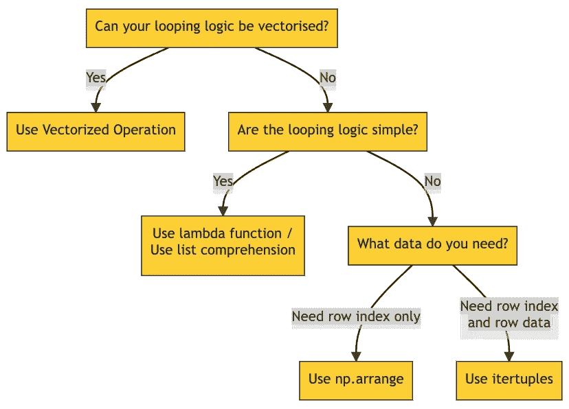
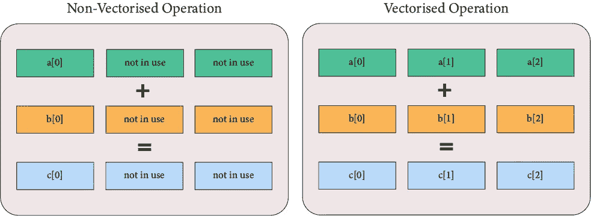

# 加速 Python 循环的艺术

> 原文：<https://towardsdatascience.com/the-art-of-speeding-up-python-loop-4970715717c>

## Python 中没有“最好的”循环技术，只有最合适的


[图片](https://unsplash.com/photos/HUJDz6CJEaM)来自[克里斯·利维拉尼](https://unsplash.com/@chrisliverani?utm_source=unsplash&utm_medium=referral&utm_content=creditCopyText)来自 [Unsplash](https://unsplash.com/?utm_source=unsplash&utm_medium=referral&utm_content=creditCopyText) 。

" Python 中最快的循环技术是什么？"

这是一个合理的问题，但往往过于简单化。如果有一种循环方法比其他方法更好，那么其他的技术就会被弃用。

事实是，没有“最好”。

正如生活中的大多数事情一样，会有这样的情况，其中一个明显优于其他人，而在其他一些情况下，这绝对是垃圾。它们视情况而定。用 Python 思考循环优化的更好方式应该是这样的。



对您的用例来说，最佳的循环技术取决于一系列的决策。图片由作者提供。

它们中的每一个都有其自身的用处。我不想再写另一篇速度测试文章，我想强调是什么使它们独一无二，何时使用它们，以及如何使它们变得更好？你会惊讶地发现，通过一个简单的语法调整，我们可以将它们的性能提高 8000 倍。

循环技术的类型:

*   循环迭代
*   列表理解
*   λ函数
*   矢量化运算

# 循环迭代

*For-loops* 是传授给 Python 初学者的入门级循环技术，因为它们易于阅读且用途广泛。

```
items = ['bat', 'cat', 'dog']
for item in items:
  print(item)**>> bat
>> cat
>> dog**
```

然而，许多人认为 for 循环是高效编程的对立面。它们很慢，因为 Python 的 for 循环实现有非常大的开销(例如:类型检查等——稍后讨论),每次迭代都要执行。

有两种主要类型的 for 循环，即(I)索引循环和(ii)行循环。

## 索引循环

一个索引循环接受一个数字序列(例如:[0，1，2，…])并为序列中的每个元素运行代码逻辑。

在第一次迭代中，Python 在执行循环中的代码之前，将变量`idx`赋给序列的第一个元素(在本例中为 0)。然后，`idx`被重新分配给第二个、第三个……元素，循环重复，直到序列结束。

```
for idx in ['bat', 'cat', 'dog']:
  print(f'Hello, I am index {idx}.')**>> Hello, I am index bat.
>> Hello, I am index cat.
>> Hello, I am index dog.**
```

当我们需要控制序列的起始索引、结束索引和步长时，索引循环非常有用。

例如，如果你想从第 1000 行循环到第 2000 行…

```
res = 0
for idx in range(1000, 2000):
  res += df.loc[idx, 'int']
```

如果你只需要第 1000 到 2000 行的第 5 个元素…

```
res = 0
for idx in range(1000, 2000, 5):
  res += df.loc[idx, 'int']
```

索引循环非常灵活，但是它们通常被认为是缓慢的循环技术。虽然在某种程度上是真的，但也不尽然！出于基准测试的目的，这里有一个简单的循环，它返回`int`列的总和。

```
%%timeit
res = 0
for idx in range(0, 100000):
  res += df.loc[idx, 'int']**>> 486 ms ± 4.28 ms per loop (mean ± std. dev. of 7 runs, 1 loop each)**
```

我们可以实现相同的功能，但通过一个简单的优化技巧— `np.arange()`可以获得更好的性能。

```
%%timeit
res = 0
for idx in np.arange(0, 100000):
  res += df.loc[idx, 'int']**>> 60.3 µs ± 355 ns per loop (mean ± std. dev. of 7 runs, 10000 loops each)**
```

同样的代码，但是`np.arange()`比`range()`快 8000 倍**。**

原因如下。

`range()`是一个内置的 Python 类范围，仅存储所需数字序列的起点、终点和步长。只有当我们开始遍历序列时，数字列表才会在幕后迭代生成。这可以节省内存，因为我们不需要一直存储整个序列，但由于生成数字的开销，这会影响性能。

`np.arange()`则是第三方库(Numpy)功能。在功能上，它们类似于`range()`，但是 NumPy 实现在 C 级上执行许多操作，包括循环，这比 Python 的性能好得多。它们针对使用向量进行了优化，避免了很多与 Python 相关的开销。

> 由于`range()`和`np.arange()`做的是同样的事情，我推荐在需要索引循环的时候总是使用`np.arange()`。

## 行循环

行循环遍历熊猫数据帧的行—第 1 行、第 2 行、…、第 n 行。每次迭代时，它返回特定迭代的**行索引**和**行数据**。行循环最常见的实现是`DataFrame.iterrows()`函数。

```
for idx, row in df.iterrows():
  print(f'row_idx: {idx}, row_data: {row}')**>> row_idx: 0, row_data:
animal             bat
animal_type        mammals
Name: 0, dtype: object****>> row_idx: 1, row_data: 
animal             dog
animal_type        mammals
Name: 1, dtype: object****>> ...**
```

由于行循环返回行索引*和*行数据，这给了我们额外的能力——重命名行数据的能力。根据上面的例子，我们可以将行数据放入一个`row`变量中，并通过`row['col_name']`访问它。

代替我们通常在索引循环中使用的`df.loc[idx, 'col_name']`,现在代码看起来，嗯，可能更简洁一点。但是真正的改进是在我们解包并重命名每个单独的列时开始的，就像这样…

```
# Better
res = 0
for idx, row in df.iterrows():
  res += row['col3']# Even better
%%timeit
res = 0
for idx, (col1, col2, col3) in df.iterrows():
  res += col3**>> 4.86 s ± 28.4 ms per loop (mean ± std. dev. of 7 runs, 1 loop each)**
```

干净多了，对吧？

然而，就性能而言，行循环落后于索引循环。我们执行相同的逻辑，但是…

*   `np.arange()`耗时 0.0000603 秒。
*   `range()`跑了 0.486 秒。
*   `DataFrame.iterrows()`跑了 4.86 秒。

好消息是——就像 Index Loop 一样——我们可以通过简单的改变来优化它。用`itertuples()`代替`iterrows()`。

```
%%timeit
res = 0
for row in df.itertuples():
  res += getattr(row, 'int')**>> 160 ms ± 13.4 ms per loop (mean ± std. dev. of 7 runs, 10 loops each)**
```

从表面上看，`itertuples()`比`iterrows()`快 **30x** 。但是为什么呢？`iterrows()`和`itertuples()`有什么区别？

对于好奇的灵魂，这里有一篇很棒的[文章](https://medium.com/swlh/why-pandas-itertuples-is-faster-than-iterrows-and-how-to-make-it-even-faster-bc50c0edd30d)详细解释了它。TLDR 版本…

*   `iterrows()`返回`Series`对象中的行数据。它不保留数据类型，所以在循环时必须执行大量的类型检查。更多的检查=更慢的循环。
*   `itertuples()`返回`tuple`中的行数据。它保留了数据类型，因此只需要最少的类型检查。更少的检查=更快的循环，快得多。在我们的例子中，`itertuples()`比 **~30 倍于**。

> 如果我们需要访问行数据，最好使用行循环而不是索引循环。此外，优先考虑`itertuples()`而不是`iterrows()`，因为它要快得多。

# 列表理解

Python List Comprehension 是基于现有列表的值创建一个`list`对象的一种简单而巧妙的方法。它有下面的一般表达式。

```
List = [expression(i) for i in another_list if filter(i)]
```

所以，不要…

```
%%timeit
for (idx, animal, animal_type, _) in df.itertuples():
    if animal == 'dog':
        animal_type = 'mammals'
    elif animal == 'frog':
        animal_type = 'amphibians'
    elif animal == 'goldfish':
        animal_type = 'fish'
    else:
        animal_type = 'others'df.loc[idx, 'animal_type'] = animal_type**>> 1min 41s ± 393 ms per loop (mean ± std. dev. of 7 runs, 1 loop each)**
```

我们可以把这些废话浓缩成几行代码。

```
%%timeit
df['animal_type'] = ['mammals' if animal == 'dog' else
                     'amphibians' if animal == 'frog' else
                     'fish' if animal == 'goldfish' else
                     'others' for animal in df['animal']]**>> 16.7 ms ± 92.3 µs per loop (mean ± std. dev. of 7 runs, 100 loops each)**
```

列表理解不仅更紧凑、更容易掌握，而且比普通循环迭代得更快。在这种情况下，列表理解比行循环快 6048 倍！

可悲的是，有一个限制。

请注意，我没有使用与其他部分相同的示例(我们根据`int`列的总和进行性能基准测试)？

我不能。

List comprehension 的语法很简单，但是保持简单的意图也限制了它能做什么。例如，我们不能有一个变量在迭代时存储当前值的总和。即使我尝试了一种类似黑客的方式，在一个列表理解范围之外的函数中指定`current_sum`，它仍然使用初始值`current_sum`，而不是在每次迭代时更新。

```
old_list = [10, 20, 30, 40, 50]
print(f'old_list is... {old_list}')current_sum = 0
def get_cumulative_sum(x, current_sum):
    current_sum += x
    return current_sumnew_list = [get_cumulative_sum(x, current_sum) for x in old_list]
print(f'new_list is... {new_list}')**>> old_list is... [10, 20, 30, 40, 50]
>> new_list is... [10, 20, 30, 40, 50]**
```

总的来说，每个列表理解都可以在 for 循环中重写，但不是每个 for 循环都可以在列表理解中重写。如果你正在写一些复杂的逻辑，避免列表理解。

> 总而言之，列表理解只是迭代的语法糖。它通常比普通的循环要快，但是应该只用于简单的代码逻辑以保持可读性。

# λ函数

在 Python 中定义函数时(通常的方式)，我们需要给函数命名。Lambda 是另一种方法，它允许我们创建函数，但是没有名字。

```
# The usual way
def multiply_two(x):
  return x * 2# Lambda function
multiply_two = lambda x: x * 2
```

这种类型的“无名”函数被称为立即调用函数表达式(IIFE)。它们一创建就被执行，不需要显式调用来调用函数。

用外行人的话来说，生命跑得更快。

但是 Lambda only *创建*生命函数，它不执行函数——这就是为什么我们通常看到 Lambda 函数与 Panda 的`DataFrame.apply()`一起使用。它将一个函数(lambda 或 not)作为参数，并将其应用于每一行(或每一列)。

```
# Apply the function to each column.
output = df.apply(lambda x: x*2, axis=0)# Apply the function to each row.
output = df.apply(lambda x: x*2, axis=1)
```

但是这些功能到底有多快呢？让我们比较一下列表理解和 lambda 函数。

```
%%timeit
def get_type(animal):
    if animal == 'dog':
        animal_type = 'mammals'
    elif animal == 'frog':
        animal_type = 'amphibians'
    elif animal == 'goldfish':
        animal_type = 'fish'
    else:
        animal_type = 'others'
    return animal_type# List comprehension
df['animal_type'] = [get_type(x) for x in df['animal']]
**>> 21.7 ms ± 140 µs per loop (mean ± std. dev. of 7 runs, 10 loops each)**# Lambda function
df['animal_type'] = df['animal'].apply(lambda x: get_type(x))
**>> 24.6 ms ± 187 µs per loop (mean ± std. dev. of 7 runs, 10 loops each)**
```

虽然列表理解和 lambda 函数是根本不同的概念，但它们有非常相似的特征…

*   性能—相同。
*   灵活性——两者都更适合简单的代码逻辑。我们不能创建跟踪先前迭代输出的变量。

> 总结一下，lambda 函数和列表理解是 po-tae-toe 和 po-tah-toh。使用您更喜欢的语法。就我个人而言，我更喜欢列表理解，因为它们读起来更直观。

# 矢量化运算

矢量化操作就像搬房子。你宁愿…

*   装载一件家具，开到你的新家，卸下，然后重复？
*   把所有东西都装上，开到你的新家，一次卸完？

后者肯定更有效，它非常类似于矢量化运算的工作方式。

在非矢量化操作中，CPU 将单个值加载到内存中，执行计算，然后返回一个输出。它在每次循环迭代中重复这个步骤。但更有意思的是，CPU 的内存可以存储不止一个值——这意味着大部分 CPU 容量都处于闲置状态。

在向量化操作中，CPU 尽可能多地加载内存，这样我们就可以一次完成计算*。开销的节省有助于大幅提高性能。*

**

*非向量化操作不会最大限度地利用 CPU 资源。图片由作者提供。*

*除了最大化 CPU 容量之外，矢量化运算还经常在用低级语言(例如:C)编写的优化的预编译代码中实现。这些语言本质上比 Python 更具性能，而且它们还避免了数据类型检查等开销。*

*理论已经足够了——这里有一个简单的矢量化操作。*

```
*# Non-vectorised operation
def calc_result(row):
    return row['col1'] +(row['col2'] * row['col3'])
df['result'] = df.apply(calc_result, axis=1)
**>> 984 ms ± 16.3 ms per loop (mean ± std. dev. of 7 runs, 1 loop each)**# Vectorised operation
df['result'] = df['col1'] + (df['col2'] * df['col3'])
**>> 227 µs ± 1.39 µs per loop (mean ± std. dev. of 7 runs, 1000 loops each)***
```

*矢量化运算的执行速度比非矢量化运算快**到 4350 倍**。代码很直观，读起来也更清晰。*

*除了对数字执行数学运算，矢量化运算还可以执行非计算运算，对其他数据类型也是如此。Jake VanderPlas 在他的 Python 数据科学手册中分享了一个关于可能的字符串类型矢量化操作的[好参考](https://jakevdp.github.io/PythonDataScienceHandbook/03.10-working-with-strings.html)。*

```
*# Two examples of Vectorised Operation for String-type
df['result'] = df['String'].str.extract('([A-Za-z]+)', expand=**False**)
df['result'] = df['String'].str.split('T').str[0]# Two examples of Vectorised Operation for DateTime-type
df['result'] = df['Date'].dt.day_name()
df['result'] = df['Date'].dt.year*
```

*但是，矢量化运算同时加载和运行所有内容这一事实也意味着它只能对每个输入值执行相同的运算。如果我们想将一列除以 2，它必须将该列中的所有值除以 2，没有例外。*

> *换句话说，矢量化运算是最快的迭代方式之一，并且具有最简洁的语法。它们非常适合对整个数据序列应用简单统一的操作。但是如果我们试图应用条件逻辑(例如；if-then)，请改用 Lambda 函数或 List Comprehension。*

# *结束语*

*我希望这能帮助你看到每种循环技术的优点和局限性。“最佳”循环技术总是依赖于您正在实现的逻辑类型。*

*最后一点，这个比较并不详尽。为了简单起见，故意省略了一些小细节。这里的信息*通常*是正确的，但是对于不同的用例，你可能会遇到稍微不同的性能(例如:在字符串上矢量化的操作比较慢)。我建议你自己对循环计时，如果你真的想榨出优化的汁液，就使用[线条分析器](https://stackoverflow.com/questions/23885147/how-do-i-use-line-profiler-from-robert-kern)。*

*在那之前，祝你好运和成功。*