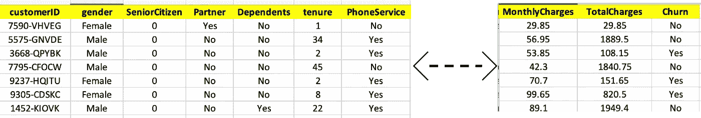
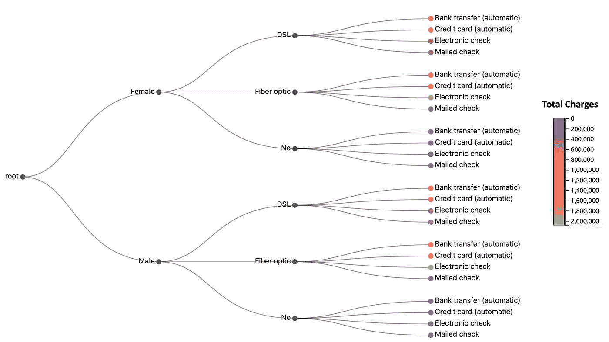
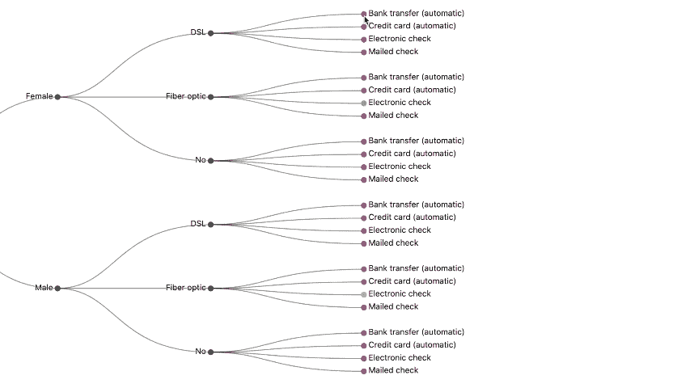
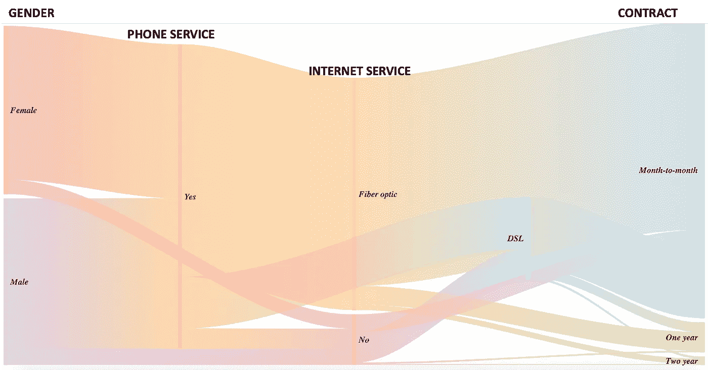
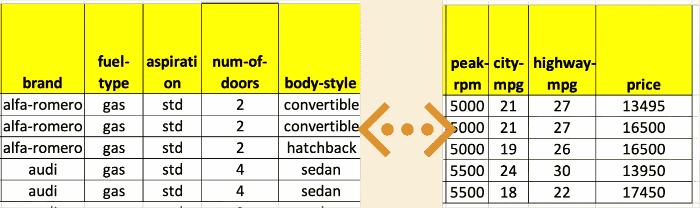
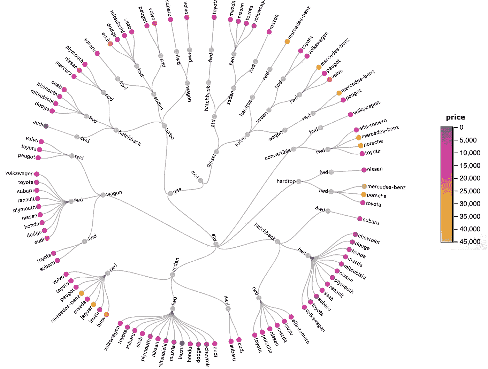

# 层级可视化的强大力量

> 原文：<https://towardsdatascience.com/the-awesome-power-of-hierarchy-visualizations-466274d16e8>

## 通过将数据视为一个层次结构，将您的数据分析和可视化提升到一个新的水平

叶夫根尼娅·利托夫琴科在 [Unsplash](https://unsplash.com/s/photos/power?utm_source=unsplash&utm_medium=referral&utm_content=creditCopyText) 上的照片

*注意:上图的灵感来自于一个径向树图(显示在文章末尾)*

我们习惯于用表格的方式查看数据。例如，我们看到的大部分数据都在数据库表格或表格应用程序中，如 Excel 或 Google sheet。

但是，以层次结构的形式查看数据对理解数据有很大帮助。此外，大多数数据都有某种层次模式。因此，对数据进行层次可视化有助于将数据转化为强大的洞察力。

在一些数据中，等级是明显的。以销售数据为例，该数据包含区域、国家、城市、销售额等字段。层级非常明显，区域→国家→城市→销售。

然而，让我们从一家电信公司获取一个客户数据集。该数据集包含人口统计信息、服务、账单信息以及客户是否有过交易。

电信客户流失数据集(图片由作者提供)

注意:数据集引用在文章的结尾

在这个数据集中，层次不是很明显。我们倾向于将其视为“平面数据”,我们所有的分析都是在这种“平面数据”假设下完成的。然而，从层次的角度思考可以让你的数据分析和可视化更上一层楼。让我告诉你怎么做。

# 从枯燥的视觉效果转移到高级层次可视化

层次可视化是最先进的和令人惊叹的视觉效果之一。它们还有助于将数据转化为有力的见解。在上面显示的电信数据集中，您可以将性别→互联网服务→支付方式→总费用视为一个层级。

这里有一些高级层次可视化，看起来不错，也给你强大的洞察力。下面显示的是一个**树状图**，这是一种可视化层次数据的自然方式。

树状图可视化(图片由作者提供)

与条形图等标准可视化相比，树状图在视觉上非常吸引人。此外，它提供了非常强大的洞察力。例如，我们可以观察到，与其他服务相比，光纤服务收费较高。

您还可以添加悬停效果，如下所示。这对于数据叙事非常有用。

具有悬停效果的树状图(图片由作者提供)

# 提高您的数据探索效率

假设我们想要开发一个机器学习模型来预测电信数据集中的流失。机器学习中的一个重要步骤是进行数据探索，以了解哪些特征是相关的。

通常的方法是制作输入特征相对于目标变量(流失)的直方图、条形图或散点图。然而，使用这种方法，您拥有的输入功能越多，您将需要更多的可视化。该方法可能会因为大量的特征而变得复杂。

> 层级可视化具有在一个画面中同时显示多个特征的能力。这是非常强大的，因为您可以提高您的数据探索生产力。

Sankey 图是一个非常强大的层次可视化工具。它可用于同时显示多个特征。下图显示了电信数据集中各种功能的 Sankey 图。

Sankey 的不同级别对应于层级性别→电话服务→互联网服务→合同。层级之间的“流”的厚度是基于流失的。

桑基图(图片由作者提供)

我们可以观察流的厚度，以得出哪些特征与预测流失相关的结论。女性和男性的性别层次的厚度是相似的。这意味着女性搅拌者和男性搅拌者数量相等。这意味着性别特征与机器学习模型无关。

另一方面，特征合约具有不同的厚度，逐月、一年、两年。这意味着大多数买家都是签有短期合同的客户。所以契约是机器学习模型的一个重要特征。特色互联网服务也是如此。

正如您所观察到的，我们只需要一个单一的可视化来进行一些非常强大的数据探索。提高生产力的好方法！

# 以优雅的方式查看大量数据

大多数可视化显示部分数据。然而，层次可视化能够以非常优雅的方式在单个可视化中向您显示大量数据。

让我用一组汽车数据来说明这一点。这里显示了一个样本数据集。这些数据包括汽车的构造、不同的技术特征，如燃料类型、长度、宽度、车门数量等。以及汽车的价格。

汽车样本数据(图片由作者提供)。

注意:数据集引用可在文章末尾找到

径向树是在单个视图中打包大量数据时非常有效的层次可视化之一。

> 辐射状树的美妙之处在于它是圆形的。因此，它可以有效地利用屏幕上的所有空间来表示大量数据。

径向树(图片由作者提供)

数据集中大约有 100 多个汽车模型。所有这些都优雅而清晰地显示在可视化中。你也可以把一辆车的不同特征看成一个层级。价格信息也根据节点的颜色显示。这是一种将大量信息打包在一个视觉画面中的好方法。

*注:放射树的圆形本质也是文章开头形象的灵感来源*

# 结论

层次可视化有很多用途，从强大的可视化到提高数据科学的生产力。对于任何数据科学家和数据分析师来说，这都是一个很好的补充。

# 额外资源

## 网站(全球资讯网的主机站)

你可以访问我的网站，使层次可视化和其他零编码分析。[**https://experiencedatascience.com**](https://experiencedatascience.com/)

## ****媒体订阅和推荐链接****

**请 [**订阅**](https://pranay-dave9.medium.com/subscribe) 每当我发布一个新的故事时，请保持通知。**

**您也可以通过我的 [**推荐链接**](https://pranay-dave9.medium.com/membership) 加入 Medium**

## **Youtube 频道**

**这是我的 YouTube 频道
[https://www.youtube.com/c/DataScienceDemonstrated](https://www.youtube.com/c/DataScienceDemonstrated)的链接**

# **数据源引用**

## **电信客户数据集**

**数据来自[https://community . IBM . com/community/user/business analytics/blogs/Steven-macko/2019/07/11/telco-customer-churn-1113](https://community.ibm.com/community/user/businessanalytics/blogs/steven-macko/2019/07/11/telco-customer-churn-1113)**

**根据本链接[https://developer . IBM . com/terms/download-of-content-agreement/](https://developer.ibm.com/terms/download-of-content-agreement/)中规定的协议，它可用于商业和非商业用途**

## **汽车数据集**

**数据来自 https://archive.ics.uci.edu/ml/datasets/automobile。**

**Dua d .和 Graff c .(2019 年)。UCI 机器学习知识库[http://archive . ics . UCI . edu/ml]。加州欧文:加州大学信息与计算机科学学院。**