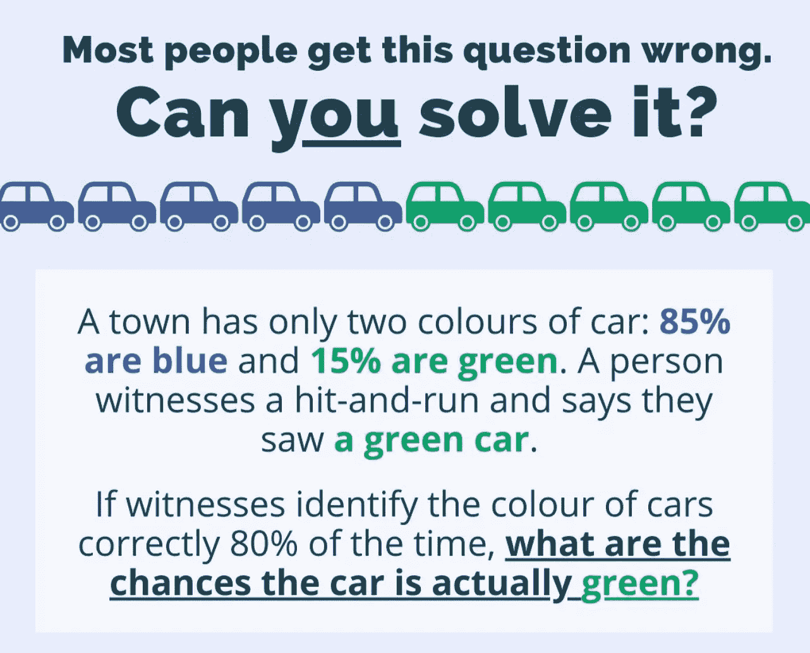
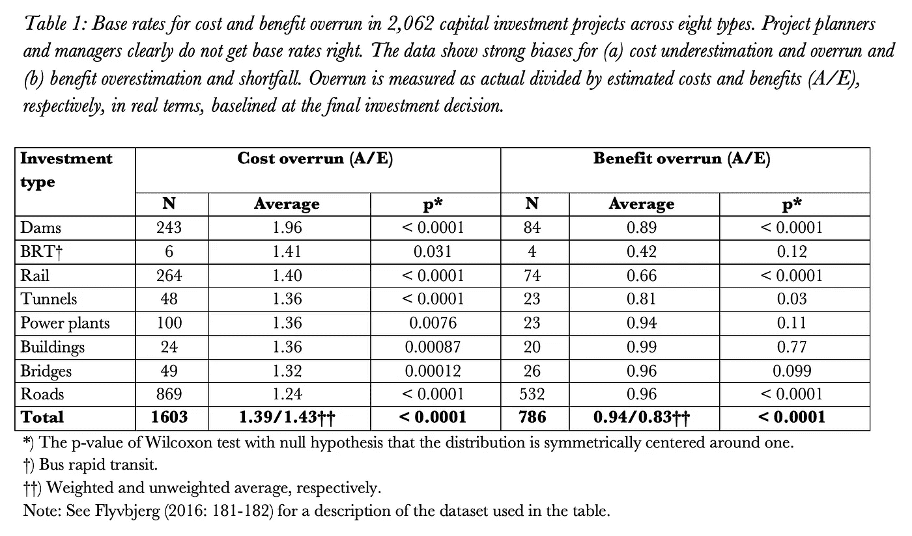

# 基本比率谬误

> 原文：<https://towardsdatascience.com/the-base-rate-fallacy-b94c0a1b9938>

## 开始抑制行为偏差的最简单和最有效的方法是获得正确的基础利率。本文解释了原因和方法。

查看页面底部的正确答案(来源:[维基媒体](https://www.google.com/search?q=base-rate+fallacy+wikimedia&tbm=isch&ved=2ahUKEwiQ8dXumt71AhUPehoKHYZqBUAQ2-cCegQIABAA&oq=base-rate+fallacy+wikimedia&gs_lcp=CgNpbWcQA1DABFi0FGDJGGgAcAB4AIABOIgBtwOSAQE5mAEAoAEBqgELZ3dzLXdpei1pbWfAAQE&sclient=img&ei=1__4YdCpHI_0aYbVlYAE&bih=772&biw=1403#imgrc=kVGlaHoDbywgFM&imgdii=0TpwAQWjOXKc6M)

基本比率谬误是一种忽略基本比率信息(例如人口或样本的平均值)并专注于特定信息(例如与某个案例或少数案例相关的数据)的趋势(Bar-Hillel 1980、Tversky 和 Kahneman 1982)。基础率谬误有时也被称为基础率偏差或基础率忽视。

如果你玩扑克，假设的赔率不同于适用的赔率，那么你就受制于基础利率谬误——很可能会输。客观赔率是基本利率。

> 人们经常认为他们所掌握的信息比实际情况更相关。

人们经常认为他们拥有的信息比实际上更相关，或者他们对他们没有的所有相关信息视而不见。这两种情况都会导致基础利率谬误。

“概率忽略”——sun stein(2002:62–63)创造的一个术语，指的是人们过度关注可能性很小的坏结果，例如恐怖袭击——是基础率谬误的一个特例。

其他偏见助长了基础利率谬误，例如[独特性偏见](https://medium.com/geekculture/uniqueness-bias-what-it-is-how-to-avoid-it-65563f26bf54)，这导致了极端的基础利率忽视，因为手头的案例被认为是独特的，因此其他案例的信息被认为是不相关的。

内部观点、[后见之明偏差、](https://bentflyvbjerg.medium.com/overconfidence-bias-hindsight-bias-availability-bias-fb5e41f23269)可用性偏差、 [WYSIATI 偏差、](https://bentflyvbjerg.medium.com/overconfidence-bias-hindsight-bias-availability-bias-fb5e41f23269)、[过度自信偏差](https://bentflyvbjerg.medium.com/overconfidence-bias-hindsight-bias-availability-bias-fb5e41f23269)和框架偏差也助长了基础利率谬误。

> 当有一个好的，强有力的故事时，基本率的忽视尤其明显。

当有一个好的，强有力的故事时，基本率的忽视尤其明显。大型、不朽的项目通常都有这样的故事，导致对这些项目的额外忽视。

最后，人们——包括专家——低估了方差。因此，在典型项目中，根据以下公式，基本速率忽略与变化忽略相结合:

*基本利率忽略+变异忽略=强凸性*

我们研究的初步结果表明，在决策过程中，变异忽略比基本率忽略受到的关注少，这是很不幸的，因为研究还表明，变异忽略通常比基本率忽略更大，对项目结果的影响甚至更大。

正如项目管理铁律所记载的那样，基本比率谬误在项目规划和管理中泛滥成灾。表 1 显示了项目管理中成本和效益的基本费率的最全面的概述，它基于涵盖八种项目类型的 2，062 个项目的数据。

> 大多数项目都没有得到正确的基础利率——甚至没有接近。

我们看到，大多数项目没有得到正确的基本利率，甚至没有接近，正如在如此高的统计显著性水平上不同于 1(1.0≈正确的基本利率)的平均值所记录的那样(p < 0.0001 ≈ “overwhelmingly high,” in statisticians’ language) it is rarely found in studies of human behavior. The base-rate fallacy is deeply entrenched in project management, the data show. Flyvbjerg and Bester (2021) argue that base-rate neglect results in a new behavioral bias, which we call the “[成本效益谬误](https://papers.ssrn.com/sol3/papers.cfm?abstract_id=3918328))，这通常会破坏项目的成本效益分析，以至于此类分析不可信。

正如 Kahneman (2011: 150)所指出的，“任何在概率评估中忽视基础利率和证据质量的人肯定会犯错误。”在项目管理内外，基本比率谬误的治疗方法是通过采取外部观点来获得正确的基本比率，例如通过[参考类预测](https://papers.ssrn.com/sol3/papers.cfm?abstract_id=2238013)，执行预决策，或进行决策卫生学(Flyvbjerg 2006，Klein 2007，Kahneman 等人 2011，2021:312–324，371–72)。

如果你是一名项目策划人或经理，开始控制工作中的行为偏差的最简单和最有效的方法是为你负责的项目设定正确的基本比率。

> 如果你不了解一个游戏的真实赔率，你就不太可能成功。

希望大多数人能明白，如果你不了解一个游戏的真实赔率，你就不太可能成功。但是这是大多数项目计划者和经理的情况:他们没有得到他们正在玩的游戏的正确几率:项目管理。表 1 毫无疑问地证明了这一点，并为项目管理中的许多重要领域建立了现实的基本费率，规划者可以将其作为正确实施项目的起点。由于篇幅原因，没有包括其他项目类型的数据，但我有数据，它们显示了类似的结果。

………………..

*)有关完整参考资料，请参见 Flyvbjerg，Bent，2021，“项目管理中的十大行为偏差:概述”，*《项目管理杂志》*，第 52 卷，第 6 期，第 531–546 页。免费下载[这里](https://papers.ssrn.com/sol3/papers.cfm?abstract_id=3979164)。

页面顶部测验的正确答案:41%。