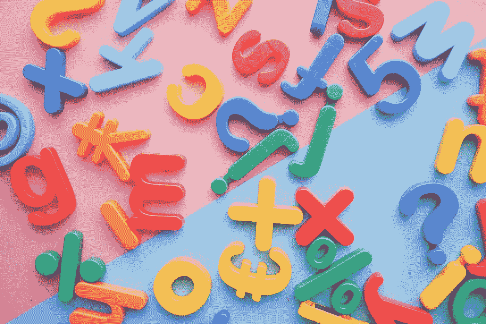
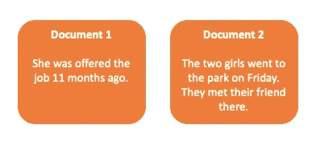
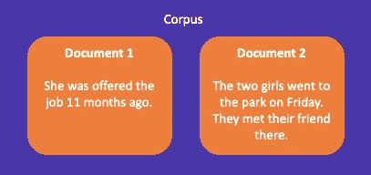
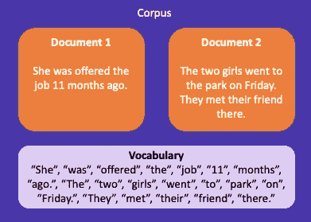

# 自然语言处理基础

> 原文：<https://towardsdatascience.com/the-basics-of-natural-language-processing-25002d093eb9>

## 领域中使用的常用术语和预处理步骤

在 [Unsplash](https://unsplash.com?utm_source=medium&utm_medium=referral) 上由[Towfiqu barb huya](https://unsplash.com/@towfiqu999999?utm_source=medium&utm_medium=referral)拍摄的照片

当我第一次接触自然语言处理的世界时，我被大量的术语所淹没。当我试图学习行话时，我觉得许多网站的解释包含了更多的行话！一旦我最终学会了行话，我就开始了 NLP 中最基本的任务之一——预处理数据。大多数教程以相同的顺序讲述相同的步骤。直到我开始探索我自己的数据，我才意识到我可能只想在某些情况下应用一些步骤。

在本文中，我将介绍

*   *简单英语中 NLP 行话的含义*
*   *常见预处理步骤以及何时使用它们*

# 什么是 NLP

当人类用自然语言交流时，计算机理解一种叫做二进制的机器语言。自然语言处理是计算机理解自然语言(即人们如何交流)的过程。

人们很容易想当然地认为语言有多复杂。在《机器学习的自然语言标注》一书中， Pustejovsky 等。all 描述了语言的九个层次:

1.  **句法** —研究单词如何组合成句子。
2.  **语义** —语言的意义。
3.  **形态学**——研究一个单位的意义。
4.  **音系学**——研究声音模式。
5.  **语音学**——研究人类说话的声音以及它们是如何被感知的。
6.  词汇——对一种语言的单词和短语的研究。
7.  **话语分析**——研究像对话这样的信息交流的意义。
8.  语用学——研究文本的语境如何影响其意义。
9.  文本结构分析——研究文本风格如何组合成更大的作品。

下次你因为 Alexa 不理解你的问题而感到沮丧时，记住她必须尝试处理和理解所有九层！

照片由[耶戈·古格莱塔](https://unsplash.com/@lazargugleta?utm_source=medium&utm_medium=referral)在 [Unsplash](https://unsplash.com?utm_source=medium&utm_medium=referral) 上拍摄

# NLP 行话

当你开始学习自然语言处理时，你可能会觉得这是另一种语言，因为你会看到所有的行话。让我们浏览一下常用术语。

## 代币

标记是自然语言处理中的基本单位，可以看作是一个或多个字符的组合。一个标记可能是字符级的，意味着一个字符代表一个标记，或者是单词级的，意味着一个单词代表一个标记。记号化是将一段文本分解成更小单元(记号)的过程。

我们可以选择修饰一个句子，比如“她在 11 个月前得到了这份工作。”在字或词的层面。如果我们选择字符级，我们的句子将变成下面的列表:

" S "，" h "，" e "，" w "，" a "，" s" …等等。

如果我们选择在单词级别进行标记，我们的句子现在看起来像这样:

“她”、“曾经”、“提供”、“工作”……等等。

## N-grams

我们可以进一步扩展字符和单词级标记化，并将标记组合在一起形成 n 元语法。

这里有一个在单词和字符级别为我们上面的例句创建一元词( *n=1* )、二元词( *n=2* )和三元词( *n=3* )的例子。

**人物级别单字:***【S】【h】【e】【w】【a】【S】*……等等。

**人物层面的二元词:***“Sh”、“他”、“wa”、“as”、“of”、“ff”、“fe”，* …

**词级单字:***“她”、“曾”、“献”、“该”、“职”* …

**词级连词:** *“她被”、“被献”、“被献”* …

**词级三元组:** *“她被录用了”、“被录用了”、“被录用了”…*

## 文件

在自然语言处理中，您会经常听到术语*文档*，这可能会让您想起 Word 文档的图像。虽然这是一个有效的文档示例，但其他一些文档示例包括 tweet、Amazon review 甚至是 blog post。本质上，文档是一组标记。

图 1 —两个文档的示例。图片作者。

## 文集

语料库是文档的集合。我们可能有推特、亚马逊评论或博客文章的语料库。语料库中的文档可以有不同的长度，甚至可以是不同的语言。请注意下面的图 2，文档 1 有一个句子，而文档 2 有两个句子。

图 2 —文档的集合被称为语料库。图片作者。

## 词汇

词汇表是语料库中唯一的标记集。在下面的例子中，我们已经在单词级别对我们的文档进行了标记化，以形成单字。请注意，*、*和*、*被认为是两个不同的标记，尽管它们是同一个单词。这是由于大写字母 *T* 造成的，通常通过将所有文档转换为小写作为初始预处理步骤来纠正。

图 3 —词汇表是语料库中唯一的一组标记。图片作者。

# 预处理步骤

现在我们已经讨论了 NLP 术语，让我们来讨论如何为计算机更好地理解文本做准备。预处理的目的是规范化和清理文本数据。大多数文本数据都有一套标准的预处理步骤，但是这些步骤的应用没有一定的顺序。事实上，根据您的用例，您甚至可以选择排除一些步骤。

## 小写字母

虽然人类很容易理解" *It"* 和" *it"* 是同一个词，但计算机却不理解。为了不影响字数，将文本数据小写通常是很重要的。然而，也有让数据保持原始形式的用例。假设你正在分析情绪(一段文字是积极的，消极的，等等。)并希望对所有大写字母的单词给予更多权重，因为此人可能更有激情。如果您将文本小写，您可能会丢失有关文本语气的信息。

## 删除标点符号

类似于我们之前的例子，计算机无法理解" *It* "和" *it* "是同一个单词，计算机也无法理解" *it、*"、" *it "。*“，还有“*它！*“是同一个词。从文本中删除标点符号的目的是为了准确计算字数而将其规范化。像大写字母一样，标点符号也可以传达语气。当写作更有激情时，你可以保留一些标点符号，比如感叹号。

## 删除号码

我们通常从文本中删除数字，因为它们对理解文本的意义没有多大价值。但是，例如，如果您需要知道文档中引用的年份，您可以选择保留数字。

## 删除停用词

停用词是常见的词，如“*”、“*it”*、“*is*”等。它们通常不会帮助我们理解文章的意思，因为它们太普通了。停用词几乎总是从文本中删除，但是如果您的数据包含类似“ *IT* ”的缩写(可能代表“*信息技术”)，您可以保留它们，或者删除它们的一个较小的子集。*小写*【IT】*改为*【IT】，*为停用词，被删除。在这个例子中，你会丢失文本中的重要信息。*

## *标记化*

*记号化是将文本分成更小单元(记号)的过程。我们可以通过分析记号序列来解释文章的意思。标记化最终允许我们将文档表示为一个向量。根据我的经验，这是一个预处理步骤，你*总是*应用于你的数据。*

## *词干化或词汇化*

*虽然人类可以理解*【研究】【学习】**【学习】*都是指*去学习*，但计算机却将它们视为不同的单词。有两种技术可以帮助将这三个单词组合在一起:词干化和词汇化。词干化去除了一个单词的后缀，而词干化则将其还原为词根形式。*

*虽然词干化通常比词汇化在计算上更快，但词汇化通常更易于人工分析。如果我们对*“麻烦”、“困扰”、“T9”和*“困扰”、“进行词干分析，我们会得到一个词根形式的*“troubl”*，这对人类来说可能不太可读。虽然词汇化通常可读性更强，但它也会改变单词的意思。比如*“好”“更好”**“最好”*都可能被词条化为“*好*”。在情感分析上下文中，*“更好”*和*“最好”*比*“好”具有更强的情感。****

# 概述

在本文中，我们介绍了 NLP 的基础知识，包括使用的术语和常见的预处理步骤。标准的预处理步骤包括小写、删除标点、删除数字、删除停用词、标记化以及词干化或词条化。批判性地思考您的数据和您正在使用的预处理步骤非常重要，因为这可能会导致您丢失关于文本数据的信息。

如果你喜欢这篇文章，我们也在 Skillshare 上教授数据科学课程。我们涵盖了本文中讨论的概念以及更高级的主题，如命名实体识别。你可以使用我们的推荐链接[这里](https://skl.sh/3x4lDnu)获得 Skillshare 的免费试用。

# 参考

1.  普斯特约夫斯基等人。all，机器学习的自然语言标注(2012)，[https://www . oreilly . com/library/view/building-Machine-Learning/9781492045106/](https://www.oreilly.com/library/view/natural-language-annotation/9781449332693/)
2.  [https://www . skillshare . com/classes/Natural-Language-Processing-with-Python/18583602](https://www.skillshare.com/classes/Natural-Language-Processing-with-Python/18583602)