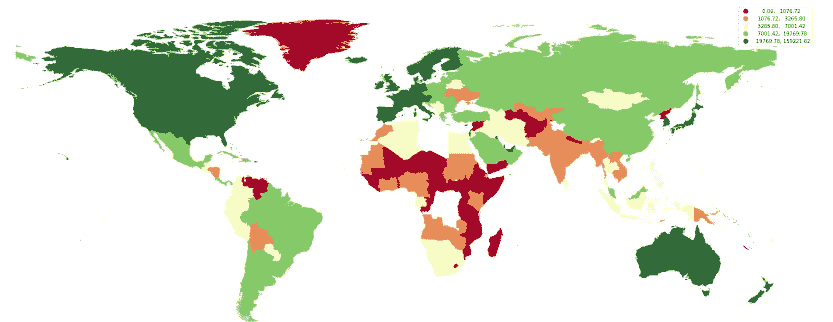
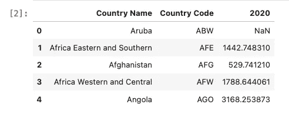
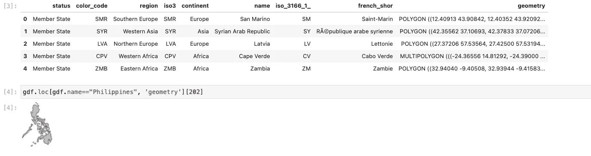
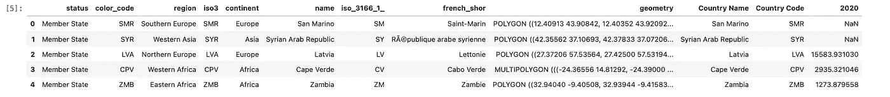
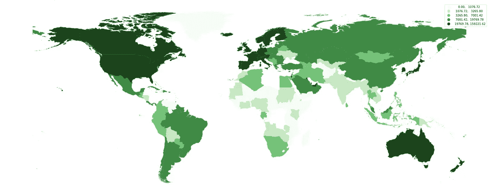
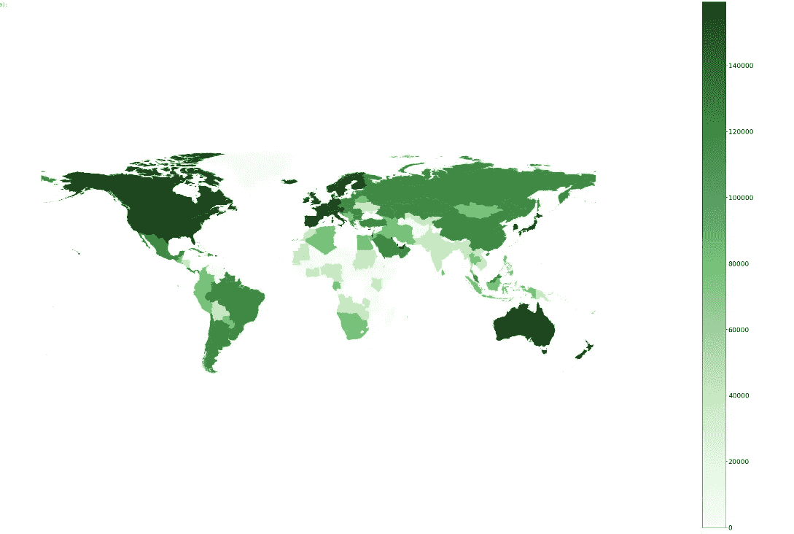
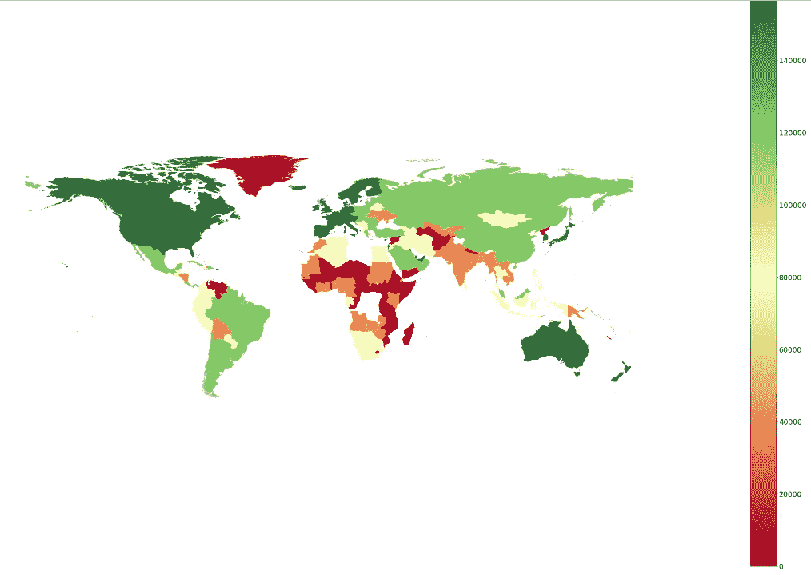
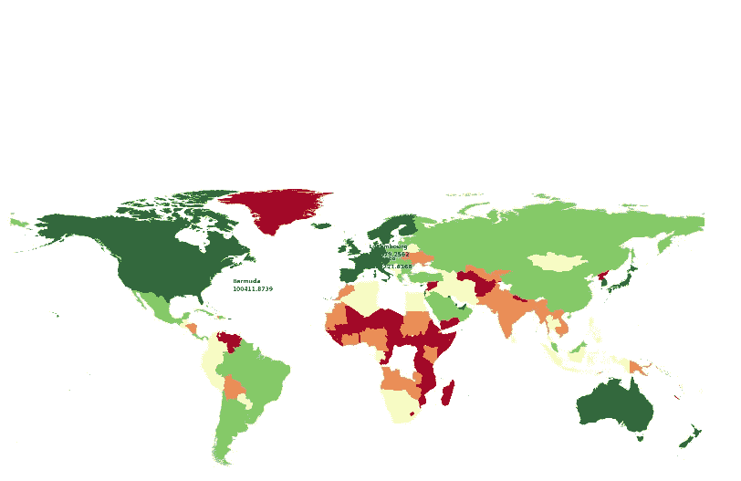

# 乔洛普勒斯之战——第一部分

> 原文：<https://towardsdatascience.com/the-battle-of-choropleths-part-1-e6102e62eea>

## PYTHON。数据科学。地理可视化

## 使用 Geopandas 创造惊人的 Choropleths



图片由作者提供:带有发散色图的 Choropleth

到目前为止，在我们的文章系列中，我们一直在讨论如何创建交互式 geoplots，我们已经讨论了七(7)个选项，涵盖了一系列工具，用户可以根据首选的易用性和可定制性来使用这些工具。

与 geoscatterplots 相比，choropleths 的选项较少，因此对于我们的文章系列，我们将包括甚至非交互式的选项。

对于这一部分，让我们用现有的最基本的方法来尝试一下:Geopandas。

# CHOROPLETHS

首先，Choropleth(有时称为*颜色主题*)是一个**主题地图，它使用色阶(颜色强度)来表示一个区域的值**。我们使用区域这个术语是因为它通常对应于一个行政位置(城市、省和国家)。

因此，创建 choropleth 贴图需要存在**shape file**。

颜色越强烈(在色阶光谱的右边)，代表一个区域的值越大。例如，对于像“绿色”这样的连续色标/色彩映射表，绿色的暗色调代表更大的值。


来自 Matplotlib。（同 organic）有机

那么，什么时候你更喜欢使用 choropleths 而不是 geoscatterplot？

当您的目标是**比较地区间的合计值**时，将使用 Choropleths。这可能是某些值或统计数据的平均值、中值、最小值或最大值。另一方面，geoscatterplot 表示**单个观测值的**离散度，而不是集合。****

**如果使用了图例，它可以用来比较单个观察值(就像我们在咖啡店的例子)。**

**让我们试着做一个各国人均 GDP 的分布图，使用分布图的好处是，我们可以立即看到人均 GDP 较高的国家是否表现出地理位置的接近性。**

**现在让我们继续编码。**

# **预赛**

## **数据的加载和预处理**

**对于我们的数据集，我们将使用来自[世界银行数据库](https://databank.worldbank.org/source/world-development-indicators) k 的人均 GDP 数据集(2015 年定值美元)。**

## **包装**

**要安装和使用的最重要的包是 geopandas。根据我的经验，在 Macbook 上安装这个很容易，但在 Windows 上有点困难。在这种情况下，我准备了[一篇文章](/geopandas-installation-the-easy-way-for-windows-31a666b3610f)也许能帮到你。**

**出于我们的目的，我们同样需要安装`pyproj`和`mapclassify`。**

```
import pandas as pd
import numpy as np
import matplotlib.pyplot as plt
import matplotlib.colors as colorsimport geopandas as gpd%matplotlib inline
```

## **正在加载 SHAPEFILES**

**对于这个系列中几乎所有的 choropleth，我们将需要我们要制作 choropleth 的区域的 shapefiles。Shapefiles 提供了一个位置的行政边界，可以详细到一个省、城市或一些定制的区域。**

**由于我们需要绘制的信息是针对国家的，因此我们将使用带有国家级几何图形的世界形状文件。**

**Shapefiles 可以从 [GADM](https://gadm.org/data.html) 下载。**

# **编码**

```
### LOAD GDP PER CAPITA DATA
df = pd.read_csv('data/gdp_per_capita.csv', 
            skiprows=4)
df = df.loc[:,['Country Name','Country Code', '2020']] #Choose only 2020
df.head()
```

****

**图片由作者提供:数据集的前五个系列**

```
### LOAD THE SHAPEFILES
gdf = gpd.read_file('shapefiles/world-administrative-boundaries/world-administrative-boundaries.shp')
gdf.head()
```

****

**作者图片:世界的形状文件。额外收获:你可以通过调用一个位置的几何数据来查看它的几何形状**

```
### MERGE DATA
merged = gdf.merge(df, left_on='name', right_on='Country Name' )
merged.head()
```

****

**图片由作者提供:Shapefiles 和人均 GDP 的合并数据框架**

> **重要提示:并非所有国家/地区的名称都与 shapefiles 的名称相同，因此同步这些名称非常重要**

```
### PLOTcmap = 'Greens'#Create A Figure to Attach Other Objects Later
fig, ax = plt.subplots(figsize = (30,25))merged.plot(column="2020",
            ax=ax,
                 cmap=cmap, 
#                      k=colors,
                 scheme='quantiles',
                 legend=True)ax.axis('off')
```

**关于我们的准则的一些事情:**

*   **cmap —色彩映射表。**
*   **fig，ax——如果我们希望创建一个颜色条(*是我们用于颜色图*的图例),这一部分很重要**
*   **scheme —上面的 scheme 参数要求我们安装`mapclassify`。这有助于我们更好地分配颜色地图，而不是手动决定地图将使用的颜色数量。在大多数情况下，这是有帮助的，因为太多的颜色可能难以处理。**
*   **`ax.axis(‘off’)`-这是用于移除与地理编码相对应的 x 轴和 y 轴的代码。**

****

**作者图片**

# **用户化**

**为了进一步改善我们的地图，我们可以:**

*   **添加颜色条**
*   **选择不同的配色方案**
*   **为人均收入超过 100，000 美元的人添加文字**

## **彩条**

**颜色条是帮助确定与颜色或颜色阴影相关的可能值范围的图例。**

```
# create the colorbar
norm = colors.Normalize(vmin=merged['2020'].min(), vmax=merged['2020'].max())
cbar = plt.cm.ScalarMappable(norm=norm, cmap='Greens')
```

**请注意，上面的代码实现了来自`2020`的 colorbar，这是我们用来给地图添加颜色的列。**

```
cax = fig.add_axes([1, 0.1, 0.03, 0.8])
cbr = fig.colorbar(cbar, cax=cax,)#Remove the legend
ax.get_legend().remove()#Change the tick for the colorbar
cax.tick_params(labelsize=18)fig
```

****

**图片由作者提供:添加了颜色条**

## **发散的彩色地图**

**为了真正显示对比，发散色图是首选。在这种情况下，让我们试试`RdYlGn`:**

```
#Try a diverging colormap
cmap = 'RdYlGn'#Create A Figure to Attach Other Objects Later
fig, ax = plt.subplots(figsize = (30,25))merged.plot(column="2020",
            ax=ax,
                 cmap=cmap, 
#                      k=colors,
                 scheme='quantiles',
                 legend=True)# ax.legend(loc="best")ax.axis('off')# create the colorbar
norm = colors.Normalize(vmin=merged['2020'].min(), vmax=merged['2020'].max())
cbar = plt.cm.ScalarMappable(norm=norm, cmap=cmap)cax = fig.add_axes([1, 0.1, 0.03, 0.8])
cbr = fig.colorbar(cbar, cax=cax,)#Remove the legend
ax.get_legend().remove()#Change the tick for the colorbar
cax.tick_params(labelsize=18)fig
```

****

**作者图片:发散色图**

## **在上述人均 10 万美元的基础上增加文字**

**与其他定制相比，这种定制不容易美化，但是为了那些想要它的人，让我们继续将它放在这里。**

**要添加文本，我们需要将它放在几何图形的中心(或质心)。这样做的问题是一些几何图形比其他的小，因此不容易调整文本的大小。**

```
for ind, row in merged.iterrows():
    if merged.loc[ind,'2020']>100000:
        ax.text(row["geometry"].centroid.x,row["geometry"].centroid.y+4, row["name"], fontsize=12, color='blue',weight="bold")
        ax.text(row["geometry"].centroid.x,row["geometry"].centroid.y, row["2020"],
                fontsize=12, color='blue', weight='bold')fig
```

****

**作者提供的图片:带有蓝色文本的地图，显示人均 GDP 超过 10 万美元的国家**

# **结束语**

**正如我们所看到的，choropleth 确实回答了我们最初的问题:人均 GDP 水平确实聚集在一起，我们看到富裕国家彼此接近，而贫穷国家也是如此(就人均 GDP 而言)。**

**好消息是，对于我们将测试的后续包，将使用我们这里已经有的基本代码，因为它们中的大多数需要 shapefiles(或 geopandas dataframe)。**

**我的 [Github 页面](https://github.com/francisadrianviernes/GeoVisualization/blob/master/The%20Battle%20of%20Choropleths%E2%80%8A-%E2%80%8APart%C2%A01.ipynb)上的全部代码。**

# **其他相关文章**

## **[交互式地理可视化之战第一部分——使用一条线的交互式 geo plot……](/the-battle-of-interactive-geographic-visualization-part-1-interactive-geoplot-using-one-line-of-8214e9ed1bb4?source=your_stories_page-------------------------------------)**

## **[交互式地理可视化之战第二部分——使用一条线的交互式 geo plot…](/the-battle-of-interactive-geographic-visualization-part-2-interactive-geoplot-using-one-line-of-2118af59a77c?source=your_stories_page-------------------------------------)**

## **[交互式地理可视化之战第三部分——Plotly 图形对象(Go)](/the-battle-of-interactive-geographic-visualization-part-3-plotly-graph-objects-go-c3d3f2a00132?source=your_stories_page-------------------------------------)**

## **[交互式地理可视化之战第四部分——牛郎星](/the-battle-of-interactive-geographic-visualization-part-4-altair-5b67e3e5e29e?source=your_stories_page-------------------------------------)**

## **[交互式地理可视化之战第五部分——叶子](/the-battle-of-interactive-geographic-visualization-part-5-folium-cc2213d29a7?source=your_stories_page-------------------------------------)**

## **[交互式地理可视化之战第六集— Greppo](/the-battle-of-interactive-geographic-visualization-part-6-greppo-4f615a1dae43?source=your_stories_page-------------------------------------)**

## **[交互式地理可视化之战第七集——散景](/the-battle-of-interactive-geographic-visualization-part-7-bokeh-57e40e159354?source=your_stories_page-------------------------------------)**