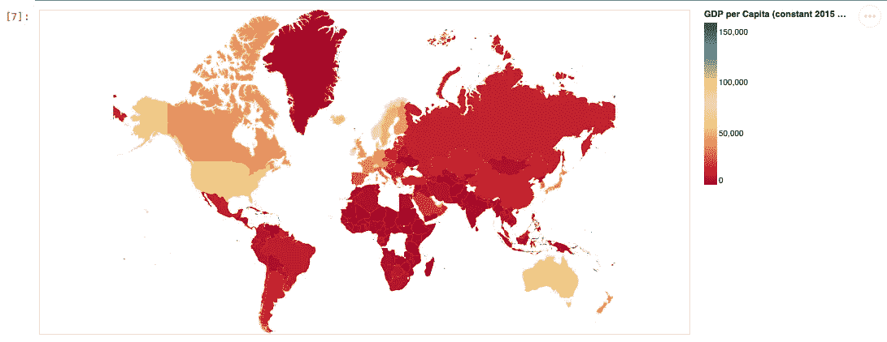
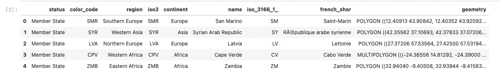
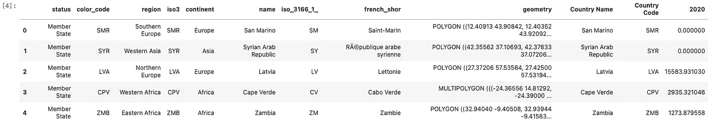
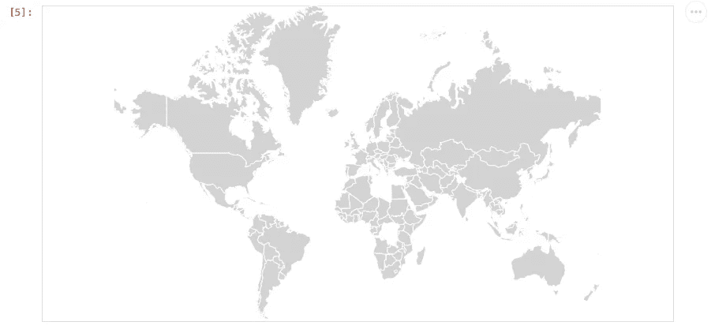
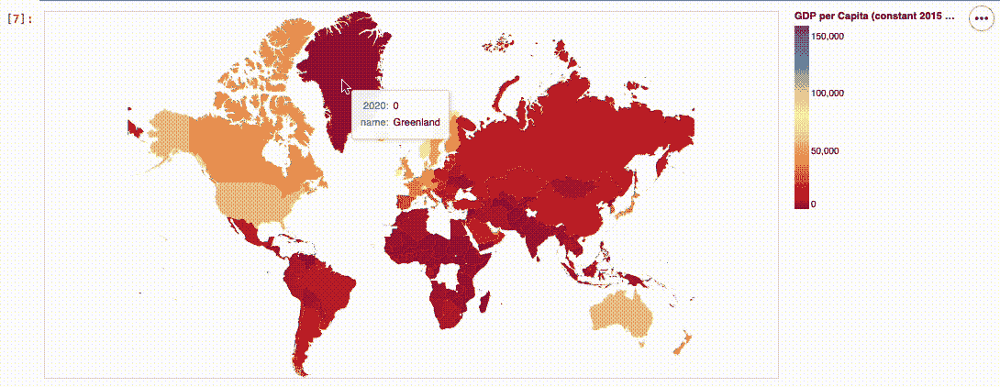
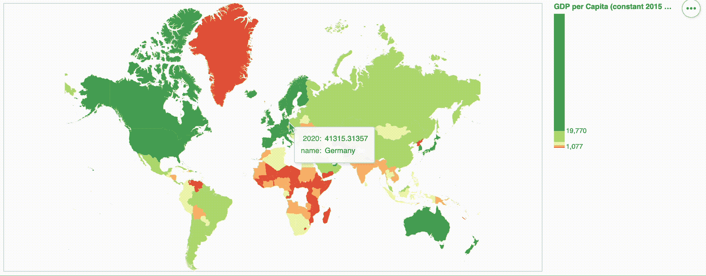

# 乔洛普勒斯之战——第二部分——牛郎星

> 原文：<https://towardsdatascience.com/the-battle-of-choropleths-part-2-altair-accaa4b46fb4>

## PYTHON。数据科学。地理可视化

## 使用牛郎星创造惊人的合唱团



图片由作者提供:初始 Choropleth

# 牵牛星

我们在本文中首次使用了 Altair 包:[交互式地理可视化之战第 4 部分— Altair](/the-battle-of-interactive-geographic-visualization-part-4-altair-5b67e3e5e29e) 。

对于那些开始阅读本文的人来说，Altair 被比作 Plotly，因为它是一种高级声明性语言。这意味着 Altair 将更容易使用，但在某些部分更难控制。

Altair 也有我们称之为“交互语法”的东西，可以很容易地在部件和情节之间，以及情节本身之间创建交互。稍后，我们将为 shapefile 和数据本身创建不同的绘图，并将它们组合在一起，我们将会看到这一点。

在 Geopandas 上使用 Altair 的一个快速好处是，您可以将鼠标悬停在几何图形上，并使用它来识别数据。

不再赘述，让我们开始编码吧。

# 编码

由于数据和 shapefile 是相同的，代码和输出将类似于第一部分中的内容。

## 预赛

```
import pandas as pd
import numpy as npimport geopandas as gpdimport altair as alt
```

## 加载人均 GDP 数据

```
df = pd.read_csv('data/gdp_per_capita.csv', 
            skiprows=4)
df = df.loc[:,['Country Name','Country Code', '2020']] #Choose only 2020
df.head()
```


作者图片:数据集的前五次观察

## 加载形状文件

```
gdf = gpd.read_file('shapefiles/world-administrative-boundaries/world-administrative-boundaries.shp')
gdf.head()
```



作者图片:Shapefile 的前五个数据

## 合并数据

```
merged = gdf.merge(df, left_on='name', right_on='Country Name' )
merged.fillna(0, inplace=True)
merged.head()
```



按作者分类的图像:合并数据集的前五个数据

注意，在这部分代码中，合并的数据被归类为`Geopandas GeoDataFrame`是很重要的。

# 测绘

在可视化的这一部分，我们可以分别绘制 shapefile 和数据，然后将它们组合起来。

## 绘制形状文件

```
world = alt.Chart(merged).mark_geoshape(stroke='white',
                            fill='lightgray').properties(width=800,
                                                                 height=400)
```



作者图片:Shapefile 可视化

让我们分解以下代码:

*   `alt.Chart` —初始化牛郎星图表。
*   `.mark_geoshape` —决定了我们想要的图表类型，在我们的例子中是一个地理形状。这同样包括特定于图表的参数，在我们的例子中还包括地图的笔画和填充属性。
*   `.properties —`这用于控制地图的整体布局，而不是特定的(图表特定参数)

## 绘制 CHOROPLETH

```
choro = alt.Chart(merged).mark_geoshape().encode(alt.Color('2020', 
                  type='quantitative', 
                  scale=alt.Scale(scheme='redyellowgreen'),
                  title = "GDP per Capita (constant 2015 USD)"),
                                                    tooltip=['name', '2020:Q'])
```



GIF 作者:初始 Choropleth

上面代码的一点上下文:

*   `.encode` —将数据的特征编码到图形的不同视觉特征中。这更容易理解，我认为这是将数据转化为可视化表示的代码。
*   `alt.Color` —对 Choropleths 很重要的颜色模式包装。
*   `tooltip` —对于工具提示，重要的是包括以下格式的数据类型`column_name:data_type`；*这里 Q 代表定量。—* (例如用于`2020:Q`)

这里有一些注意事项:与我们的第一篇 geopandas 文章相比，我们可以清楚地看到大多数国家更接近红色，因为某些国家是异常值。在地图上很难看到它们，因为从几何角度来看它们也很小。

> **数据可视化专家应该额外注意这个重要的方面:通过分位数来表示它们，我们能够消除离群值，从而消除不平等。在某些情况下，这是可取的，但并不总是如此。**

让我们通过自定义我们的地图来尝试实现我们在第一系列中拥有的相同的地图。

## 用户化

```
choro = alt.Chart(merged).mark_geoshape().encode(alt.Color('2020', 
                  type='quantitative', 
                  scale=alt.Scale(scheme='redyellowgreen', type='quantile'),
                  title = "GDP per Capita (constant 2015 USD)"),
                                                    tooltip=['name', '2020:Q'])
```

要继承我们在`world` shapefile 中添加的定制:

```
world + choro
```



作者 GIF:从该系列的第一篇文章中重新创建 Choropleth

如你所见，我们的地图上有一个自动色带。这对 Altair 来说是一个巨大的利好。

> 此外，它很容易结合两个对象，我们已经设计。我们简单地用符号`+`将它们组合起来。

# 结束语

可以说，Altair 创建类似 choropleth 的语法比 Geopandas 简单得多。

这种便利不是没有代价的。截至本文撰写之时，Altair 软件包，至少对于地图来说，还不具备放大和缩小以及平移和缩放的功能。它目前正在开发中，但现在，这可能是可视化的一个很大的缺点，比如这个国家的面积可能比其他国家小。

我的 [Github 页面](https://github.com/francisadrianviernes/GeoVisualization/blob/master/The%20Battle%20of%20Choropleths%20-%20Part%202%20-%20Altair.ipynb)上的全部代码。

# 其他相关文章

## Choropleths 之战——第一部分

## [交互式地理可视化之战第一部分——使用一行……的交互式地理地图](/the-battle-of-interactive-geographic-visualization-part-1-interactive-geoplot-using-one-line-of-8214e9ed1bb4?source=your_stories_page-------------------------------------)

## [交互式地理可视化之战第二部分——使用一行……的交互式 geo plot](/the-battle-of-interactive-geographic-visualization-part-2-interactive-geoplot-using-one-line-of-2118af59a77c?source=your_stories_page-------------------------------------)

## [交互式地理可视化之战第三部分——Plotly 图形对象(Go)](/the-battle-of-interactive-geographic-visualization-part-3-plotly-graph-objects-go-c3d3f2a00132?source=your_stories_page-------------------------------------)

## [交互式地理可视化之战第四部——牛郎星](/the-battle-of-interactive-geographic-visualization-part-4-altair-5b67e3e5e29e?source=your_stories_page-------------------------------------)

## [交互式地理可视化之战第五集——叶子](/the-battle-of-interactive-geographic-visualization-part-5-folium-cc2213d29a7?source=your_stories_page-------------------------------------)

## [交互式地理可视化之战第六集——格雷波](/the-battle-of-interactive-geographic-visualization-part-6-greppo-4f615a1dae43?source=your_stories_page-------------------------------------)

## [交互式地理可视化之战第七部分——散景](/the-battle-of-interactive-geographic-visualization-part-7-bokeh-57e40e159354?source=your_stories_page-------------------------------------)