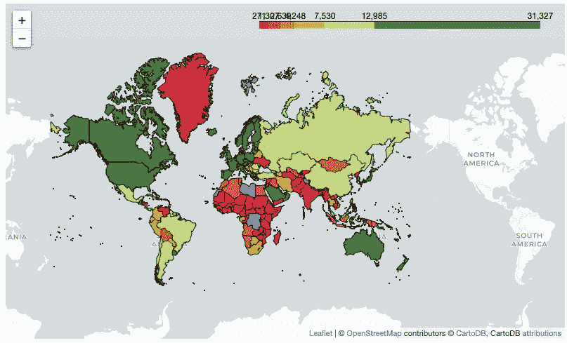
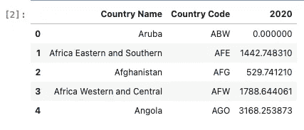
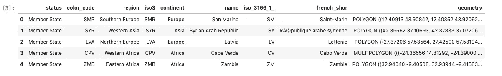
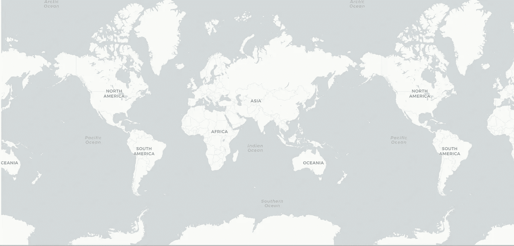
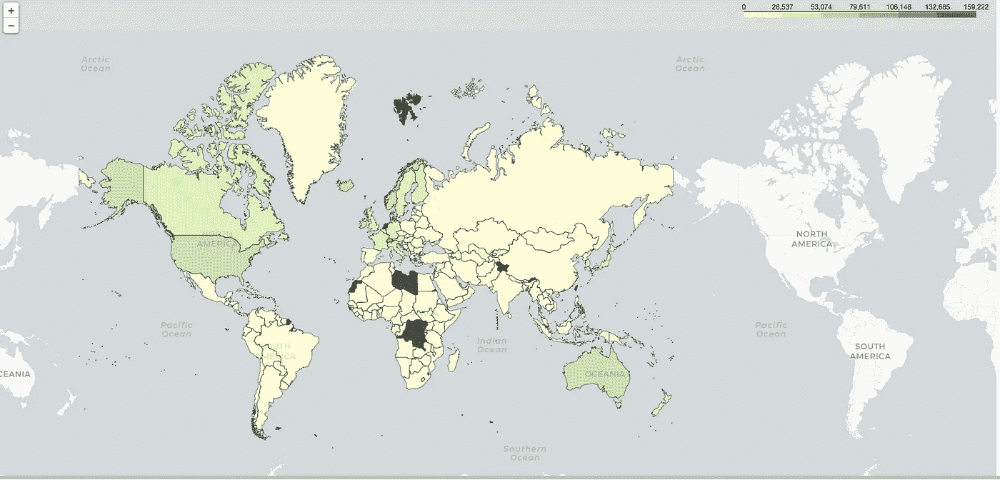
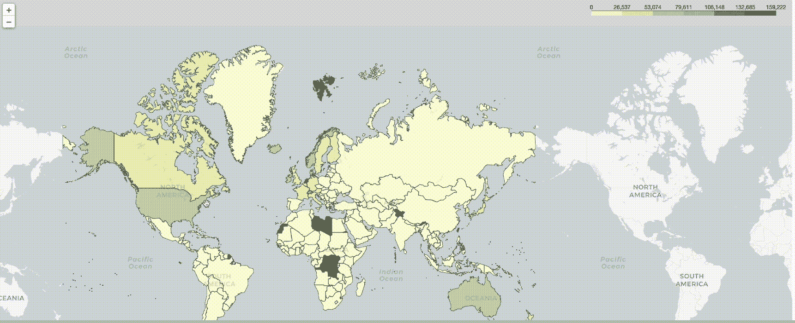
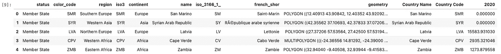
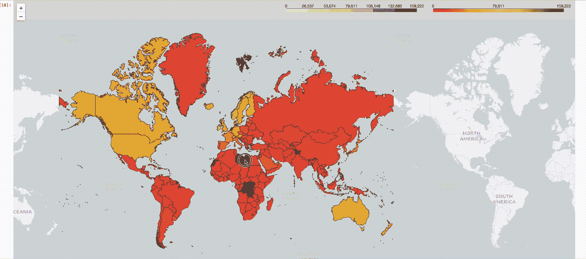
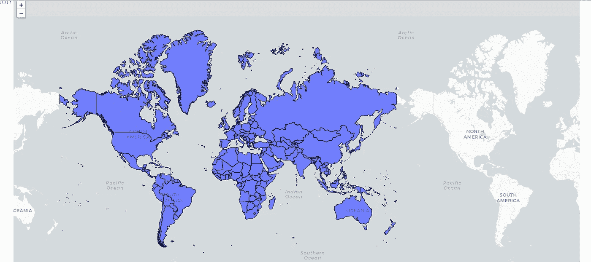
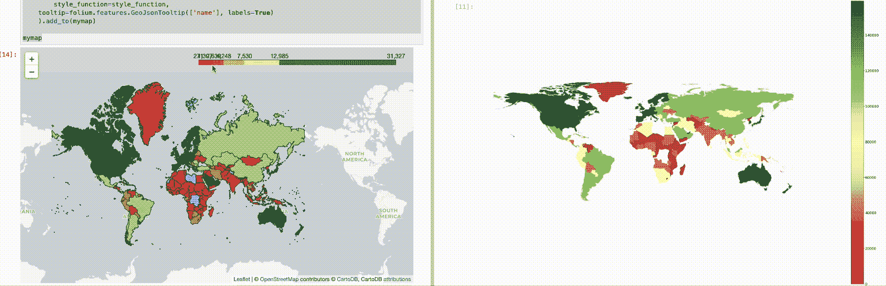

# Choropleths 之战——第三部分——叶子

> 原文：<https://towardsdatascience.com/the-battle-of-choropleths-part-3-folium-86ab1232afc>

## PYTHON。数据科学。地理可视化

## 使用叶包创造惊人的 Choropleths

在本系列的前两篇文章中，我们能够从 Geopandas 和 Altair 包中创建 choropleths。让我们继续学习，但这一次让我们使用叶包。



图片由作者提供:通过叶创建的 Choropleth

# 树叶包装

在这篇[文章](/the-battle-of-interactive-geographic-visualization-part-5-folium-cc2213d29a7)中，我们介绍了 leav 包以及该包的优缺点。

正如我们将在后面看到的，leav 引入了许多定制工具，这些工具将帮助我们创建更具交互性和专业外观的地图。当然，这带来了额外几行代码的额外成本。

不多说了，我们开始吧。

# 编码

编码部分类似于前两篇文章，但是在这篇文章中，我们不需要合并数据集(*，除非我们想要创建一个自定义的颜色图，我们将在后面看到。)*

## 预赛

```
import pandas as pd
import numpy as npimport geopandas as gpd
import folium
```

## 加载和预处理数据

```
df = pd.read_csv('data/gdp_per_capita.csv', 
            skiprows=4)
df = df.loc[:,['Country Name','Country Code', '2020']] #Choose only 2020df = df.fillna(0) #New step df.head()
```



图片由作者提供:数据集的前五次观察

## 加载形状文件

```
gdf = gpd.read_file('shapefiles/world-administrative-boundaries/world-administrative-boundaries.shp')gdf.head()
```



作者图片:形状文件的前五个观察

# 测绘

## 启动地图

```
#Folium
mymap = folium.Map(location=[19.0649070739746, 73.1308670043945], zoom_start=2,tiles=None)#ADDING TILES AS A SEPARATE LAYER ALLOWS FOR MORE CONTROL AND MORE SUTOMIZATION
folium.TileLayer('CartoDB positron',name="Light Map",control=False).add_to(mymap)#Calling the map
mymap
```



作者提供的图片:将包含其他图层的空白地图

## 创建要作为层添加的 CHOROPLETH

```
choropleth = folium.Choropleth(
    geo_data=gdf, #the dataset merged with the geometry and the data we need to plot on,
    data=df,
    key_on='feature.properties.name',
    columns=['Country Name', '2020'], #the first one is the 'index' which needs to be connected with the 'key_on' property of  the geo_data
    name = 'GDP per capita (Constant USD 2015 )',
    fill_color='YlGn',
        fill_opacity=0.7,
    line_opacity=0.5,
).add_to(mymap)
mymap
```

让我们讨论一下代码的参数:

*   `geo_data` —形状文件数据集
*   `data` —包含 choropleth 颜色的基础值。
*   `key_on` —这是指在 shapefile(或`geo_data`参数)中找到的列，该列将用于将值与`data`参数中的值合并。**我们跳过数据合并部分的原因是这样的:follow 将使用该参数进行合并。**
*   `.add_to` —将 choropleth 图层添加到我们初始化的地图中。



图片由作者提供:初始 Choropleth 地图

一个潜在的弱点是它的调色板有限。我们现在使用黄绿色，但有一种方法可以在以后定制它。

# 自定义

让我们通过做两件事来定制我们的 choropleth:

1.  添加互动工具提示
2.  创建自定义的色彩映射表—红-黄-绿。

## 添加工具提示

要添加定制的工具提示，我们需要调用 leav 的`GeoJsonTooltip`类。这为我们提供了一种交互和查看数据的方式，这非常方便，尤其是在我们做一些报告的时候。

```
# Display Region Label
choropleth.geojson.add_child(
    folium.features.GeoJsonTooltip(['name'], labels=True)
)
mymap
```



作者 GIF:添加工具提示

## 创建自定义色彩映射表

要尝试复制第一个系列的配色方案，有必要创建一个自定义颜色映射。如前所述，follous 中可用的调色板是有限的，要创建一个定制的调色板，我们需要添加更多行代码。

在我们最初的文章中，我们使用了“红-黄-绿”的颜色图。要在这里使用这个，我们需要做几件事情:

1 .使用`branca`库创建自定义色彩映射表。可用的色彩映射表是有限的，如果我们想创建一个定制的，我们需要使用`branca`库。
2。将数据与地理数据框架合并。**这现在变得很有必要，因为为了添加一个颜色依赖于值的层，几何数据应该存在。**
3。用自定义的色彩映射表添加一个单独的层。

```
import branca
import branca.colormap as cm#First determine your maximum and minimum values - this becomes the basis for the steps in the map
vmax = df['2020'].max()
vmin = df['2020'].min()colormap = cm.LinearColormap(colors=['red', 'yellow','green'], 
                             vmin=vmin,
                             vmax=vmax)
```

## 合并数据

```
merged = gdf.merge(df, left_on='name', right_on='Country Name' )
merged.head()
```



作者提供的图片:合并数据集中的前五个观察值

## 作为单独的层添加

```
# First create a function that would call on these values
style_function = lambda x: {"weight":0.5, 
                            'color':'black',
                            'fillColor':colormap(x['properties']['2020']), 
                            'fillOpacity':0.75}#Add the colormap as a legend
colormap.add_to(mymap)#Save it as an object so you can add it
folium.features.GeoJson(
        merged.fillna(0),
        style_function=style_function,
    ).add_to(mymap)mymap
```



GIF 作者:红黄绿配色

这个现在类似于我们创建的原始牛郎星地图。万岁！

为了使颜色更均匀，这就是忽略离群值，正如我们使用分位数方法所做的那样，我们需要添加更多的代码。

# 分位数方法——复制以前文章中的图

为了完全复制我们在前两篇文章中创建的地图，我们需要确保这些值被分成几个步骤(忽略异常值，在文章的最后一部分发布了警告)。

但是，请注意，随着您不断向地图添加图层，地图会变得混乱，因此创建一个新的图层可能会更清晰。但是，如果您计划创建一个自定义的颜色映射，不保持 choropleth 部分的干净可能更简单，如下所示:

```
# My Map
#Folium
mymap = folium.Map(location=[19.0649070739746, 73.1308670043945], zoom_start=2,tiles=None)#ADDING TILES AS A SEPARATE LAYER ALLOWS FOR MORE CONTROL AND MORE SUTOMIZATION
folium.TileLayer('CartoDB positron',name="Light Map",control=False).add_to(mymap)choropleth = folium.Choropleth(
    geo_data=gdf,name = 'GDP per capita (Constant USD 2015 )',
).add_to(mymap)
mymap
```



图片由作者提供:已清理的初始化地图

下面的代码显示了我们建议的步骤:

1.  我们利用索引(手动指定颜色的切割点。这首先要求我们知道数列的最大值和最小值。
2.  我们对色彩映射表进行了线性化，以便值可以落入索引中的箱中。
3.  如你所见，我们重复了两次十六进制代码`#c7f6b6`。这不是偶然的。**叶似乎很难剪切列表中的最后一种颜色，因此添加更多的颜色可以确保在最后一种颜色绿色之前有更线性的过渡。当然，颜色应该是上一个颜色渐变，这样十六进制代码就是浅绿色的。**
4.  我们手动剪切索引，在原始索引中，只使用了五次剪切。然而，对于这个地图，7 似乎更好一些(*回想一下，在对数字范围进行索引时，Python 中的最后一个值无论如何都会被忽略*)。

```
#First determine your maximum and minimum values - this becomes the basis for the steps in the map
vmax = df['2020'].max()
vmin = df['2020'].min()colormap = cm.LinearColormap(colors=['red','yellow' , '#c7f6b6' ,'#c7f6b6','green'], 
                             vmin=vmin,
                             vmax=vmax)# We add this in extra step to emulate the coloring scheme of the prveious articles
n_steps = 7 # Quantiles
list_of_values = df['2020'].sort_values()#Remove all 0's as the geopandas version did not count 0 on the count of merging
list_of_values = [i for i in list_of_values if i != 0]length = len(list_of_values)index = [list_of_values[int((length/n_steps)*i)] for i in range(n_steps)]print(index)colormap = colormap.to_step(index=index)
```

最后润色:

请注意，在这一层中，**工具提示需要作为最后一层的一部分添加，以便使用，所以我们将它合并到我们使用的最后一层**。

```
# First create a function that would call on these values
style_function = lambda x: {"weight":0.5, 
                            'color':'black',
                            'fillColor':colormap(x['properties']['2020']), 
                            'fillOpacity':0.75}#Add the colormap as a legend
colormap.add_to(mymap)#Save it as an object so you can add it
folium.features.GeoJson(
        merged,
        style_function=style_function,
    tooltip=folium.features.GeoJsonTooltip(['name'], labels=True)
    ).add_to(mymap)mymap
```



作者 GIF:最后的润色

瞧啊。我们能够精确地复制前两篇文章中的地图，尽管并不容易。

# 结束语

正如我们所看到的，使用 leav，定制的能力是以便利性为代价的。为了在前两篇文章中重新创建整个地图，我们需要添加更多的代码。

对于一些打算部署地图的人来说，这个成本可能是值得的，因为 follow 输出可以保存为 HTML。最重要的是，其他功能，如添加定制工具提示的能力，在特定区域周围创建视觉半径，以及更多其他功能，使 leav 成为 choropleths 的一个很好的包。

我的 [Github 页面](https://github.com/francisadrianviernes/GeoVisualization/blob/master/The%20Battle%20of%20Choropleths%20-%20Part%203%20-%20Folium.ipynb)上的全部代码。

# 其他相关文章

## [乔洛普勒斯之战——第一部](https://medium.com/towards-data-science/the-battle-of-choropleths-part-1-e6102e62eea?source=list-392080e5cdc--------0-------3dec1f652be9---------------------)

## [乔洛普勒斯之战——第二部——牛郎星](/the-battle-of-choropleths-part-2-altair-accaa4b46fb4)

## [交互式地理可视化之战第一部分——使用一行……的交互式地理地图](/the-battle-of-interactive-geographic-visualization-part-1-interactive-geoplot-using-one-line-of-8214e9ed1bb4?source=your_stories_page-------------------------------------)

## [交互式地理可视化之战第二部分——使用一行……的交互式 geo plot](/the-battle-of-interactive-geographic-visualization-part-2-interactive-geoplot-using-one-line-of-2118af59a77c?source=your_stories_page-------------------------------------)

## [交互式地理可视化之战第三部分——Plotly 图形对象(Go)](/the-battle-of-interactive-geographic-visualization-part-3-plotly-graph-objects-go-c3d3f2a00132?source=your_stories_page-------------------------------------)

## [交互式地理可视化之战第四部——牛郎星](/the-battle-of-interactive-geographic-visualization-part-4-altair-5b67e3e5e29e?source=your_stories_page-------------------------------------)

## [交互式地理可视化之战第五部分——叶子](/the-battle-of-interactive-geographic-visualization-part-5-folium-cc2213d29a7?source=your_stories_page-------------------------------------)

## [交互式地理可视化之战第六部分—格雷波](/the-battle-of-interactive-geographic-visualization-part-6-greppo-4f615a1dae43?source=your_stories_page-------------------------------------)

## [交互式地理可视化之战第七集——散景](/the-battle-of-interactive-geographic-visualization-part-7-bokeh-57e40e159354?source=your_stories_page-------------------------------------)