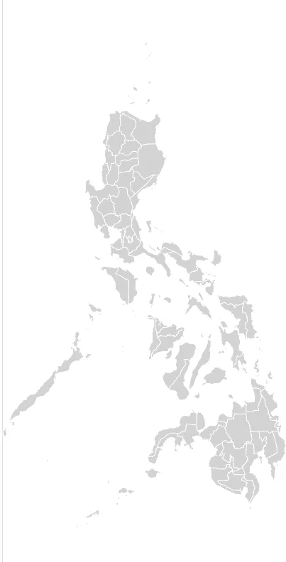
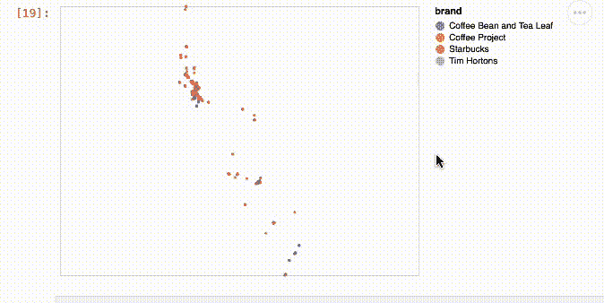
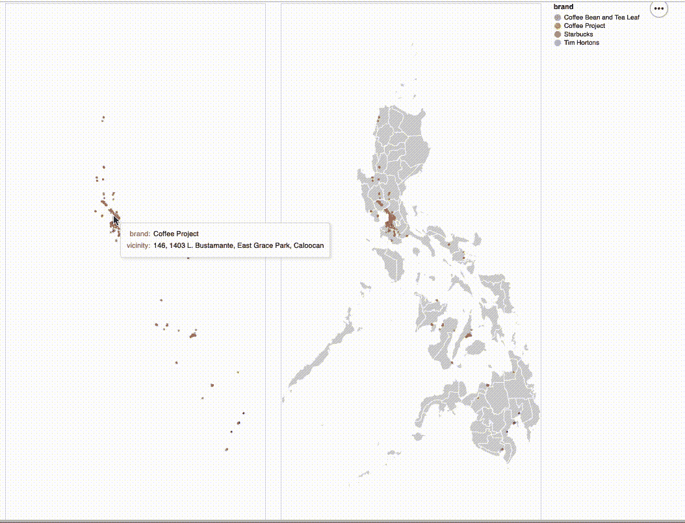

# 交互式地理可视化之战第四部分——牛郎星

> 原文：<https://towardsdatascience.com/the-battle-of-interactive-geographic-visualization-part-4-altair-5b67e3e5e29e>

## PYTHON。数据科学。地理可视化。

## 使用 Altair 软件包创建漂亮的交互式地理绘图


[粘土银行](https://unsplash.com/@claybanks?utm_source=medium&utm_medium=referral)在 [Unsplash](https://unsplash.com?utm_source=medium&utm_medium=referral) 拍摄的照片

# 我们离开的地方

在这个系列中，我们已经确定了三(3)种制作美丽的地理散射图的方法。

*   **全息视图** — [交互式地理可视化之战第一部分——使用一行代码的交互式地理地图](/the-battle-of-interactive-geographic-visualization-part-1-interactive-geoplot-using-one-line-of-8214e9ed1bb4)
*   **Plotly Express —** [交互式地理可视化之战第二部分——使用一行代码的交互式 geo plot](/the-battle-of-interactive-geographic-visualization-part-2-interactive-geoplot-using-one-line-of-2118af59a77c)
*   **Plotly Go** — [交互式地理可视化之战第三部分——Plotly 图形对象(Go)](/the-battle-of-interactive-geographic-visualization-part-3-plotly-graph-objects-go-c3d3f2a00132)

在本文中，我们将学习如何使用数据科学社区中 plotly 包最著名的竞争对手之一 Altair 来创建类似的图。

# 牵牛星作为一个包

Altair 被比作 Plotly Express，因为它是一种高级声明性语言，很像 seaborn、holoviews 和 ggplot。这意味着我们用控制来换取易用性。

与其他图表不同，Altair 专注于拥有一种图形语法，在这种语法中，从单个图形创建组合图表更容易，类似于如何将单词组合成人类句子。这使得 Altair 的语法更加接近 ggplot，对于 R 用户来说是一个优势。

Altair 也有我们称之为“交互语法”的东西，可以很容易地在部件和情节之间，以及情节本身之间创建交互。例如，在我们下面的图中，与图表左侧的交互将模拟我们与右侧的交互，只要它们属于同一个图表。

最后，当谈到外观时，Altair 会在您调整情节大小时保留情节的元素。这在我们不断添加更多类别时非常有用，这与其他可视化库不同，后者维护的是整体绘图属性(图形大小)，从而扭曲了绘图元素。

# **编码**

## 预赛

和其他人一样，让我们装载我们的包:

```
import pandas as pd
import altair as altimport geopandas as gpd
from shapely.geometry import Pointalt.renderers.enable('default') #Allows the map to be displayed in the notebook/Jupyterlab
```

## 加载数据集

加载以下数据集:

```
df = pd.read_csv('data/Coffee Brands Footprint.csv',
                index_col=0)
df.head()
```


作者图片:我们数据集的前五次观察。

***使用 Altair 的一点警告:*** *Altair 使用数据转换器，要求所有列都是“JSON 可序列化的”。这意味着您的列中不应该有几何数据类型。*

现在，与 Plotly 不同，我们需要导入自己的 shapefiles 来提供地图的边界。[https://gadm.org/](https://gadm.org/)提供了几乎所有你需要的 shapefiles。

## 加载形状文件

```
#Load the geodataframe
gdf = gpd.read_file('Shapefiles/gadm36_PHL_shp/gadm36_PHL_1.shp')#Options When It Comes to Boundaries of the Shapefilephilippines = alt.Chart(gdf).mark_geoshape(stroke='white',
                            fill='lightgray').encode().properties(width=400,
                                                                 height=800).project('mercator')philippines
```



图片由作者提供:在 Jupyterlab 展示的菲律宾 Shapefile

让我们回顾一下上面的一些选项:

*   表示“另类的”图表—这段代码从提供的数据集创建 Altair 图表。在这种情况下，我们提供了地理数据框架。
*   mark _ geo shape——该命令让 Altair 知道数据帧的属性应该如何准确地在绘图中表示；在我们的例子中，它是一个 geo_shape。
*   描边-这是指线颜色或地理数据框的边界。政治边界越详细，这个参数就越重要。
*   填充-地图的颜色填充。
*   编码—这是将列映射到映射的可视属性的代码部分。
*   属性——我们用它来改变图(或图形)本身的宽度、高度或任何其他属性。
*   投影-投影类型。在我们的情况下是可选的，但对大多数美国地图有帮助。

## 绘制地理散射图

下面的代码将创建一个类似的散点图，就像我们前三(3)篇文章一样:

```
points = alt.Chart(df).mark_circle(opacity=0.7).encode(
    longitude='lng:Q',
    latitude='lat:Q',
    size=alt.value(10),
    color='brand',
    tooltip=['brand', 'vicinity'])points
```



GIF by Author:生成的散点不受 shapefile 的限制。

这些参数与我们用于 geoshape 的参数非常相似，但是请注意，对于 geoscatterplots，我们需要为`longitude`和`latitude`填充参数或自变量。

注意，提供该参数的格式是“ **column_name:Q** ”。因为我们的经度列被命名为‘LNG’，所以提供给经度列的值是`lng:Q`。代码工作所需的`:Q`是**。还要注意，对于尺寸参数，我们也使用了`alt.value`。**

## **结合这两个图**

**最后，Altair 地图的一个非常酷的特性，尤其是地理可视化，就是你可以简单地添加我们之前创建的两个地图。**

```
points | philippines + points
```

****

**作者 GIF:只需使用“+”号就可以将两个图形相加。**

# **结束语**

**Altair 被认为是一个高级声明库，所以它的易用性必须与 plotly express 相提并论。因为它能够读取我们导入的 shapefile，所以它有能力变得更加优雅，尤其是对于较低级别的边界。**

**虽然 Altair 对于 geoscatterplot 来说同样很棒，但是对于 choropleth 来说同样很容易使用。请继续关注我们尝试使用不同的包来创建 choropleths。**

**感谢阅读，并让我知道你的想法！**

****请查看我的其他文章:****

**[交互式地理可视化之战第一部分——使用一行代码的交互式地理地图](/the-battle-of-interactive-geographic-visualization-part-1-interactive-geoplot-using-one-line-of-8214e9ed1bb4)**

**[交互式地理可视化之战第二部分——使用一行代码的交互式地理地图](/the-battle-of-interactive-geographic-visualization-part-2-interactive-geoplot-using-one-line-of-2118af59a77c)**

**[交互式地理可视化之战第三部分——Plotly 图形对象(Go)](/the-battle-of-interactive-geographic-visualization-part-3-plotly-graph-objects-go-c3d3f2a00132)**

**[使用 Google Places API 和 fluous 为您在菲律宾最喜欢的咖啡店绘制地图](/mapping-your-favorite-coffee-shop-in-the-philippines-using-google-places-api-and-folium-2f9d5ad697bf?source=your_stories_page----------------------------------------)**

**[使用 GeoPandas 可视化菲律宾的人口密度](/psvisualizing-the-philippines-population-density-using-geopandas-ab8190f52ed1?source=your_stories_page----------------------------------------)**

# ****参考文献****

**[STACKOVERFLOW:牛郎星 vs Plotly Express](https://stackoverflow.com/questions/59845407/plotly-express-vs-altair-vega-lite-for-interactive-plots#:~:text=One%20notable%20difference%20is%20that,fit%20an%20overall%20plot%20size.)**