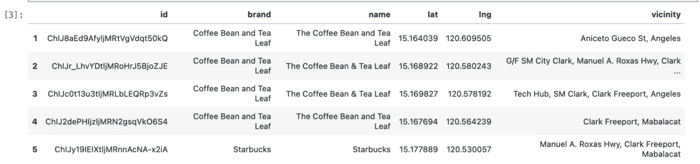
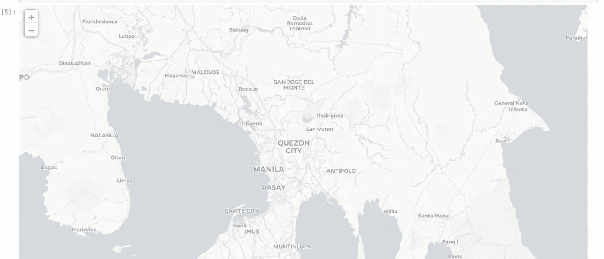
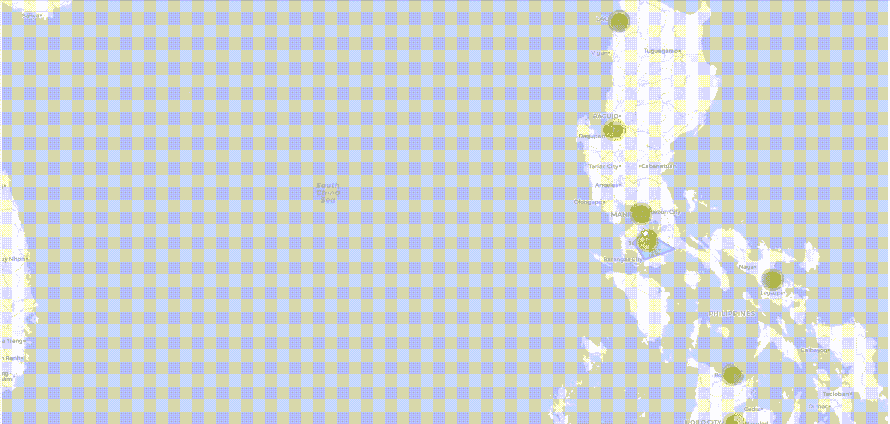
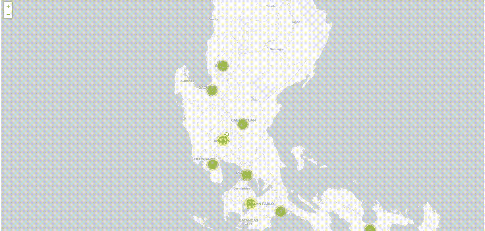

# 交互式地理可视化之战第五讲——叶子

> 原文：<https://towardsdatascience.com/the-battle-of-interactive-geographic-visualization-part-5-folium-cc2213d29a7>

## PYTHON。数据科学。地理可视化。

## 使用 follow 包创建漂亮的交互式 Geoplots


[粘土银行](https://unsplash.com/@claybanks?utm_source=medium&utm_medium=referral)在 [Unsplash](https://unsplash.com?utm_source=medium&utm_medium=referral) 拍摄的照片

## 我们离开的地方

在这个系列中，我们已经确定了制作美丽的地理散射图的四(4)种方法:

*   **全息视图** — [交互式地理可视化之战第一部分——使用一行代码的交互式地理地图](/the-battle-of-interactive-geographic-visualization-part-1-interactive-geoplot-using-one-line-of-8214e9ed1bb4)
*   **Plotly Express —** [交互式地理可视化之战第二部分——使用一行代码的交互式 geo plot](/the-battle-of-interactive-geographic-visualization-part-2-interactive-geoplot-using-one-line-of-2118af59a77c)
*   **Plotly Go** — [交互式地理可视化之战第三部分——Plotly 图形对象(Go)](/the-battle-of-interactive-geographic-visualization-part-3-plotly-graph-objects-go-c3d3f2a00132)
*   **牛郎星**——[交互式地理可视化之战第四集——牛郎星](/the-battle-of-interactive-geographic-visualization-part-4-altair-5b67e3e5e29e)

在本文中，我们将学习如何使用我最喜欢的地理可视化软件包，follow，创建一个类似的但更加定制的绘图。

我还将向您展示如何使用为我们的 geoviz 提供即时升级的“标记集群”功能。

## 叶子与情节

Folium 可能是 Python 用户使用最广泛的地理可视化工具之一，这些用户打算为个人甚至商业用途创建更多定制地图。

它是建立在 needs 之上的，比我们到目前为止介绍过的任何一个包都能覆盖更多的制图需求。

另一方面，Plotly 的优势是在语法和扩展使用上更容易，特别是它的高级绘图库 Plotly Express。你也可以用这个包做很多事情，但是没有用 leav 做的多。

# 编码

确保首先安装叶子:

```
pip install folium
```

# 预赛

和其他人一样，让我们装载我们的包:

```
import numpy as np
import pandas as pdimport folium
from folium.plugins import MarkerCluster
import geopandas as gpdfrom shapely import geometry
from shapely.geometry import Point
from shapely.geometry.polygon import Polygon
```

## 加载数据集

```
df = pd.read_csv('data/Coffee Brands Footprint.csv',
                index_col=0)
df.head()
```



作者图片:我们数据集的前五次观察。

加载数据集后，我们可以开始创建我们的叶子地图！

# 叶子代码

## 启动地图

以下代码启动了叶子图:

```
m = folium.Map(location=[14.577924, 121.073972],
            tiles="cartodbpositron") #Latitude first before Longitude
```



图片作者:初始化的树叶地图

`Folium.Map`有可以控制初始缩放的参数和控制地图的图块。我们选择了图块`cartodbpositron`,因为它离我们其他包的底图更近。

## 启动标记集群

叶子的`MarkerCluster`插件是我们 geoviz 的一个很好的补充，因为它可以为我们提供一些即时的见解。这是一种聚类形式，因此您可以立即评估哪些区域中有您的研究对象。

另一个明显的好处是，它有助于保持你的地图看起来干净，因为它不会有太多的标记杂乱。

要启动 MarkerCluster 对象:

```
marker_cluster = MarkerCluster(control=False).add_to(m)
```

我们将它存储在一个名为`marker_cluster`的变量中，因为我们稍后将调用它，或者更确切地说，添加到它。

不要忘记将这个`MarkerCluster`对象添加到我们名为`m`的地图对象中。

## 启动标记

要为此启动标记，我们需要做一个初步的步骤来存储在一个元组中或列出我们的地理编码。

```
#We need this cause apparently, folium can recognize not a geoseries but a normal tuple/list
df.reset_index(drop=True, inplace=True)
df['geocode'] = [[df['lat'][i],df['lng'][i]] for i in range(len(df)) ]
```

现在，让我们创建带有定制工具提示的标记，显示咖啡店的品牌或名称。

```
for point in df.index: # loop through the plotshtml = """<h3>{name}</h3><br>"""popup_contents = folium.Html(html.format(name = df.loc[point, 'name']),
                                             script = True)popup = folium.Popup(popup_contents, max_width=1500)# mark every addresses in the map from the data
        folium.Marker(df['geocode'][point],
                     popup=popup).add_to(marker_cluster)
```

让我们分解上面的代码(步骤 1-3 用于弹出内容，步骤 4 用于标记):

1.  HTML 字符串将包含我们的工具提示，单击散点图中的点时将显示该工具提示。
2.  因此，在我们的`folium.HTML`对象中会有这个空字符串。
3.  因此，我们将它存储在一个可以进一步定制的`folium.Popup`对象中。
4.  最后，要向这些商店添加 pin，`folium.Marker` 为每个位置添加一个 pin，并确保这些商店是集群的，您需要将它添加到我们已经创建的`marker_cluster` 变量中。



GIF 作者:CircleMarker 在行动

为了简单地显示和聚集这些咖啡店，我们已经完成了！

然而，如果你想实现我们曾经使用的彩色标记，就像在过去的文章中一样，那么我们需要选择一个不同的标记——圆形标记。

## 添加彩色圆圈标记，以提高识别能力

您可以添加之前的标记，也可以选择添加圆形标记。下面是这样做的代码:

我们首先需要声明我们的品牌及其颜色:

```
#Let's Create a Color Dictionary for the Markers
coffee_brands = ["Coffee Bean and Tea Leaf", "Starbucks", "Tim Hortons", "Coffee Project"]color_dict = {
    "Starbucks": ' #00704A',
    "Coffee Bean and Tea Leaf": '#362d26',
    "Coffee Project": '#654321',
    "Tim Hortons": '#dd0f2d'
}
```

接下来，我们需要迭代每个品牌，并迭代添加彩色圆圈标记。请注意，这段代码用常规的`folium.Marker`替换了我们现有的代码。

```
#Since we need to add a filter for this, we need to add them by brand:
for brand in coffee_brands:
    df_i = df[df['brand']==brand]
    df_i.loc[:, "color"] = color_dict[brand]

    for index, row in df_i.iterrows():

        ####### START OF THE SAME CODE FOR POPUP #######
        html = """<h3>{name}</h3><br>"""popup_contents = folium.Html(html.format(name = row['name']),
                                             script = True)popup = folium.Popup(popup_contents, max_width=1500)
        ####### END OF THE SAME CODE FOR POPUP #######
        folium.vector_layers.CircleMarker(radius = 8,
                                                  location = (row.lat,
                                                              row.lng),
                                                  color = row.color,
                                                  fill = True,
                                                  fill_color = row.color,
                                                  name = brand,
                                                  popup=popup,
                                                  control = True,
                                                  overlay = True
                                                 ).add_to(marker_cluster)
```

让我们分解上面的代码:

1.  您可能已经注意到，添加标记对于 leav 来说是一个迭代过程。根本没有办法批量添加它们，所以对于我们的目的来说，它们必须是循环的一部分。因此，第一步是对品牌进行分组或过滤，这样你就可以给一个品牌分配一种颜色。
2.  在过滤一个品牌后，你就可以创造另一个增加市场的循环。**请注意，弹出内容必须添加到每个标记中，因此它们也是循环的一部分，并且具有与上面相同的代码。**
3.  最后，就像在`folium.Marker`中一样，我们在`folium.vector_layers.CircleMarker`中添加必要的参数，比如半径的大小、填充颜色和颜色，它们将遵循循环开始时分配的颜色。



作者 GIF。圆圈标记在起作用

# 结束语

如你所见，我们可以用叶子做的事情范围是惊人的。如果您为地图设计了特定的单幅图块，也可以自定义单幅图块。

一个非常有用的定制是添加工具提示。正如我们所看到的，HTML 代码可以包含更多的信息，这就是为什么它也是用于部署商业项目的包。

我建议数据科学家探索更多的功能，例如添加热图和自定义标记以包含图标。每个点周围的半径也可能有助于某些地理空间项目，这也可以通过令人惊讶的叶包来完成。

让我知道你的想法！