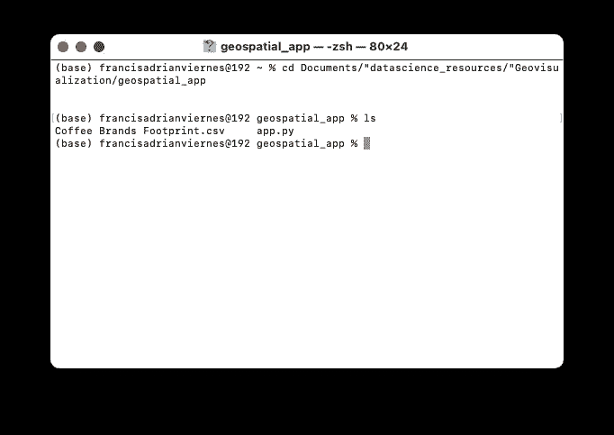
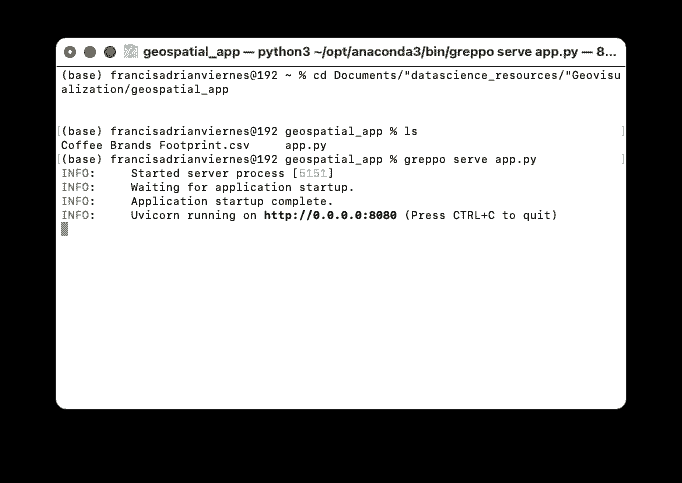
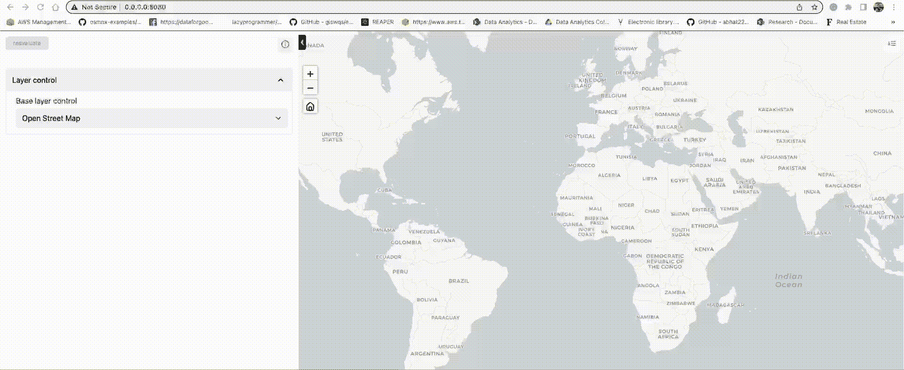
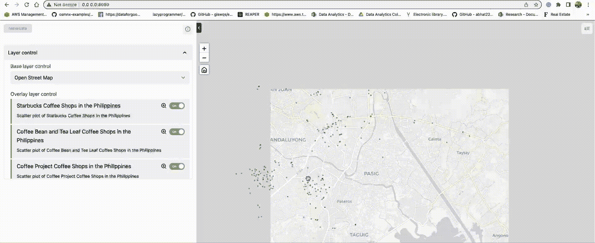
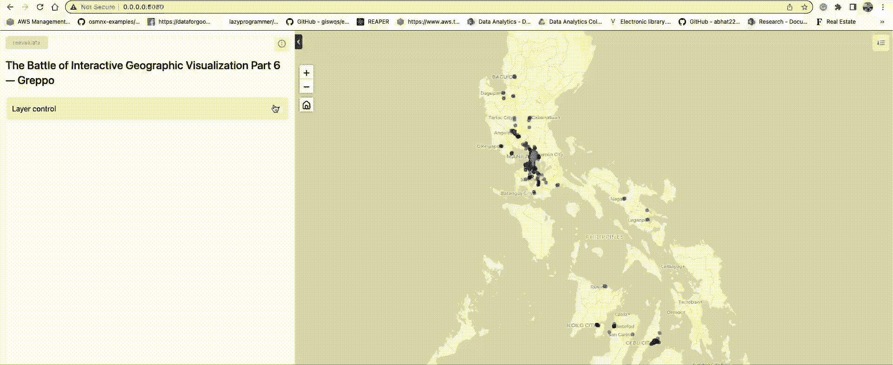

# 交互式地理可视化之战第六讲——格雷波

> 原文：<https://towardsdatascience.com/the-battle-of-interactive-geographic-visualization-part-6-greppo-4f615a1dae43>

## PYTHON。数据科学。地理可视化

## 使用 Greppo 库创建漂亮的交互式 Geoplots


由[托拜厄斯](https://unsplash.com/@tobiash?utm_source=medium&utm_medium=referral)在 [Unsplash](https://unsplash.com?utm_source=medium&utm_medium=referral) 拍摄的照片

# 我们离开的地方

在这个系列中，我们已经确定了五(5)种制作美丽地理散射图的方法。

*   **全息视图** — [交互式地理可视化之战第一部分——使用一行代码的交互式地理地图](/the-battle-of-interactive-geographic-visualization-part-1-interactive-geoplot-using-one-line-of-8214e9ed1bb4)
*   **Plotly Express —** [交互式地理可视化之战第二部分——使用一行代码的交互式 geo plot](/the-battle-of-interactive-geographic-visualization-part-2-interactive-geoplot-using-one-line-of-2118af59a77c)
*   **Plotly Go** — [交互式地理可视化之战第三部分——Plotly 图形对象(Go)](/the-battle-of-interactive-geographic-visualization-part-3-plotly-graph-objects-go-c3d3f2a00132)
*   **牛郎星**——[交互式地理可视化之战第四集——牛郎星](/the-battle-of-interactive-geographic-visualization-part-4-altair-5b67e3e5e29e)
*   **叶** — [交互式地理可视化之战第五部分—叶](https://medium.com/towards-data-science/the-battle-of-interactive-geographic-visualization-part-5-folium-cc2213d29a7?source=user_profile---------0-------------------------------)

在本文中，我们将学习如何创建，不仅仅是地理可视化，而是一个应用程序。对，一个 app！

因此，这篇文章可以与 Holoviews 的系列文章相提并论，其中易于部署是数据科学家的优势，他们希望在向利益相关者演示时避免展示我们的 Jupyter 笔记本。

我们的目标是创建与前五篇文章几乎相似的地图。

所以，不多说了，让我们开始吧:

# 五个简单的步骤

创建这个漂亮的地理空间应用程序有五个简单的步骤:

1.  创建一个包含 Python 脚本和数据集的文件夹。
2.  创建基础层
3.  导入数据
4.  将数据添加为矢量图层
5.  输入其他详细信息

## 步骤 1:创建一个包含 Python 脚本和数据集的文件夹。

与大多数应用程序一样，将它们放在一个文件夹中是一个很好的做法。在我的例子中，它位于`geospatial_app`文件夹中:



作者图片:通过 Bash 改变目录来访问我们的脚本和数据集的位置。

> 如您所见，将它保存在一个`.py`文件中很重要:一个 Python 脚本。因此，对于下面的步骤，请注意，这些将在 Python 脚本中编写。

## 步骤 2:创建基础层。

基础图层类似于我们用于 follow 应用程序的图块(*回想一下，在创建基础地图时，我们指定* `*tiles*` *)。*)

这方面代码如下:

```
app.base_layer(
    name="Open Street Map",
    visible=True,
    url="[https://{s}.tile.openstreetmap.org/{z}/{x}/{y}.png](https://{s}.tile.openstreetmap.org/{z}/{x}/{y}.png)",
    subdomains=None,
    attribution='(C) OpenStreetMap contributors',
)app.base_layer(
    name="CartoDB Light",
    visible=True,
    url="[@2x](https://cartodb-basemaps-a.global.ssl.fastly.net/light_all/{z}/{x}/{y}<a href=).png">https://cartodb-basemaps-a.global.ssl.fastly.net/light_all/{z}/{x}/{y}[@2x](http://twitter.com/2x).png",
    subdomains=None,
    attribution='&copy; <a target="_blank" href="[http://osm.org/copyright](http://osm.org/copyright)">OpenStreetMap</a> contributors',
)
```

在上面的代码中，我们创建了两个可以交替使用的基础层。格式如下:[**Greppo 文档:基础层。**](https://docs.greppo.io/map-components/base-layer.html)

为了检查我们是否正确，转到代码所在的文件夹并运行下面的命令`greppo serve app.py`。格式是`greppo serve {script name}`。在我们的例子中，我们选择将脚本命名为`app.py`，因此它将是`greppo serve.`之后的内容



图片由作者提供:在文件夹中输入命令“greppo serve app.py”来运行应用程序



作者 GIF:创建基础层

## 步骤 3:导入我们的地理空间数据

与我们的其他产品一样，导入非常简单:

```
df = pd.read_csv('Coffee Brands Footprint.csv',
                index_col=0)
```

现在，由于我们需要此特定包的地理数据框架，我们只需添加:

```
#Geometry
geometry = [Point(xy) for xy in zip(df.lng, df.lat)]
gdf = gpd.GeoDataFrame(df, geometry=geometry)
```

这也是我们为过去的文章所做的，所以在这一部分没有什么新的。继续前进。

## 步骤 4:将数据添加为矢量图层

既然我们想用不同的颜色识别不同的品牌，那么**将不同的品牌视为它们的数据集**就很重要。

这样做的原因是，造型是每层完成的，每层只能有一种颜色。因此，我们的解决方法是将每个品牌视为不同的层。

首先，创建一个颜色字典，就像我们用叶子做的那样:

```
#We need to add this iteratively, to achieve different colors in the map, we need to separate the brands and treat them as a dataframe#Borrowing this from our earlier codes
color_dict = {
    "Starbucks": ' #00704A',
    "Coffee Bean and Tea Leaf": '#362d26',
    "Coffee Project": '#654321',
    "Tim Hortons": '#dd0f2d'
}
```

最后，反复添加品牌:

```
for brand in color_dict.keys():

    app.vector_layer(
        data = gdf[gdf.brand==brand],
        name = f"{brand} Coffee Shops in the Philippines",
        description = f"Scatter plot of {brand} Coffee Shops in the Philippines",
        style = {"fillColor": color_dict[brand],
                "fillOpacity":0.5,
                "opacity":0.5},
    )
```

瞧啊。



作者 GIF。添加了图层的地理空间应用程序

最后，让我们命名我们的应用程序并输入更多详细信息:

## 步骤 5:输入其他详细信息

```
app.display(name='title', value='The Battle of Interactive Geographic Visualization Part 6 — Greppo')
app.display(name='description',
            value='A Greppo demo app for vector data using GeoPandas DataFrame')
```



作者 GIF。添加了图层和标题的最终地理空间应用程序

# 结束语

正如我们所见，使用 Greppo 部署和创建地理空间可视化应用程序非常简单。

与 Holoviews 不同，应用程序元素的排列似乎已经固定，定制也不像我们在 leav 中那样广泛。

尽管如此，这个库为我们提供了工具箱中的另一个工具，我们可以使用它来探索，因为前端足够令人愉快和漂亮，可以给我们的利益相关者留下深刻印象。

让我知道你的想法！