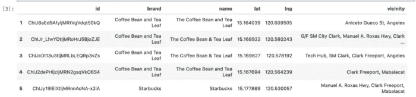
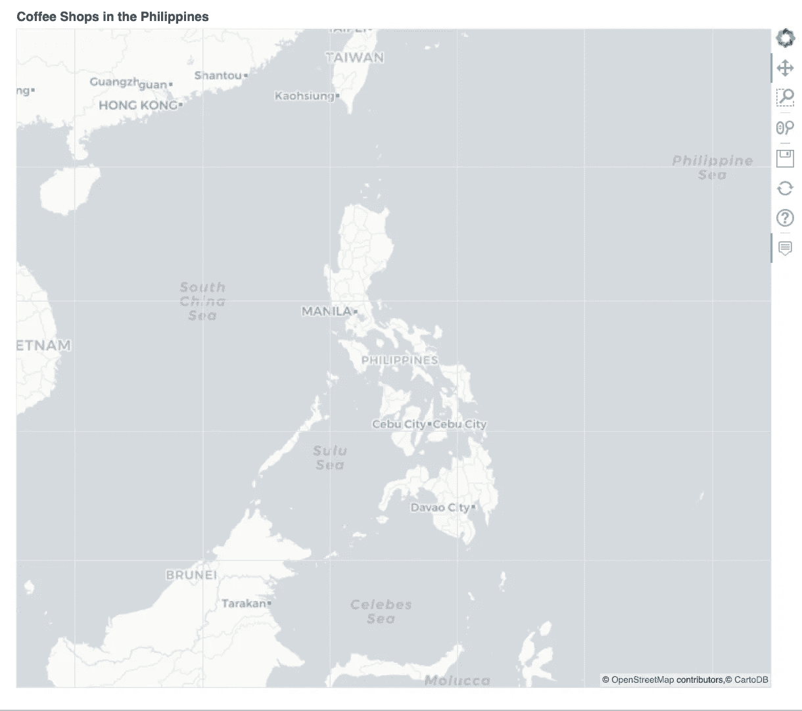
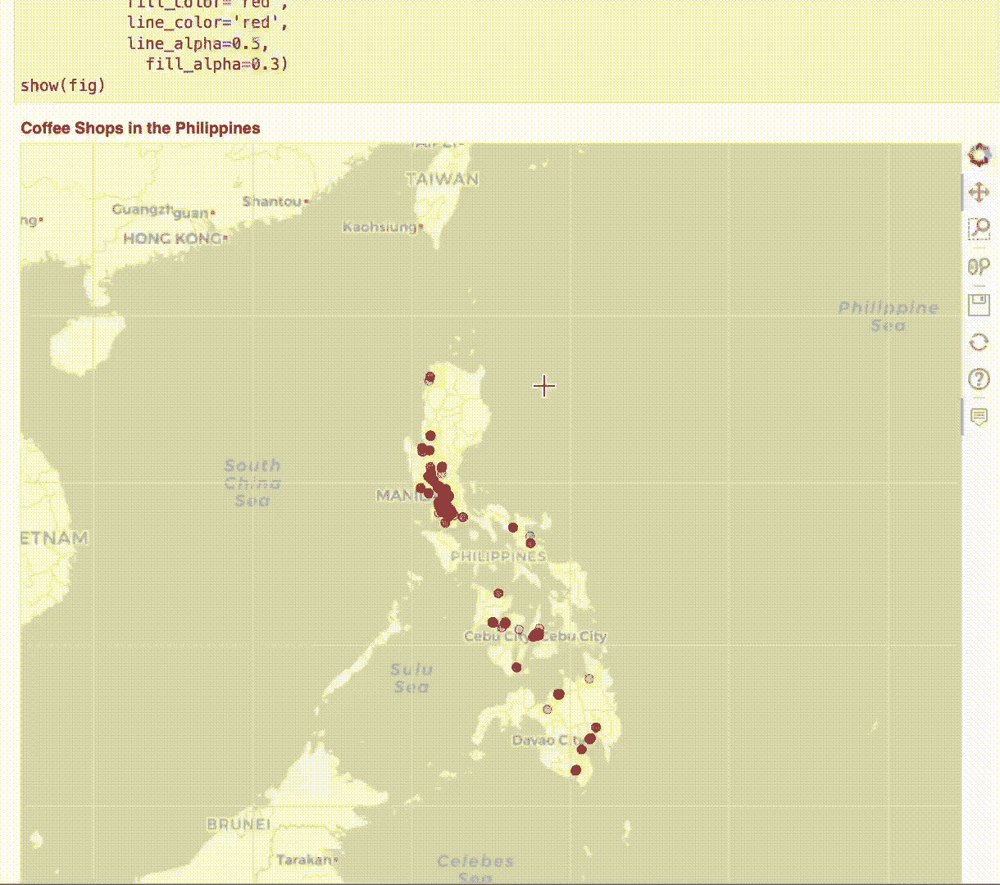
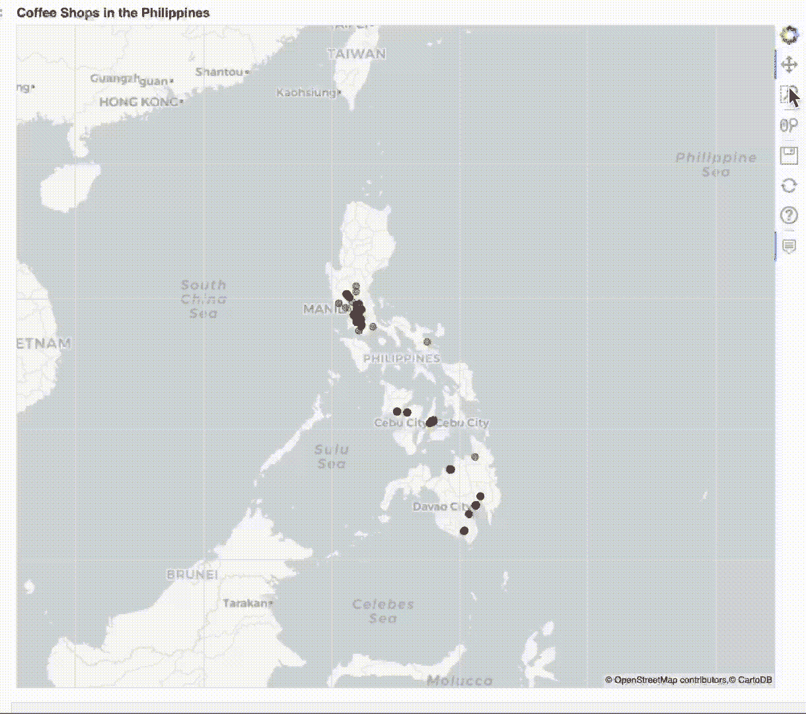

# 交互式地理可视化之战第七部分——散景

> 原文：<https://towardsdatascience.com/the-battle-of-interactive-geographic-visualization-part-7-bokeh-57e40e159354>

## PYTHON。数据科学。地理可视化

## 使用散景库创建漂亮的交互式 Geoplots


德尔菲·德拉鲁阿在 [Unsplash](https://unsplash.com?utm_source=medium&utm_medium=referral) 上拍摄的照片

# 我们离开的地方

在这个系列中，我们已经确定了六(6)种制作美丽地理散射图的方法。

*   **全息视图** — [交互式地理可视化之战第一部分——使用一行代码的交互式地理地图](/the-battle-of-interactive-geographic-visualization-part-1-interactive-geoplot-using-one-line-of-8214e9ed1bb4)
*   **Plotly Express —** [交互式地理可视化之战第二部分——使用一行代码的交互式 geo plot](/the-battle-of-interactive-geographic-visualization-part-2-interactive-geoplot-using-one-line-of-2118af59a77c)
*   **Plotly Go** — [交互式地理可视化之战第三部分——Plotly 图形对象(Go)](/the-battle-of-interactive-geographic-visualization-part-3-plotly-graph-objects-go-c3d3f2a00132)
*   **牛郎星**——[交互式地理可视化之战第四集——牛郎星](/the-battle-of-interactive-geographic-visualization-part-4-altair-5b67e3e5e29e)
*   **叶** — [交互式地理可视化之战第五部分—叶](https://medium.com/towards-data-science/the-battle-of-interactive-geographic-visualization-part-5-folium-cc2213d29a7?source=user_profile---------0-------------------------------)
*   **Greppo** — [交互式地理可视化之战第六部分— Greppo](/the-battle-of-interactive-geographic-visualization-part-6-greppo-4f615a1dae43)

在这篇文章中，我们将学习如何用散景来做到这一点。现在，散景是内置在面板上的，这是我们在本系列的第一篇文章中使用的。

# PLOTLY VS. BOKEH

一篇关于此的文章总结了这两个库的主要区别。当我们谈论易用性时，Plotly 更好，并且推而广之，在制作单独的(包括 3D)地图时更容易使用。

散景的亮点在于它的仪表板功能。这意味着更容易创建、托管和样式化仪表板。

不再赘述，让我们开始编码吧。

# 编码

## 预赛

我们将使用以下软件包重新创建我们与其他文章的互动地图:

```
import pandas as pd#Transformation of Geocodes
from pyproj import Proj, transformfrom bokeh.plotting import figure, save, show
from bokeh.io import output_notebook#For the Map Tiles
from bokeh.tile_providers import get_provider, WIKIMEDIA, CARTODBPOSITRON, STAMEN_TERRAIN, STAMEN_TONER, ESRI_IMAGERY, OSM
tile_provider = get_provider(xyz.OpenStreetMap.Mapnik)#To display properly the maps
import panel as pn
pn.extension()
import warnings
warnings.filterwarnings("ignore")
```

这里只是简单解释一下面板库的用法:**我们需要使用它来使地图在我们的笔记本上可用。**如果我们想在同一个地图上添加多个数据集，这一点很重要。然而，通常不使用这些，地图将显示在单独的网页上。

## 加载数据

```
df = pd.read_csv('Coffee Brands Footprint.csv',
                index_col=0)
```



作者图片:我们数据集的前五次观察。

## 创建底图-地理编码的转换

正如在其他文章中一样，我们需要创建一个底图，在其中对附加数据进行分层。

但是，请注意，与其他文章不同，我们没有使用 GeoPandas。因此，散景需要一种理解`geometry`数据类型的方法。

为此，我们需要始终转换我们的地理编码集，或者更准确地说，使用投影比例，以便散景可以正确地绘制它们。

```
inProj = Proj(init='epsg:3857')
outProj = Proj(init='epsg:4326')ph_lon1, ph_lat1 = transform(outProj,inProj,115,0)
ph_lon2, ph_lat2 = transform(outProj,inProj,130,25)
```

上面的地理编码是通过反复试验为我们的地图生成最佳边界而生成的。如果您想将地图限制在特定的地区、国家或城市，以便更好地聚焦，我建议您也这样做。

要初始化基本地图:

```
#Initialize the tile that we will use
cartodb = get_provider(CARTODBPOSITRON)#Initialize the fig object
fig = figure(plot_width=800, plot_height=700,
             x_range=(ph_lon1, ph_lon2),
             y_range=(ph_lat1, ph_lat2),
             x_axis_type="mercator", 
             y_axis_type="mercator",
             tooltips=[
                    ("Cofee Brand", "[@brand](http://twitter.com/brand)"), ("Location", "[@vicinity](http://twitter.com/vicinity)")
                    ],
            title="Coffee Shops in the Philippines")fig.add_tile(cartodb)fig.xaxis.visible = False 
fig.yaxis.visible = Falseshow(fig)
```

让我们讨论一下散景的人物功能所特有的代码部分:

*   **x_range，y_range** —这些是图形的边界。X 轴指的是经度，Y 轴指的是纬度。相应地调整这些以创建所需的地图边界。
*   **x_axis_type，y_axis_type** —这告诉散景如何解释您的轴。“墨卡托”应该特别为非美国地图选择。
*   工具提示—要在工具提示中显示的变量列表。交互式工具提示的格式应该遵循一个元组。元组的第一个元素是将为工具提示显示的名称，第二个元素应该是对 dataframe 源的引用。格式应该是“@column_name”。



作者图片:底图已创建。请注意，在试图找到完美的边界时，轴应该理想地显示出来，以便经度和纬度值可见。

## 转换地理编码

正如我们所指出的，成对的地理编码需要被转换或“投影”才能对散景有意义。因此，我们需要使用以下代码:

```
lons, lats = [], []
for lon, lat in list(zip(df["lng"], df["lat"])):
    x, y = transform(outProj,inProj,lon,lat)
    lons.append(x)
    lats.append(y)

df["MercatorX"] = lons
df["MercatorY"] = lats
```

转换后，如果我们想一次显示整个数据集，而不引用品牌，我们可以使用以下代码:

```
fig.circle('MercatorX', 'MercatorY', 
           source=df, 
           size=7,
           fill_color='red',
           line_color='red',
           line_alpha=0.5,
             fill_alpha=0.3)
show(fig)
```



作者提供的 GIF:第一张显示菲律宾所有咖啡店位置的交互式地图

因为我们想用不同的颜色展示每个品牌，所以我们需要分别添加它们。这种方法，对于该系列的追随者来说，被比作是叶的方法。

## 将每个品牌视为不同的数据集

为不同品牌添加不同颜色的方法是将每个品牌视为一个单独的数据集。

但是首先，我们需要建立一个颜色字典:

```
color_dict = {
    "Starbucks": ' #00704A',
    "Coffee Bean and Tea Leaf": '#362d26',
    "Coffee Project": '#654321',
    "Tim Hortons": '#dd0f2d'
}
```

我们需要一套新的 fig，因为上一套已经用红点编码了。

```
#Doing the Fig
fig = figure(plot_width=800, plot_height=700,
             x_range=(ph_lon1, ph_lon2),
             y_range=(ph_lat1, ph_lat2),
             x_axis_type="mercator", 
             y_axis_type="mercator",
             tooltips=[
                    ("Cofee Brand", "[@brand](http://twitter.com/brand)"), ("Location", "[@vicinity](http://twitter.com/vicinity)")
                    ],
            title="Coffee Shops in the Philippines")fig.add_tile(cartodb)
```

要循环遍历数据集:

```
#Looping over the dataset
for i in color_dict.keys():
    temp = df[df.brand==i]
    fig.circle('MercatorX', 'MercatorY', 
           source=temp, 
           size=7,
           fill_color=color_dict[i],
           line_color=color_dict[i],
           line_alpha=0.5,
             fill_alpha=0.5)
```

最后，为了显示代码，我们需要这样做:

```
pn.pane(fig)
```



GIF 由作者:类似的互动地图，就像我们在以前的文章

请注意，`show(fig)`可以正常工作，但可能会显示一条错误消息，所以这不是我们在文章中使用的。

# 结束语

从这篇文章中我们可以看出，用散景复制其他库的地图是可能的。

然而，我们确实看到，我们必须采取某些步骤来确保散景理解我们的数据类型(*非地理空间数据类型也是如此)*，一些数据科学家需要熟悉这些数据类型。

散景在创建仪表板方面很棒，但我们还没有创建一个，所以就其完整的功能和特性而言，我们还没有看到全部。这可能是一个在未来开展的好项目，Bokeh 是一个学习和添加到现代地理空间数据科学家工具箱中的惊人工具。

让我知道你的想法！