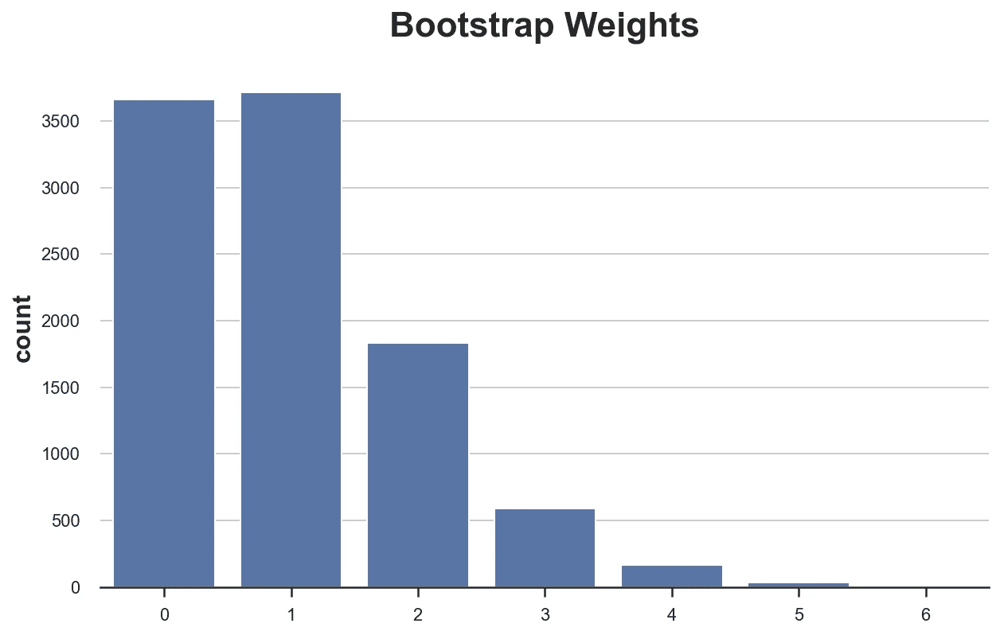
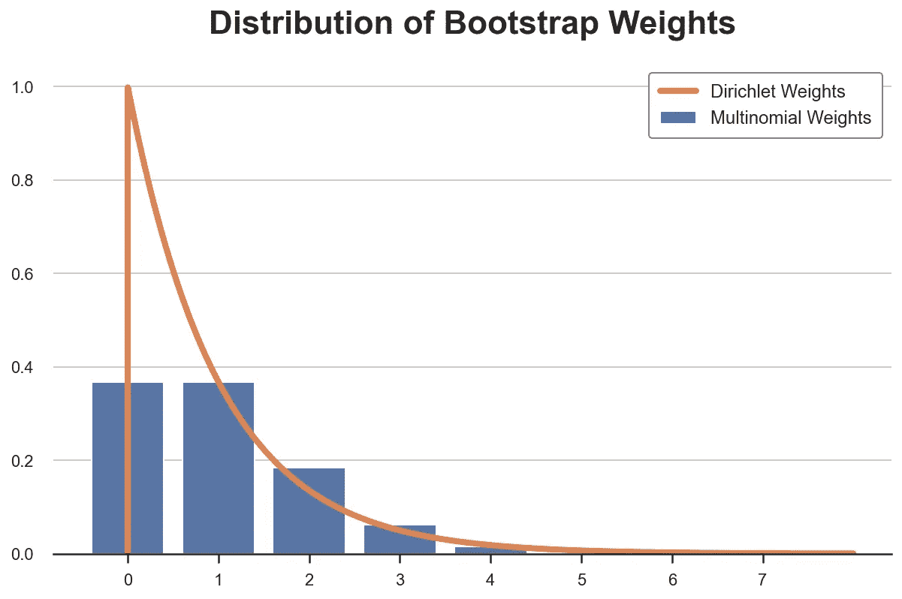
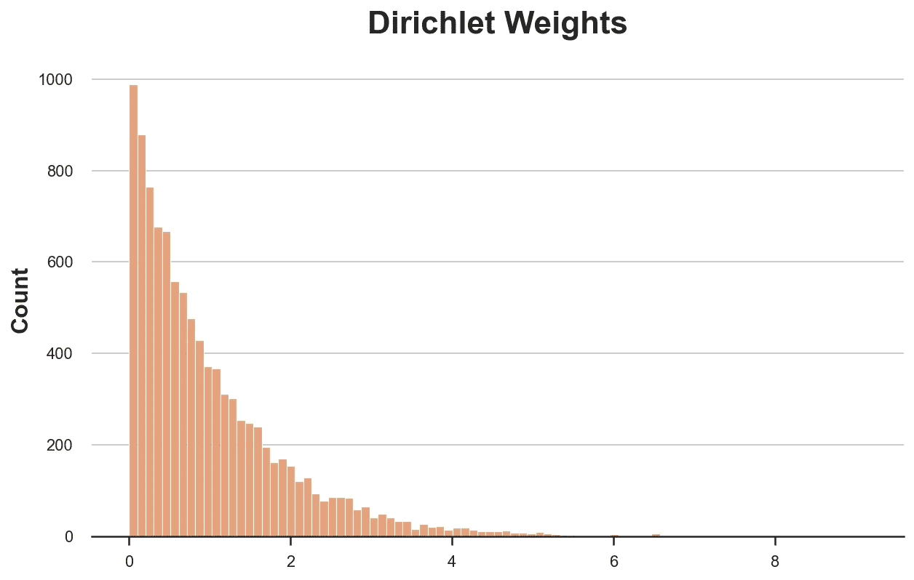
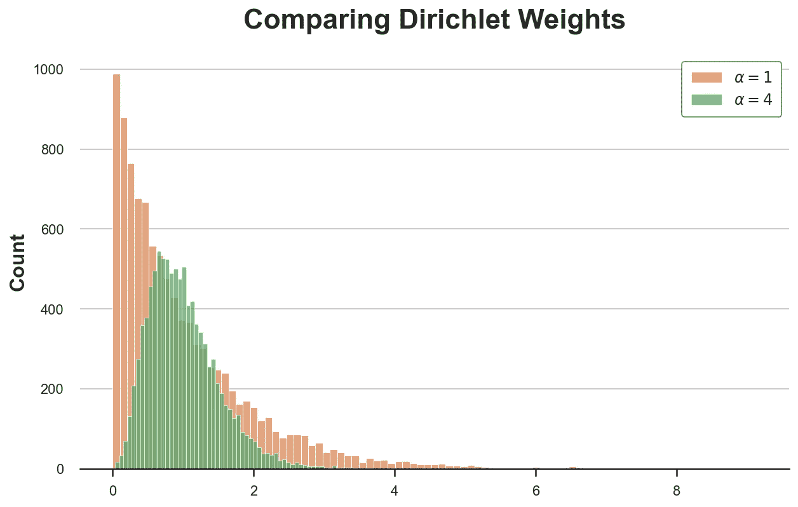
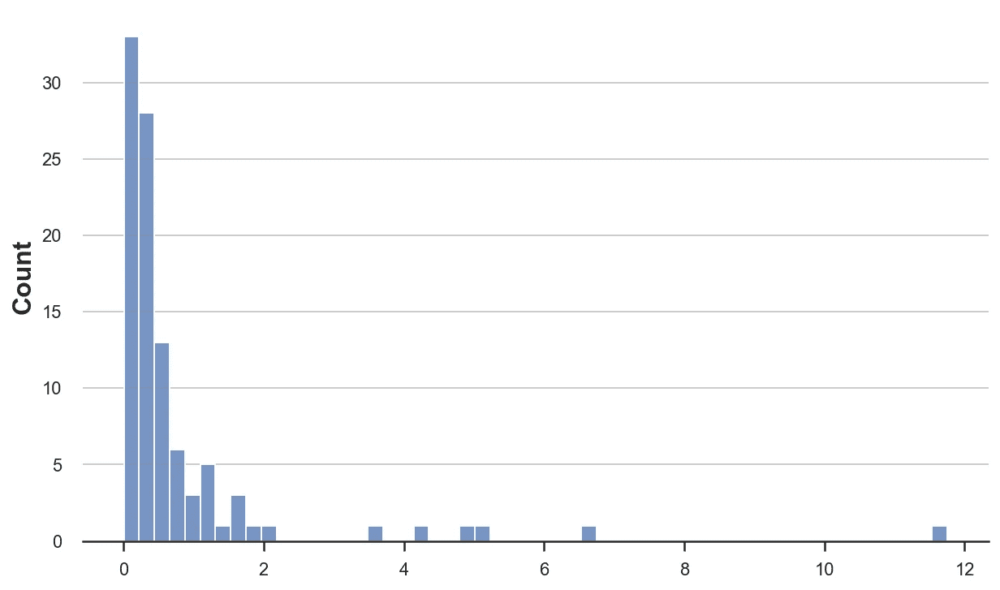
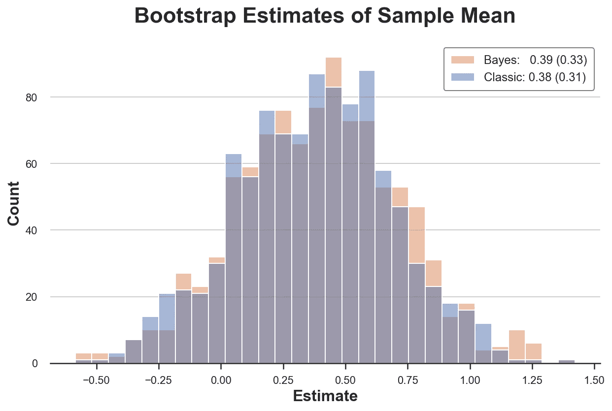
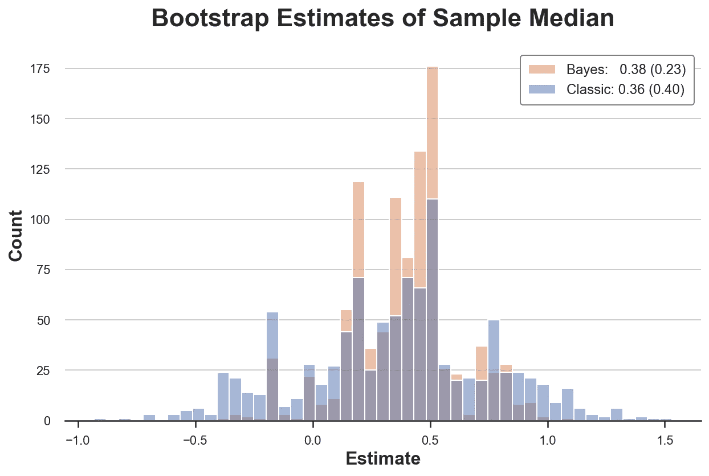
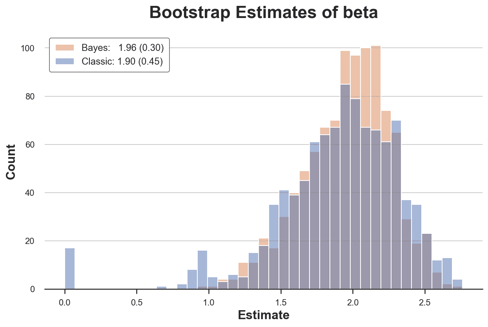

# 贝叶斯自助

> 原文：<https://towardsdatascience.com/the-bayesian-bootstrap-6ca4a1d45148>

## [因果数据科学](https://towardsdatascience.com/tagged/causal-data-science)

## *简单而强大的 bootstrap 扩展的简短指南*

封面图片，由作者使用[nightcafe](https://creator.nightcafe.studio/)生成

在因果推断中，我们不仅仅想要计算治疗效果，我们还想要进行**推断**。理解围绕点估计的不确定性通常比点本身更有信息和价值。在某些情况下，由于 [**中心极限定理**](https://en.wikipedia.org/wiki/Central_limit_theorem) ，计算估计量的(渐近)分布非常容易。例如，在计算 AB 试验或随机对照试验中的平均治疗效果时就是这种情况。然而，在其他情况下，推断更加复杂**，要么是因为很难获得方差的分析估计量，要么是因为它需要难以估计的对象(例如分位数回归中的全密度)。那我们能做什么？**

****bootstrap** 是数据科学的标准答案。这是一个非常强大的程序来估计一个估计量的分布，不需要任何数据生成过程的知识。实现起来也非常**直观和简单**:只需通过多次替换对数据进行重新采样，然后计算样本间的估计值。**

**我们能做得更好吗？答案是肯定的！贝叶斯自举**是一个强大的程序，在很多设置中比自举执行**更好**。特别是，它通常更快，可以给出更紧的置信区间，并避免了许多极限情况。在本文中，我们将更详细地探讨这个简单但功能强大的过程。****

# **自举**

**bootstrap 是一种通过随机**重新采样并替换数据**来计算估计器属性的程序。它首先由 Efron (1979) 提出，现在是数据科学中的标准推理过程。程序非常简单，由以下**步骤**组成。**

**假设你有一个 i.i.d .样本{ *X* ᵢ}ᵢⁿ，你想使用估计量*θ̂(x】*计算一个统计量 *θ* 。你可以用下面的公式来近似θ̂的分布。**

1.  **样本 *n* 观察值与替换样本{*x̃*ᵢ}ᵢⁿ{*x*ᵢ}ᵢⁿ.**
2.  **计算估计量 *θ̂-bootstrap* ( *X̃* )。**
3.  **多次重复步骤 1 和 2。**

***θ̂-bootstrap* 的分布与 *θ̂* 的分布非常接近。**

****自举为什么这么厉害？****

**首先是**容易实现**。除了已经在做的事情之外，它不需要你做任何事情:估计 *θ* 。你只需要做很多次*。事实上，bootstrap 的主要缺点是它的计算成本。如果你的估算过程很慢，自举就变得禁止了。***

***第二，bootstrap 使得**没有分布假设**。它只假设你的样本是总体的代表，观测值是相互独立的。当观察结果彼此紧密相连时，例如在研究社会网络或市场互动时，这一假设可能会被违反。***

*****bootstrap 只是加权吗？*****

***最后，当我们重新采样时，我们所做的是给我们的观察值分配整数权重，这样它们的总和就等于样本大小。这样的分布就是 [**多项式分布**](https://en.wikipedia.org/wiki/Multinomial_distribution) 。***

***让我们通过抽取一个大小为 10.000 的样本来看看多项分布是什么样的。我从`[src.utils](https://github.com/matteocourthoud/Blog-Posts/blob/main/notebooks/src/utils.py)`导入了一组标准库和函数。为了不仅包括代码，还包括像数据和表格这样的输出，我使用了 [Deepnote](https://deepnote.com/) ，一个类似 Jupyter 的基于网络的协作笔记本环境。***

***首先，我们检查权重的总和是否为 1000，或者说，我们生成了相同大小的数据的重新样本。***

***我们现在可以绘制**权重分布**。***

******

***如我们所见，大约 3600 个观察值的权重为零，而几个观察值的权重为 6。或者相当于，大约 3600 个观察值没有被重新采样，而几个观察值被采样了多达 6 次。***

***现在你可能会有一个自然而然的问题:为什么不使用**连续砝码**来代替离散砝码？***

***非常好的问题！**贝叶斯自举**就是答案。***

# ***贝叶斯自助***

***贝叶斯自助法是由 [Rubin (1981)](https://www.jstor.org/stable/2240875) 提出的，它基于一个非常简单的**想法**:为什么不画一个更平滑的权重分布呢？多项式分布的连续等价物是 [**狄利克雷分布**](https://en.wikipedia.org/wiki/Dirichlet_distribution) 。下面我绘制了单次观察的多项式和狄利克雷权重的概率分布(它们分别是泊松分布和伽玛分布)。***

******

***比较权重分布，按作者分类的图像***

***贝叶斯自举有很多优点。***

*   ***第一个也是最直观的一个是，由于它的连续加权方案，它提供的估计比正常的 bootstrap 更加平滑。***
*   ***此外，连续加权方案**防止了拐角情况**的出现，因为任何观测都不会得到零权重。例如，在线性回归中，如果原始样本中没有共线性问题，则不会出现共线性问题。***
*   ***最后，作为贝叶斯方法，我们得到**解释**:估计量的估计分布可以解释为[后验分布](https://en.wikipedia.org/wiki/Posterior_probability)和[无信息先验](https://en.wikipedia.org/wiki/Prior_probability)。***

***让我们现在画一组狄利克雷权重。***

***权重自然总和(大约)为 1，所以我们必须用因子 n 对它们进行缩放。***

***和以前一样，我们可以绘制重量分布图，不同的是现在我们有连续的重量，所以我们必须近似分布。***

******

***狄利克雷权重示例，图片由作者提供***

***您可能已经注意到，狄利克雷分布有一个**参数 *α*** ，我们已经将它设置为所有观测值的 1。它是做什么的？***

****α* 参数本质上决定了被采样的绝对和相对概率。增加所有观察值的 *α* 使得分布不那么偏斜，从而所有观察值具有更相似的权重。对于 *α→∞* ，所有的观测值得到相同的权重，我们回到原始样本。***

***我们应该如何**选择*α*的值？[邵和涂(1995)](https://link.springer.com/book/10.1007/978-1-4612-0795-5) 建议如下。*****

> ***随机权重向量的分布不必局限于 Diri(l，…，1)。后来的研究发现，具有比例 Diri(4，…，4)分布的权重给出了更好的近似(涂和郑，1987)***

***让我们来看看，对于所有观测值来说， *α=4* 的狄利克雷分布与之前对于所有观测值来说， *α=1* 的分布相比如何。***

******

***不同 *α的狄利克雷权重样本，图片作者****

***新的分布更少偏斜，更集中在平均值 1 附近。***

# ***例子***

***让我们看几个例子，比较两种推理过程。***

## ***偏态分布的平均值***

***首先，让我们来看看最简单也是最常见的估计量之一:**样本均值**。首先，让我们从一个[帕累托分布](https://en.wikipedia.org/wiki/Pareto_distribution)中抽取 100 个观察值。***

******

***来自帕累托分布的样本，图片由作者提供***

***这种分布非常**偏斜**，一些观察值比平均值高得多。***

***首先，让我们计算一个再抽样的经典 bootstrap 估计量。***

***然后，让我们写一组随机权重的贝叶斯自举。***

***我们现在可以实现任何引导程序。我使用`[joblib](https://joblib.readthedocs.io/en/latest/)`库来并行化计算。***

***最后，让我们编写一个比较结果的函数。***

******

***样本均值的 Bootstrap 分布，按作者分类的图像***

***在这个设置中，两个程序给出了非常相似的答案。这两个分布非常接近，而且估计量的估计均值和标准差几乎相同，与 bootstrap 过程无关。***

***哪个引导程序**更快**？***

***在 97.8%的模拟中，贝叶斯 bootstrap 比经典 bootstrap 快，并且快了令人印象深刻的 66.5%！***

## ***不加权？没问题***

***如果我们有一个不接受权重的估计量，比如中位数，会怎么样？我们可以做**两级抽样**:首先我们对权重进行抽样，然后根据权重对观测值进行抽样。***

******

***样本中位数的 Bootstrap 分布，按作者分类的图像***

***在这种情况下，贝叶斯 Bootstrap 也比经典 Bootstrap**更精确**，因为 *α=4 时的权重分布更密集。****

## ***结果罕见的逻辑回归***

***现在让我们探索经典自举可能陷入**困境**的两种设置中的第一种。假设我们观察到一个特征 *x* ，正态分布，以及一个二元结果 *y* 。我们对这两个变量之间的关系感兴趣。***

***在这个样本中，我们只在 100 次观察中的 10 次观察到阳性结果。***

***由于结果是二元的，我们拟合一个 [**逻辑回归**](https://en.wikipedia.org/wiki/Logistic_regression) 模型。***

***我们得到的点估计值为 *-23* ，置信区间非常小。***

***我们能自助估计量的分布吗？让我们尝试计算 1000 个 bootstrap 样本的逻辑回归系数。***

***对于 1000 个样本中的 5 个，我们**无法**计算估计值。使用贝叶斯自举不会发生这种情况。***

***在这种情况下，这似乎是一个无关紧要的问题:我们可以忽略这些观察。让我们以一个更危险的例子来结束。***

## ***用很少的处理单元回归***

***假设我们观察到一个二元特征 *x* 和一个连续结果 *y* 。我们再次对这两个变量之间的关系感兴趣。***

***让我们比较一下 *x* 上 *y* 回归系数的两个 bootstrap 估计量。***

******

***作者自举分布图***

***经典的 bootstrap 程序估计的方差比我们的估计量大 50%。为什么？如果我们更仔细地观察，我们会发现在近 20 个重新样本中，我们得到了一个非常不寻常的零估计值！为什么？***

***问题是，在某些样本中，我们可能没有任何观察值**x = 1。因此，在这些重新采样中，估计系数为零。贝叶斯自助不会发生这种情况，因为它不会丢弃任何观察值(所有观察值总是得到正权重)。*****

***这里有问题的部分是我们没有得到任何错误消息或警告。这种偏见非常狡猾，很容易被忽视！***

# ***结论***

***在本文中，我们看到了 bootstrap 的一个强大扩展:贝叶斯 bootstrap。关键思想是，只要我们的估计量可以表示为加权估计量，bootstrap 就相当于带有多项式权重的随机加权。贝叶斯自助相当于用狄利克雷权重加权，即多项式分布的连续等价。具有连续的权重避免了极限情况，并且可以生成估计量的更平滑的分布。***

***这篇文章的灵感来自布朗大学教授[彼得·赫尔](https://sites.google.com/site/aboutpeterhull/home)的以下推文。***

***事实上，除了是一个简单和直观的程序，贝叶斯 Bootstrap 并不是经济学研究生院标准计量经济学课程的一部分。***

## ***参考***

***[1] B. Efron [Bootstrap 方法:再看刀切](https://www.jstor.org/stable/2958830)(1979)*《统计年鉴》*。***

***[2] D .鲁宾，[《贝叶斯自助法》](https://www.jstor.org/stable/2240875) (1981)，*《统计年鉴》*。***

***[3] A. Lo，[贝叶斯自助法的大样本研究](https://www.jstor.org/stable/2241087) (1987)，*《统计年鉴》*。***

***[4] J .邵，d .涂，[杰克尼菲与自举](https://link.springer.com/book/10.1007/978-1-4612-0795-5) (1995)，*斯普林格*。***

## ***密码***

***你可以在这里找到 Jupyter 的原始笔记本:***

***<https://github.com/matteocourthoud/Blog-Posts/blob/main/notebooks/bayes_boot.ipynb> *** 

## ***感谢您的阅读！***

****真的很感谢！*🤗*如果你喜欢这个帖子并且想看更多，可以考虑* [***关注我***](https://medium.com/@matteo.courthoud) *。我每周发布一次与因果推断和数据分析相关的主题。我尽量让我的帖子简单而精确，总是提供代码、例子和模拟。****

****还有，一个小小的* ***免责声明*** *:我写作是为了学习所以错误是家常便饭，尽管我尽了最大努力。当你发现他们的时候，请告诉我。也很欣赏新话题的建议！****