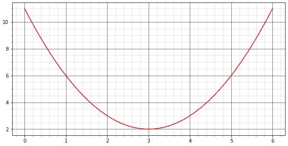
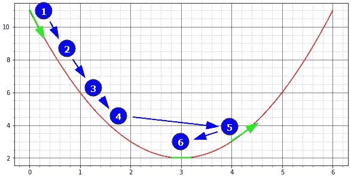
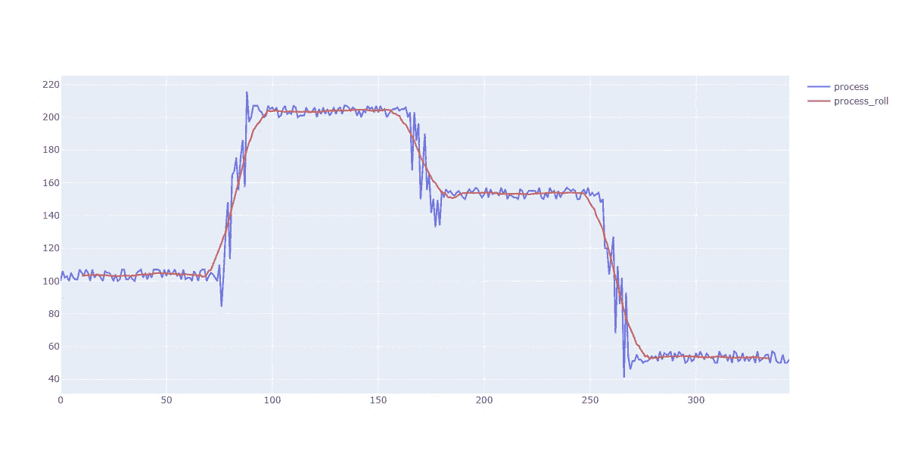
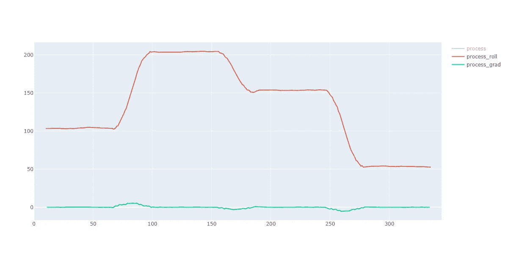
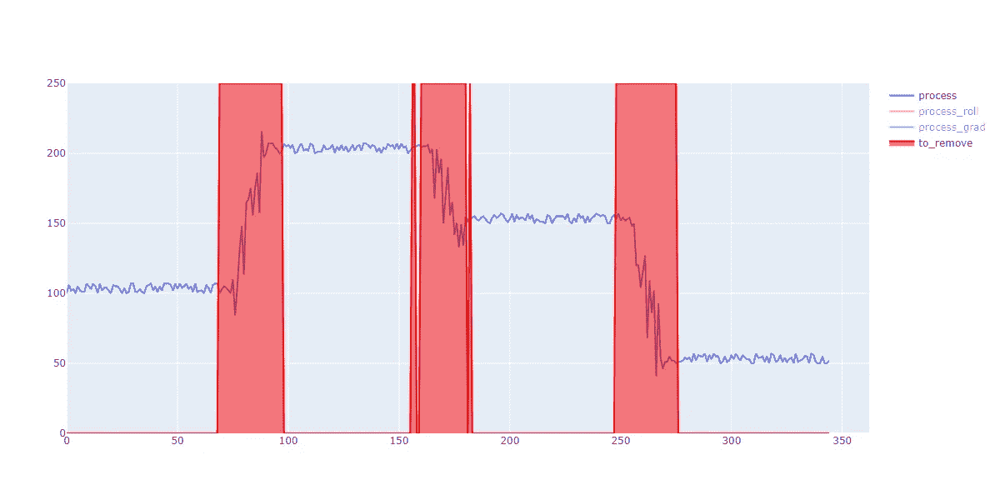

# 渐变之美

> 原文：<https://towardsdatascience.com/the-beauty-of-gradient-7798f4f0dd40>

## 在一个真实的例子中，让我们探索这个简单而强大的计算如何帮助您过滤数据，尤其是不同的生产批次

杰里米·贝赞格在 [Unsplash](https://unsplash.com?utm_source=medium&utm_medium=referral) 上的照片

# 梯度在机器学习中的一般用途

当然，如果你对数据科学感兴趣已经有一段时间了，甚至只有几个星期，你可能听说过梯度下降以及它如何帮助你找到线性函数或神经网络的最佳系数。

成本函数示例-作者图片

一个典型的用例是当您寻找线性回归的最佳参数时。成本函数曲线可能如上图所示。

损失函数(红色)-步长(蓝色)-局部斜率(绿色)-作者提供的图像

从第 1 点开始，我们可以使用每一步的斜率来确定我们的目标是优化损失函数还是偏离它。

*   第一步:x = 0；斜率= -6
*   第二步:x = 0，5；斜率= -5
*   第三步:x = 1；斜率= -4
*   第四步:x = 1，5；斜率= -3
*   第五步:x = 4；斜率= +2
*   第六步:x = 3；slope = 0<= local miminum

Curious about how this gradient (or slope) is calculated? We simply need to use the derivative from the loss function:

Loss function:
f(x)=(x-3)+2
f(x)= x-2 *(3x)+2
f(x)= x-6x+4

导数:
f'(x) = 2x-6

结果:
f '(0)= 2(0)-6 =-4
f '(4)= 2(4)-6 =+2
f '(3)= 2(3)-6 = 0

# 利用梯度过滤生产时间序列

最近，我一直在处理一个案例，一台机器生产许多不同等级的产品，其速度有规律地变化(如下图的时间序列所示)。

由于历史数据中有数百处变化，我们需要确定生产稳定的时期，并消除加速/减速时期:

原始时间序列—作者提供的图像

首先，为了抵消传感器自身不稳定性的影响，我们决定使用滚动窗口(20)来平滑局部变化:

原始时间序列+平滑滚动窗口-作者提供的图像

神奇的事情发生了:通过计算时间序列中每一点的梯度，我们可以很容易地识别出速度变化并向另一个名义速率移动的时刻。

每当这种情况发生时，梯度将从非常低的水平(0=完全稳定)切换到更高的水平(看到绿线上的小突起)。

平滑滚动窗口+梯度计算—作者提供的图像

这种方法的好处是，它对绝对值不敏感:从 50 到 150 或从 100 到 200 切换将给出相同的梯度值，这使得自动分析生产变化容易得多。

然后，只需定义一个梯度阈值，从时间序列中移除变化周期，如下所示:

原始时间序列+排除时段-按作者分类的图像

# 结论:

复杂的问题，例如在一个时间序列中分离稳定和不稳定的时期，从一开始就看起来很有挑战性！

例如，您可能会考虑计算一个“移动绝对差值”来识别这种变化。我们甚至可以考虑将时间序列的第一部分标记为“稳定”和“不稳定”类，然后训练神经网络来识别它们(是的，这肯定是“过度的”，但我们可以做到！).

但是，有时候，最简单的方法仍然是最有效的。

**寻找简单数学函数如何帮助特征工程的另一个例子？** 看看我写得最好的一篇文章，解释“余弦”和“正弦”如何帮助你处理周期性特征:

</cyclical-features-encoding-its-about-time-ce23581845ca>  

与本文对应的代码存储在这里:

<https://github.com/pierrelouisbescond/medium_articles/blob/main/medium_gradient.ipynb>  

请不要犹豫，浏览我在 Medium 上的其他文章:

<https://pl-bescond.medium.com/pierre-louis-besconds-articles-on-medium-f6632a6895ad> 