# 分布式计算初学者指南

> 原文：<https://towardsdatascience.com/the-beginners-guide-to-distributed-computing-6d6833796318>

## 用 Python 实现分布式计算的 7 个基本概念

# 进入分布式世界

越来越多的数据科学家正在冒险进入分布式计算的世界，以扩大他们的计算规模，更快地处理更大的数据集。但是开始您的分布式计算之旅有点像进入另一个世界:势不可挡、令人生畏、令人困惑。


图片来自 giphy.com

但是这里有一个好消息:**你不需要了解分布式计算的所有知识就可以开始。**

这有点像去一个语言不通的国家度假。在登机前，学习如何就当地错综复杂的政治体系展开完整的对话是多余的。但是明智的做法可能是**知道如何在需要的时候四处寻求帮助。**

这篇文章解释了你开始分布式计算需要的 7 个基本概念**。尽早掌握这些基本概念将会节省你数小时的研究时间和以后昂贵的错误。这些概念将通过使用 [Dask](http://www.dask.org) 的 Python 代码来演示。**

让我们开始吧。

# 1.懒惰评估

惰性求值是一种编程策略，它将表达式或变量的求值延迟到需要它的值的时候。与 *strict* 或 *eager evaluation* 相反，在后者中，表达式在被调用时被直接求值。惰性求值通过避免不必要的重复求值，增加了计算的优化并减少了内存负载。


懒惰的北极熊途经[giphy.com](https://giphy.com/gifs/bear-lazy-polar-f4SoNPj4otohG)

让我们用一个思维实验来说明。

来见见 Mercutio，我们的三度封爵分布式计算鼠标专家。


图片来自 [twemoji](https://twemoji.twitter.com/) (CC-BY 4.0 许可证)

茂丘西奥将参与一项实验。这个实验的目的是让茂丘西奥找到穿过迷宫到达最终目的地的最快方法:一块美味的切达奶酪。通过放置面包屑来指引茂丘西奥，可以确定迷宫的路径。这个实验的目标是*尽可能快地拿到奶酪，*所以 Mercutio 每吃一个面包屑就会减 1 分。

在场景 1 中，Mercutio 在您放置第一个面包屑后立即开始行走(用计算术语来说是“执行”)，并跟随您从一个面包屑到另一个面包屑。这样，他当然会最终到达他预定的目的地。他将*也将*已经招致 5 个负点，每经过一个面包屑(和吃一个面包屑)一个负点。这不是问题的错误解决方案，但也不是最佳方案。

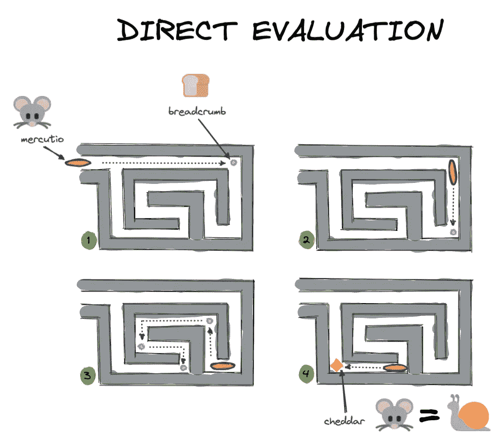

作者图片，表情符号通过 [twemoji](https://twemoji.twitter.com/)

然而，如果茂丘西奥让*推迟*执行死刑，直到你放下奶酪*然后评估形势*，他就能看到整个问题，并找出解决问题的最快方法。

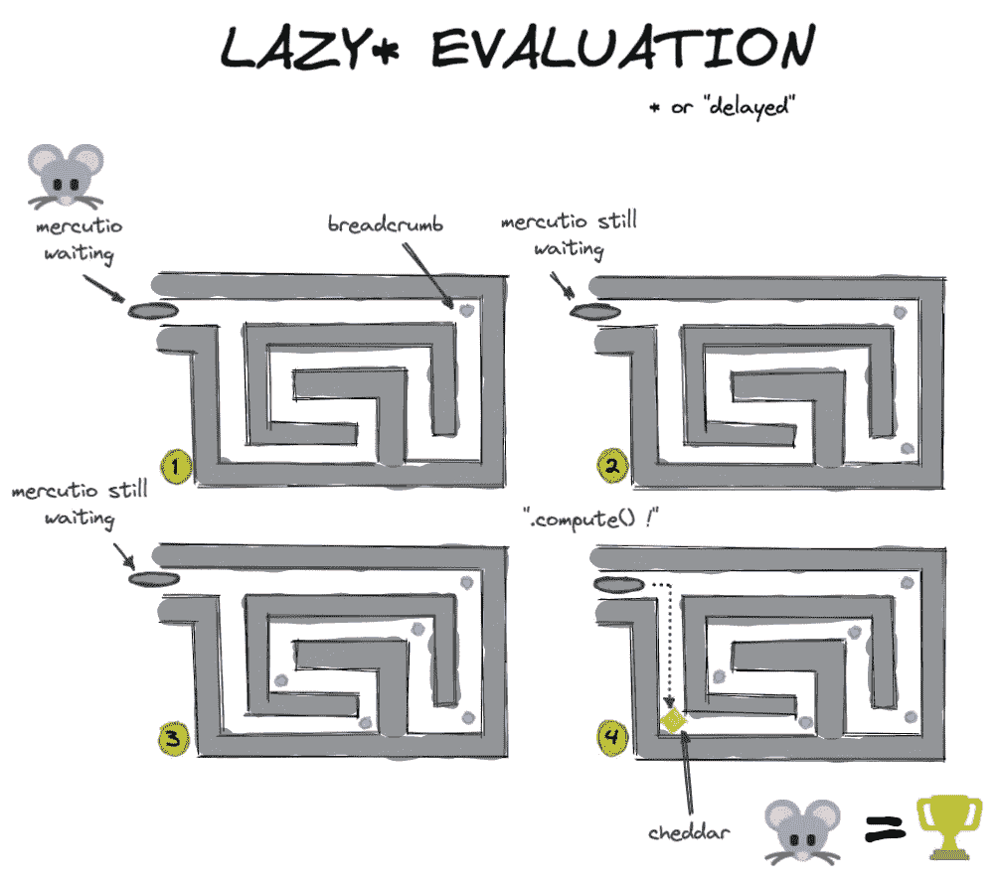

作者图片，表情符号通过 [twemoji](https://twemoji.twitter.com/)

两个茂丘西奥都达到了预期的效果(吃奶酪！)但是**懒惰或“延迟”的评估 Mercutio 能够更快、更有效地完成这些工作**。

## 代码示例

让我们用 Python 代码中的一个例子来演示使用熊猫(急切求值)和 Dask(懒惰求值)。在下面的代码中，我们将创建一个数据帧，调用该数据帧，然后在特定的列上通过计算建立一个 groupby。请注意 pandas 是如何立即返回结果的，而 Dask 只有在您明确告诉它开始计算时才会这样做。

```
import pandas as pd# create a dataframe
df = pd.DataFrame({
    "Name": ["Mercutio", "Tybalt", "Lady Montague"],
    "Age": [3, 2, 4],
    "Fur": ["Grey", "Grey", "White"]}
  )# call the DataFrame
df
```

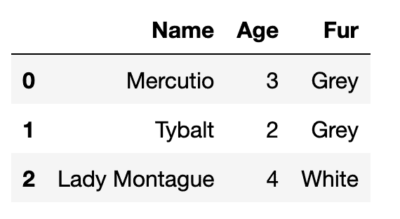

熊猫立即返回数据帧的内容(图片由作者提供)

```
# define a groupby computation
df.groupby('Fur').Age.mean()
```


熊猫立即返回分组结果

我们看到熊猫热切地评价我们定义的每一句话。DataFrame 定义和 groupby 计算的结果都会立即返回。当在 pandas 中工作时，这是预期的行为，并且当处理相对较小的数据集时，这种行为很好，可以很好地容纳在机器的内存中。

当您的数据帧包含的数据超过您的机器在内存中可以容纳的数据时，问题就出现了。Pandas 别无选择，只能尝试将数据加载到内存中，但失败了。

这就是像 Dask 这样的分布式计算库评估迟缓的原因:

```
import dask.dataframe as dd# turn df into a Dask dataframe
dask_df = dd.from_pandas(df, npartitions=1)# call the dataframe (no contents returned)
dask_df
```


dask 只是懒洋洋地返回数据帧的模式，而不是内容(图片由作者提供)

```
# define the same groupby computation as above (no results returned)
dask_df.groupby('Fur').Age.mean()
```

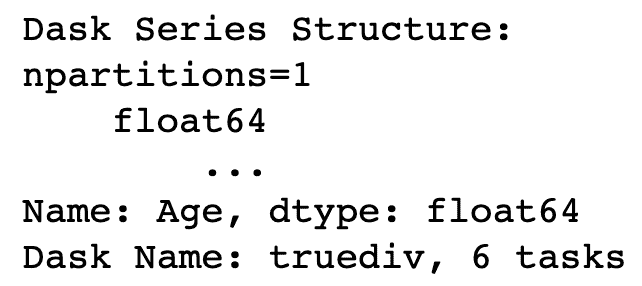

dask 只是懒洋洋地返回 groupby 的模式，而不是结果(作者的图片)

**当我们调用 DataFrame 时，Dask** **不会返回结果**，当我们通过计算定义 groupby 时也不会。它只返回结果的模式或大纲。

只有当我们专门调用`.compute()`时，Dask 才会实际执行计算并返回结果。这样，它可以等待找到达到预期结果的最佳路径，就像上面场景 2 中的 Mercutio 一样。

```
# trigger computation
dask_df.groupby('Fur').Age.mean().compute()
```

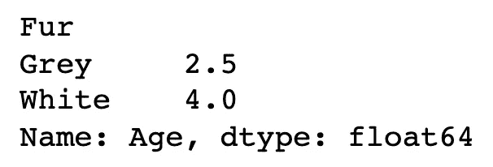

作者图片

惰性评估允许像 Dask 这样的库通过识别令人尴尬的并行计算部分来优化大规模计算。

# 2.令人尴尬的平行

术语“令人尴尬的并行”用于描述**计算或问题，这些计算或问题可以很容易地分成更小的任务，每个任务都可以独立运行。**这意味着任务之间没有依赖关系，它们可以以任何顺序并行运行。这些类型的问题有时也被称为“完全平行”或“令人愉快的平行”。


图片来自 freesvg.org[，公共领域](https://freesvg.org/straight-lines-of-alternating-black-and-white-squares-illustration)

让我们回到我们的思想实验。

我们亲爱的朋友茂丘西奥已经加入了两个同伴，他们也将参加一个懒惰的评估奶酪发现任务。我们将为这三个捕鼠人设置两个不同的实验。

在实验 1 中，切达奶酪块被分成 3 等份，每份放在不同迷宫的尽头。在实验 2 中，奶酪块保持完整，并被放在迷宫 3 尽头的一个上锁的盒子里。迷宫 1 和 2 都有一个上锁的盒子，里面有打开下一个迷宫盒子的钥匙。这意味着老鼠 1 需要从他们的迷宫中获得钥匙，并将其传递给老鼠 2，老鼠 2 需要为老鼠 3 做同样的事情。两个实验的目标都是吃掉整块奶酪。

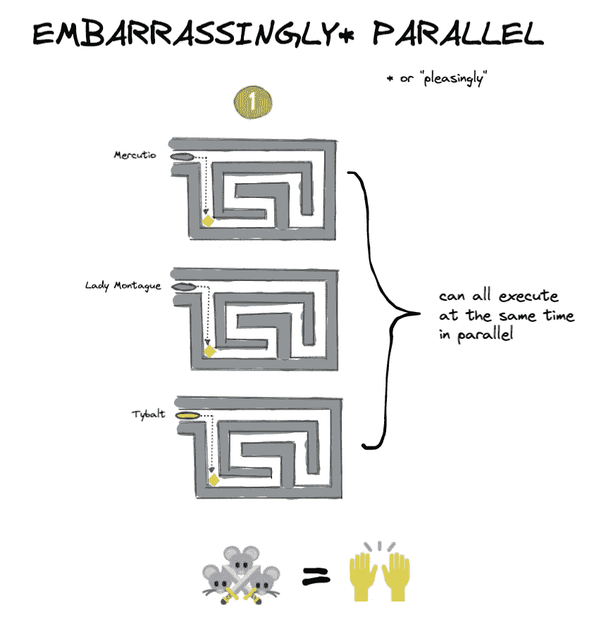

作者图片，表情符号通过 [twemoji](https://twemoji.twitter.com/)

实验 1(上图)是一个令人尴尬的**并行**问题的例子:每个 Mouseketeer 可以独立地解决他们自己的迷宫，从而并行地完成整体任务(吃掉那块奶酪)。

实验 2(下图)是一个根本无法并行化的问题的例子:解决每个迷宫取决于先解决前一个迷宫。

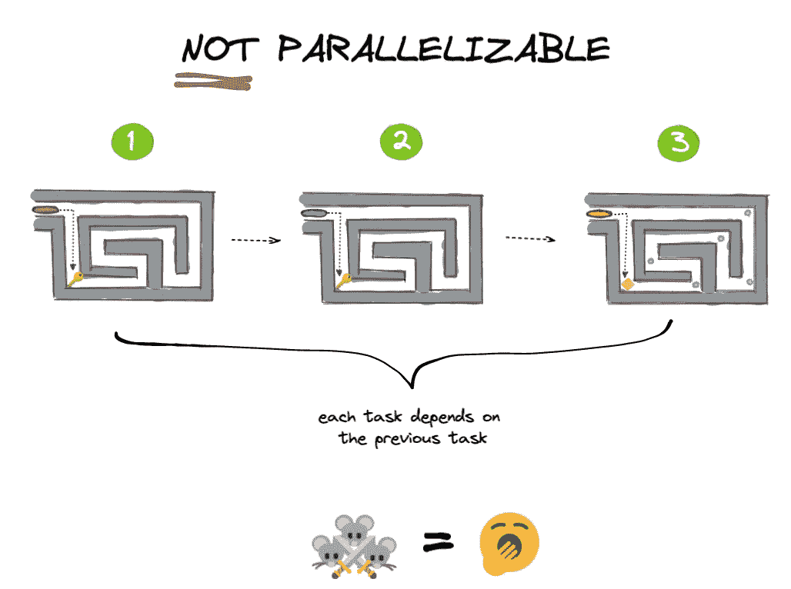

作者图片，表情符号通过 [twemoji](https://twemoji.twitter.com/)

实际上，你在分布式计算中遇到的问题将会处于完全令人尴尬的并行和完全不可并行之间。在大多数情况下，您的部分计算可以轻松地并行运行，而其他部分则不能。像 Dask 这样的分布式计算库会帮你解决这个问题。

## 代码示例

一个简单的 for 循环是一个常见的令人尴尬的并行问题的例子:循环的每次迭代都可以独立运行。蒙特卡洛模拟是一个更复杂的例子:它是一种使用重复随机抽样来估计概率的模拟。每个随机抽样独立运行，不会以任何方式影响其他抽样。

```
# a simple for loop is an embarrassingly parallel problemfor i in range(0,5):
    x = i + 5
    print(x)
```

将分区的 Parquet 文件读入 Dask 数据帧是另一个令人尴尬的并行问题的例子。

```
df = dd.read_parquet(“test.parquet”)
df.visualize()
```

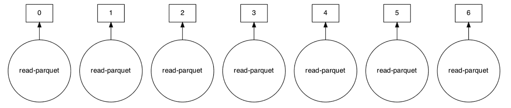

作者图片

为了进行比较，下面是在相同数据帧`df`上通过计算得出的一个组的任务图:

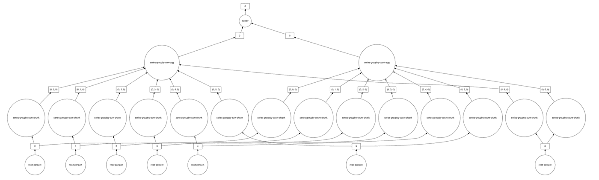

作者图片

这显然是**而不是**一个令人尴尬的并行问题:图中的一些步骤依赖于前面步骤的结果。这并不意味着问题根本不能并行化；Dask 仍然可以通过将您的数据划分到**分区来并行化*部分的*计算。**

[](https://coiled.io/blog/common-dask-mistakes/) [## 使用 Dask 时要避免的常见错误

### 第一次使用 Dask 可能是一个陡峭的学习曲线。经过多年的建设 Dask 和引导人们通过…

coiled.io](https://coiled.io/blog/common-dask-mistakes/) 

# 3.划分

分区是数据的逻辑划分，可以独立于其他分区进行处理。分区被用于分布式计算环境的许多领域:Parquet 文件被划分为分区，Dask 数据帧和 Spark RDDs 也是如此。这些批量数据有时也称为“块”。

在上面令人尴尬的平行实验 1 中，我们将实验的目标(奶酪块)分成了 3 个独立的部分，或称块。然后，每个 Mouseketeers 可以在单独的分区上做必要的工作，共同实现吃掉奶酪块的总体目标。

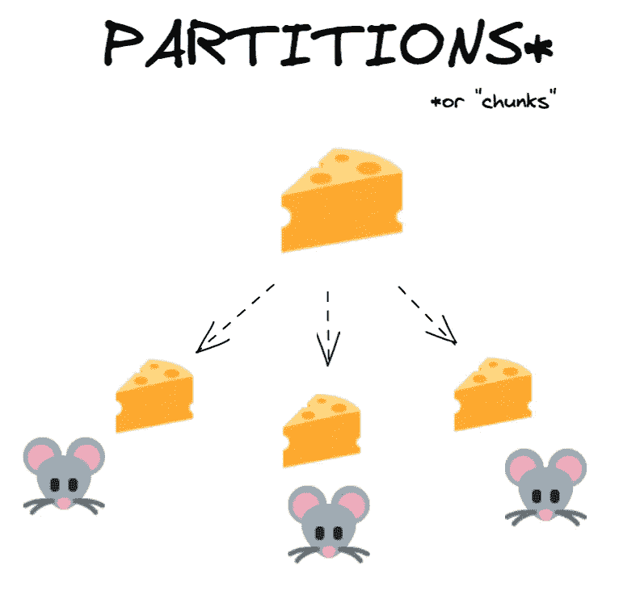

作者图片，表情符号通过 [twemoji](https://twemoji.twitter.com/)

Dask 数据帧也分为分区。Dask 数据帧中的每个分区都是一个独立的 pandas 数据帧，可以发送给单独的工作机进行处理。

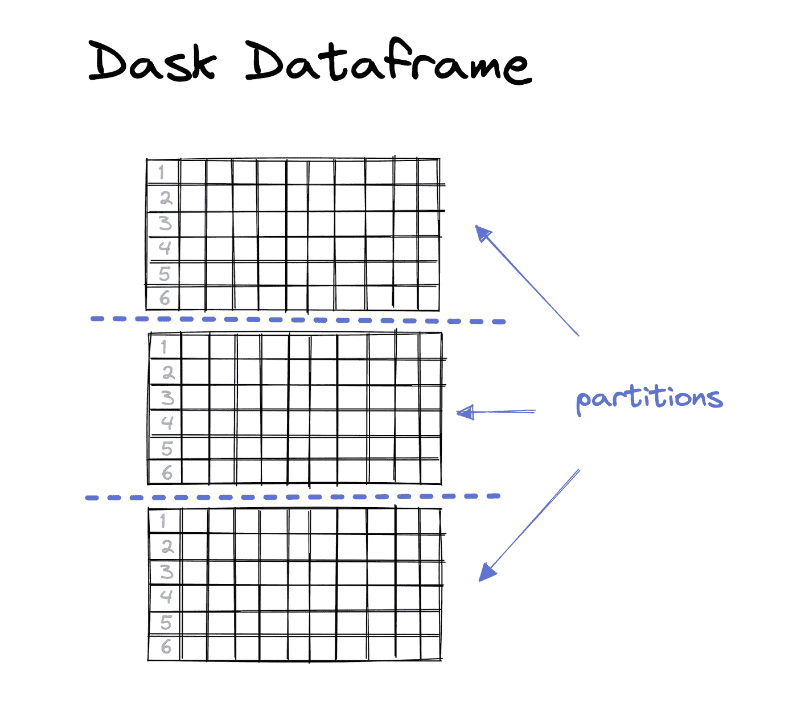

作者图片

当您[向 Parquet](https://coiled.io/blog/parquet-file-column-pruning-predicate-pushdown/) 写入 Dask 数据帧时，每个分区都将被写入它自己的 Parquet 分区。

```
df = dask.datasets.timeseries(
  "2000-01-01",
  "2000-01-08",
  freq="1h",
  partition_freq="1d"
)df.npartitions>> 7df
```

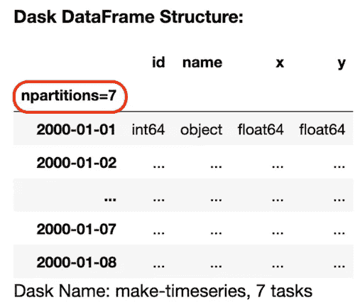

作者图片

```
# write each dask partition to a separate Parquet partition
df.to_parquet(“test.parquet”)
```

为了将我们到目前为止讨论的概念结合起来，将分区的拼花文件加载到 Dask 数据帧将是一个令人尴尬的并行问题，因为每个拼花分区都可以加载到它自己的 Dask 数据帧分区中，而不依赖于其他分区:

```
df = dd.read_parquet(“test”)
df.visualize()
```


作者图片

类似上面的任务图是由一个**调度程序创建和委派的。**

# 4.调度程序

调度器是一个计算机进程，它在你的分布式计算系统中协调数据的分布和对数据的计算。它确保数据在多个进程中同时得到高效、安全的处理，并根据可用资源分配工作负载。


图片来自 giphy.com

在一个简单的令人尴尬的并行问题中，比如并行化一个`for` 循环，跟踪谁在做什么是相对容易的。但是，当处理包含数百万甚至数十亿行数据的数据集时，这就变得更加困难了。哪台机器有哪部分数据？我们如何避免重复？如果有重复的，我们应该使用哪个副本？我们如何将所有的分区正确地拼凑成一个有意义的整体？

回到茂丘西奥和他的朋友们，假设我们的三名捕鼠队员每人负责准备一顿复杂大餐的一个独立部分:茂丘西奥炒洋葱，提伯特磨碎奶酪，蒙塔古夫人蒸花椰菜。


作者图片，表情符号通过 [twemoji](https://twemoji.twitter.com/)

现在想象一下，不是 3 只而是 30 只老鼠在这个厨房里一起工作，它们的活动必须仔细协调和同步，以尽可能充分利用现有的厨房用具。如果我们把这种协调任务留给 30 只老鼠自己，很快就会出现混乱:每只老鼠都忙于自己独立的工作，无法清楚地了解整体情况，并以最有效的方式分配任务和资源。老鼠将被提示使用同样的锅和刀，这顿饭很可能不会按时吃完。

输入主厨。


表情符号 via [twemoji](https://twemoji.twitter.com/)

主厨(又名“调度”)掌握着这顿饭的权威食谱，并根据需要将任务和资源分配给每只烹饪老鼠。当食物的各个部分都准备好了，每只老鼠会把它们的工作结果反馈给主厨，主厨会把它们组合成最终的产品。

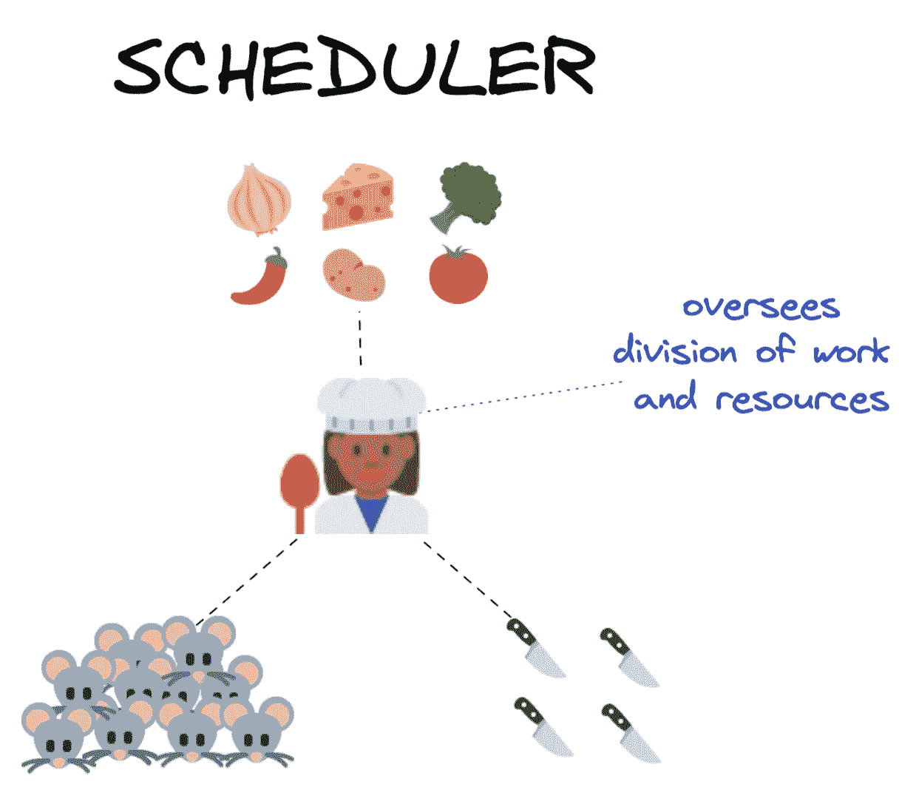

作者图片，表情符号通过 [twemoji](https://twemoji.twitter.com/)

有许多不同种类的调度程序，了解更多关于您计划使用的分布式计算解决方案的具体选项会很有用。根据您是在本地还是远程集群上工作，调度程序可能是单台机器中的独立进程，也可能是完全自治的计算机。

调度器是任何分布式计算**集群**的中枢。

# 5.簇

集群是作为一个单元一起工作来执行工作的一组计算机或计算进程。集群构成了分布式计算系统的核心架构。

不管具体的实现或架构如何，集群都有许多共同的元素:客户机、调度器和工作器。

**客户端**是您编写包含计算指令的代码的地方。对于 Dask，它是您的 iPython 会话或 Jupyter 笔记本(或者您编写和运行 Python 代码的任何地方)。

**调度器**是协调你的分布式计算系统的计算机进程。对于笔记本电脑上的本地集群，这只是一个单独的 Python 进程。在大型超级计算机集群或云中的远程集群的情况下，调度程序通常是一台自治计算机。

**工作者**是在数据分区上执行计算的实际工作的计算机进程。在您的笔记本电脑上的本地集群中，每个工作者都是位于您的机器的独立核心上的进程。在远程集群中，每个工作者通常是它自己的自治(虚拟)机器。

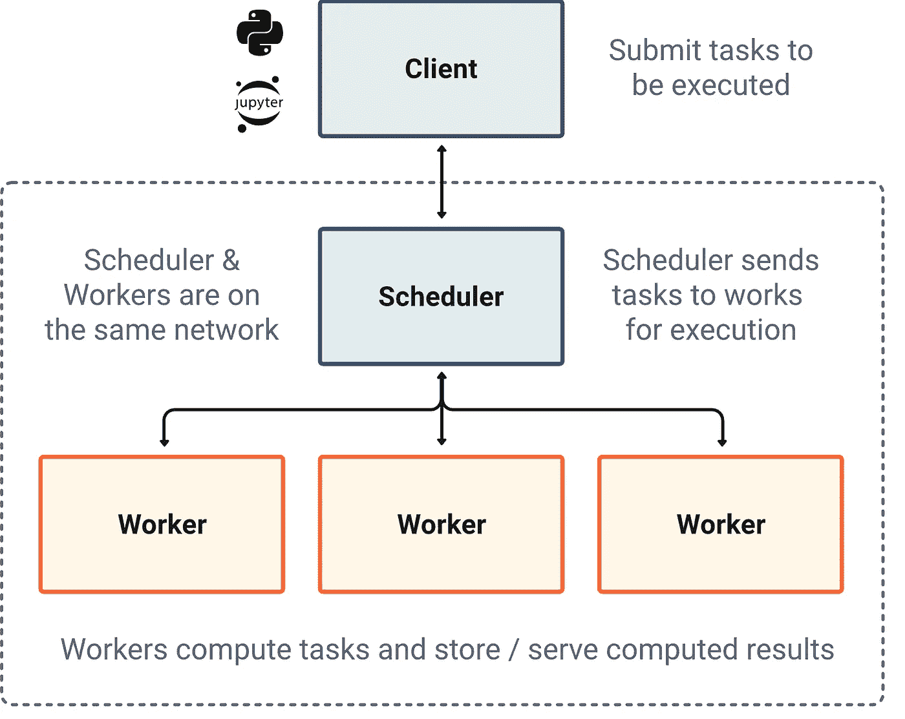

图片来自 dask.org

集群既可以存在于本地的一台机器上，也可以分布在服务器或云中的各种(虚拟)机器上。这意味着集群可以由以下各项构成:

*   多核心*在*一台机器内，
*   在同一个物理空间内的多台物理机*(一台高性能超级计算机)，*
*   多个虚拟机分布在物理空间中(云计算集群)

# 6.纵向扩展与横向扩展

在分布式计算环境中工作时，您会经常听到人们使用术语“纵向扩展”和“横向扩展”。这用来表示使用本地*集群和远程*集群的区别。“扩大规模”意味着在当地使用更多的资源*。“横向扩展”意味着远程使用更多资源*。**

**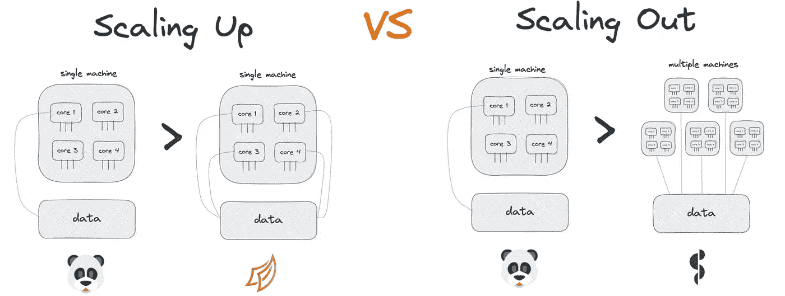**

**作者图片，表情符号通过 [twemoji](https://twemoji.twitter.com/)**

**例如，从使用 pandas 运行计算(它只使用您计算机中的一个内核)过渡到使用一个*本地* Dask 集群是**向上扩展**的一个实例。将相同的工作负载从 pandas 转移到具有盘绕式的*远程* [Dask 集群就是**向外扩展**的一个例子。](https://coiled.io/)**

```
**# scale computations OUT to a cloud cluster# launch cloud cluster with Coiled
import coiled
cluster = coiled.Cluster(n_workers=20)# connect cluster to Dask
from dask.distributed import Client
client = Client(cluster)# run computations over on 40GB+ data on remote cloud cluster
ddf = dd.read_parquet(
  's3://coiled-datasets/timeseries/20-years/parquet/'
)ddf.groupby('name').x.mean().compute()**
```

****纵向扩展**还可能涉及从 CPU 到 GPU 的过渡，即“硬件加速”。Dask 可以用`cudf`代替 pandas 将你的数据帧操作转移到你的 GPU 上进行大规模加速。(感谢[雅各布·汤姆林森](https://medium.com/u/9f6be484d42b?source=post_page-----6d6833796318--------------------------------)对这一点的阐述。)**

# **7.并行计算与分布式计算**

**无论执行计算的进程是否使用单个共享内存，并行计算和分布式计算的区别就是**。****

**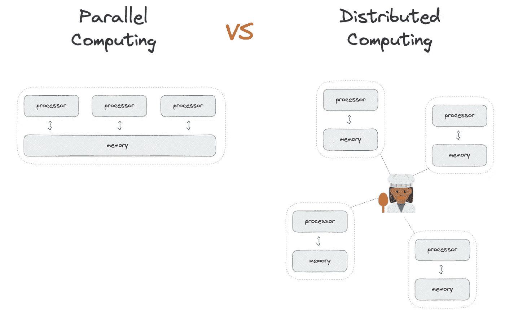**

**作者图片，表情符号通过 [twemoji](https://twemoji.twitter.com/)**

**并行计算使用共享一个内存的多个处理器执行任务。这种共享内存是必要的，因为不同的进程正在一起处理同一项任务。并行计算系统受到可以连接到共享内存的处理器数量的限制。**

**另一方面，分布式计算使用多台自主计算机执行任务，没有单一的共享内存；计算机使用消息传递相互通信。这意味着一个工作单元被分成几个独立的任务，一个中央调度程序整理每个任务的结果，并将最终结果返回给用户。分布式计算系统理论上是无限可扩展的。**

# **穿上和脱下喷气背包！**

**本文中介绍和解释的 7 个概念为您在分布式计算的广阔天地中找到立足点提供了必要的基础。现在是时候带上喷气背包，继续独自探索了。**

**Dask 教程对于任何认真探索分布式计算可能性的人来说都是一个很好的下一步。这是一个自定进度的教程，您可以在 1-2 小时内完成。**

**感谢您的阅读！[在 LinkedIn 上关注我](https://www.linkedin.com/in/richard-pelgrim/),了解定期的分布式计算更新和技巧。**

**请考虑成为支持写作社区的媒体成员:**

**[](https://richardpelgrim.medium.com/membership) [## 使用此推荐链接加入媒体

### 作为一个媒体会员，你的会员费的一部分会给你阅读的作家，你可以完全接触到每一个故事…

richardpelgrim.medium.com](https://richardpelgrim.medium.com/membership)**