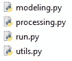
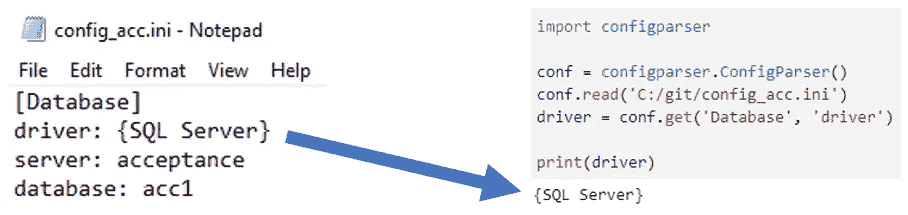
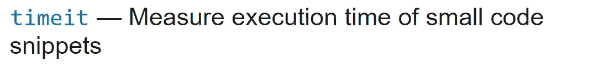
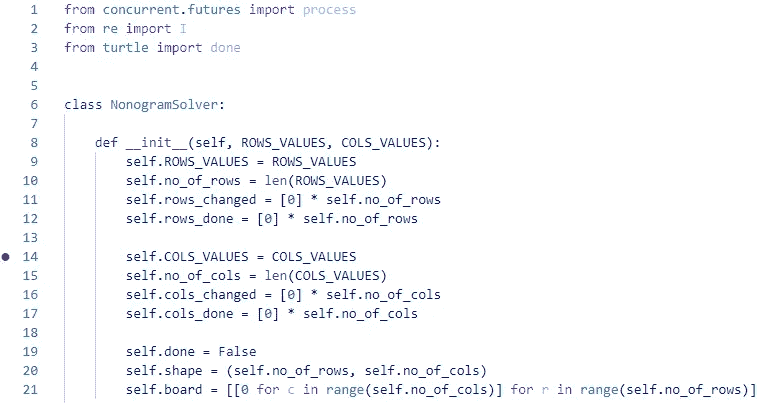
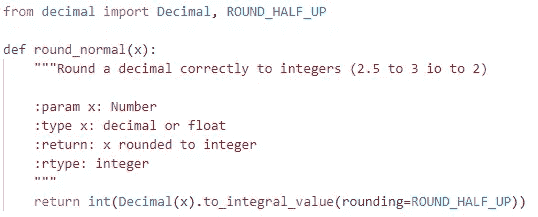
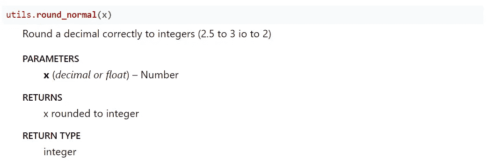

# 没有计算机科学学位的数据科学初学者的最佳编码技巧

> 原文：<https://towardsdatascience.com/the-best-coding-tips-for-any-data-science-beginner-without-a-cs-degree-3881e6142668>


Ashkan Forouzani 在 [Unsplash](https://unsplash.com?utm_source=medium&utm_medium=referral) 上的照片

## 如何编写生产就绪代码？

**人们可以通过许多不同的方式过渡到数据科学领域。如果你没有技术背景，编程部分可能会显得令人望而生畏。我的背景不是计算机科学。在成为数据科学家之前，我是一名数学老师。在我从事数据科学的第一年，我有幸与一些 IT 重量级人物共事。以下是对我帮助最大的提示。**

## 技巧 1:组织你的代码

编写一个运行完整流程的大型脚本似乎很诱人。或者就这样发生了:你从小处着手，然后你意识到你需要增加一些代码行。通过多次这样做，脚本变得越来越大。

这种方法有一些主要的缺点。首先，很难理解这个脚本做了什么，因为它做了很多事情。如果几个月后你回头看，很可能你不明白发生了什么。其次，您只能将脚本用于这个特定的过程。对于下一个项目，你需要重新开始。

解决方案很简单:将脚本分成函数和模块。每个函数应该只做一件事。通过将相关函数分组到一个模块(文件)中，您的代码变得易于理解和重用。您可以在下一个项目中从模块中导入函数或类。

什么时候开始组织都不晚！在软件工程中，你有一种叫做重构的实践，在这种实践中，你重构你的代码，而输出保持不变。



模块。图片作者。

## 技巧 2:不要做硬编码

硬编码是在源代码中存储配置或输入数据的实践。这可以是文件路径、URL、远程主机名或用户名。

为什么这是一种不好的做法？您的代码只能在特定的环境下工作，如果某些条件发生变化，您需要更改源代码。这意味着搜索你的代码，找到所有你放它的地方。

相反，您应该从配置文件、数据库、用户输入或其他外部来源获取配置或输入数据。这使得更新条件变得容易。每个环境都有自己的配置文件。为了从配置文件中提取数据，您可以使用一个[配置解析器](https://docs.python.org/3/library/configparser.html)。



左边是配置文件，右边是从文件中提取数据的代码。图片作者。

## 提示#3:不同的错误是进度

开始的时候很沮丧。你需要习惯各种错误。您的代码无法工作，并且需要花费大量时间来找到所有错误消息的解决方案。但是，如果你的程序说不，不要失望，因为你修复的错误越多，你解决它们的能力就越强。

在我作为数据科学家的第一年，我和一个很好共事的人一起工作。他很高兴，因为错误信息与之前的不同，而新的错误让我很沮丧。这对我是一个教训，并帮助我继续前进。


😁👍由[布雷特·乔丹](https://unsplash.com/@brett_jordan?utm_source=medium&utm_medium=referral)在 [Unsplash](https://unsplash.com?utm_source=medium&utm_medium=referral) 上拍摄的照片

## 提示 4:不要重新发明轮子

当你是一个初学者时，你必须意识到你不需要从头开始写每一个功能。假设你想用 Python 来抓取一个网站，如果没有 [BeautifulSoup](https://www.crummy.com/software/BeautifulSoup/bs4/doc/) 或其他抓取包，你的工作会变得相当复杂。或者使用数据科学，你不需要实现机器学习模型背后的所有数学，因为 scikit-learn 是你的朋友。这些例子有些夸张，但也有很多小任务适用于此。

> 你想想或者需要的话，大概已经有了！

记住这一点，开始写你的程序，在你编码之前搜索！


照片由 [Christian Wiediger](https://unsplash.com/@christianw?utm_source=medium&utm_medium=referral) 在 [Unsplash](https://unsplash.com?utm_source=medium&utm_medium=referral) 上拍摄

## 技巧 5:优化你的代码

在大学或课程中，表格数据集大部分时间都很小。您不必考虑代码优化，for 循环也不是问题。当你开始用杂乱的大数据解决业务问题时，它将是。您的代码可以在开发环境中使用小数据集很好地工作，但是在生产中您的过程可能会花费太长时间。

一个数据科学的例子:不要迭代数据帧行。而是使用`apply`函数、`np.where`或其他矢量化解决方案。

这里有一些让你开始的建议。



timeit 可能也很有用，它是一个 Python 库，提供了一种简单的方法来为小代码片段计时。图片作者。

## 技巧 6:处理异常并编写测试

生产就绪代码的一个重要部分是处理异常。它使你的代码健壮。如果你不处理异常，你的程序将会崩溃并以一种不受控制的方式退出。

Python 中处理异常的方式是使用`try`、`except`块。首先，您尝试执行一些代码行，如果代码失败，except 块将接管。可选地，您可以添加一个`else`或`finally`块。

如果你想了解更多，本教程将解释异常处理。

学习测试你的代码也是有帮助的。在开发过程中，您可以编写断言。使用断言，您可以进行健全性检查，以查看您的代码是否如预期的那样运行。如果`x`等于`1`，`assert(x==1)`将返回`True`。如果不是这样，`assert`语句抛出一个断言错误。如果您创建一个测试文件，并添加带有断言的小函数，这些函数一起可以成为您的单元测试，并且您可以自动化您的测试。

## 技巧 7:学习如何正确调试你的代码

如果你使用`print`语句来检查你的代码在做什么，你最好使用调试器。调试器为您提供了在任何地方暂停或冻结程序的工具。通过设置断点，您的代码暂停，您可以检查那一刻的状态。您可以逐句通过您的代码，您可以检查逻辑或变量值。

如果您使用 PyCharm 或 VS Code 之类的 IDE 来运行代码，您可能知道如何调试。python 的另一个选择是使用 Python 调试器。



断点设置在第 14 行(红点)。图片作者。

## 技巧 8:添加日志记录

通过日志记录，您可以跟踪软件运行时发生的事件。这是你程序的重要部分，因为它在开发过程中有帮助。在生产中，日志将使检测问题的原因变得更加容易。没有，你将很难找到它。

记录真的很容易。在 Python 中，你只需要写下面两行代码:

```
import logging 
logging.basicConfig(filename='<filename>.log', level=logging.INFO)
```

在这种情况下，日志记录级别设置为 info，因此日志文件将包含所有 info、warning、error 和 critical 消息。如果将级别设置为错误，则只有错误和严重消息会写入日志文件。

当您想要记录一条信息消息时，键入`logging.info('<message>')`，对于一条错误消息:`logging.error('<message>')`

就这么简单！

## 技巧 9:添加文档

是的，文档是个无聊的话题。写下你的代码做了什么需要时间，也许没有人会看它。另一方面，如果你想写专业的代码，你肯定应该写文档！你知道一个没有适当文档的流行包吗？

记录代码最简单的方法是在源代码中留下注释，尽管我不推荐这样做。更好的方法是使用像[狮身人面像](https://www.sphinx-doc.org/en/master/)这样的软件包。遵循[教程](https://www.sphinx-doc.org/en/master/tutorial/index.html)，你的文档马上就可以运行了！编写文档的另一个好处是，它将改进代码的组织方式，因为您自动地必须考虑它。

此图像中的文档字符串:



函数内的 Docstring。图片作者。

显示此文档:



上述功能的文档网页。图片作者。

## 最后的想法

你可能会发现学习 [git](https://docs.github.com/en/get-started/using-git/about-git) 、[面向对象编程](https://kinsta.com/blog/python-object-oriented-programming/)、[空间&时间复杂度](https://www.geeksforgeeks.org/time-complexity-and-space-complexity/)、[数据结构](https://realpython.com/python-data-structures/)、[反模式](https://www.freecodecamp.org/news/antipatterns-to-avoid-in-code/)和[算法](https://www.khanacademy.org/computing/computer-science/algorithms)很有用。理解这些主题肯定会提高你的编码技能，并且更容易与技术人员交流。尽管最终，数据科学工作最重要的部分是使用数据增加商业价值。如果你是一名数据科学家，不要害怕问一些有经验的 IT 人员他们将如何从技术上解决问题。这让您有更多时间关注数据和业务价值。

我希望这篇文章是有帮助的！享受编码！

*别忘了* [*订阅*](https://hennie-de-harder.medium.com/subscribe) *如果你想在我发表新文章时收到电子邮件。*