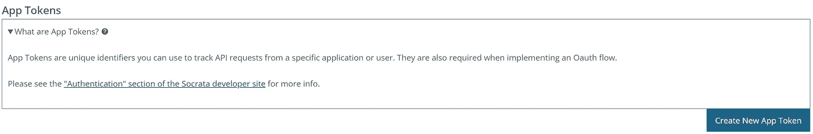
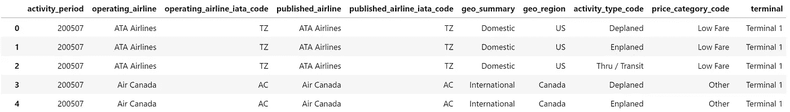

# 当然，最好的数据是免费数据

> 原文：<https://towardsdatascience.com/the-best-data-is-free-data-of-course-b88230b5b47f>

## 使用 Socrata 开放数据 API 和 sodapy 包访问大量的开放数据


[j](https://unsplash.com/@janicetea?utm_source=medium&utm_medium=referral) 在 [Unsplash](https://unsplash.com?utm_source=medium&utm_medium=referral) 上拍照

## 介绍

数据科学项目常用的数据仓库是 Kaggle 和 UCI 机器学习仓库。然而，那里可用的许多数据集是合成的，并不代表真实世界。

联邦、州和地方政府提供了大量真实世界的开放数据，您可以也应该在您的项目中使用这些数据。在这篇文章中，我将分享获得访问权限的简单步骤。你所需要的只是 Socrata 开放数据 API 和 sodapy 包。

出于解释的目的，我们将使用来自旧金山开放数据仓库 DataSF 的[空中交通乘客统计](https://data.sfgov.org/Transportation/Air-Traffic-Passenger-Statistics/rkru-6vcg)数据集。

## 1.获取 Socrata 应用程序令牌

你的第一步是在[https://data.sfgov.org/login](https://data.sfgov.org/login)注册一个免费账户，获得一个应用令牌。获得凭据后，单击创建新的应用程序令牌并完成必填字段。



您将被要求输入应用程序令牌的名称和描述，任何唯一的名称都可以。您的应用程序令牌会自动生成并显示在屏幕上。

为其他开放数据仓库获取应用令牌的过程是相同的。例如，可以在以下地址找到 NYC open data:[https://data.cityofnewyork.us/login](https://data.cityofnewyork.us/login)

## 2.安装 sodapy

下一步是用`pip install sodapy`安装 sodapy 包

## 3.建立联系

现在，我们将跳转到 Python IDE 来建立与 Socrata 开放数据 API 的连接。我用过 Jupyter 实验室:

第一步是导入 sodapy 包。接下来，我们必须定义我们的数据源并提供我们的应用程序令牌:

*   **DATA_LINK:** 这将根据您试图访问的开放数据存储库而有所不同，并且可以从 URL 获得。对于 dataSF，它是 data.sfgov.org，而对于纽约开放数据，它是 data.cityofnewyork.us


*   **DATA_ID:** 这是 API 端点，一个特定于您试图访问的数据集的指示符，也可以从 URL:


*   **APP_TOKEN:** 这是您在前面的步骤中获得的令牌。在上面的代码中，我输入了“redacted ”,以保持我自己的应用程序令牌私有。

最后，我们通过实例化一个 Socrata 对象并将其命名为 *client* 来建立连接。我们传递数据源和应用程序令牌。

## 4.请求数据

用 Socrata 开放数据 API 请求数据只需一行代码:

我们在 Socrata 对象上调用 get()方法，*客户端*。我们传递之前定义的 DATA_ID。默认情况下，将请求数据集中的前 1，000 条记录。我们将很快了解如何在每个 API 调用中请求更多的记录。

值得注意的是，当重复完全相同的请求时，Socrata API 将**而不是**返回相同的记录。为了保证一致的响应， **order** 参数应该与值':id '一起使用，它对数据集进行排序。

## 5.将数据放入数据帧

默认情况下，请求的数据以 JSON 格式返回:

```
[{'activity_period': '200507',
  'operating_airline': 'ATA Airlines',
  'operating_airline_iata_code': 'TZ',
  'published_airline': 'ATA Airlines',
  'published_airline_iata_code': 'TZ',
  'geo_summary': 'Domestic',
  'geo_region': 'US',
  'activity_type_code': 'Deplaned',
  'price_category_code': 'Low Fare',
  'terminal': 'Terminal 1',
  'boarding_area': 'B',
  'passenger_count': '27271'},
 {'activity_period': '200507',
  'operating_airline': 'ATA Airlines',
  'operating_airline_iata_code': 'TZ',
  'published_airline': 'ATA Airlines',
  'published_airline_iata_code': 'TZ',
  'geo_summary': 'Domestic',
  'geo_region': 'US',
  'activity_type_code': 'Enplaned',
  'price_category_code': 'Low Fare',
  'terminal': 'Terminal 1',
  'boarding_area': 'B',
  'passenger_count': '29131'}]
```

幸运的是，将 JSON 数据放入 pandas 数据框架非常容易:



数据帧的前五条记录。

至此，您已经能够使用 sodapy 将打开的数据导入到 DataFrame 中进行分析。然而，我们必须涵盖一些高级主题，以便您可以充分利用 Socrata 开放数据 API——通过数据集分页和高级过滤。

## 6.浏览数据集

开放数据数据集可能非常大，您可能需要在多个请求中翻阅数据集。下面的代码请求数据集的记录计数，并计算页面大小为 1，000 条记录时有多少页:

```
:: Number of Records Available: 46,670
:: Number of Pages: 47
```

下面的代码段根据选定的 page_size 和计算的 num_pages 在数据集中分页:

*   **limit:** 指定请求的记录数(可选)。
*   **offset:** 指定我们应该在数据集中的什么地方开始我们的请求，在这个例子中是在第一个可用的记录处(可选)。
*   **order=':id':** 指定数据集应该排序

查询结果的顺序不是隐式排序的，所以如果您正在分页，请确保您提供了一个`$order` [子句](https://dev.socrata.com/docs/queries/)，或者至少使用记录 ID: `$order=:id`。这将保证在浏览数据集时结果的顺序是稳定的。

## 7.高级过滤

除了请求完整的数据集，还可以通过在 get 请求中添加 where 子句来请求过滤后的数据集。以下代码段请求 2005 年 7 月的所有记录:

## 结束语

从本文中，您了解了如何使用 Socrata 开放数据 API 和 sodapy 包访问开放数据数据集。纽约和旧金山只是众多免费数据库中的两个——我鼓励您探索其他开放的数据库。

如果你喜欢阅读这样的故事，并想支持我成为一名作家，可以考虑[注册成为一名媒体会员](https://medium.com/@nickdcox/membership)。每月 5 美元，你可以无限制地阅读媒体上的故事。如果你[用我的链接](https://medium.com/@nickdcox/membership)注册，我会赚一小笔佣金。

也请查看我的系列文章**通过示例学习 Python 数据分析**:

*   [通过示例学习 Python 数据分析:纽约市违章停车](/learn-python-data-analytics-by-example-ny-parking-violations-e1ce1847fa2)
*   [通过示例学习 Python 数据分析:航班到达延误](/learn-python-data-analytics-by-example-airline-arrival-delays-e26356e8ae6b)。
*   [通过例子学习 Python 数据分析:芝加哥交通事故](/learn-python-data-analytics-by-example-chicago-traffic-crashes-4840f6f15ed)

以及我最近发表的其他文章:

*   [使用贝叶斯结构时间序列模型的因果推断](/causal-inference-using-bayesian-structural-time-series-models-ab1a3da45cd0)
*   [提升您的数据科学能力:学会随机应变](/elevate-your-data-science-abilities-learn-resourcefulness-5ae879a6b3b7)
*   [你是不是得了冠状病毒却连自己都不知道？我知道是谁干的！](https://medium.datadriveninvestor.com/did-you-have-coronavirus-and-not-even-know-it-i-know-who-did-77200e76149e)