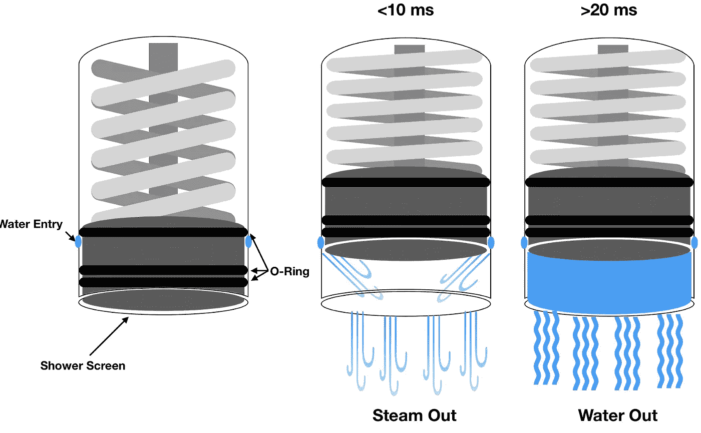
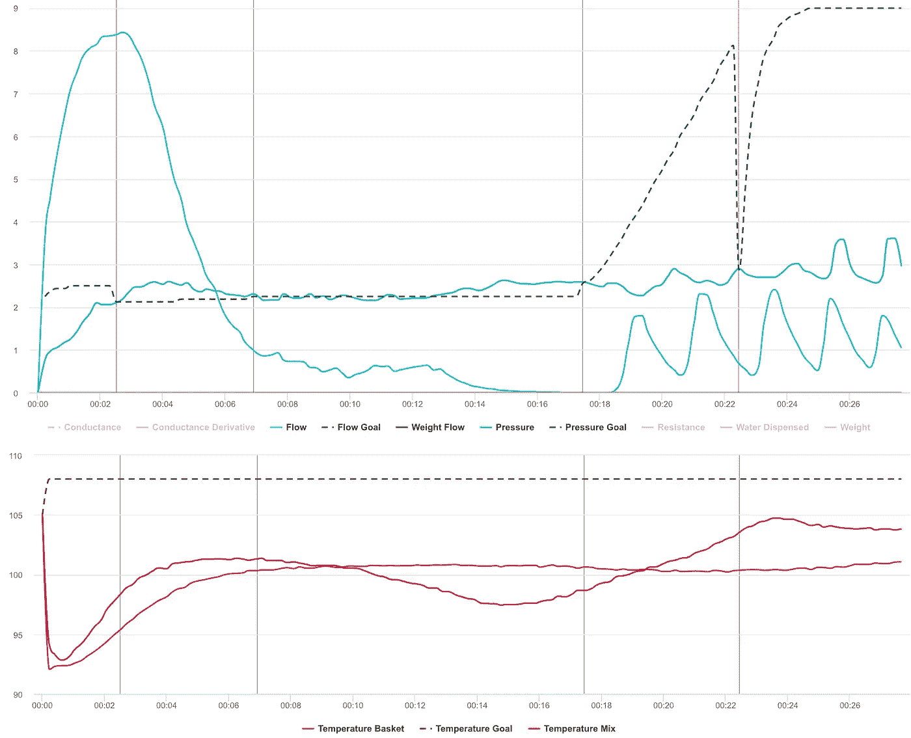
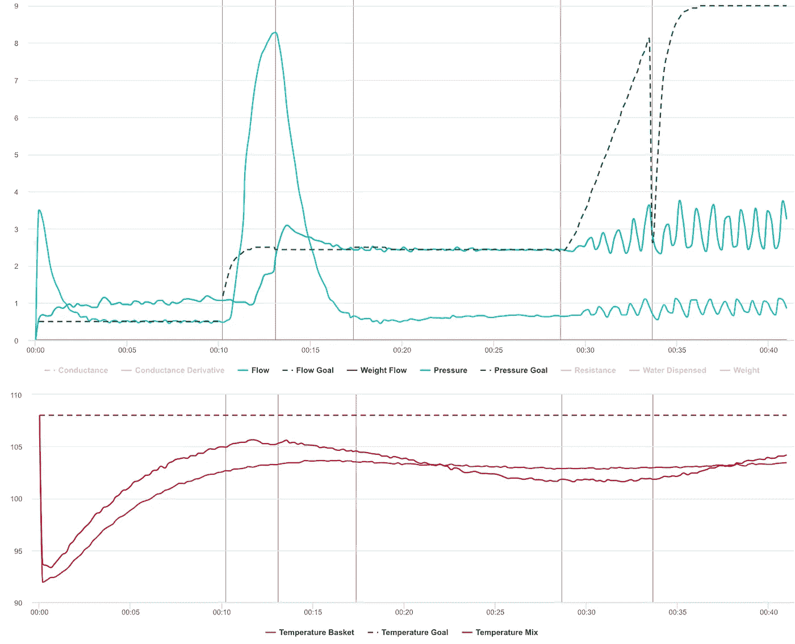
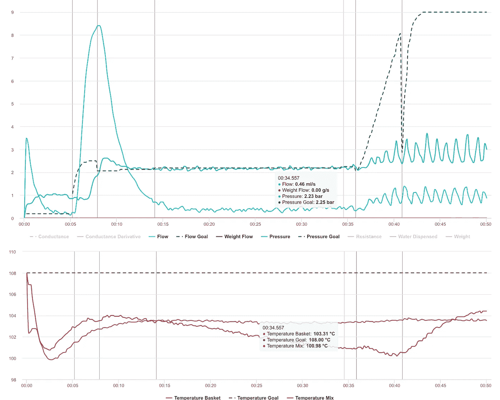
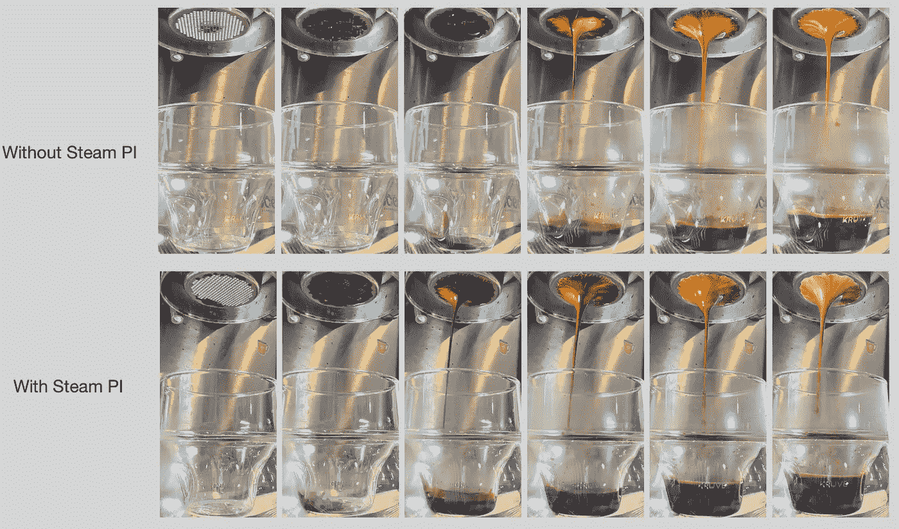
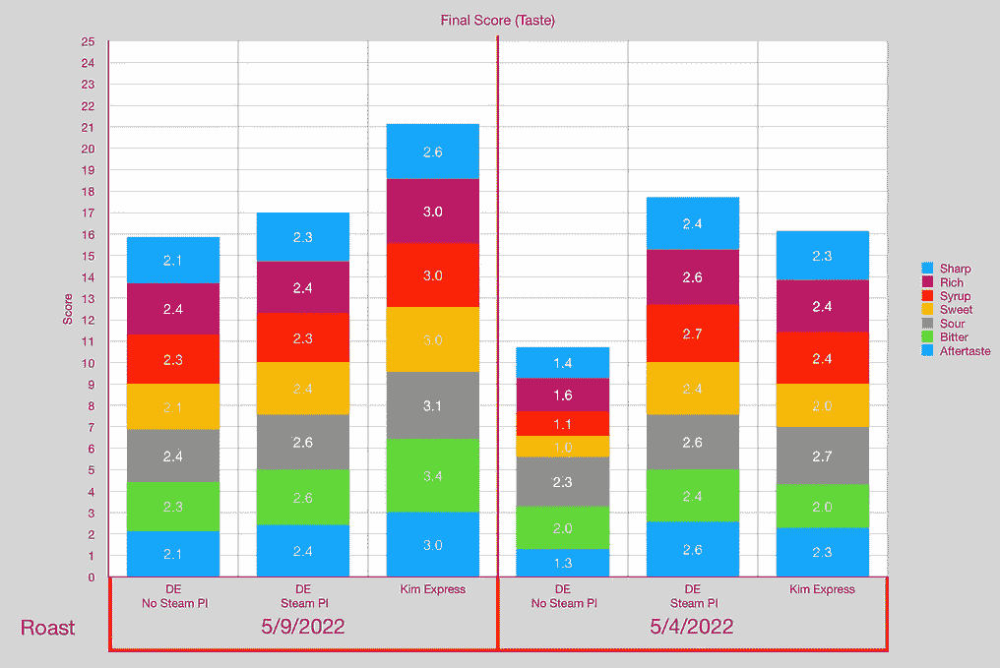
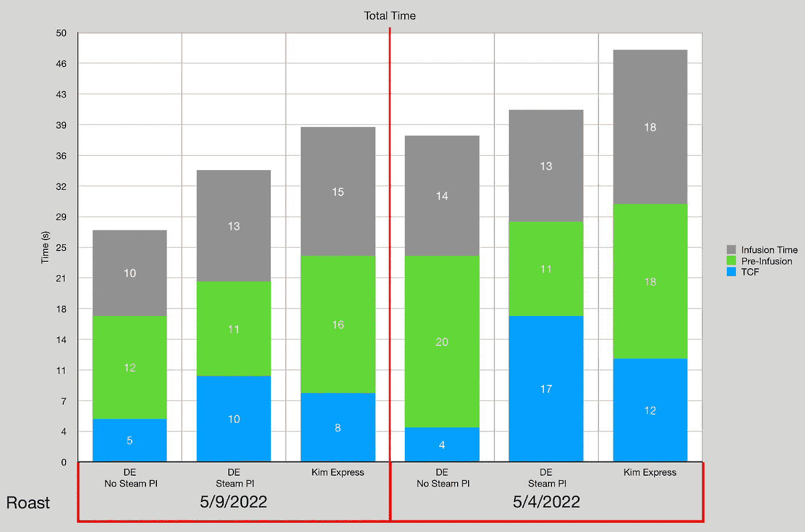

# 自预浸泡以来，浓缩咖啡的最佳改进:蒸汽预浸泡

> 原文：<https://towardsdatascience.com/the-best-improvement-for-espresso-since-pre-infusion-steam-pre-infusion-42983203b79c>

## 咖啡数据科学

## 利用杠杆机器的提示进行改进

在之前的中，我比较了 Kim Express 和体面的 Espresso (DE)咖啡机，发现 Kim Express 在味道和咖啡提取方面更好。随着我对原因的深入挖掘，我发现两个主要原因:水温和蒸汽预注入(PI)。

提高水温只能缩小差距，所以我调查了[咖啡喷嚏](https://rmckeon.medium.com/catching-the-coffee-sneeze-in-espresso-c6053ca55719)，原来是[蒸汽预浸](https://rmckeon.medium.com/the-untold-story-of-steam-pre-infusion-for-espresso-e41a3a559153)。我想在 DE 中复制这一点，这是一个通向更好咖啡的有趣旅程。

# 轮廓开发

蒸汽预注入发生在 Kim Express 中，因为水箱中的水温超过 100 摄氏度。通常，我的[水](/water-temperature-for-espresso-1abe656b54d3)在 116C 到 120C 之间，这意味着当水开始进入腔室时，它首先变成蒸汽。蒸汽先于水穿过冰球。

所有图片由作者提供

# 起始轮廓

我从一个我已经工作了几个月的[档案](/developing-a-decent-profile-for-espresso-c2750bed053f)开始。它包括快速预浸泡，一旦过滤器被咖啡覆盖，就手动结束预浸泡。随后暂停，直到手动输入开始进入[压力脉冲](/pressure-pulsing-for-better-espresso-62f09362211d)。

我开始使用 0.5 毫升/秒的流量限制添加 10 秒蒸汽 PI。这对唐努汀产生了直接影响。

我尝试了更长和更短的蒸汽 PI。最佳流速为 0.2 毫升/秒，因为它允许刚好足够的水进入圆盘。0.1 毫升/秒太慢，0.4 毫升/秒太快。

我还查看了 steam PI 的时间长度。理想状态是 5 到 20 秒。这取决于你的锅炉的温度。DE 中的测量值肯定会测量到更高的圆盘温度，但这是在顶部测量的。我还注意到水温没有我开始时下降得快。

我已经根据我正在煮的咖啡修改了蒸汽管道的长度。我继续测试这个变量，以便更好地理解如何使用它。

# 设备/技术

[意式咖啡机](/taxonomy-of-lever-espresso-machines-f32d111688f1) : [像样的意式咖啡机](/developing-a-decent-profile-for-espresso-c2750bed053f)

[咖啡研磨机](/rok-beats-niche-zero-part-1-7957ec49840d) : [小生零](https://youtu.be/2F_0bPW7ZPw)

咖啡:[家庭烘焙咖啡](https://rmckeon.medium.com/coffee-roasting-splash-page-780b0c3242ea)，中杯(第一口+ 1 分钟)

镜头准备:[断奏夯实](/staccato-tamping-improving-espresso-without-a-sifter-b22de5db28f6)和[断奏](https://medium.com/overthinking-life/staccato-espresso-leveling-up-espresso-70b68144f94)

[预灌注](/pre-infusion-for-espresso-visual-cues-for-better-espresso-c23b2542152e):长，约 25 秒

输液:[压力脉动](/pressure-pulsing-for-better-espresso-62f09362211d)

[过滤篮](https://rmckeon.medium.com/espresso-baskets-and-related-topics-splash-page-ff10f690a738) : 7g/20g VST

其他设备: [Atago TDS 计](/affordable-coffee-solubility-tools-tds-for-espresso-brix-vs-atago-f8367efb5aa4)、 [Acaia Pyxis 秤](/data-review-acaia-scale-pyxis-for-espresso-457782bafa5d)

# 绩效指标

我使用了两组[指标](/metrics-of-performance-espresso-1ef8af75ce9a)来评估技术之间的差异:最终得分和咖啡萃取。

[**最终得分**](https://towardsdatascience.com/@rmckeon/coffee-data-sheet-d95fd241e7f6) 是评分卡上 7 个指标(尖锐、浓郁、糖浆、甜味、酸味、苦味和回味)的平均值。当然，这些分数是主观的，但它们符合我的口味，帮助我提高了我的拍摄水平。分数有一些变化。我的目标是保持每个指标的一致性，但有时粒度很难确定。

</coffee-solubility-in-espresso-an-initial-study-88f78a432e2c>**使用折射仪测量总溶解固体量(TDS)，该数字结合咖啡的输出重量和输入重量用于确定提取到杯中的咖啡的百分比，称为**提取率(EY)** 。**

# **抽样资料**

**我看了一些样本数据，因为我还没有准备好拍摄一组配对照片。我想更好地理解这项技术。所以我看了两个样本集，它们显示了我的总体经历。**

**让我们从我 2022 年 5 月 4 日烤的有和没有蒸汽 PI 的例子开始。蒸汽码头似乎有一个稍微深一些的颜色。**

****

**看两次烘烤，每次烘烤三次，我们可以看看 Kim Express 的性能。蒸汽 PI 对两种烘焙都更好，但 5/4/2022 烘焙能够匹配 EY/TDS 上的 Kim，并在味道上击败它。**

********

**在一些蒸汽预注入后，射击时间更符合 Kim。**

****

**随着我对这项技术的进一步试验，这只是一个很小的数据分享。我想知道，如果 E61 型机器在淋浴屏幕上方有一些空间，它是否可以更好地模拟杠杆机器，允许在室内装满水时进行蒸汽预注入。我的目标是将来做一个更好的并列比较。**

**如果你愿意，可以在推特、 [YouTube](https://m.youtube.com/channel/UClgcmAtBMTmVVGANjtntXTw?source=post_page---------------------------) 和 [Instagram](https://www.instagram.com/espressofun/) 上关注我，我会在那里发布不同机器上的浓缩咖啡照片和浓缩咖啡相关的视频。你也可以在 [LinkedIn](https://www.linkedin.com/in/dr-robert-mckeon-aloe-01581595) 上找到我。也可以关注我在[中](https://towardsdatascience.com/@rmckeon/follow)和[订阅](https://rmckeon.medium.com/subscribe)。**

# **[我的进一步阅读](https://rmckeon.medium.com/story-collection-splash-page-e15025710347):**

**[我未来的书](https://www.kickstarter.com/projects/espressofun/engineering-better-espresso-data-driven-coffee)**

**[我的链接](https://rmckeon.medium.com/my-links-5de9eb69c26b?source=your_stories_page----------------------------------------)**

**[浓缩咖啡系列文章](https://rmckeon.medium.com/a-collection-of-espresso-articles-de8a3abf9917?postPublishedType=repub)**

**工作和学校故事集**