# 最佳学习率时间表

> 原文：<https://towardsdatascience.com/the-best-learning-rate-schedules-6b7b9fb72565>

## 设置学习率的实用而强大的技巧

(由 [Unsplash](https://unsplash.com/s/photos/learning?utm_source=unsplash&utm_medium=referral&utm_content=creditCopyText) 上的 [Element5 数码](https://unsplash.com/@element5digital?utm_source=unsplash&utm_medium=referral&utm_content=creditCopyText)拍摄)

任何训练过神经网络的人都知道，在训练期间适当地设置学习速率是让神经网络表现良好的一个关键方面。此外，学习率通常根据一些学习率时间表沿着训练轨迹变化。这个时间表的选择对培训质量也有很大的影响。

大多数从业者在培训期间采用一些广泛使用的学习率计划策略；例如阶跃衰减或余弦退火。这些时间表中的许多都是为特定的基准而策划的，在经过多年的研究后，它们是根据经验确定的，以最大限度地提高测试的准确性。但是，这些策略往往无法推广到其他实验环境，这就提出了一个重要的问题:*对于训练神经网络来说，最一致、最有用的学习速率表是什么？*

在这个概述中，我们将着眼于最近对各种学习速率表的研究，这些学习速率表可用于训练神经网络。这样的研究发现了许多提高学习速度的策略，这些策略既高效又易于使用；例如循环或三角学习率计划。通过研究这些方法，我们将得出几个实用的要点，提供可以立即应用于改善神经网络训练的简单技巧。

为了补充这个概述，我实现了主要的学习率计划，我们将在这里的[找到的库内探索这些计划。这些代码示例有些简单，但它们足以轻松实现本概述中讨论的任何学习率计划。](https://github.com/wolfecameron/LRSchedules)

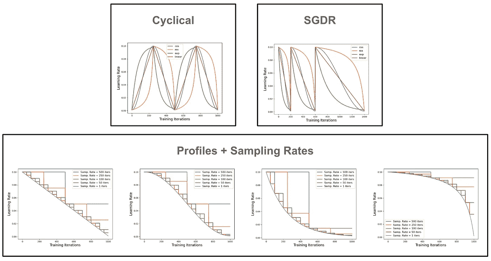

各种类型的学习率计划的图解(由作者创建)

# 神经网络训练和学习率

在监督学习设置中，神经网络训练的目标是生成一个神经网络，在给定一些数据作为输入的情况下，该神经网络可以预测与该数据相关联的基本事实标签。这方面的一个例子是训练一个神经网络，根据一个大的猫和狗的标记图像数据集，正确地预测一个图像是包含一只猫还是一只狗。

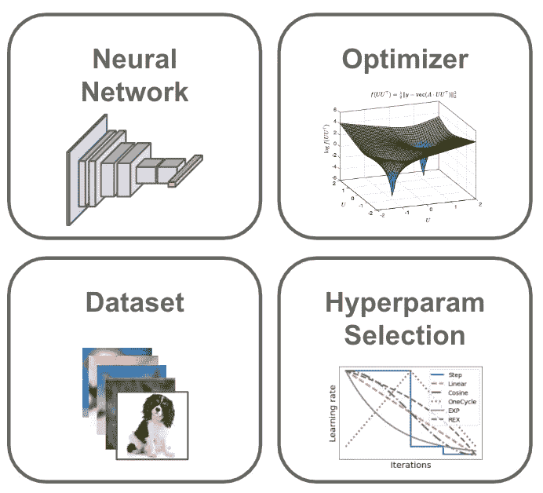

训练神经网络的组件(由作者创建)

如上所述，神经网络训练的基本组件如下:

*   **神经网络:**将一些数据作为输入，并根据其内部参数/权重对这些数据进行转换，以产生一些输出。
*   **数据集:**输入输出数据对(如图像及其对应的分类)的一大组实例。
*   **优化器:**用于更新神经网络的内部参数，使其预测更加准确。
*   **超参数:**由深度学习实践者设置的外部参数，用于控制训练过程的相关细节。

通常，神经网络开始训练时，其所有参数都是随机初始化的。为了学习更有意义的参数，向神经网络显示来自数据集的数据样本。对于这些样本中的每一个，神经网络试图预测正确的输出，然后优化器更新神经网络的参数以改进这种预测。

更新神经网络参数以使其能够更好地匹配数据集中的已知输出的过程称为训练。该过程反复重复，通常直到神经网络多次循环遍历整个数据集(称为一个训练时期)。

虽然这种对神经网络训练的描述并不全面，但它应该提供足够的直觉来完成这一概述。网上有许多关于神经网络训练的广泛教程。目前为止我最喜欢的教程来自杰瑞米·霍华德和 fast.ai 的《程序员实用深度学习》课程；请参见下面的视频链接。

## 什么是超参数？

模型参数由优化器在训练期间更新。相比之下，超参数是我们深度学习实践者可以控制的“额外”参数。但是，*我们实际上可以用超参数控制什么呢？*与本概述相关的一个常见超参数是学习率。

**学习率是多少？**简单来说，每次优化器更新神经网络的参数时，学习率控制着这次更新的大小。*我们应该大量更新参数，一点点更新，还是在中间某处更新？*我们通过设置学习率来做出选择。

**选择好的学习率。**设定学习率是训练神经网络最重要的方面之一。如果我们选择一个太大的值，训练将会发散。另一方面，学习率太小会导致表现不佳和训练缓慢。我们必须选择一个足够大的学习率，以便为训练过程提供正则化的好处并快速收敛，同时不能太大以至于训练过程变得不稳定。

## 选择好的超参数

模型参数由优化器在训练期间更新。相比之下，超参数是我们深度学习实践者可以控制的“额外”参数。但是，用超参数我们能控制什么呢？与本概述相关的一个常见超参数是学习率。

**什么是学习率？**简单来说，每次优化器更新神经网络的参数时，学习率控制着这次更新的大小。*我们应该更新参数很多，一点点，还是中间的某个地方？*我们通过设置学习率来做出选择。

**选择一个好的学习率。设定学习率是训练神经网络最重要的方面之一。如果我们选择一个太大的值，训练将会发散。另一方面，学习率太小会导致表现不佳和训练缓慢。我们必须选择一个足够大的学习率，以便为训练过程提供正则化的好处并快速收敛，同时不能太大以至于训练过程变得不稳定。**

## 选择好的超参数

学习率等超参数通常使用一种简单的方法选择，称为[网格搜索](https://elutins.medium.com/grid-searching-in-machine-learning-quick-explanation-and-python-implementation-550552200596)。基本想法是:

1.  为每个超参数定义一个潜在值范围
2.  选择一组离散值在此范围内进行测试
3.  测试可能的超参数值的所有组合
4.  根据[验证集](https://machinelearningmastery.com/difference-test-validation-datasets/)性能选择最佳超参数设置

网格搜索是对最佳超参数的简单、详尽的搜索。有关潜在学习率值的网格搜索示例，请参见下图。

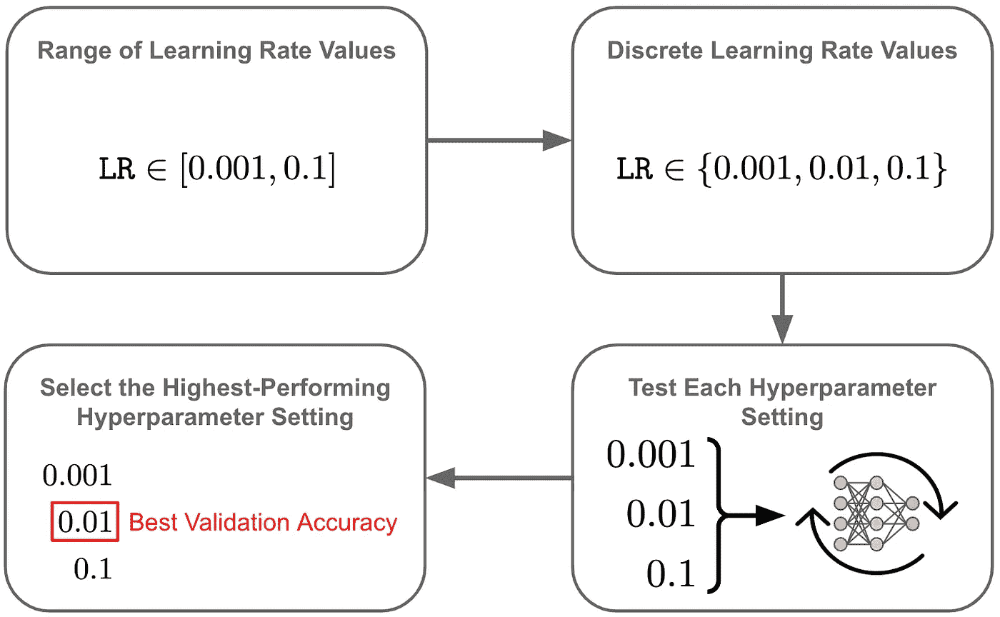

最佳学习率的网格搜索(由作者创建)

通过遵循类似的方法并测试超参数值的所有可能组合，可以将类似的方法同时应用于许多超参数。

网格搜索在计算上是低效的，因为它需要为每个超参数设置重新训练神经网络。为了避免这种成本，许多深度学习实践者采用“猜测和检查”的方法，在合理的范围内尝试几个超参数，看看什么有效。选择最佳超参数的替代方法已被提出[5]，但网格搜索或猜测和检查程序因其简单性而被普遍使用。

## 学习率调度

在选择了学习率之后，我们通常不应该在整个训练过程中保持相同的学习率。相反，传统智慧建议我们应该 *(i)* 选择一个初始学习率，然后 *(ii)* 在整个训练过程中衰减这个学习率[1]。我们用来执行这种衰减的函数被称为学习速率表。

多年来已经提出了许多不同的学习速率表；例如，阶跃衰减(即，在训练期间将学习速率衰减 10X 几次)或余弦退火；见下图。在这个概述中，我们将探讨一些最近提出的表现特别好的时间表。

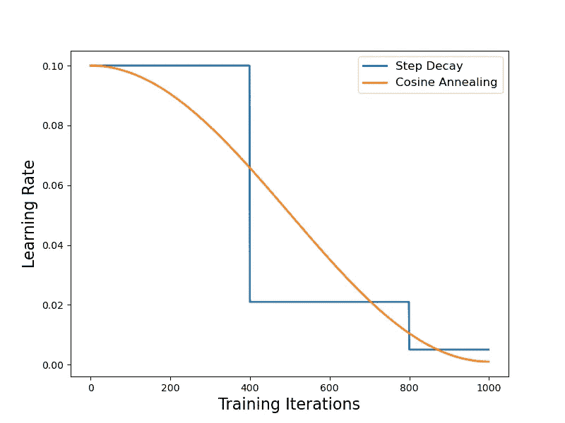

阶跃衰减和余弦退火学习率图表(由作者创建)

**适应性优化技术。**根据[随机梯度下降](https://www.geeksforgeeks.org/ml-stochastic-gradient-descent-sgd/) (SGD)的神经网络训练选择用于更新所有模型参数的单个全局学习速率。除了 SGD 之外，还提出了自适应优化技术(例如， [RMSProp](http://www.cs.toronto.edu/~tijmen/csc321/slides/lecture_slides_lec6.pdf) 或 Adam【6】)，这些技术使用训练统计数据来动态调整用于每个模型参数的学习率。本概述中概述的大多数结果适用于自适应和 SGD 风格的优化器。

# 出版物

在本节中，我们将看到最近提出的学习率计划的几个例子。这些策略包括循环或三角学习率，以及学习率衰减的不同模式。最佳学习率策略高度依赖于领域和实验设置，但是我们将会看到，通过研究许多不同学习率策略的经验结果，可以得出一些高层次的结论。

## [训练神经网络的循环学习率](https://arxiv.org/abs/1506.01186)【1】

作者在[1]中提出了一种在神经网络训练期间处理学习速率的新方法:根据平滑时间表在最小值和最大值之间循环变化。在这项工作之前，大多数实践者采用了流行的策略 *(i)* 将学习率设置为一个初始的大值，然后 *(ii)* 随着培训的进行逐渐降低学习率。

在[1]中，我们抛弃了这一经验法则，转而采用循环策略。以这种方式循环学习率有些违反直觉——在训练期间增加学习率会损害模型性能，对吗？尽管随着学习率的增加，网络性能会暂时下降，但循环学习率计划实际上会在整个培训过程中带来很多好处，我们将在【1】中看到。

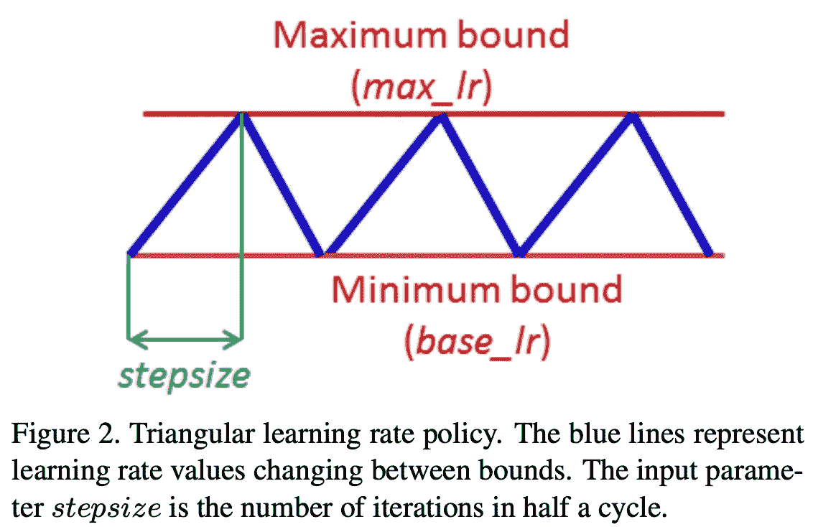

(来自[1])

循环学习率引入了三个新的超参数:步长、最小学习率和最大学习率。由此产生的时间表是“三角形”的，意味着学习率在相邻的周期中增加/减少；见上文。步长可以设置在 2-10 个训练时段之间，而学习率的范围通常通过学习率范围测试来发现(参见[1]的第 3.3 节)。

增加学习率会暂时降低模型性能。然而，一旦学习率再次下降，模型的性能将会恢复并提高。考虑到这一点，我们在[1]的实验结果中看到，用循环学习率训练的模型在其表现中遵循一种循环模式。模型性能在每个周期结束时达到峰值(即，当学习率衰减回最小值时)，并且在周期的中间阶段(即，当学习率增加时)变得有些差；见下文。

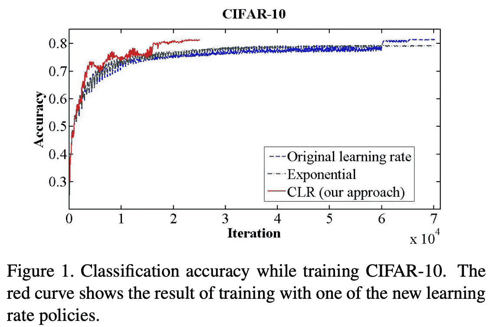

(来自[1])

[1]中的结果表明，在训练过程中，循环学习率有利于模型性能。通过循环学习率训练的模型比通过其他学习率策略训练的模型更快地达到更高的性能水平；见下图。换句话说，用循环学习率训练的模型的 anytime 性能真的很好！

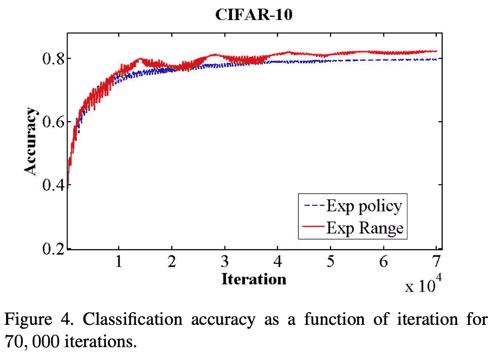

(来自[1])

在 ImageNet 上的大规模实验中，循环学习率仍然有好处，尽管它们没有那么明显。

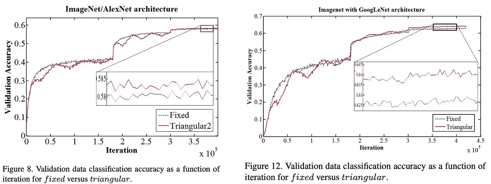

(来自[1])

## [SGDR:带有热重启的随机梯度下降](https://arxiv.org/abs/1608.03983)

作者在[2]中提出了一种简单的学习率重启技术，称为重启随机梯度下降(SGDR)，其中学习率被周期性地重置为其初始值并计划降低。该技术采用以下步骤:

1.  按照固定的时间表降低学习速度
2.  衰减计划结束后，将学习率重置为其原始值
3.  返回步骤#1(即，再次衰减学习率)

下面提供了遵循该策略的不同时间表的描述。

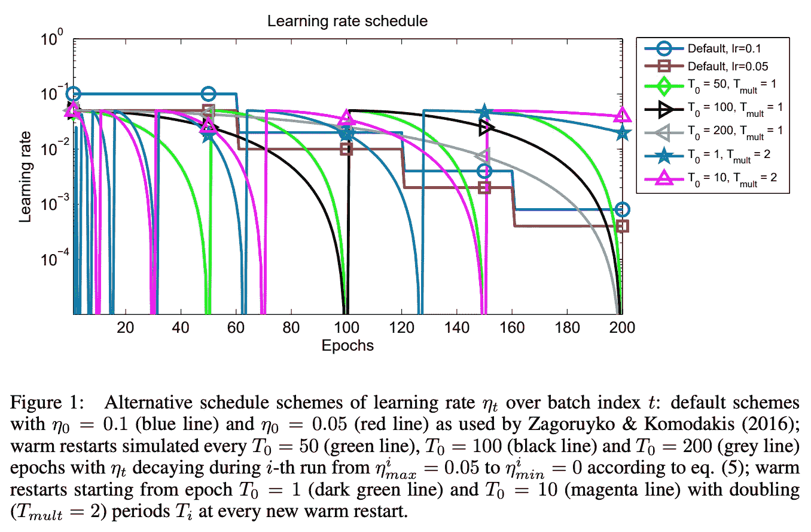

(来自[2])

我们可以注意到关于上面的时间表的一些事情。首先，在[2]中总是使用余弦衰减时间表(该图的 y 轴是对数标度)。此外，随着训练的进行，每个衰减时间表的长度可能会增加。具体来说,[2]中的作者将第一个衰变周期的长度定义为`T_0`,然后在每个后续衰变周期中将该长度乘以`T_mult`;见下文的描述。

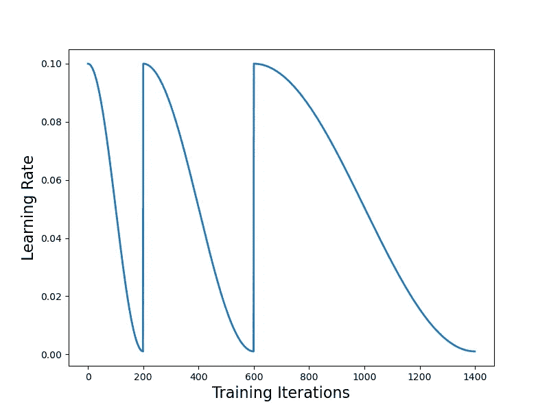

延长 SGDR 境内的周期长度(由作者创建)

按照[1]的术语，SGDR 的步长可能在每个周期后增加。然而，与[1]不同，SGDR 不是三角形的(即，每个周期只是衰减学习速率)。

在 CIFAR10/100 上的实验中，我们可以看到 SGDR 学习率计划比阶跃衰减计划更快地产生良好的模型性能——SGDR 具有良好的随时性能。在每个衰变周期之后获得的模型表现良好，并且在连续的衰变周期中继续变得更好。

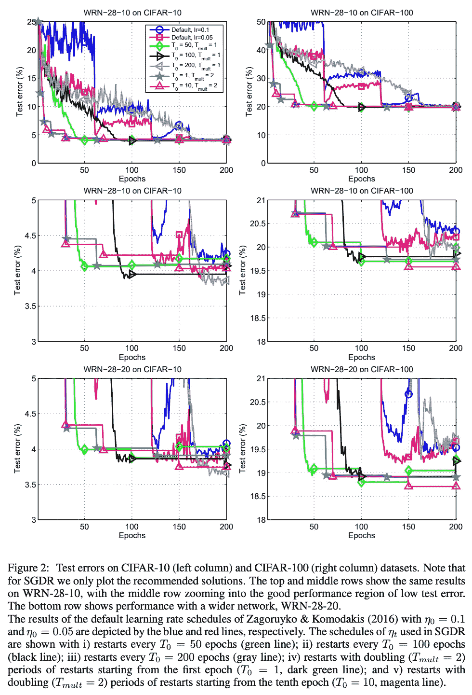

(来自[2])

除了这些初步结果，我们还可以研究在每个衰变周期结束时拍摄“快照”所形成的模型集合。特别是，我们可以在 SGDR 时间表内的每个衰变周期后保存模型状态的副本。然后，在训练完成后，我们可以在推断时对这些模型中的每一个的预测进行平均，形成模型的集合/组；点击链接[这里](/neural-networks-ensemble-33f33bea7df3)了解更多关于合奏的细节。

通过以这种方式形成模型集合，我们可以在 CIFAR10 上实现非常显著的测试误差减少；见下文。

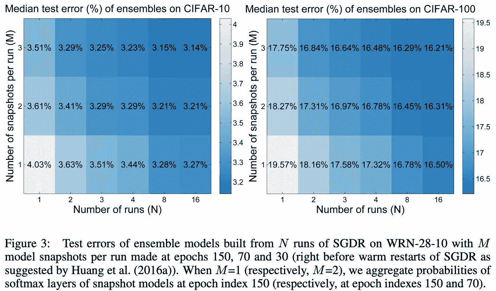

(来自[2])

此外，来自 SGDR 的快照似乎提供了一套具有不同预测的模型。以这种方式形成集成实际上优于将独立的、完全训练的模型添加到集成中的正常方法。

## [超收敛:使用大的学习速率非常快速地训练神经网络](https://arxiv.org/abs/1708.07120) [3]

[3]中的作者研究了一种训练神经网络的有趣方法，该方法允许训练速度提高一个数量级。基本方法——最初在[8]中概述——是执行一个具有较大最大学习率的单一三角形学习率循环，然后在训练结束时允许学习率衰减到低于该循环的最小值；请看下面的插图。

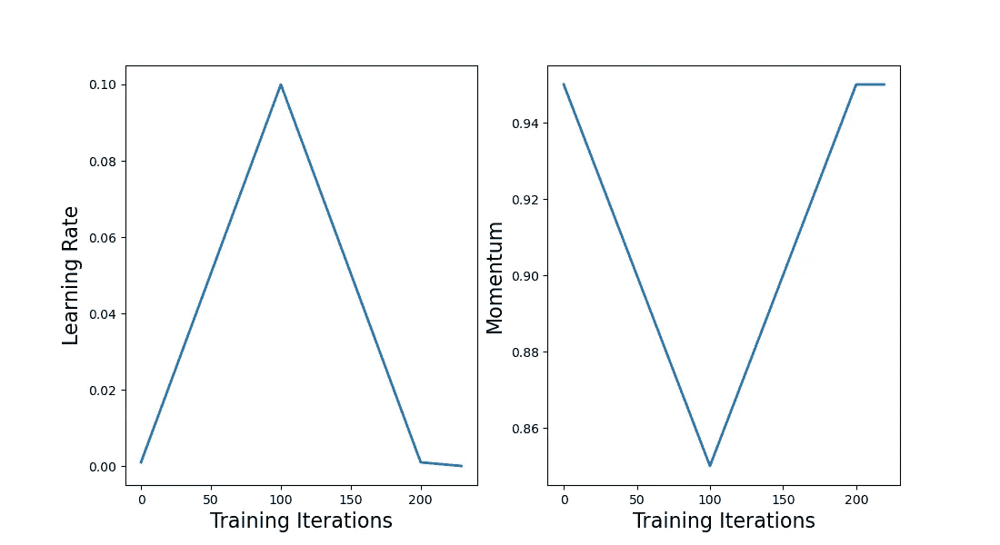

1 周期学习率和动量表(由作者创建)

此外，动量以与学习速率相反的方向循环(通常在[0.85，0.95]的范围内)。这种联合循环学习速率和动量的方法被称为“1 循环”。作者在[3]中表明，它可以用来实现“超收敛”(即极快地收敛到高性能的解决方案)。

例如，我们在 CIFAR10 上的实验中看到，1cycle 可以比基线学习率策略获得更好的性能，训练迭代次数减少了 8 倍。使用不同的 1cycle 步长可以进一步提高训练速度，尽管精度水平会因步长而异。

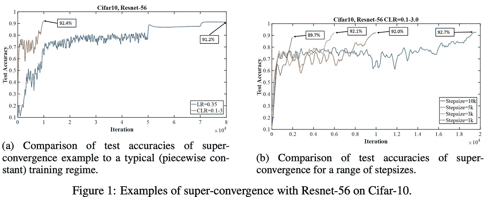

(摘自[3])

我们可以在一些不同的架构和数据集上观察到类似的结果。参见下表，其中 1cycle 在数量少得惊人的训练时段中再次产生了良好的性能。

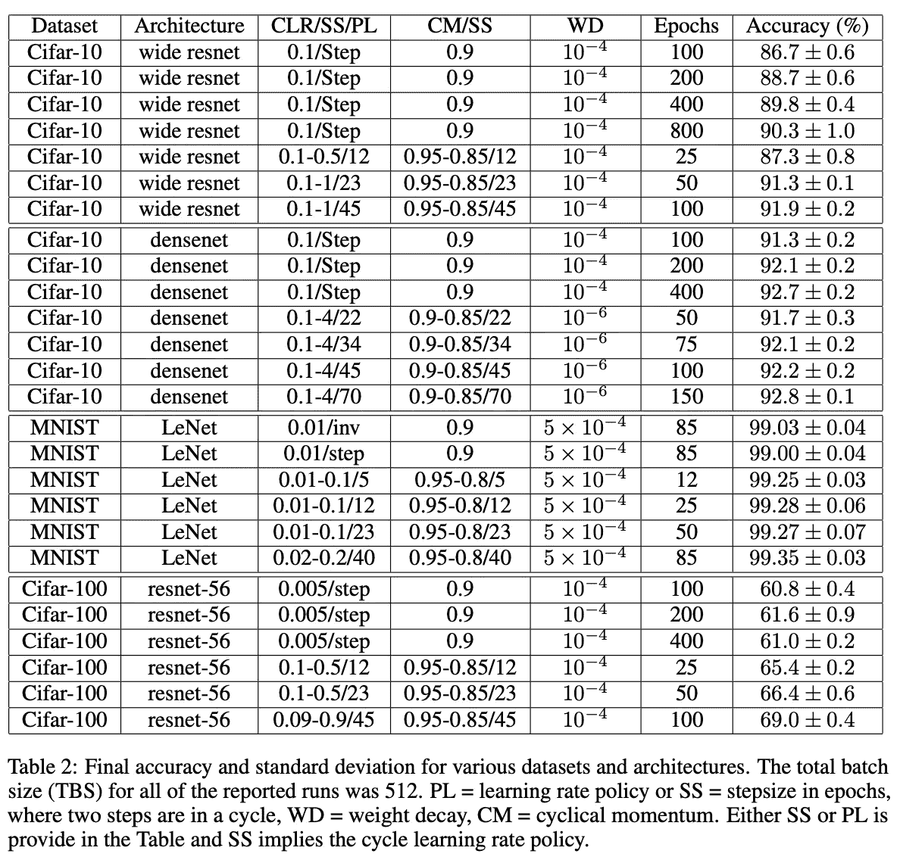

(摘自[3])

目前，由于[3]中提供的实验在规模和种类上有所限制，尚不清楚是否可以在大量的实验设置中实现超收敛。尽管如此，我们可能都同意超级趋同现象非常有趣。事实上，这个结果非常有趣，甚至被 [fast.ai](http://fast.ai/) 社区推广和深入研究；见[此处](https://www.fast.ai/posts/2018-07-02-adam-weight-decay.html)。

## [REX:用改进的时间表重新审视预算培训](https://arxiv.org/abs/2107.04197)

在[4]中，作者(包括我自己)考虑了在给定不同预算制度(即，小、中或大数量的训练时期)的情况下适当安排学习率的问题。你可能会想:*我们为什么要考虑这种设置？*通常，训练时期的最佳数量事先并不知道。此外，我们可能会使用固定的货币预算来限制我们可以执行的训练次数。

为了找到最佳的预算不可知的学习率计划，我们必须首先定义将被考虑的可能的学习率计划的空间。在[4]中，我们通过将学习率计划分解为两个部分来实现这一点:

1.  **Profile:** 学习率在整个训练过程中变化的函数。
2.  **采样率:**根据所选的配置文件更新学习率的频率。

这种分解可以用来描述几乎所有的固定结构的学习率时间表。不同的曲线和采样速率组合如下所示。较高的采样速率会使时间表与底层配置文件更加匹配。

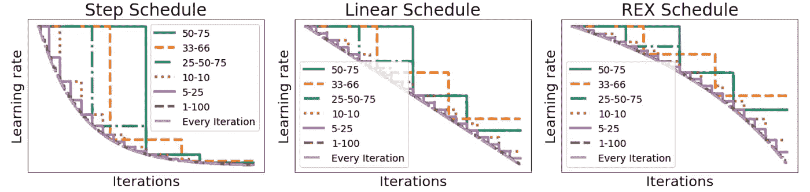

用不同的曲线和采样速率描述学习速率表(来自[4])

[4]中的作者考虑了由不同的采样速率和三个函数轮廓形成的学习速率计划——指数(即，产生步进计划)、线性和 REX(即，在[4]中定义的新轮廓)；见上图。

在这里，作者在 CIFAR10 上使用不同的采样速率和配置文件组合来训练 Resnet20/38。在这些实验中，我们看到阶跃衰减时间表(即，具有低采样率的指数曲线)仅在给定低采样率和许多训练时期的情况下表现良好。REX 调度每次迭代采样在所有不同的历元设置中表现良好。

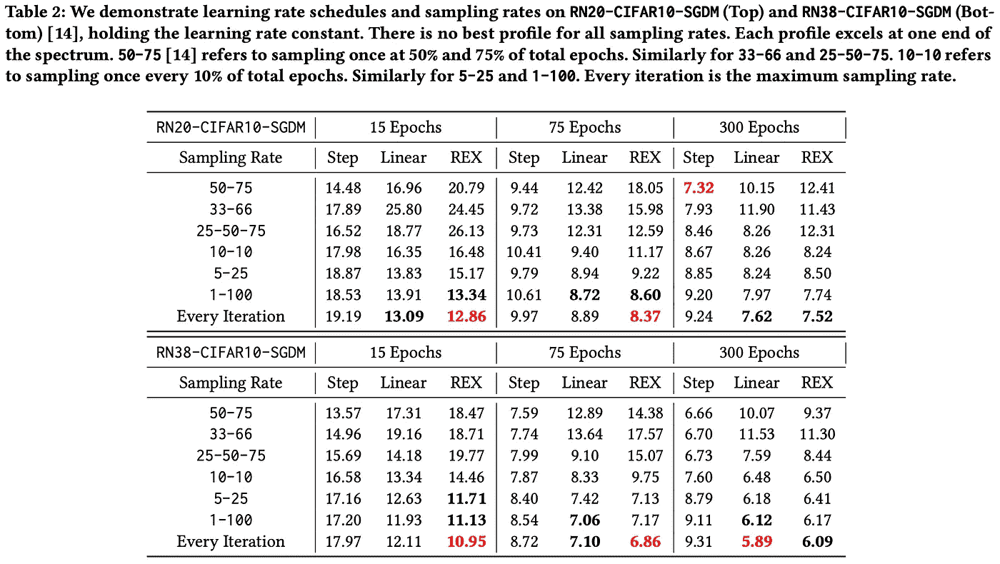

(摘自[4])

先前的工作表明，线性衰减时间表最适合低预算的训练设置(即，具有较少时期的训练)[9]。在[4]中，我们可以看到 REX 实际上是一个更好的选择，因为它避免了在训练期间过早地衰减学习率。

从这里开始,[4]中的作者考虑了各种流行的学习率计划，如下图所示。

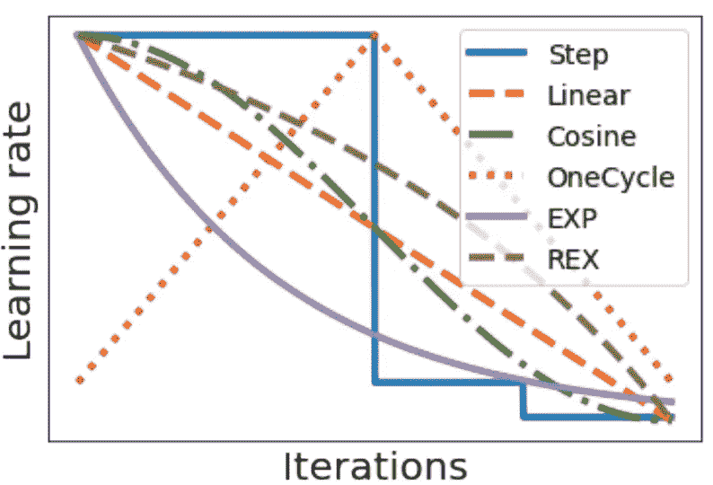

[4]中研究的不同学习率计划

这些时间表经过了各种领域和训练时期预算的测试。当汇总所有实验的性能时，我们会得到如下所示的结果。

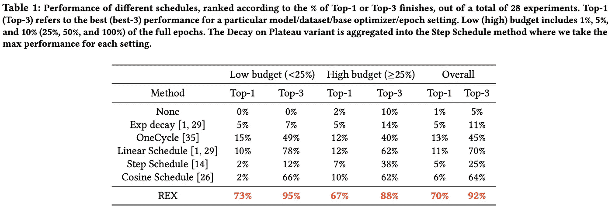

(摘自[4])

很快，我们看到 REX 在不同的预算制度和实验领域取得了惊人的一致表现。没有其他的学习进度计划在实验中达到接近前 1/3 的比率，这表明 REX 是一个很好的领域/预算不可知的学习进度计划。

除了 REX 的一致性，这些结果教给我们一些更普遍的东西:*常用的学习速率策略在实验环境中并不通用。*每种学习计划(即使是 REX，尽管程度较轻)仅在少数情况下表现最佳，这表明为任何特定环境选择合适的学习率策略都非常重要。

# 外卖食品

正确处理学习速率可以说是神经网络训练最重要的方面。在这个概述中，我们已经了解了几个用于训练深度网络的实用学习率计划。研究这一行提供了简单易懂、易于实现且高效的要点。下面列出了一些基本要点。

**选择一个好的学习率。**正确设置学习率是训练高性能神经网络的最重要方面之一。选择不良的初始学习率或使用错误的学习率计划会显著降低模型性能。

**“默认”时间表并不总是最好的。**许多实验设置都有一个“默认”的学习速率表，我们往往会不假思索地采用它；例如用于训练图像分类的 CNN 的步进衰减时间表。我们应该意识到，随着实验设置的改变，这些时间表的性能可能会急剧恶化；例如，对于预算设置，基于 REX 的调度明显优于步长衰减。作为实践者，我们应该始终注意我们选择的学习率计划，以真正最大化我们模型的性能。

周期性的日程安排太棒了。循环或三角学习率计划(如[2]或[3])非常有用，因为:

*   它们经常达到或超过最先进的性能
*   他们随时都有很好的表现

使用循环学习率策略，模型在每个衰减周期结束时达到最佳性能。我们可以简单地继续训练任意给定的周期数，直到我们对网络的性能满意为止。最佳的训练量不需要事先知道，这在实践中经常是有用的。

**外面有很多值得探索的地方。**虽然学习速度策略已经被广泛研究，但似乎还有更多有待发现。例如，我们已经看到，采用替代衰变曲线有利于预算设置[4]和循环策略，在某些情况下甚至可以用来实现超收敛[3]。我的问题是:*还能发现什么？*似乎真的有一些有趣的策略(例如，分形学习率[7])有待探索。

## 软件资源

作为对这个概述的补充，我创建了一个[轻量级代码库](https://github.com/wolfecameron/LRSchedules)，用于复制一些不同的学习率计划，包括:

*   产生不同衰变曲线的函数
*   PyTorch 优化器中用于调整学习率/动量的函数
*   我们在本概述中看到的常见学习率计划的工作示例

虽然有点小，但这段代码提供了实现和使用我们到目前为止学习过的任何学习率策略所需的一切。如果您对使用这段代码不感兴趣，也可以使用 PyTorch 中直接实现的[学习率调度器](https://pytorch.org/docs/stable/optim.html#how-to-adjust-learning-rate)。

## 结论

非常感谢你阅读这篇文章。如果你喜欢它，请在 [twitter](https://twitter.com/cwolferesearch) 上关注我，或者订阅我的[深度(学习)焦点时事通讯](https://cameronrwolfe.substack.com/)，在那里我挑选了一个关于深度学习研究的单个两周一次的主题，提供了对相关背景信息的理解，然后概述了一些关于该主题的流行论文。我是 [Cameron R. Wolfe](https://cameronrwolfe.me/) ，ale gion[的研究科学家，莱斯大学的博士生，研究深度学习的经验和理论基础。你也可以看看我在 medium 上的](https://www.alegion.com/)[其他著述](https://medium.com/@wolfecameron)！

## 文献学

[1] Smith，Leslie N .“训练神经网络的循环学习率” *2017 年 IEEE 计算机视觉应用冬季会议(WACV)* 。IEEE，2017。

[2]洛希洛夫、伊利亚和弗兰克·哈特。" Sgdr:带有热重启的随机梯度下降." *arXiv 预印本 arXiv:1608.03983* (2016)。

[3]史密斯、莱斯利·n .和尼古拉·托平。"超收敛:使用大的学习速率非常快速地训练神经网络."*面向多领域运营应用的人工智能和机器学习*。第 11006 卷。SPIE，2019。

[4]陈、约翰、卡梅伦·沃尔夫和塔索斯·基里利迪斯。"雷克斯:用改进的时间表重新审视预算培训."*机器学习与系统学报*4(2022):64–76。

[5]余、童、。"超参数优化:算法和应用综述."arXiv 预印本 arXiv:2003.05689 (2020)。

[6]金玛、迪德里克 p .和吉米巴。"亚当:随机最优化的方法."arXiv 预印本 arXiv:1412.6980 (2014)。

[7] Agarwal、Naman、Surbhi Goel 和 Cyril Zhang。"通过分形学习速率表加速."机器学习国际会议。PMLR，2021 年。

[8] Smith，Leslie N 神经网络超参数的训练方法:第 1 部分——学习速率、批量大小、动量和权重衰减〉 *arXiv 预印本 arXiv:1803.09820* (2018)。

[9]李、、尔辛·尤默和德瓦·拉曼南。"预算训练:在资源限制下重新思考深度神经网络训练." *arXiv 预印本 arXiv:1905.04753* (2019)。