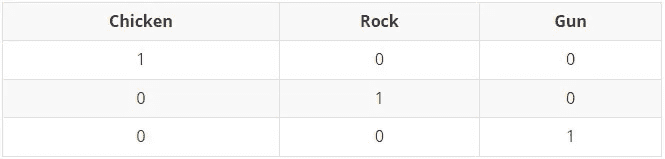

# 一次性编码数据的最佳方法

> 原文：<https://towardsdatascience.com/the-best-methods-for-one-hot-encoding-your-data-c29c78a153fd>

## 数据准备

## onehotencode vs get _ dummies vs to _ category


图片由[皮克斯拜](https://pixabay.com//?utm_source=link-attribution&utm_medium=referral&utm_campaign=image&utm_content=2326145)的 Gerd Altmann 提供

**在将数据输入机器/深度学习模型之前，对数据进行预处理是整个过程中最重要的阶段之一。如果没有经过适当预处理的数据，无论你的模型多么先进和巧妙，最终都将是低效和不准确的。**

**对于独立分类数据来说，一种热编码可能是最常用的预处理方法，可确保模型能够公平、无偏见地解释输入数据。**

**本文将探索使用一次性方法对分类数据进行编码的三种最常见的方法，并讨论为什么首先要使用这种技术。**

# 介绍

本文将对以下方法进行比较和讨论:

*   **熊猫** — get_dummies()
*   **Scikit-Learn**—OneHotEncoder()
*   **Keras**—to _ categorial()

所有方法基本上达到相同的结果。然而，它们以完全不同的方式进行，并且具有不同的特性和选项。

那么，哪种方法最适合您的具体情况呢？

# 什么是一键编码？

在我们开始之前，我认为有必要先简单介绍一下为什么你会想使用这种方法。

一个热编码基本上是一种准备分类数据的方法，以确保机器学习/深度学习模型将类别视为彼此独立。

## 确凿的例子

让我们举一个实际的例子来说明这个观点。我们有三个类别:

*   鸡肉
*   岩石
*   枪

他们之间没有任何关系，完全独立。

为了将这些类别输入到机器学习模型中，我们需要将它们转化为数值，因为机器/深度学习模型无法处理任何其他类型的输入。那么如何最好地做到这一点呢？


一只逃跑的鸡。[詹姆斯·温斯科特](https://unsplash.com/@tumbao1949?utm_source=unsplash&utm_medium=referral&utm_content=creditCopyText)在 [Unsplash](https://unsplash.com/s/photos/chicken?utm_source=unsplash&utm_medium=referral&utm_content=creditCopyText) 上的照片

最简单的方法是给每个类别分配一个编号:

1.  鸡肉
2.  岩石
3.  枪

这种方法(称为顺序编码)的问题是，当数字一个接一个时，模型可以推断出类别之间的关系。

枪比鸡重要是因为它的编号更高吗？鸡是半块石头吗？如果你有三只鸡，那和一把枪一样吗？

如果这些值是标签，如果模型输出的答案是 1.5，那会怎么样呢？所有这些说法都是无稽之谈，但由于模型只看到数字，而不是我们看到的名字，因此推断这些东西对模型来说是完全可行的。

为了避免这种情况，我们需要将类别完全分开。这就是一键编码所实现的目标:



一个热点编码的例子——作者列表

这些值只能是 1 或 0(开或关)。1 表示是那个东西，0 表示不是。

所以在第一排你有一只鸡(没有石头也没有枪)，第二排有一块石头(没有鸡也没有枪)等等。由于这些值要么是开，要么是关，因此不可能以任何方式将一个与另一个相关联。

# 快速笔记

在更详细地研究这三种方法之前，我只想指出，我将使用 Colab 的一种替代方法，我通常使用它来为本文提供代码。

我将使用的替代方案是 [deepnote](https://deepnote.com/) 。它本质上与 Colab 相同，它让您可以在在线环境中运行 Jupyter 笔记本(有一些差异，我不会在这里深入讨论，但可以查看网站了解更多信息)。

这样做的主要原因是，为了演示本文中一些方法的最新特性，我需要访问 Pandas 1.5.0(撰写本文时的最新版本)，而我似乎无法在 Colab 中实现这一点。

然而，在 deepnote 中，我可以指定一个 Python 版本(在本例中是 3.10)，还可以创建自己的 requirements.txt 来确保环境安装 Pandas 1.5.0，而不是默认版本。

它还允许非常简单的从 Jupyter 笔记本直接嵌入到本文中(您将会看到)，这非常有用。

我仍然会像往常一样让笔记本在 colab 中可用，但是一些代码不会运行，所以请记住这一点。

# 数据

这些数据基本上与饮酒对考试成绩的影响有关。不是你需要记住的东西，但如果你感兴趣的话…


由[vini cius“amnx”Amano](https://unsplash.com/@viniciusamano?utm_source=unsplash&utm_medium=referral&utm_content=creditCopyText)在 [Unsplash](https://unsplash.com/s/photos/alcohol?utm_source=unsplash&utm_medium=referral&utm_content=creditCopyText) 上拍摄

和以往一样，我把数据放在一个笔记本上。您可以在以下任一 deepnote 中访问它:


(如前所述，熊猫 1.5.0 已在 deepnote 中推出。只需在右边的“环境”部分激活 Python 3.10，在右边的“文件”部分创建一个名为“requirements.txt”的文本文件，其中有一行“pandas==1.5.0”。然后运行笔记本。)

或者 colab:

[](https://colab.research.google.com/github/thetestspecimen/notebooks/blob/main/one_hot_encoding_comparison.ipynb)

(由于需要 Pandas 1.5.0，下面的一些方法将不起作用)

我选择了一个数据集，它包括各种不同的分类和非分类列，这样就可以很容易地看出每种方法是如何根据数据类型工作的。这些列如下所示:

*   **性别** —二进制字符串(“M”代表男性，“F”代表女性)
*   **年龄** —标准数值栏(int)
*   **Medu** —母亲的教育程度—多类整数表示(0[无]，1[初等教育]，2 [五至九年级]，3[中等教育]或 4[高等教育])
*   **Mjob** —母亲的工作—多类字符串表示—('教师'，'健康'保健相关，民事'服务'(如行政或警察)，'在家'或'其他')
*   **Dalc** —工作日酒精消耗量—多类分级整数表示(从 1[非常低]到 5[非常高])
*   **Walc** —周末饮酒量—多类分级整数表示(从 1[非常低]到 5[非常高])
*   **G3** —最终成绩(标签)—多类分级整数表示(数字:从 0 到 20)

前五行的示例如下:

和数据类型:

# 熊猫—获取 _ 假人()


[帕斯卡·米勒](https://unsplash.com/@millerthachiller?utm_source=unsplash&utm_medium=referral&utm_content=creditCopyText)在 [Unsplash](https://unsplash.com/s/photos/panda?utm_source=unsplash&utm_medium=referral&utm_content=creditCopyText) 上的照片

```
pandas.get_dummies(data, prefix=None, prefix_sep=’_’, dummy_na=False, columns=None, sparse=False, drop_first=False, dtype=None)
```

[文档](https://pandas.pydata.org/docs/reference/api/pandas.get_dummies.html)

我会把 Pandas 的 get_dummies()方法描述为一个非常中庸的一次性编码器。它让事情变得简单，同时提供合理数量的选项，允许您适应最常见的用例。

您可以非常简单地将 Pandas dataframe 传递给 get_dummies()，它会计算出哪些列最适合一种热编码。

然而，正如您将看到的那样，这并不是处理事情的最佳方式:

如果您查看上面的输出，您将看到只有类型为“Object”的列被一次性编码(sex 和 MJob)。任何整数数据类型列都被忽略了，这在我们的例子中并不理想。

但是，您可以指定要编码的列，如下所示:

需要注意的一点是，当使用 get_dummies()时，它将所有内容都保存在 dataframe 中。没有额外的数组需要处理。它只是被整齐地保存在一个地方。OneHotEncoder()或 to _ categorical()方法则不是这种情况，我们将在后续章节中讨论。

在某些特定情况下，删除每个热编码序列的第一列可能是可取或有用的(例如，为了避免多重共线性)。get_dummies()内置了这种能力:

例如，请注意上面的“Medu_0”现在是如何丢失的。

现在的工作方式是，如果 Medu_1 到 Medu_4 都是零，这实际上意味着 Medu_0(唯一的其他选择)被“选择”。

以前，当包含 Medu_0 时(即不使用 drop_first)，绝不会出现所有值都为零的情况。因此，实际上通过删除列，我们不会丢失关于类别的任何信息，但是我们确实减少了列的总量，因此减少了运行模型所需的处理能力。

在决定删除一个专栏是否合适时，有更多微妙的事情需要考虑，但是由于这种讨论需要自己写一整篇文章，所以我将把它留给您来研究。

## 附加选项

除了“drop_first”之外，还有其他方法，如“sparse”来生成稀疏矩阵，以及“dummy_na”来帮助处理数据中可能存在的 NaN 值。

如果您需要这种程度的灵活性，还可以对前缀和分隔符进行一些定制。

## 用 from_dummies()反转 get_dummies()

直到最近还没有从 Pandas 库中反转 get_dummies()的方法。您必须手动完成这项工作。

然而，从 **Pandas 1.5.0** 开始，有了一种叫做 **from_dummies()** 的新方法:

```
pandas.from_dummies(data, sep=None, default_category=None)
```

[文档](https://pandas.pydata.org/docs/dev/reference/api/pandas.from_dummies.html)

这允许在不编写自己的方法的情况下实现反转。它甚至可以通过使用“default_category”参数来处理利用“drop_first”的一键编码的反转，如下所示:

要在编码中使用“drop_first”时进行反转，必须指定丢弃的项目:

# scikit-learn — OneHotEncoder()


由[凯利·西克玛](https://unsplash.com/@kellysikkema?utm_source=unsplash&utm_medium=referral&utm_content=creditCopyText)在 [Unsplash](https://unsplash.com/s/photos/learn?utm_source=unsplash&utm_medium=referral&utm_content=creditCopyText) 上拍摄的照片

Scikit-Learn 中的 OneHotEncoder()方法可能是所有热编码方法中最全面的。

```
sklearn.preprocessing.OneHotEncoder(*, categories='auto', drop=None, sparse=True, dtype=<class 'numpy.float64'>, handle_unknown='error', min_frequency=None, max_categories=None)
```

[文档](https://scikit-learn.org/stable/modules/generated/sklearn.preprocessing.OneHotEncoder.html)

正如您所看到的，上面的方法输入可以处理:

*   为一个热门编码自动挑选类别
*   drop columns(不仅仅是第一种，还有更广泛的选择)
*   生成稀疏矩阵
*   处理可能出现在未来数据集中的类别(handle_unknown)
*   您可以根据频率或最大类别数来限制编码返回的类别数量

该方法还使用了 fit-transform 方法，这对于在机器和深度学习的输入管道中使用该方法非常有用。

## 编码器

这种方法与所有其他方法的区别之一是，您创建了一个编码器“对象”，它存储了将用于编码数据的所有参数。

因此，这可以在代码的后面引用、重用和调整，使它成为一种非常灵活的方法。

一旦编码器被实例化，我们就可以一次性编码一些数据:

在这种情况下，我使用了“fit_transform”方法，但与所有遵循“fit”/“transform”模式的 sklearn 方法一样，您也可以在单独的步骤中拟合和转换数据。

OneHotEncoder 所做的是提取它认为应该一键编码的列，并将它们作为一个新数组返回。

这与 get_dummies()不同，后者将输出保存在同一个数据帧中。如果您想以最小的努力将所有数据包含在一个数据帧中，那么这是值得考虑的事情。

还应该注意的是，OneHotEncoder 在“auto”时识别更多 get_dummies()的输入列，如下所示。

无论如何，指定您希望作为目标的列仍然是一个很好的做法。

为了保持一致性，我将用 get_dummies()对与前面相同的列进行编码:

已编码的列，以及编码器的参数:

## 反转 OneHotEncoder

有一个非常简单的方法来反转编码，因为编码器被保存为它自己的对象(在本例中为“skencoder”)，所以所有用于进行一次性编码的原始参数都保存在这个对象中。这使得反转非常容易:

## 其他有用信息

使用 OneHotEncoder 的另一个优点是，有大量的属性和帮助方法可以让您访问编码中使用的信息。我在下面提供了一些例子:

**属性**

**方法**

## 高级功能

如前所述，OneHotEncoder 有很多有用的特性，使它成为一种非常灵活的使用方法。

我将在下面谈到其中的一些方法。

**最小频率**

这可以用来限制编码类别。如果你有一个由几个重要的类别主导的特性，但是有许多更小的类别，那么你可以有效地将这些更小的类别归入一个单独的“其他”类别。

您可能会发现，您不想为不频繁的类别指定准确的记录数量。在这种情况下，您可以指定与可用记录总数相比的最小记录数。为此，您需要指定总计数的一部分。

在我们的例子中有 395 条记录，所以为了达到与指定正好 60 条记录作为限制相同的结果，我们可以指定 60 / 395 = 0.152，或者为了简单起见，指定 0.16(这基本上意味着一个类别必须占总计数的 16%才能被认为是重要的)

**最大类别数**

解决这个问题的另一种方法是指定类别的最大数量。

**处理未知**

处理未知是一个非常有用的特性，尤其是在用于机器学习或神经网络模型的流水线中。

本质上，它允许您在不中断输入管道的情况下，为将来可能出现的另一个类别制定计划。

例如，您可能有一个像“Medu”这样的特征，将来由于某种原因，在“高等教育”的最终类别之上的“PhD”类别被添加到输入数据中。理论上，这个额外的类别会破坏你的输入管道，因为类别的数量已经改变了。

处理未知允许我们避免这种情况。

虽然我不会给出一个具体的例子，但这很容易理解，尤其是如果你已经阅读了前两节关于“最大类别”和“最小频率”的内容。

设置选项:

*   **【错误】**:这只会引发一个错误，如果你试图添加额外的类别，你可以说这是标准行为
*   **【ignore】**:这将导致任何额外的类别都被编码为全零，因此如果最初有 3 个类别[1，0，0]，[0，1，0]和[0，0，1]，那么额外的类别将被编码为[0，0，0]。反转后，该值将为“无”。
*   **' incocrative _ if _ exist '**:如果您已经在编码器中实现了' max_categories '或' min_frequency '，那么附加类别将与任何非频繁类别一起映射到' XXX _ incocrative _ sk learn '。否则，它将被完全视为“忽略”。

**重要提示:**不能同时使用 handle_unknown='ignore' **和**drop category 参数(如 drop: 'first ')。这是因为它们都产生全零的类别，因此冲突。

**下降**

就像来自 _dummies()的熊猫一样，你可以选择删除类别，尽管选项更广泛一些。

以下是选项(根据文档):

*   **无**:保留所有功能(默认)。
*   **‘第一’**:在每一个功能里放第一个类别。如果只存在一个类别，该特征将被完全删除。
*   **‘if _ binary’**:将每个特征中的第一个类别，用两个类别进行拖放。具有 1 个或 2 个以上类别的特征保持不变。
*   **数组** : drop[i]是特征 X[:，i]中应该被丢弃的类别。

**重要提示:**不能同时使用 handle_unknown='ignore' **和**drop category 参数(如 drop: 'first ')。这是因为它们都产生全零的类别，因此冲突。

***【第一次】***

每个类别的第一个条目将被删除(“sex_F”、“Medu_0”和“Mjob_at_home”)。

***【if _ binary】***

只有恰好两个类别的特征会受到影响(在我们的例子中，只有‘sex _ F’被删除)。

***【列阵】***

在这种情况下，您可以从每个要素中准确选择应该删除的类别。我们将删除“sex_M”、“Medu_3”和“Mjob_other”。

# 分类分类


扬·安东宁·科拉尔在 [Unsplash](https://unsplash.com/s/photos/sorting?utm_source=unsplash&utm_medium=referral&utm_content=creditCopyText) 上拍摄的照片

Keras 方法是一个非常简单的方法，虽然它可以像其他方法一样用于任何事情，但是它只能处理数值。

因此，如果您有字符串类别，您必须首先转换它们，这是其他方法自动处理的事情。

```
tf.keras.utils.to_categorical(y, num_classes=None, dtype='float32')
```

[文档](https://www.tensorflow.org/api_docs/python/tf/keras/utils/to_categorical)

Keras to _ categorical()可能对一个标签的热编码最有用:

上面没有告诉我们太多，所以让我们挑出索引 5 处的转换，这样我们可以看到编码了什么:

## 反转

没有专门的反转方法，但是通常 argmax 应该允许我们反转编码。Argmax 也可以从模型的输出中工作，其中的数字可能不是整数。

较小的示例:

所有数据:

## 指定类别

一个有用的特性是能够指定有多少独特的类别。默认情况下，类别的数量是数组中最大的数字+ 1。+1 是考虑到零。

值得注意的是，这是您可以指定的最小值。但是，可能有这样的情况，传递的数据不包含所有的类别，您仍然希望转换它(就像一小组测试标签)，在这种情况下，您应该指定类的数量。

尽管该方法需要整数，但它可以按照下面的方式处理 float 数据类型。

这些是独特的类别:

这是唯一类的计数:

只有 18 个唯一的类，但是我们可以编码任意多的类，所以让我们编码 30 个类:

然后我们可以检查形状，看到我们有 30 个列/类:

…仍然可以顺利反转:

# 摘要

概括来说:

**熊猫— get_dummies()** :

*   在数据框架内创建一个热编码列，而不创建新矩阵。如果你喜欢用最少的努力把所有的东西都保存在一个熊猫的数据框架内，这可能是适合你的方法
*   只有**能自动**将非数字列识别为分类数据吗
*   有一些有用的选项，比如稀疏矩阵和删除第一列
*   从熊猫 1.5.0 开始，内置了一个反转方法

**Scikit-learn—OneHotEncoder():**

*   设计用于管道，因此很容易集成到预处理工作流中
*   可以自动挑出一个热编码的类别，包括数字列
*   drop columns(不仅仅是第一种，还有更广泛的选择)
*   生成稀疏矩阵
*   用于处理未来数据集中出现的类别的各种选项(handle_unknown)
*   您可以根据频率或最大类别数来限制编码返回的类别数量
*   有许多帮助器方法和属性来跟踪您的编码和参数

**Keras—to _ categorial():**

*   一个非常简单的方法是只对数字数据进行热编码
*   必须首先将数据转换为有序数字类别
*   可能对标签最有用
*   没有内置的反转方法

# 结论

总而言之，如果我必须推荐任何一种方法，那就是 Scikit-Learn 的 **OneHotEncoder()。**

你可能会说这个方法太复杂了。然而，我认为这种方法使用起来非常简单，而且您最终会获得可追溯性和灵活性，这是其他任何方法都无法实现的。

在考虑生产就绪代码时，将这种预处理方法与其他方法结合到处理管道中的能力以及 handle_unknown 等特性也是一个巨大的优势。

如果你觉得这篇文章有趣或有用，记得关注我，或者[注册我的简讯](https://medium.com/@maclayton/subscribe)获取更多类似的内容。

如果你还没有，你也可以考虑订阅媒体。你的会员费不仅直接支持我，也支持你所阅读的其他作家。你还可以完全不受限制地访问媒体上的每个故事。

使用我的推荐链接注册会给我一点回扣，对你的会员资格没有影响，所以如果你选择这样做，谢谢你。

[](https://medium.com/@maclayton/membership) [## 加入我的介绍链接媒体-迈克克莱顿

### 阅读迈克·克莱顿(以及媒体上成千上万的其他作家)的每一个故事。您的会员费直接支持…

medium.com](https://medium.com/@maclayton/membership) 

# 参考

[1] Aman Chauhan，[酒精对研究的影响](https://www.kaggle.com/datasets/whenamancodes/alcohol-effects-on-study) (2022)，Kaggle，许可:[归属 4.0 国际(CC BY 4.0)](https://creativecommons.org/licenses/by/4.0/)

[2] Paulo Cortez，[学生表现数据集](https://archive.ics.uci.edu/ml/datasets/student+performance) (2014)，UCI 机器学习知识库

[3] P. Cortez 和 A. Silva，[使用数据挖掘预测中学生成绩](http://www3.dsi.uminho.pt/pcortez/student.pdf) (2008)，A. Brito 和 J. Teixeira 编辑。，第五届未来商业技术(FUBUTEC)会议论文集第 5–12 页，葡萄牙波尔图，2008 年 4 月，EUROSIS，ISBN 978–9077381–39–7