# 利用数据能力的最佳无代码人工智能平台

> 原文：<https://towardsdatascience.com/the-best-no-code-ai-platforms-to-empower-your-data-capabilities-a812915c706>

## 任何人手中神经网络的力量

在 [Unsplash](https://unsplash.com/s/photos/ai-business?utm_source=unsplash&utm_medium=referral&utm_content=creditCopyText) 上由[米米·蒂安](https://unsplash.com/@mimithian?utm_source=unsplash&utm_medium=referral&utm_content=creditCopyText)拍摄的照片

数据科学家比任何人都清楚这一点:训练机器学习模型是一项漫长而乏味的工作。

除此之外，数据工程师需要编写代码，清理数据，创建标签，完善模型…

即使模型能够胜任任务，他们仍然需要检查其输出，并防止过度拟合和欠拟合。

然而，正如无代码平台使网页设计变得更容易一样，新的平台已经出现，使 ML 模型培训变得容易。

这些无代码 AI 解决方案在市场上数不胜数，每一个都带来了独特的功能。以下是最适合您的使用案例和需求的一些。

# 结构化数据无代码人工智能

## 显然是艾

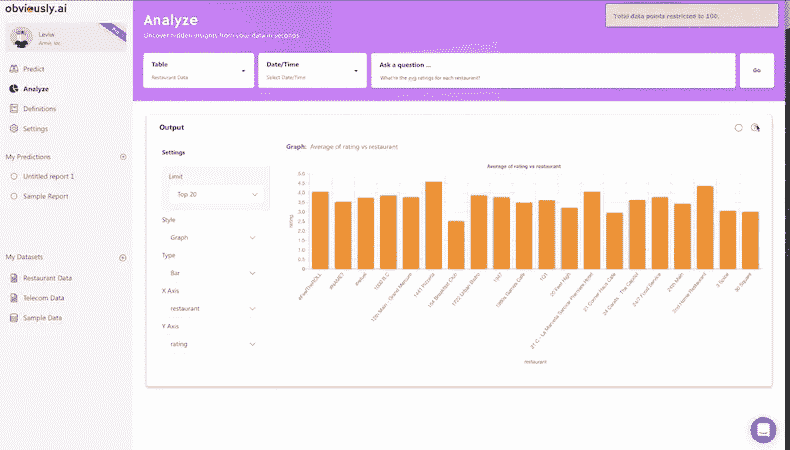

[显然，人工智能](https://www.obviously.ai)将人工智能的预测能力添加到了你常用的电子表格中。通过将该工具与您的历史表格数据(客户数据、交易数据、价目表)相联系，您可以确定您的客户的可能流失率、您的实时最优价格或您的业务运营风险。您可以用许多数据源丰富您的 ML 模型，并改进您的预测。显然，人工智能是一个很好的工具，可以即时利用你的业务数据。

## 阿克基奥

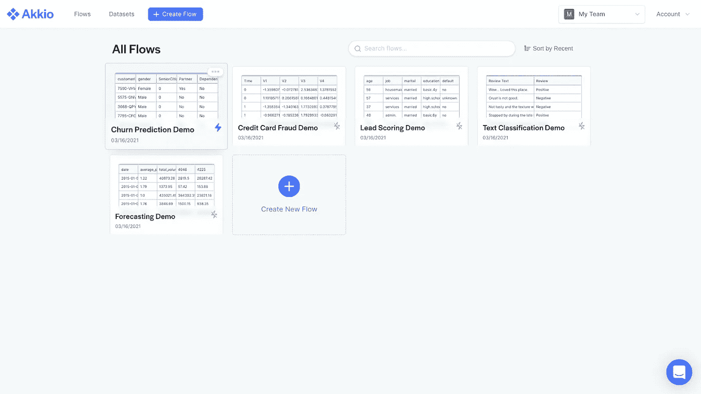

[Akkio](https://www.akkio.com) 提供相同的功能，但与您的业务应用程序(SalesForce、Hubspot、Airtable)直接集成。凭借其直观的界面，它为运营商和工程师提供了强大的预测、排名和智能推荐工具。因此，他们可以识别和利用关键业务变量来优化绩效。最重要的是，Akkio 拥有市场上一些最精确的 ML 模型，可用于许多用例。

## 猴子学习

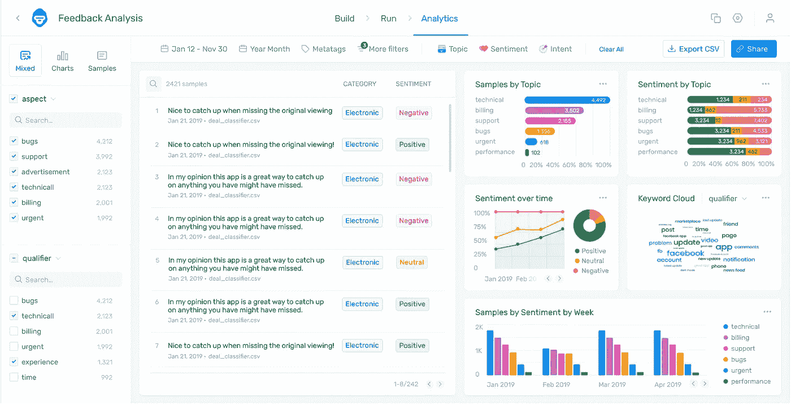

[MonkeyLearn](https://monkeylearn.com) 是一个以自然语言处理和文本分析为主的无代码 AI 平台。你只需要导入你的文本文件(从电子邮件，社交媒体，调查…)，你就会得到你的文本的语义和情感分析。通过数据标注训练模型，您可以自动对文本进行分类或找出有意义的关键字。通过这种方式，你可以将内容背后的感觉和意图形象化，或者轻松地发现特定的词语或谈话主题。MonkeyLearn 让您了解客户的感受，从而为您提供改善业务的关键见解。

# 非结构化数据的无代码人工智能

## 纳米网络

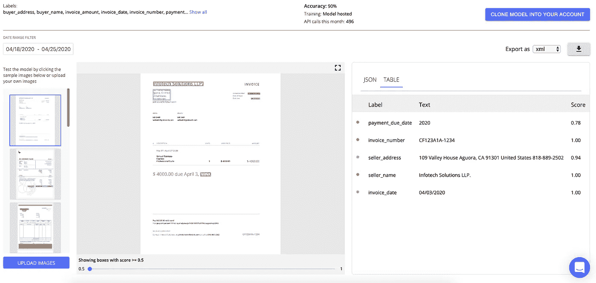

[Nanonets](https://nanonets.com) 允许您利用在非结构化文档中发现的数据。基于 OCR 技术，您可以训练模型来分析您的书面文档，只需很少的手动干预。您可以自动将会计、发票和管理文档转换为表格文件。您也可以只记录文档的某些特定部分，以提高效率并保留重要信息。这为操作员节省了大量时间，并允许他们从业务文档中提取关键信息。

## 超壬酸盐

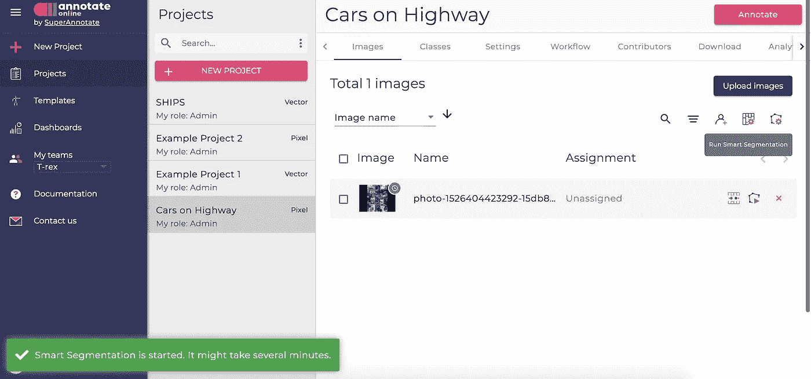

[SuperAnnotate](https://www.superannotate.com) 致力于让文本、图片和视频注释的艰苦工作变得更加容易。无论是对文本进行分类，识别图片中的对象，还是跟踪视频流中的手势和事件，该平台都为您提供了一个一体化的界面来构建您的训练数据集。有了这些深入的、高质量的注释，您可以将它们集成到您的自动化项目中，并创建一个为您的任务而完美训练的模型。

## 考萨伦人

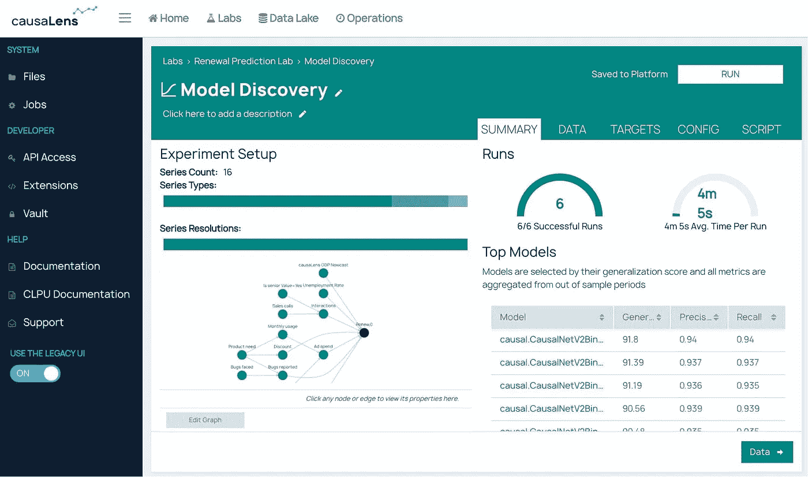

[CauseLens](https://www.causalens.com) 允许决策者利用公司的数据湖来指导和证明他们的决策。与仅依赖相关性的传统机器学习模型不同，使用该工具，您可以训练基于因果关系的模型。通过将它们连接到您的预测数据流和参考数据库，这些模型为您提供了有关业务关键决策的可解释预测。然后，您可以评估这些结果的相关性，获得下一步行动的建议，并向利益相关方证明您的决策是正确的。用于透明决策的透明人工智能。

# 没有代码人工智能的创造性使用

## 裂片

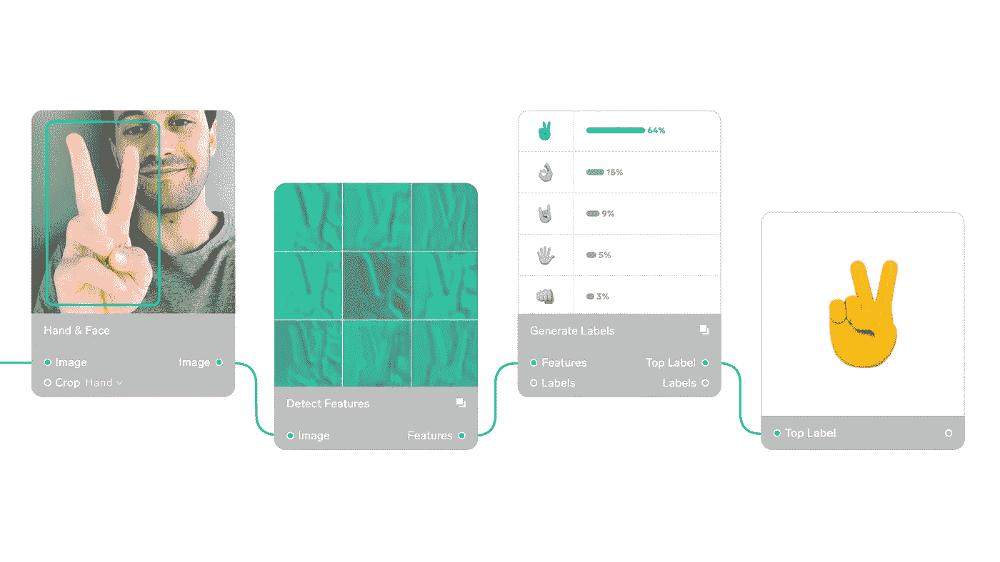

[Lobe](https://www.lobe.ai) 是一款让训练图像和视频分类模型变得前所未有的简单的应用。通过非常友好的用户界面，您可以一键标记来自图库或网络摄像头的图片或视频，检查模型的准确性，并将其集成到您的应用程序中。您可以创建识别情绪、分析动物行为、监控设备维护和检测产品或对象的模型。Lobe 为几乎所有人推广机器学习用例！

## 跑道

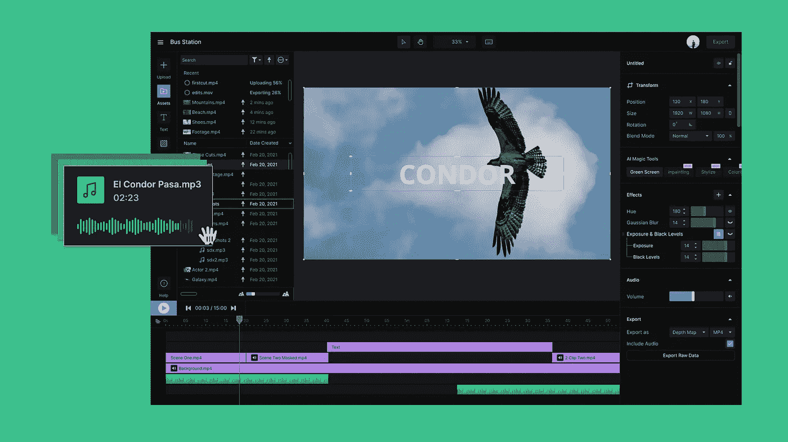

[Runway](https://runwayml.com) 为视频创作者带来人工智能的力量。借助预配置的视觉模板，您可以为视频添加高级滤镜，移除背景，并从您的帧中移动特定对象。这个视频平台以前是一个人工智能无代码工具，现在允许你通过自动对象识别和识别来进行专业的视频编辑。没有什么比成为高质量的视频制作者更有效的了！

## 可教机器

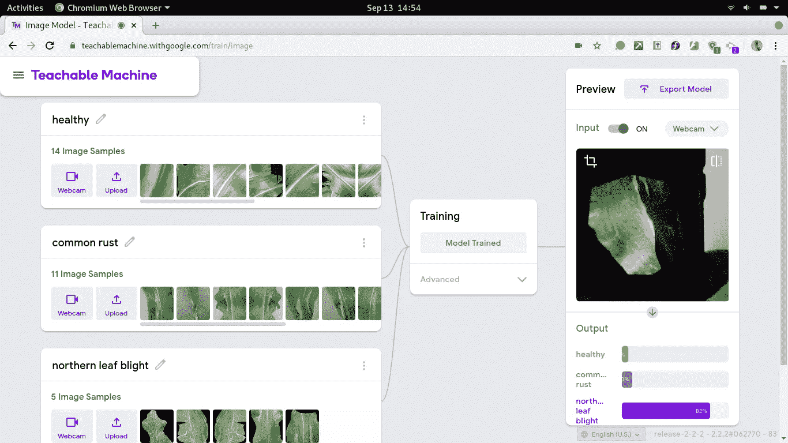

[可教机器](https://teachablemachine.withgoogle.com)让机器学习的可及性更进了一步。直接从你的电脑或智能手机的网络摄像头，你可以训练一个模型识别某些物体，姿势或图像，并逐步测试它的能力。你马上就会得到一个应用程序，它可以翻译语言障碍手势，对物体进行分类，并允许你进行游戏实验或制作动画机器人。可教机器使人工智能成为一个有趣的互动游戏。

# 一体化无代码人工智能平台

## 轻率

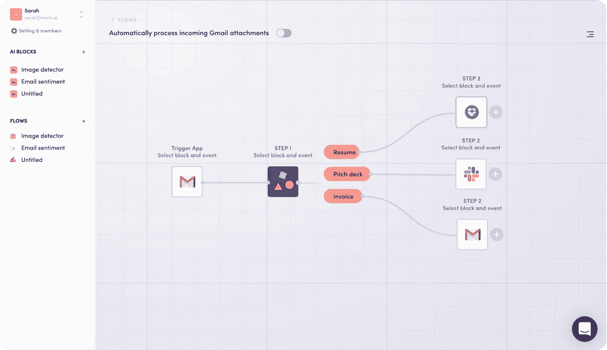

[轻佻](https://levity.ai)通过一个仪表板将所有数据科学功能掌握在您团队的手中。用户可以对图像、视频、音频和文本文档执行视觉质量检查、面部识别、内容审核或预测性维护。他们还可以对 Instagram 视频进行分类，进行社交监听，通过视频监控他们的工业过程，并自动标记他们的产品图像。简而言之，它是利用中型公司数据的终极工具！

## 谷歌云 ML

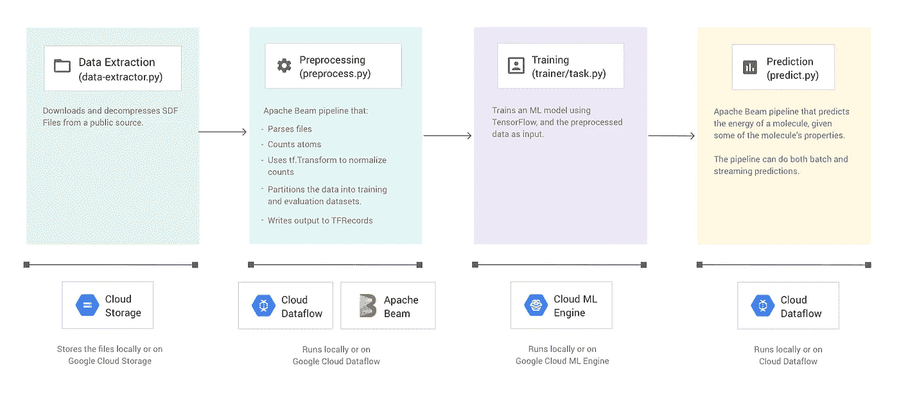

[Google Cloud ML](https://cloud.google.com/solutions/ai) 提供了同样的价值，但是使用了更大的用例列表和 Google 强大的技术。您可以分析和处理呼叫中心的音频数据，访问高级视觉识别技术，以及阅读非结构化文档。谷歌云环境的好处是，你可以在任何平台上集成你的应用程序，依靠预先训练的、最先进的 API 和可解释的模型。另一方面，这些解决方案不太容易获得，因为它们主要面向有经验的数据科学家工程师。

## 克拉里菲

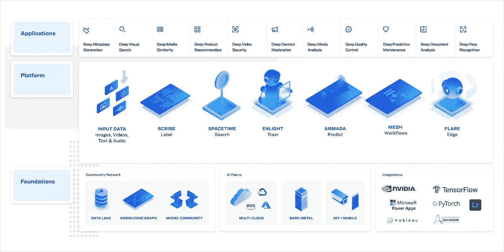

[Clarifai 的](https://www.clarifai.com)深度学习解决方案帮助您利用各种数据源潜力。无论是注释你的视频和文本，提供相关的搜索系统，还是在边缘为你的视觉监控和监视系统提供动力，Clarifai 的人工智能模型都是多功能的。它们让您的所有业务数据为您服务，并让您可以在单一平台上获得洞察力。您的团队拥有立即采取行动和预测威胁所需的一切。

这就是最好的无代码人工智能工具，让你的团队拥有数据智能。