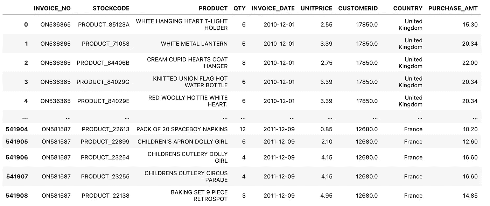
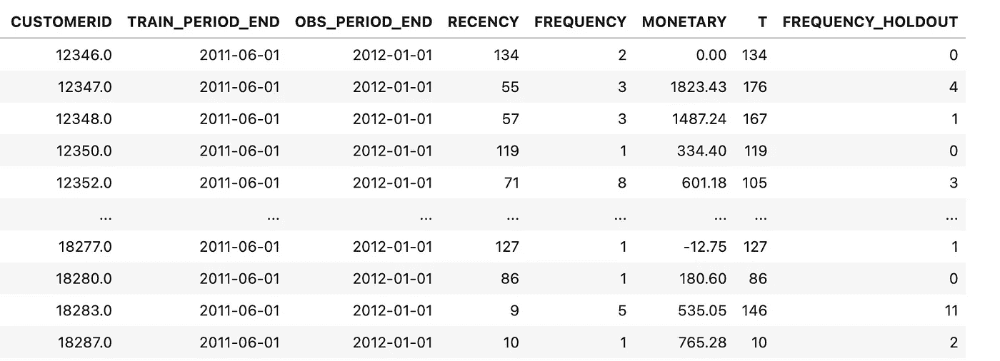
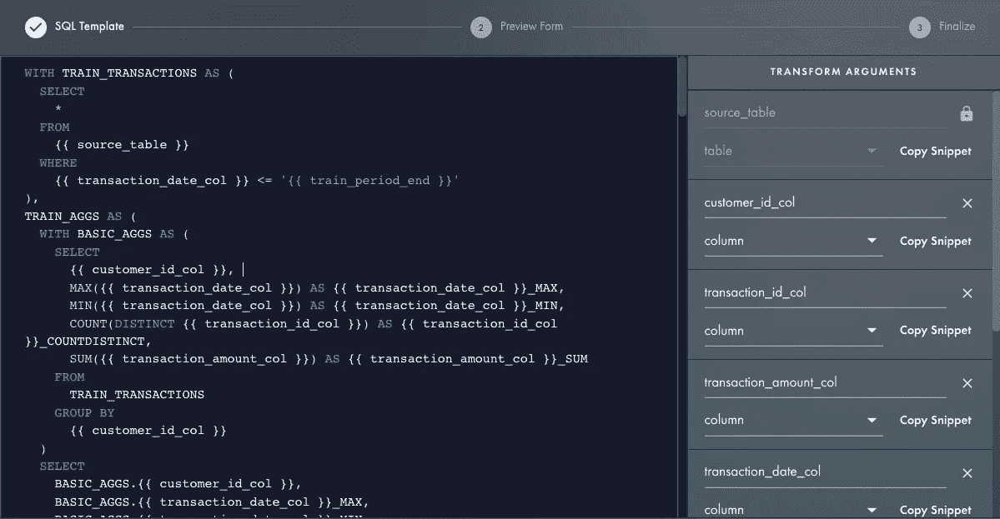

# 客户终身价值的最佳 SQL 模板

> 原文：<https://towardsdatascience.com/the-best-sql-template-for-customer-lifetime-value-56978b062c0b>

## 用于 RFM 和 CLV 分析的可重用 SQL


图片来自 energo epic . com:[https://www . pexels . com/photo/black-payment-terminal-2988232/](https://www.pexels.com/photo/black-payment-terminal-2988232/)

## 介绍

在过去 10 年的职业生涯中，我与各种客户、行业和数据集一起研究客户终身价值(CLV)模型。有许多不同的方法来解决这个问题，但是这篇文章不是关于这个的。相反，我想解释一下数据设置，这在博客圈经常被忽视。

在我的上一篇博客文章中，[让我们用 SQL](https://medium.com/@jberry_33001/lets-go-further-with-sql-babf2c5cae4) 走得更远，我谈到了我对结合 jinja 和 SQL 的潜力感到多么兴奋，以便利用 SQL 代码本身之上的语义抽象。这篇文章是最近在我脑海中出现的许多想法中的第一个。我的目标是(1)向您展示 CLV 模型的数据准备可以在 SQL 中完成，但更重要的是，(2)为您提供一个可以在其他地方应用的模板，这样您就不必真正从头开始编写 SQL。

## 入门指南

预测 CLV 最常用的概率模型是**贝塔几何/负二项分布**模型(通常缩写为 BG/NBD)。它有一个流行的表亲，帕累托/NBD 模型。这些模型试图预测给定客户的未来交易。 **Gamma-Gamma** 扩展模型关注的是那些交易的金额*货币方面*。

今年，全世界成百上千的数据科学家将建立这种模型。

他们将如何开始？你会如何开始？如果你是诚实的，第一步可能是谷歌它，阅读一些博客，然后跟随你自己的数据。如果你能在网上找到一个足够好的例子，你就能以一种类似于博客文章的方式有条不紊地操作你的数据，直到你足够接近它，你就可以开始运行了。

## 一个熟悉的模式出现了

如果你读了足够多的博客，你会开始意识到有一个熟悉的模式。所有这些都是从将数据处理成特定形状开始的——通常称为 [RFM 表](https://en.wikipedia.org/wiki/RFM_%28market_research%29) [。](https://en.wikipedia.org/wiki/RFM_%28market_research%29%29.)

还有其他方法来计算 CLV，我不打算讨论这些。我主要关注的是 RFM 表，因为它不仅是一种非常流行的方法，而且是非常可重复的。如果你不熟悉 RFM 餐桌，可以看看我的朋友奥卢布库诺拉·阿金索拉在 T2 的博客文章。

基本要素是:

**R** —客户从该企业购买的最近日期
**F** —客户从该企业购买的频率
**M** —客户购买的货币价值。

## 选择 SQL

如果您读过我以前的博客文章，那么您已经知道我热衷于利用 SQL 来利用数据仓库的处理能力。为了创建 RFM 表，我们需要从原始事务级别聚集数据，这可能是我们数据库中最大的表之一。虽然确实有很多可用的 python 解决方案，但当我有一个非常好的数据仓库时，为什么要费心去卸载数百万或数十亿的事务，而这些事务可能甚至不适合我的 python 内存呢？

## 使其可重复

在接下来的几节中，我将演示一个示例，该示例从我在网上找到的销售数据集中创建一个 RFM 表。然而，这意味着任何人在将来偶然发现这篇文章，仍然要仔细重写 SQL 以匹配他们自己的数据库。

这就是金贾发挥作用的地方。Jinja 是一个有 14 年历史的模板引擎，主要用于动态生成 HTML、XML 和其他标记格式。最近，它被证明是 SQL 的强大伙伴，被 dbt 和 Rasgo 所利用。如果你想阅读基础知识， [Julien Kervizic](https://medium.com/@julienkervizic) 在 2019 年写了一篇名为[Jinja the SQL way of the Ninja](https://medium.com/analytics-and-data/jinja-the-sql-way-of-the-ninja-9a64fc815564)的预言性文章。

因此，我不只是分享 SQL 代码和逻辑，而是将它带到下一个层次——我将分享一个模板，您可以使用它来为您的*自己的*数据动态创建 SQL。

## 浏览一个例子

让我们从 [UCI 机器学习库](https://archive.ics.uci.edu/ml/index.php)中获取一些销售交易的例子。



原始交易数据的示例

我处理这个问题的方法是首先构建 SQL。这一部分显然很有挑战性，但我这样做是为了让你不必如此。下面是工作的 SQL。

这个查询的结果是一个格式正确的 RFM 表，就像我们需要开始我们的 CLV 建模一样。



结果-RFM 交易汇总

## 成为一名忍者

为了构建我们的 RFM 表，我们需要一个要聚合的事务表。在这个表格中，我们需要找到的是:

*   CustomerID —唯一标识客户的列
*   TransactionID —唯一标识交易或购买的列
*   交易日期—标识交易日期/时间的列
*   TransactionAmount—标识交易的货币值金额的列

由于我们的目标是最终建立一个模型，我们还必须考虑一段时间的培训，以及随后的一段时间的验证/拒绝。

*   观察结束—我们认为数据结束的日期(维持结束)
*   TrainingPeriodEnd —我们将培训的结束与维持的开始分开的日期

从我们的示例数据中，我们知道这些:

下一步是创建一个与 jinja 兼容的 SQL 模板，这样我就可以在不同的项目和客户中重复使用。

因为代码很长，我将用一个简短的例子来解释这是如何做到的。如果我们最初的查询是:

```
SELECT CustomerID
FROM tblCustomers
```

我们想创建一些参数，比如，

*   列名
*   表名

那么我们的 jinja 模板将是:

```
SELECT {{ column_name }}
FROM {{ table_name }}
```

因此，我将整个 CLV-RFM 查询参数化，以便我们将来可以在任何事务表上运行它。

为了渲染 jinja，有大量的在线渲染器，或者你可以使用 python 包`jinja2.`个人来说，我使用 [Rasgo](https://app.rasgoml.com/sql) 来渲染模板。



用 Rasgo 渲染 SQL 模板

这里是完整的代码，准备好了！只需插入您自己的表名、列名，这将动态呈现为您的数据定制的 SQL。

## 结论

我真的为 SQL 模板的可能性感到兴奋。事实上，我已经有了一些其他的想法。例如，时间序列问题通常需要类似的数据准备步骤，

*   删除负销售额
*   为没有销售额的日期添加行
*   向前填充那些缺失行的最后已知值
*   添加滞后和基于窗口的聚合

我认为这听起来像是另一个模板的好候选。

你能想到什么吗？想投稿？请让我知道！