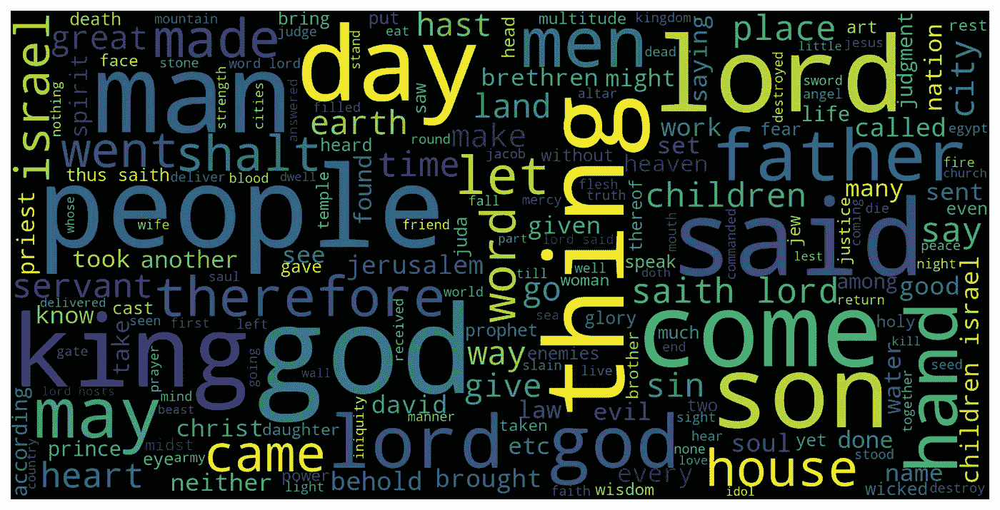
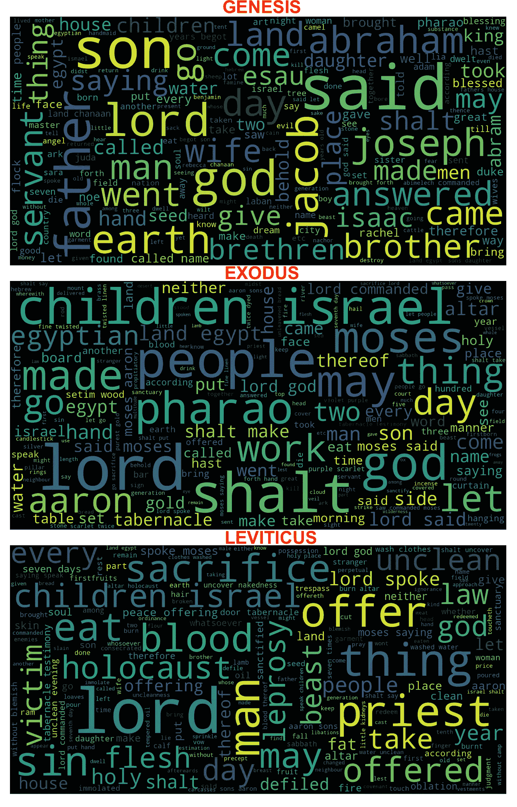
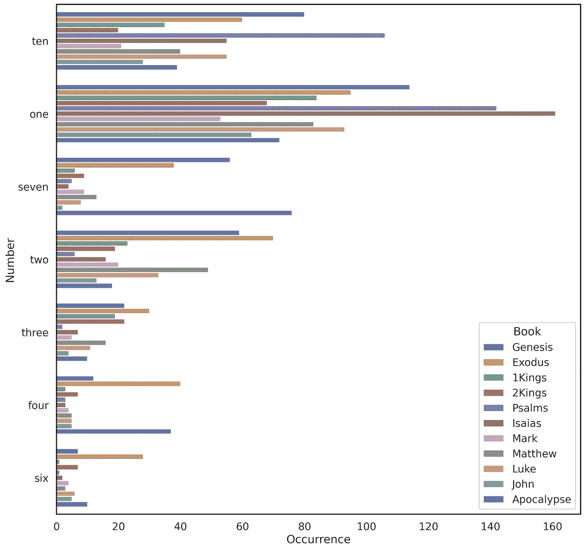
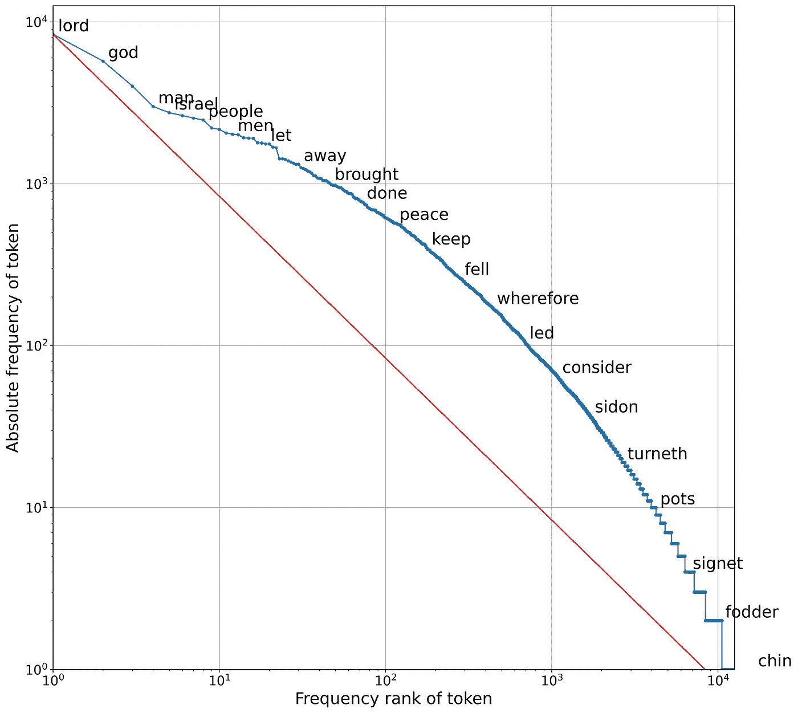
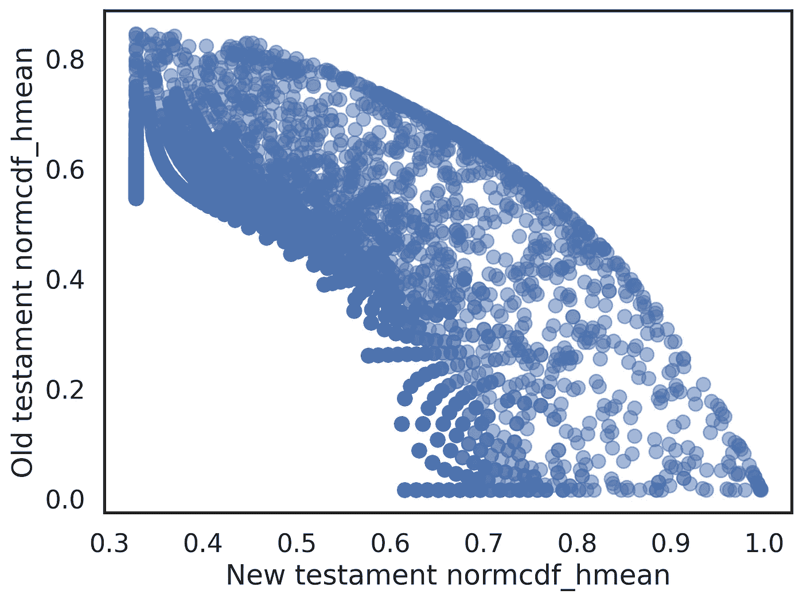

# NLP 眼中的圣经(上)

> 原文：<https://towardsdatascience.com/the-bible-under-the-nlp-eye-part-1-416dbfd79444>

## 有趣的数据科学项目的第一部分，学习更多关于文本处理、NLP 技术以及从文本语料库中提取有意义的信息。


图片由 [Pascal Debrunner](https://unsplash.com/@debrupas) 在 [Unsplash](https://unsplash.com/photos/_JedZkjoUFw) 上拍摄

由于复活节即将来临，我想到了一个有趣的数据科学项目，将 NLP 技术应用于圣经。圣经可以从古腾堡计划[https://www.gutenberg.org/cache/epub/1581/pg1581.txt](https://www.gutenberg.org/cache/epub/1581/pg1581.txt)([古腾堡许可](https://www.gutenberg.org/policy/license.html))免费下载文本格式

《杜埃-兰斯圣经》是从拉丁文圣经翻译成英文的，总共有 74 本。圣经的第一部分是旧约，共 46 卷，讲述了以色列人的历史(摩西五经)，善恶之分(智慧书)，以及先知书。第二部分是新约，28 本书，讲述了基督和他的门徒的历史以及地球的未来，直到天启。这部分的主要书籍是马可福音、马太福音、路加福音、约翰福音和启示录。

这个项目希望温和地介绍 NLP 世界，带领读者经历每一步，从清理原始输入数据到获取和理解书籍的显著特征。在这第一部分中，我们将处理:数据清理，从语料库中提取数据，以及 Zipf 定律。

## 开始前

这是两篇文章中用到的所有包:

```
import re
import nltk
nltk.download('stopwords')
from nltk.corpus import stopwords
import glob
import string
import gensim
from gensim.corpora import Dictionary
from gensim.utils import simple_preprocess
from gensim.models import CoherenceModel, Phrases, LdaModel
from gensim.models.ldamulticore import LdaMulticore
import pandas as pd
from num2words import num2words
import numpy as np
from wordcloud import WordCloud
from sklearn.feature_extraction.text import CountVectorizer
import seaborn as sbn 
from matplotlib.pyplot as plt
from scipy.stats import hmean
from scipy.stats import norm
```

因此您可以提前安装，只需导入一次。

## 预处理

预处理是第一件事——我们应该牢记在心！在这里，原始输入文件被清理，书籍被细分为单个文件。我进行了一次简单的手工清理，取出了每本书的介绍、书名和简介，以及最后的古腾堡末日免责声明。在这一步之后，每本书都从图案`Book_name Chapter 1`开始，伴随着诗句、数字和文本。

图 1 显示了我是如何将所有的书分成单个文件的。使用`.readlines()`将输入文件作为单个字符串读取。旧约全书在`old_books`中，`multinames`列表表示所有有多个版本的书籍(如`The First Book of Kings, The First Book of Paralipomenon` 等)。

图 1:开始打扫卫生，收集书籍的索引。这些索引有助于以后保存每本书。

对于以`Chapter`开始的每一行，我们提取`book_name`。对于`multinames`的书，我们在每章的开头都有模式`1 Book_Name Chapter 1`，所以我们从`val.split()[1]`行中提取下一个单词。第一次出现的`Book_Name Chapter 1`标记了书的起始索引。当`current_book_name`不同于存储的`tmp_book`名称时，检索结束索引。因此，字典`books_idx`包含图书名称、起始索引和结束索引(例如`{"Genesis":[0, 5689], "Exodus":[5689, 10258], ... }`)。从索引中，我们可以选择原始`lines`中的所有书籍，并将它们保存到一个`txt`文件中

如果没有不同的说明，输入文本已经以这种方式被清除，并作为字符串存储在`data`列表中:

图 2:输入书籍的清洁。每本书都要清理数字诗句模式、名称和章节号、标点符号、新行、停用词。

对于每本书来说，诗句的数字模式`NUMBER:NUMBER. text`都被移除了`re`以及与数字组合`\d{1,}`匹配的正则表达式`r"\d{1,}\:\d{1,}\.`、半列`\:`和最后一个点`\.`。同样，图案`Book_name Chapter NUMBER`被移除。最后，所有的文本都被转换成小写，标点符号以及停用词被删除。

## 获得一个初步的想法:wordcloud

对圣经中的主题和反复出现的词语有一个初步的概念是一个完美的起点。Wordcloud 以人类可理解的方式显示文本中出现最频繁的单词。所有的圣经书籍都可以压缩在一个`big_string`中，生成一个单词云`WordCloud(width=IMAGE_WIDTH, height=IMAGE_HEIGHT, max_font_size=FONT_SIZE).generate(big_string)`:

图 3:从所有的书籍中创建一个单词云。WordCloud 的输入参数是一个字符串

图 4 显示了所有书籍的文字云。话题可以立刻被发现，还有`lord`、`god`、`come`、`son`、`isreal`、`king`等关键词



图 4:所有圣经书籍中的文字云。作者图片

我们可以做得更多，为每本书提取一个词云。图 5 显示了旧约的前三本书《创世纪》、《出埃及记》和《利未记》中的文字云的比较。我们可以清楚地认识到主要元素和差异。《创世纪》以`earth`和`god`开始，其中`said`到`Abraham`不吃树上的果子。从那里我们可以定义亚伯拉罕的其他后代，比如`Joseph`、`Isaac`、`Brethren`。在《出埃及记》中，主角是`Moses`和`Egypt pharao`。最后，在利未记中，主题是`holocaust`，所以我们会有`sacrifice`、`blood`、`victim`、`flesh`和`offer`这样的词



图 5:旧约前三卷中的字云比较。作者图片

我将留给你们去分析和观察福音书的词汇云的不同，并欣赏福音书、创世纪和启示录(这是最后一本圣经，可能是在基督后 100 年写的)之间的音调差异。

## 数字符号

因为圣经来自口头传统，所以有许多重复出现的模式。此外，还有很多象征意义。每个词在特定的上下文中都有它的含义。这同样适用于数字。数字被用来表达一个概念——例如“七倍多”或“七十七倍”通常被用来表示“很多”——并构成了一个独特而有趣的有待发现的特征。此外，在文本中查找数字是学习正则表达式的好方法，也是获取数字的小技巧。

任务是在文本中找到简单的英文数字。第一种简单的方法是将整数转换成字符串，将文本分割成空格以得到一个分割列表，并计算每个分割列表出现的次数。图 6 总结了这种方法。首先，我们用`num2words`将数字转换成字符串，并存储在一个列表中。在数据被清理(如上)后，我们可以计算每本书的每个数字出现的次数。在 Google Colab 笔记本上，这个过程对于 100k 个号码来说大约需要 12 秒。到目前为止还不错，但是，我们可以立即看到，最终的字典充满了大多数数字的 0 出现。此外，大多数找到的数字都在 0 到 20 之间。这是由于我们如何分割字符串以及如何将一些数字转换成字符串(例如，我们可能在数字列表中有 `twenty-one` ，但在文本中应该是`twenty-one` )

图 6:在文本中查找文字数字的第一种方法

我们可以使用 Python 模块`re`并构建一个正则表达式来改进这种方法。我不想教你如何创建一个正则表达式，有大量的源代码，记住如何创建一个正则表达式通常是没有用的。我想把我们的注意力集中在如何处理这个过程上。

我们的想法是创建一个正则表达式，它可以匹配给定书籍中的所有数字。正则表达式的核心部分可能类似于`\b(numb1|numb2|numb3)\b`。图 7 显示了对包含以下数字`one, twenty thousand, three thousand thirty four, three thousand five hundred forty five`的字符串的测试。因此，我们可以构建一个包含数字的正则表达式，并像`re.findall(regex, test_text)`一样对测试字符串运行它。超级简单，但是结果非常错误，因为找到的数字是`one, twenty, three, thirty four, three, five, forty five`。正如您所看到的，regex 是如何在找到匹配后立即停止的。这不是我们想要的。我们可以做一些更隐蔽的事情，颠倒正则表达式的顺序，在开头使用“罕见”的数字，在结尾使用小的“频繁”的数字。如您所见，结果是正确的，返回了我们想要的数字。

图 7:用正则表达式获取文字数字。记住:在正则表达式中，顺序是非常重要的！

有了这个方案，我们现在可以在圣经中查找数字，对从`num2words`转换来的数字增加一点预处理，如图 8 所示。正则表达式在 2 秒内创建，而运行匹配位需要 1 分 30 秒。在这种情况下，最终的字典`match_dict`将包含比我们之前的方法更重要和有用的信息，因为每本书都将记录正确的数字，避免大量的 0 值。然而，创建这样的正则表达式是很痛苦的，而且当我们必须运行匹配过程时，效率不是很高。https://www.rexegg.com/regex-trick-numbers-in-english.html 来帮忙了

图 8:使用逆序/非频繁数字顺序创建一个正则表达式

图 9 示出了我们可以创建正则表达式来匹配简单的英文数字，通过简单地使用字面数字构造，例如`f(?:ive|our)`并且定义从 0 到万亿中的万亿的数字，而不用在存储器中存储任何东西或者额外的过程。正则表达式的创建过程大约需要 300 微秒，而匹配过程大约需要 4 秒钟！

图 9:寻找数字的正则表达式，利用简单的英语规则

如你所见，最后一种方法是成功的方法。它更容易移植，不需要对数字进行额外的处理，而且比我们的第一种方法计算效率更高，可以返回完全正确的信息。

如果我们分析最终的匹配词典，我们可以看到`Numbers`是——不出所料——拥有最多数字的书，632 本。第二本书是`Genesis`，508，而`Apocalypse`有 323 个数字，比《新约》中的任何一本书都多，其中`seven` 重复了 76 次，`one`重复了 72 次。圣经中的最高数字是 800'000，它出现在撒母耳记下第二卷，24:9(旧约):

> 约押将百姓的总数奏告于王，以色列拿刀的勇士有八十万，犹大拿刀的勇士有五十万。

从输出字典中，我们可以通过`pandas.DataFrame`比较所有结果，并以直方图显示它们(图 10):

图 10:从输出字典创建一个熊猫数据帧。选择主要帐簿并创建直方图

我们可以比较圣经的主要书籍，即`Genesis`、`Exodus`、撒母耳记下第一、二卷(`1Kings`、`2Kings`、`Psalms`、`Isaias`、福音书:`Mark`、`Matthew`、`Luke`、`John`和最后一卷`Apocalypse`



图 11:比较主要圣经书籍中常见数字的直方图。作者图片

10、1、7、2、3、4 和 6 是圣经中常用的数字。特别有趣的是注意到`seven`在`Genesis`(第一本书)和`Apocalpyse`(最后一本书)中的使用

## 齐夫定律

以美国语言学家乔治·金斯利·齐普夫命名的齐普夫定律将单词的出现频率和它们的排名联系起来。特别地，在文本语料库中，任何词的频率与其频率排名成反比。或多或少，出现频率最高的单词是第二高的单词的两倍，第三高的单词的三倍，依此类推。将该定律转换到对数-对数域，结果是作为单词等级和单词频率的函数的线性图。从这里，让我们看看圣经文集是如何与齐夫定律相关联的。

图 12 显示了如何计算每本圣经的词频和排名。首先，我们启动`sklearn.feature_extraction.text.CountVectorizer()`来统计每本书出现的所有单词。最终的矩阵计数`all_df`可以转换成一个`pandas.DataFrame`，对所有出现的单词`tf = np.sum(all_df, axis=0)`求和，并从`cvev.get_feature_names()`中检索单词。最终的数据帧`term_freq_df`将把单词作为索引和一列，这是语料库中单词的总计数。从那里可以在对数尺度上比较词的分布与 Zipf 定律。

图 12:根据圣经语料库计算并绘制齐夫定律

图 13 显示了最终的绘图结果。圣经稍微偏离了 Zipf 的线性。这并不奇怪。事实上，在《圣经》中有许多在自然语言中很少使用的重复词语。有趣的是,`chin`这个词只用了一次，在撒母耳记下第二卷 20:9:

> 约阿布对阿玛撒说:我的兄弟，愿天主拯救你。他用右手抓住阿玛萨的下巴亲吻他。



图 13:圣经语料库与 Zipf 的预期行为略有不同。作者图片

从这里，我们可以更深入地了解圣经中的用词，以便看到主要书籍之间的差异。首先，整部圣经中反复出现的主要词汇是:

*   `lord`出现 8377 次
*   `god`出现 5720 次
*   `man`出现 2999 次

有趣的是，`David`比`christ`或`Jesus`用的次数多，分别是 1162、992 和 1028，而`children`这个词用了 1915 次。

接下来，我们可以检查一下新约和旧约在用词上的差异。表 1 显示了旧约(`Old T%`)和新约(`New T%`)中单词出现的百分比。我们可以看到`lord`、`Israel`、`king`、`people`在旧约中的主要用法，以及它们在新约中对`god`、`Jesus`、`christ`、`father`和`man`的翻译/转化。

表 1:旧约(旧 T %)和新约(新 T %)出现的百分比比较。

我们可以通过研究单词的出现来探索这种术语上的差异。图 14 示出了如何将旧/新约的单词出现与总比率和旧/新类别比率的正态累积分布函数的调和平均值相关联。这是什么意思？我们可以立即找到独特的词汇，这些词汇是旧约全书和新约全书的主要特征:

*   首先我们计算一个单词率，即单词出现次数，`term_freq_df[0`表示总出现次数`term_freq_df['total']` → `old_rate`
*   类似地，我们计算特定类别的单词率，即使用`term_freq_df[0].sum()` → `old_freq_pct`细分单词的出现
*   我们计算`old_rate`和`old_freq_pct`之间的类调和平均值
*   从这里我们计算出`old_rate`和`old_freq_pct` → `old_rate_normcdf`和`old_freq_pct_normcdf`的正态累积分布函数
*   最后，我们计算出`old_rate_normcdf`和`old_freq_pct_normcdf`之间的调和平均值，以给给定类别的唯一和特定的单词更多的权重

这种方法主要来自于[里奇金](https://medium.com/@rickykim78)的惊人文章

图 14:计算旧约/新约单词出现率的调和平均值的 normcdf

如果你画出`old_normcdf_hmean`和`new_normcdf_hmean`，你会看到图 15，它在左上角突出了所有独特的和主要在旧约中使用的词，在右下角突出了在新约中特别使用的词。



图 15:旧约和新约的谐音。左上角突出了独特和具体的话，主要用于旧约，而右下侧的话，特点是新约。作者图片

从这里我们可以立即看到《旧约》和《新约》之间的语气对比，表 2。在《旧约》中，更普遍的“战争”术语是`valiant`和`convenient`，故事的特点是“农村”社会。新约强调新的信仰，突出了`angels`、`charity`和`faith`的概念

表 2:描述以下特征的特定术语

作为最后一件事，上面的分析可以适用于所有四部福音书，突出了每部福音书的特征词。福音书写于不同的时代，最古老的是马可福音，其次是马太福音、路加福音和约翰福音。接下来会有不同的写作风格，以及每种风格中使用的更具体的词语。约翰福音似乎是最“天主教”的福音，用的术语指的是现在的教会:`flesh`、`glorify`、`paraclete`、`truth`。我们将在下一篇文章中回到这个话题:)

今天是一切:)

## 第一部分的结论

让我们回顾一下今天的内容:

*   我们学习了如何预处理原始文本输入，为 NLP 分析做好准备，并将其保存到不同的文件中
*   为了初步理解我们的数据，我们从这里开始运行`WordCloud`,我们能够识别圣经书籍中不同的主题
*   我们看到了如何处理一个正则表达式问题，用简单的英语找到一系列数字，以及如何优化最终的解决方案
*   最后，我们对照圣经语料库测试了齐夫定律，并扩展了这一分析，为四部福音书中的每一部定义了独特的词汇

下次我们将运行主题建模、单词嵌入和文本嵌入以及文本相似性。敬请期待:)

*通过我的推荐链接加入 Medium，支持我的写作和项目:*

[](https://stefanobosisio1.medium.com/membership) [## 通过我的推荐链接加入 Medium—Stefano Bosisio

### 作为一个媒体会员，你的会员费的一部分会给你阅读的作家，你可以完全接触到每一个故事…

stefanobosisio1.medium.com](https://stefanobosisio1.medium.com/membership) 

*如果有任何问题或意见，请随时给我发电子邮件:stefanobosisio1@gmail.com 或直接在 Medium 这里。*