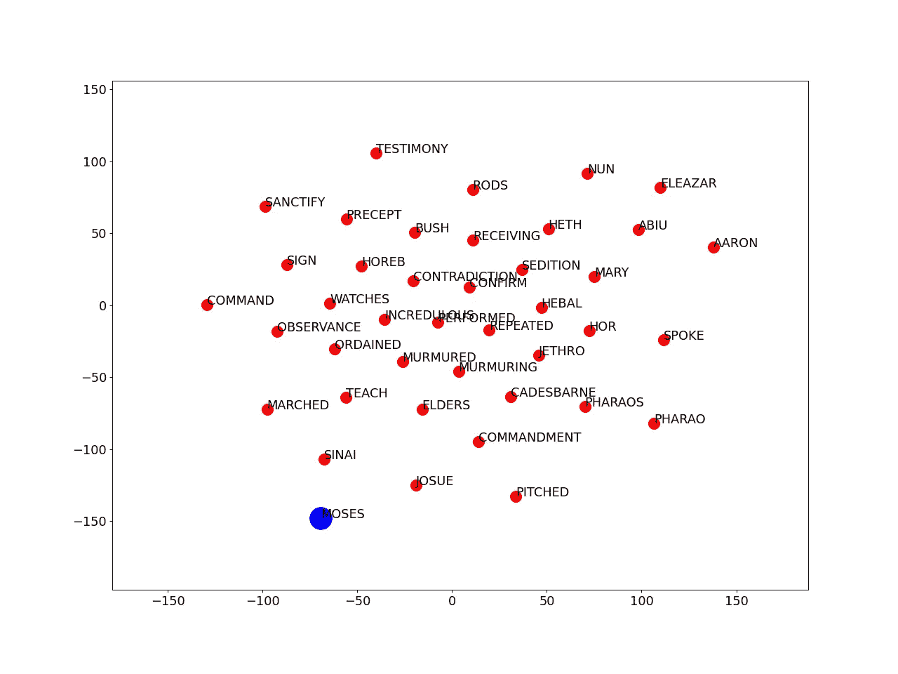
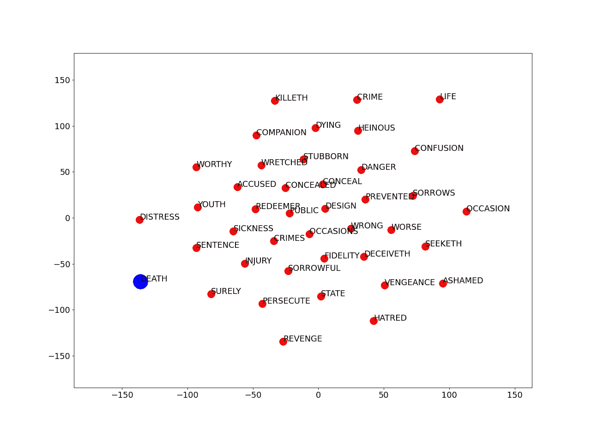
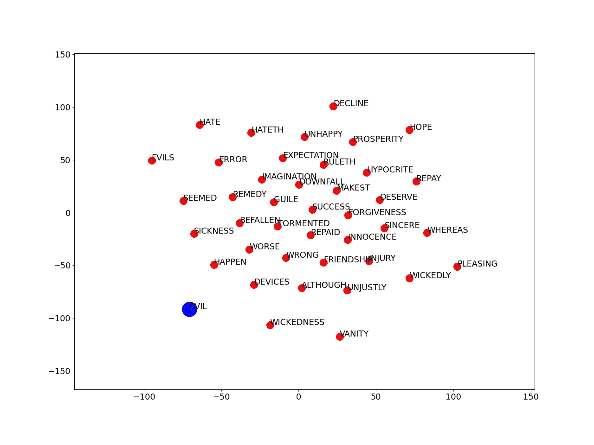
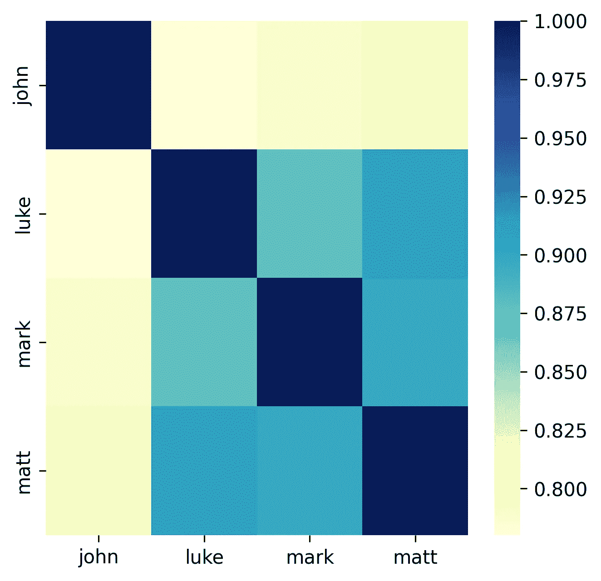
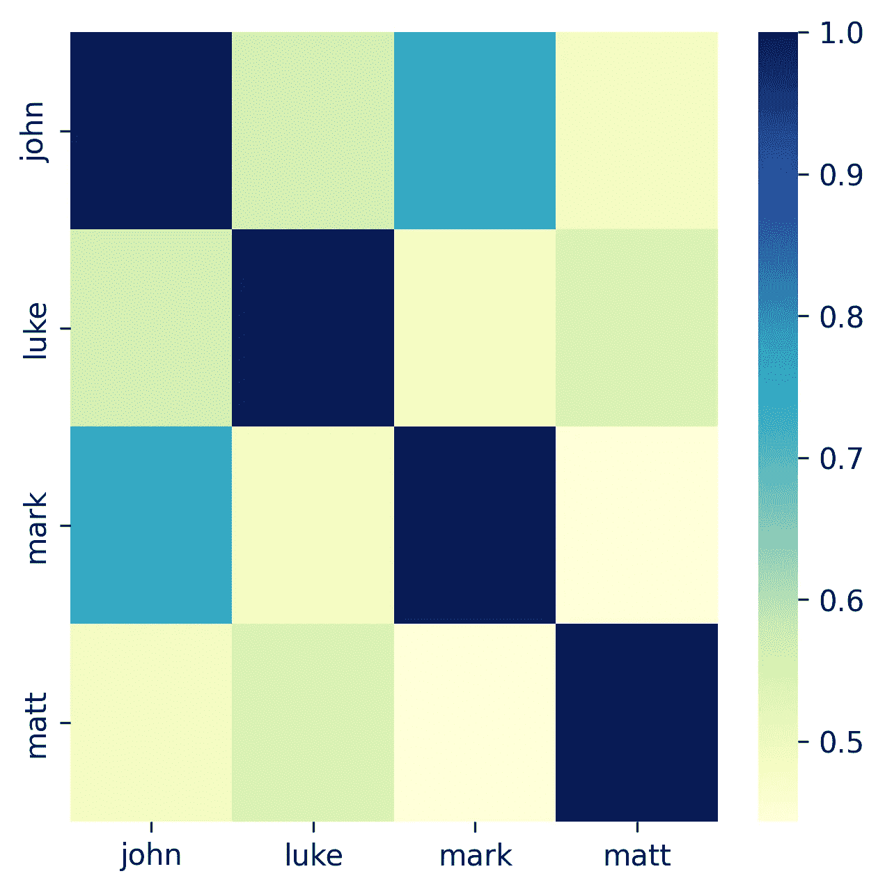

# NLP 眼中的圣经(下)

> 原文：<https://towardsdatascience.com/the-bible-under-the-nlp-eye-part-2-df2559cdae5f>

## 我们的 NLP 探索的第二部分:通过 TF-IDF 和 transfomers 的主题建模、单词嵌入和文本相似性


西蒙·伯杰在 [Unsplash](https://unsplash.com/photos/twukN12EN7c) 上拍摄的图片

欢迎回到 NLP 世界的介绍。如果您错过了 NLP 介绍的第一部分，请单击此处:

[](/the-bible-under-the-nlp-eye-part-1-416dbfd79444)  

今天我们将探索新的自然语言处理工具，来分析圣经:

*   主题建模:从文档(圣经书籍)到主题
*   单词嵌入:如何获得嵌入，我们能从这种方法中得到什么信息？
*   文本相似性:福音书之间有多相似？我们可以使用什么技术来检测相似性，文本相似性意味着什么？

[在这里](/the-bible-under-the-nlp-eye-part-1-416dbfd79444#8a62)你可以找到每个主题所需的所有软件包——更多软件包将在文章中给出。当[在这里](/the-bible-under-the-nlp-eye-part-1-416dbfd79444#9c99)时，我已经为原始数据定义了预处理和清理代码

## 主题建模

数据科学家通常采用主题建模来从非结构化数据中获得洞察力，检索关键和简明的信息(例如，评论、医疗文档、机器信息、元数据)。在商业中有无数的主题建模的例子，从总结评论到在客户电话中发现商业问题。具体来说，有两个主要的主题建模策略:1)非负矩阵分解(NMF)——[这是我关于 NMF 及其实现的文章](/practical-cython-music-retrieval-non-negative-matrix-factorisation-fd4b2ce65457)——以及 2)潜在狄利克雷分配(LDA)。

在本教程中，我们将使用 LDA。LDA 的根源在于 2003 年的一篇论文(是的 19 年前！)发表在《机器学习研究杂志》上，作者大卫·布雷、吴恩达和迈克尔·乔丹——三位伟大的人工智能/人工智能作者。我将写一篇关于这种技术的文章，因为我喜欢它，但是，我很乐意让你抓住 LDA 工作的这个基本概念:*可交换性*。可交换性是一个简单的数学假设，1985 年和 1990 年的论文。根据意大利 Guido De Finetti 定理，任何可交换随机变量的集合都可以表示为混合分布。简而言之，我们可以在不考虑文档中单词顺序的情况下建立主题模型。有了这个定理，我们可以通过混合分布捕获重要的文档内统计结构。

让我们从旧约开始，通过像我们在第一个教程中所做的那样清理和分组所有的书[，让我们看到所有书的主题。图 1 显示了对旧约全书执行 LDA 的工作流。](https://gist.github.com/Steboss89/73e1f3bbf1a62403ccad53f7e63a6581#file-cleaning_2-py)

图 1:根据旧约全书搜索 LDA 的函数和参数。

首先，在第 60 行，我们对每本书执行一个`gensim.utils.simple_preprocess`,它被视为一个唯一的字符串/句子。其次，我们将创建一个字典，其中有一个单词索引映射(例如，单词`allowed`在 LDA 算法中表示为`0`)。一旦映射`id2word`我们就可以创建一个“单词袋”，字面意思就是装满单词的袋子。`corpus`返回每个文档中每个单词的出现频率。最后，我们用`gensim` 到`gensim.models.ldamodel.LdaModel`运行 LDA 算法

现在，让我们花一点时间来看看我们是如何运行 LDA 的。LDA 理论清楚地表明，我们需要给出我们期望的主题的输入数量。此外，我们还有一些其他超参数，例如，块大小和每次循环的迭代次数，循环次数。在这个例子中，我试图探索主题的数量和组块的大小，以找到最佳主题。然而，等一下，我们如何衡量一个成功的主题建模？嗯，我们有两个很好的指标可以帮助我们进行主题建模:`perplexity`和`coherence`。

前一个度量是预测性度量，并且它与模型交叉熵相关联。`perplexity`在训练集上训练后，评估模型预测测试集主题的良好程度。很难给这个分数一个正确的解释，通常越负面越好，但是已经证明`perplexity`没有一个明确的人类解释。第二个指标，`coherence`，通过测量主题的可解释性来帮助我们——在更人性化的意义上，通过测量主题中的单词与文档中的单词的相似度。作为一个建议，在所有这些中，总是需要一点点人类的解释，所以不要过分地用分数来偏见自己。

事实上，这应该是你能得到的最好结果:

```
Num Topic 4 and chunksize 20 Computing LDA with  4 topics, 20 chunksize... 
Writing classification onto csv file... 
Topic Keywords 
['lord, saith, land, god, israel, people, shalt, king, man, day'  'lord, israel, king, god, said, son, house, people, juda, jerusalem'  'god, man, lord, things, heart, good, wisdom, men, fear, soul'  'king, great, jews, us, men, kings, daniel, kingdom, came, day']
```

正如你所看到的，前两个主题有着或多或少的相同含义，它们指的是应许之地，以色列或犹大家(或多或少在地理上)。第三个需要一点解释，它可能是指上帝的智慧以及人类应该如何敬畏上帝，或者是上帝和人类之间的相似性。最后是混合了[丹尼尔](https://en.wikipedia.org/wiki/Daniel_(biblical_figure))的故事，以及有一天国王会到来的预言。

让我们对新约也这样做:

```
Num Topic 3 and chunksize 20 Computing LDA with 3 topics, 20 chunksize… 
Writing classification onto csv file… 
Topic Keywords 
[‘said, jesus, man, god, things, come, therefore, lord, came, say’ ‘god, christ, also, things, jesus, may, lord, faith, sin, according’ ‘god, earth, great, seven, angel, beast, heaven, voice, throne, come’] Perplexity -7.394623212885921 Coherence 0.4202057333015461 Num Topic 4 and chunksize 50 Computing LDA with 4 topics, 50 chunksize… 
Writing classification onto csv file… 
Topic Keywords 
[‘said, jesus, god, man, lord, things, come, came, saying, say’ ‘god, christ, also, things, lord, jesus, man, may, faith, according’ ‘god, earth, great, seven, come, heaven, angel, saying, things, beast’ 
‘god, christ, sin, law, faith, jesus, son, also, spirit, things’] Perplexity -7.347456308975332 Coherence 0.3708218577493271 Num Topic 5 and chunksize 50 Computing LDA with 5 topics, 50 chunksize… 
Writing classification onto csv file… 
Topic Keywords 
[‘said, jesus, god, man, lord, things, come, came, saying, also’ ‘god, christ, also, things, lord, jesus, man, may, faith, according’ ‘god, earth, great, seven, come, heaven, angel, saying, things, beast’ 
‘god, christ, sin, law, spirit, jesus, faith, also, son, world’ ‘jesus, things, god, christ, may, men, saviour, good, also, lord’] Perplexity -7.353096888524062 Coherence 0.3734882570283872
```

如您所见，许多主题相互重叠。我个人认为 3 个主题足以区分所有的新约主题。前者`said, jesus,man, god, things, come, therefore, lord, came say`指耶稣的寓言；第二个话题`god, christ, also, things, Jesus, may, lord, faith, sin, according`可能是指对上帝的信仰和耶稣为人类的罪所做的牺牲；最后一个话题指的是天启`god, earth, great, seven, angel, beast, heaven, voice, throne, come`

总之，主题建模是理解文档中引入的关键词和主题的一种很好的技术。我们不能用一种简单的方式来衡量主题的正当性，但是我们必须采用`perplexity`和`coherence`，无论如何，如果没有足够的人类解释，这是不够的。从旧约和新约，从应许之地到启示录，衍生出三个主题。我们能做更多来整合主题建模吗？当然，我们可以在单词嵌入上运行主题建模——我会把这个练习留给你来解决:)

## 单词嵌入

现在让我们来看一些更复杂的东西:单词嵌入。许多(显然)单词和文章都花在了单词嵌入上。简而言之，单词嵌入允许我们将多维单词、句子和文档简化为人类可解释的含义和计算有效的向量。一个向量可以有大量的维度，但是当所有的单词都投影到向量上时，就有可能将它们聚集在不同的类别中，从而解决并大大简化真正的大规模问题，并找到单词之间的有趣关系。

对于单词嵌入，我们需要以下附加包:

```
from sklearn.manifold import TSNE
from collections import Counter
from six.moves import cPickle
import gensim.models.word2vec as w2v
import numpy as np
import tensorflow as tf
import matplotlib.pyplot as plt
import multiprocessing
import os
import sys
import io
import re
import json
import nltk
nltk.download('punkt')
```

然后，我们将计算嵌入并创建一个`w2v`文件来保存来自`gensim.w2v.Word2Vec`的二进制单词嵌入

图 2:使用 gensim word2vec 函数从一系列文档中计算给定文本的单词嵌入表示。在这种情况下，我们正在处理新约全书

现在，我们想把这个多维向量形象化。一种常用的方法是使用 *t 分布随机邻居嵌入*或 *t-sne，*这是一种非线性降维技术。下面的代码将给我们一个在 2D 嵌入向量的单词:

图 3: T-SNE 函数表示二维的单词嵌入。最初，t-sne 是基于单词嵌入表示来计算的。然后检索最频繁的单词并收集最相似/相关的单词。最终的图表显示了一个单词与其他单词的关联程度

代码很长，所以我们要做的是:

*   首先，我们通过带有`calculate_t_sne`的 t-sne 减少二维的单词嵌入，产生`x_coords, y_coords`和`labels`(它们是单词)
*   我们用`Counter().most_common()`计算单词的频率
*   对于前 50 个最常用的单词，我们将通过`most_similar`检查这些单词是如何与 word2vec 词汇表中的其他单词向量相关联的。最终，我们为 50 个最常用的单词返回一系列列表，并为每个单词返回相关的单词。
*   在这一步之后，我们将这一系列列表转换为 t-sne 空间中的 x 和 y 坐标，并绘制最终结果。

在我看来，图 4 显示了 word2vec 的全部力量，我们可以清楚地看到摩西之间的正确联系。我们有`Sinai`、`Commandment`、`Observance`(至十诫)、`Pharaoh`



图 4:圣经中单词嵌入的 t-sne 图。在这种情况下，摩西与他故事的所有元素都有关联

图 5 显示了单词 Death 的另一个特殊的单词嵌入。我们可以看到`Life`处于完全相反的位置，而在它们之间有`revenge`、`crimes`、`sickness`、`danger`和`confusion`



图 5:圣经中单词嵌入的 t-sne 图。在这种情况下，死亡与他的故事的所有元素相关联

图 6 是我们用 word2vec 得到的信息的最后一个例子，单词`evil`在相反的方向，我们将得到`hope`，有趣的是看到邪恶在整个圣经中是如何联系在一起的。邪恶是错误的，它与疾病、邪恶和虚荣联系在一起。



图 6:圣经中单词嵌入的 t-sne 图。在这种情况下，邪恶与他的故事的所有元素相关联

总而言之，单词嵌入可以给你单词间隐藏的联系。在真实的场景中，单词可以是评论、产品、搜集的数据，你可以通过嵌入建立重要的联系。此外，单词嵌入可以而且应该与主题建模一起使用，以进一步利用单词关联来发现更多可解释的主题。

# 文本相似度

[圣经最受讨论的一个方面是书籍](https://en.wikipedia.org/wiki/Synoptic_Gospels#/media/File:Relationship_between_synoptic_gospels-en.svg)的重叠和相似，尤其是福音书。事实证明，马可福音 76%的内容是在马太福音和路加福音中共享的。此外，马太和路加分享了大约 50%的内容。稍有不同的是约翰福音，它是在将近 100 年后写成的，写作风格与天气福音相去甚远。

您可以尝试的第一种文本相似性方法是运行*术语频率-逆文档频率*或 TF-IDF。在这种方法中，我们将考虑整个语料库中的词的频率，而不是单个文档(例如，整个圣经而不是单本书)。关键是，在任何地方出现次数多的词，意义会低，而出现次数少的词，可能有意义。TF-IDF 的实现用`scikit-learn`很简单，如图 7 所示

图 7:sci kit-learn 中的 TF-IDF 实现。这里的数据是一个 dataframe，其中每一列都有一篇福音书(约翰福音、路加福音、马可福音和马太福音)

这里的`data`是一个熊猫数据框架，每一列都是一个福音。文本通过`TfidfVectorizer`处理，最后通过`cosine_similarity` ig 计算相似度。记住，当你想测量向量之间的相似程度时，余弦相似度是最好的方法。图 8 显示了四个福音的相似性结果。正如你所看到的，这个情节强烈地指向天气福音的相似性有多强，通过一点计算能力，我们已经对 4 本主要的圣经书籍有了一个很好的看法。



图 8:用 TF-IDF 方法分析四个福音的余弦相似性。我们用一种简单的方法复制了最初在圣经研究中发现的东西

这很好，但我们可以尝试做得更多，分析每本书的上下文内容。使用句子转换器可以实现更精确的方法。在这里，我们可以引用大量的模型，其中最著名的是 BERT 和 Sentence-BERT (SBERT ),它是由一个暹罗网络组成的，用于导出句子嵌入。这里我们不仅要看文本的相似性，还要看上下文的相似性。图 9 显示了实现，由于`sentence_transformers`包包含了我们想要的所有相关变压器，所以实现非常简单。我们选择`stsb-roberta-large`作为要使用的转换器，并对我们拥有的输入数据进行编码。最后，正如我们之前所做的，相似性是用余弦相似性来度量的。

图 9:通过 sentence_transformers 包实现 roberta transformer，并测量 4 部福音书的相似性。

图 10 显示了用 Roberta 和 wow 获得的结果！，在这里我们获得了新的有趣的信息。我们知道，约翰福音和路加福音的基调与马太福音和马可福音相去甚远，这两部福音书是最早写成的。因此，在上下文层面上，这两部福音书可能有更多的相似之处，出现了其他福音书中没有出现的词汇和概念。看到所有其他福音在上下文层面上彼此大相径庭，真的很有趣。



图 10:四部福音书中变形金刚的上下文层次分析。有趣的是乔恩和卢克有很高的上下文相似性，这可能与写作风格有关。

# 第二部分的结论

那么，做得好，这是我们的 2 部分教程的结束。让我们回顾一下今天的内容:

*   我们学习了什么是主题建模，以及 LDA 建模的关键数学点是什么:可交换性
*   我们可以做更多的工作来理解单词的含义，并将主题建模中的信息与单词嵌入相结合
*   我们可以用 TF-IDF 这样的简单技术来测量文档之间的文本相似性，或者，如果我们想在上下文层次上研究相似性，我们可以使用奇妙的 sentence_transformers 库并旋转一个 transformer 来测量文本相似性。

从这两个教程中，你肯定学到了很多很多技术，这些技术在你每次开始一个新的 NLP/text 项目时都会有用。我希望您喜欢这一切，并在下一篇文章中尽快见到您:)

*通过我的推荐链接加入 Medium 来支持我的写作和项目:*

[](https://stefanobosisio1.medium.com/membership)  

如果有任何问题或意见，请随时给我发电子邮件，地址是:stefanobosisio1@gmail.com，或者直接在 Medium 这里。