# 反对饼状图的理由

> 原文：<https://towardsdatascience.com/the-case-against-the-pie-chart-43f4c3fccc6>

## 为什么它的使用几乎从来没有正当理由

由 [Unsplash](https://unsplash.com/photos/es7aJ-3iBDo) 上的 [dilja96](https://unsplash.com/@dilja96) 拍摄

# 问题是

通过图表和图形可视化定量数据的目的是使数据更容易理解，并从中获得有价值的见解。然而，饼状图往往适得其反，掩盖了所呈现数据的潜在数量。这主要是因为人类更擅长解释长度和高度，而不是从角度估计数量，这是阅读饼图所需的技能。正如统计学家和数据可视化先驱爱德华·塔夫特所说:

> *…唯一比饼图更糟糕的设计是其中的几个……—爱德华·塔夫特*

尽管从各个角度受到了广泛的批评，饼状图仍然是商业、营销和新闻业中使用最广泛的图表之一。这经常导致数据以一种扭曲的方式呈现，结果，读者误解了试图传达的观点。

为了便于说明，下面几节包含一些假设情景，试图传达有关公司年收入的信息。

# 获得洞察力的困难

## 推导分数

包含大量切片的饼图将难以确定较小切片相对于较大切片的比例(图 1)。此外，在饼图中有许多小片段会产生标签问题，这只会增加读者理解它的难度。条形图通常是规避这些问题的一个很好的替代品。

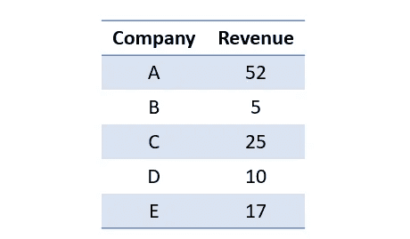

表 1:显示五家公司年收入(十亿美元)的综合数据。

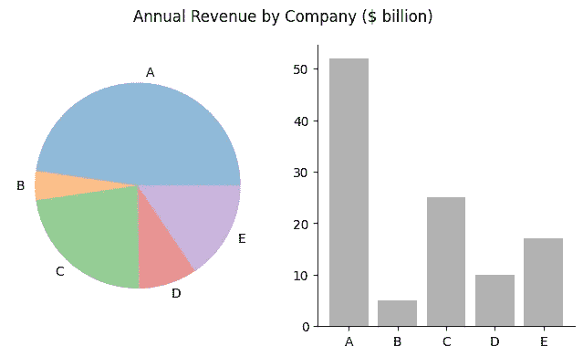

图 1:在饼图中，很难确定小切片相对于大切片的比例。例如，在相应的柱状图中，很明显 A 公司的收入是 B 公司的十倍，而 B 公司的收入是 d 公司的一半。

## 显示时间信息

随着时间的推移，变化是非常难以察觉的。在下图中，无法从饼图中推断出每个切片随时间的变化，而在条形图中，可以立即识别出这些变化。

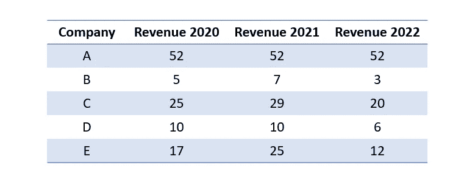

表 2:显示五家公司连续三年年收入(十亿美元)的综合数据。

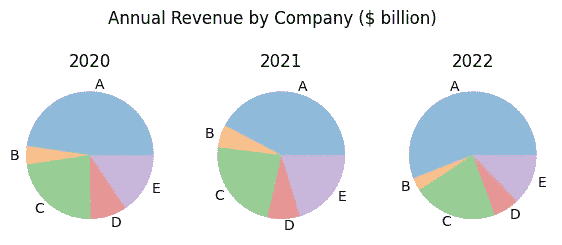

图 2.1:看这些饼图，A 公司 2021 年的收入比 2020 年少，然后在 2022 年增加。相比之下，E 公司的收入在此期间似乎相当稳定。事实上，A 公司的收入稳定在 520 亿美元，而 E 公司的收入波动很大。数字基于表 2。

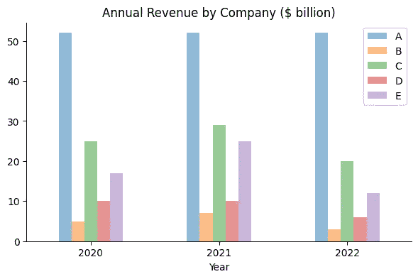

图 2.2:将上述数据绘制成柱状图，可以更容易地发现收入随时间的波动。人们可以清楚地看到 A 公司收入的稳定性以及 e 公司收入的波动性。

*注意:*如果数据中的时间段更长，则使用折线图可以更有效地传达这一信息。

## 比较相似大小的切片

当试图比较大小相似的切片时，会出现另一个问题。

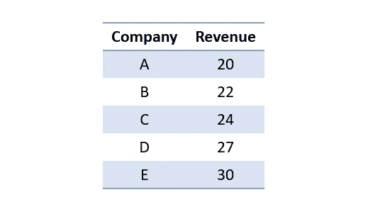

表 3:显示五家公司年收入(十亿美元)的综合数据。

图 3:看饼状图，能看出 A 公司和 B 公司的营收哪个更高吗？A 公司和 C 公司，或者 B 公司和 D 公司呢？同样，右边的条形图更有效地传达了这一信息。数字基于表 3。

## 仅显示两个值

如果你只是比较两个数值，那就没有理由使用饼状图或者其他图表(图 4)。在这种情况下，简单地用数字而不是图表来传达信息会更有效。

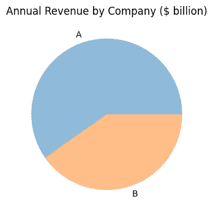

图 4:说明两家公司年收入的饼状图。生成图表来传达这种类型的信息是完全多余的。简单地说，A 公司的收入是 520 亿美元，而 B 公司的收入只有 350 亿美元，就能说明问题。

## 整体的一部分

如果需要显示整体是由什么组成的，树形图通常是更好的选择(图 5)。它不仅避免了读取角度的问题，而且还方便了标记方面，因为矩形比饼图中的楔形提供了更多的空间。如果需要的话，还可以很容易地扩展它们，以显示更多的值。理论上，饼图也可以扩展；然而，在饼的中心会有很多浪费的空间，并且标签问题只会随着饼的增长而加剧。此外，树状图也可以用于多层次数据，因为矩形可以很容易地分成子类别——这对于饼状图中的楔形来说是很困难的。

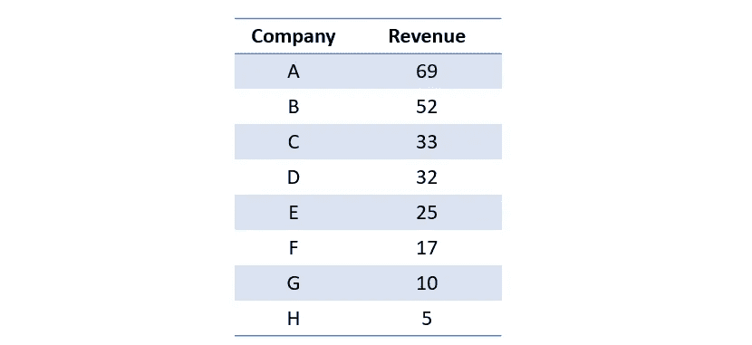

表 4:显示八家公司年收入(十亿美元)的综合数据。

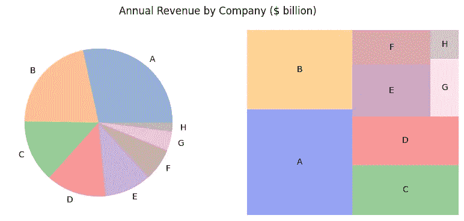

图 5:右边的树形图使得可视化处理和解释所呈现的信息更加容易。此外，它支持多级数据的显示，更易于扩展和标记。数字基于表 4。

## 添加效果

在任何情况下都应避免使用 3D 或爆炸饼图(图 6 ),因为这些影响通常会导致数据进一步失真。

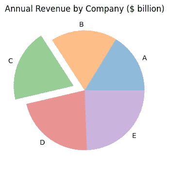

图 6:带有分解楔形的饼图。虽然由于我们天生没有阅读角度的能力，解释常规的饼状图已经很困难了，但这种描述进一步加剧了这个问题。数字基于表 3。

不出所料，爱德华·塔夫特对此也有自己的看法:

> 经常扭曲数据的表面修饰永远也不会弥补潜在的内容缺乏。—爱德华·塔夫特

# 例外

虽然我强烈反对在大多数情况下使用饼图，但在我看来，有两种情况下饼图可能是有益的:(1)如果唯一的目标是证明一个部分占整体的大多数，以及(2)如果分数正好是 25%或 50%。

## 关注最大的一块

如果图示的唯一目的是显示一个特定的部分占整体的大部分，或者超过所有其他部分的总和，那么饼图的使用是合理的。这种信息通常很难从条形图中获得，因为您必须手动将所有其他条形图相加才能获得这种洞察力(图 7)。

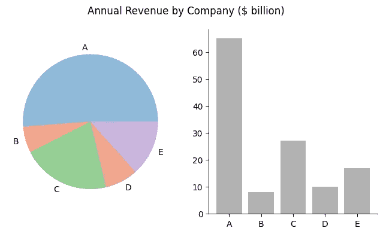

图 7:在左边的饼状图中，很容易看出公司 A 的收入高于所有其他公司的收入总和。通过分析相应的条形图，很难得出这种见解。

## 分数是 25%或 50%

虽然这种情况很少发生，但是如果您处理的数据恰好是 25%或 50%(图 8)，那么饼图可以很好地说明这一点。

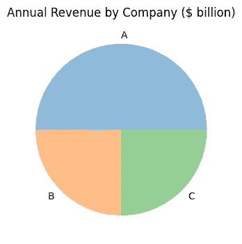

图 8:饼状图说明公司 A 的收入是公司 B 和 c 的两倍。

# 结论

本文中的插图表明，使用饼图几乎从来都不是一个好主意，在大多数情况下，简单的条形图提供了一个很好的替代品，有助于提取洞察力。虽然 3D 图表或爆炸切片等视觉效果在页面上看起来很花哨，但实际上它们并没有添加任何信息，而且事实上还会进一步扭曲数据。如果需要显示整体的组成，树形图是首选，因为它不需要读者评估角度，支持多级数据的显示，并避免了图表增长时的标记问题。

然而，如果唯一的目的是说明一个特定的切片构成了整体的大部分，或者如果切片的比例恰好是 25%或 50%，那么饼图的使用可能是合理的。

# 参考

[1]t .蒙兹纳(2015 年)。*可视化分析与设计*。CRC 出版社。ISBN: 9781498759717。

[2]爱德华·塔夫特，*饼状图*。【https://www.edwardtufte.com/bboard/q-and-a-fetch-msg? msg_id=00018S 。

[3]墨尔本大学，*为什么不应该用饼状图*。[https://SCC . ms . unimelb . edu . au/resources/data-visualization-and-exploration/no _ pie-charts](https://scc.ms.unimelb.edu.au/resources/data-visualisation-and-exploration/no_pie-charts)。