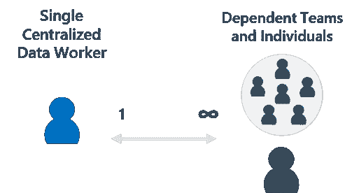
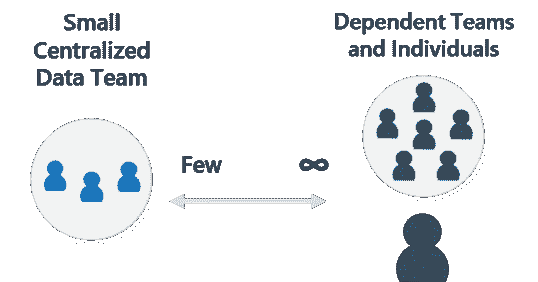
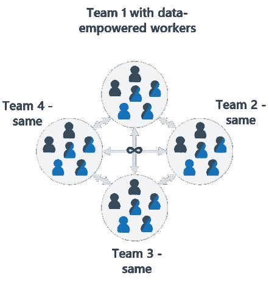
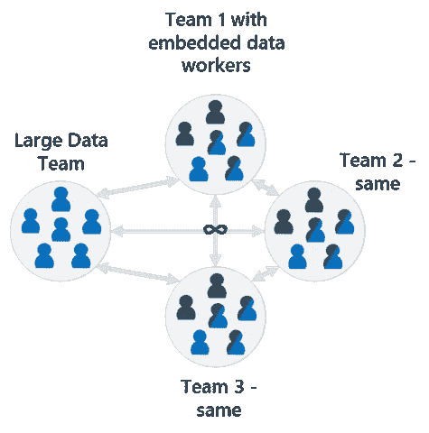
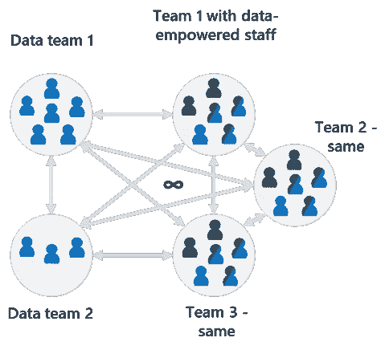
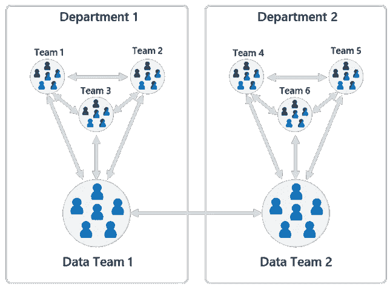
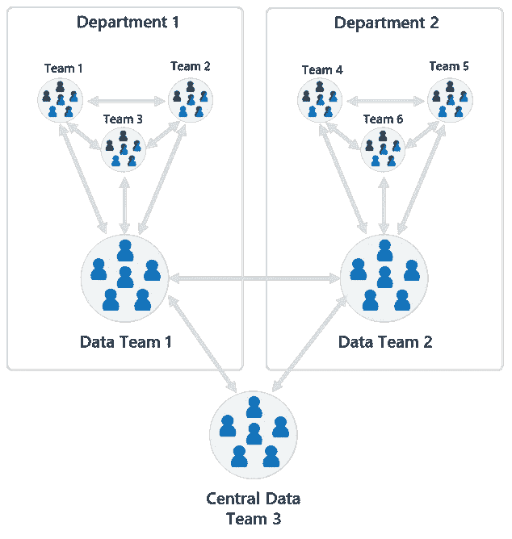
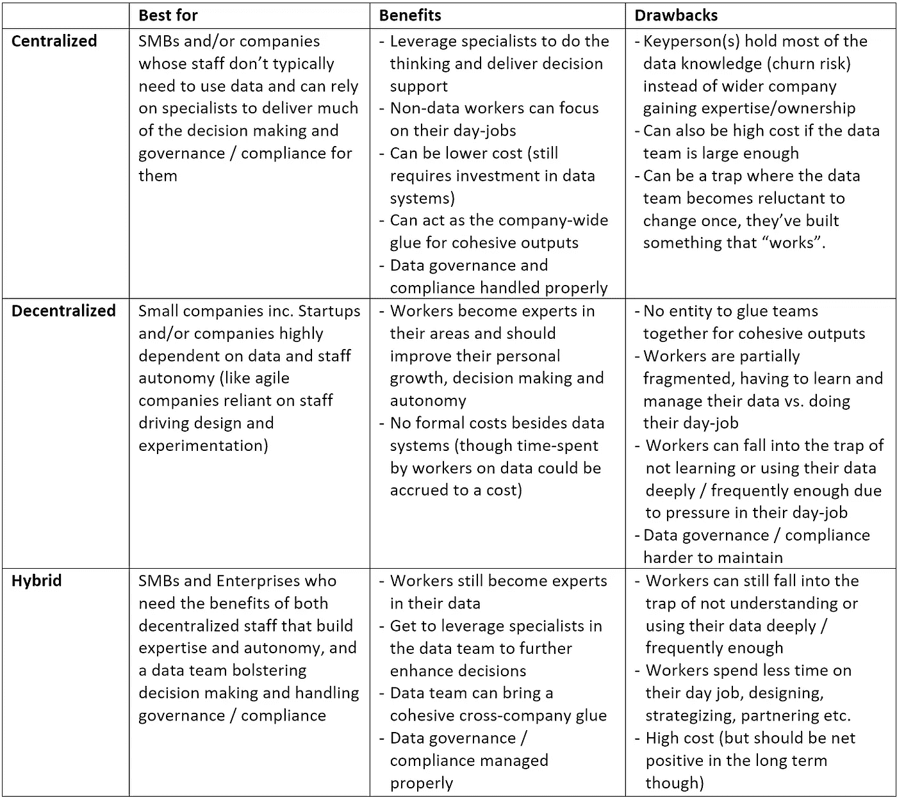

# 混合数据组织的案例

> 原文：<https://towardsdatascience.com/the-case-for-a-hybrid-data-organization-bb6dc6211acf>

## 数据组织

# 混合数据组织的案例

## 在各种形状和规模的数据组织中工作或与之共事 15 年的经验

过去的 15 年是一段有趣的旅程。我在几个不同的部门、国家和产品中工作，有幸参与了数据行业在这段时间里发生的令人难以置信的变化。

让我印象深刻的一件事是我参与(或合作)的数据组织的形状、大小和职权范围，以及它们对公司运营、产品和客户的影响程度。

举几个例子:一个人处理几千兆字节的数据，小型数据团队处理几千兆字节的数据，企业拥有众多国际互联的数据团队。

在每一种情况下，公司(或大型部门)都以自己独特的方式实现他们的数据组织和系统，随着时间的推移，随着需求的增加而进行调整和创新。然而，根据公司的属性，如规模、预算、成熟度、地理位置、监管要求等，每种方法都有共性、优点和缺点。

本文旨在强调我观察到的三种常见的数据组织类型，它们在文献中经常被讨论；集中式、分散式和混合式。最后，我将证明混合动力在许多情况下是理想的。

# 首先，我们来回答一个基本问题。为什么公司有某种形式的数据组织？

决策支持！

*就本文的目的而言，我将把明确的决策支持数据组织和系统与运营数据组织和系统分开，运营数据组织和系统的存在主要是为了保持诸如法规遵从性之类的正常运行。*

对于任何公司来说，数据组织都是一项昂贵的承诺，其预期结果是投资将从更有效的决策中获得正回报。虽然没有个人或公司是完美的决策者，数据本身也不能保证这一点，但公司至少可以努力提高做出更有效决策的机会。

对于一个公司来说，要建立和保持他们的竞争优势，这些决策必须尽可能地有影响力(增长)和有效率(成本)，最好是需要尽可能少的决策。换句话说，公司必须不断努力达到最佳决策影响比。

如今，以数据为导向的决策可以延伸到公司的每个角落，并提出了什么类型的数据组织可以支持这种广度的问题。没有放之四海而皆准的方法，但我通常观察到三种类型:

*   **集中式** —个人/团队拥有其他行业/团队的数据并为其工作
*   **分散化** —每个个人/团队都拥有、成为专家并利用他们自己的数据
*   **混合** —以上的组合

有些人可能会争论这些定义，这没什么。这些是我对数据团队和非数据团队合作伙伴之间动态的观察。

# **让我们看看过去的一些数据组织**

*请注意，这些都是基于我的经验和观点，并不是对所有可能的数据组织的全面评估。*

作者图片

## **小公司集中一个人的数据带**

作者图片

*   **公司类型**:小型，很少/很少持续的数据支持需求，经常临时运营。系统简单，数据集小。
*   **主要任务**:基本报告/分析，通常是临时的
*   **好处**:低成本，开始辅助决策
*   **弊端**:关键人物依赖，意味着大部分数据技能和知识被锁在一个人身上(流失风险)。一个人也可能过于分散(并可能超负荷)，而没有在某个特定领域积累专业知识。

## **中小型企业中的小型集中团队**

作者图片

*   **公司类型**:具有中等持续数据支持需求和较大、略复杂的系统和数据集的中小型企业。
*   **主要职责**:更广泛的报告范围，开始有正式的指标/渠道、基本分析、维护数据系统和确保法规合规性。
*   **好处**:成本仍然相对较低，比单人更具响应性和能力，可以开始支持战略决策。
*   **缺点**:机会成本使企业中的员工没有建立他们的数据技能和领域知识，而仅仅依靠数据团队。

## **分散在一家小公司的精通数据的员工**

作者图片

*   **公司类型**:小公司，没有多余资源的初创公司
*   **:特定领域的报告、计划、分析、实验等。**
*   ****好处**:很少/没有正式的数据资源成本除了数据系统之外，员工(应该)成为其数据、产品和客户的完全所有者和专家，这应该能够实现更好、更有效的自主决策。**
*   ****缺点**:学习和使用数据和工具而不是执行其他日常任务的潜在机会成本，数据系统和法规合规性更难维护**

## ****中小型企业中分散的精通数据的员工****

****

**作者图片**

**与分散的小公司非常相似，但具有放大的属性。**

**此外，没有一个这样规模的实体来粘合所有团队，并提供统一的输出和跨公司的叙述可能会成为一个问题。每个团队也可能变得过于孤立，不共享知识，并且在没有沟通的情况下做出影响其他团队的决策。员工可能会陷入忙碌的陷阱，无法频繁或充分地学习或使用他们的数据来增强决策。**

## ****简单混合中小型企业/企业****

****

**作者图片**

*   ****公司类型**:中小型企业和企业，他们需要团队实现大部分数据自治，但也承认需要专家来支持数据系统和执行更深入更复杂的工作。**
*   ****主要职责**:更高级的报告和分析，潜在的数据科学公司，机器学习和统计建模，实验支持，维护数据管道和监管。数据团队可能开始在高管层拥有一席之地(想想首席数据官)。**
*   ****好处**:公司中大多数精通数据的员工应该能够提高他们的决策能力，同时也能够与专家合作来加强这些决策或卸载更复杂的工作。数据管道应该更加稳健、全面和合规。**
*   ****缺点**:在这个阶段，人员和系统可能是一项重要的投资，尽管从理论上来说，这项投资应该会产生净收益。工作人员仍然会陷入忙碌的陷阱，没有足够频繁或深入地学习或使用他们的数据，或者将太多内容转移给数据团队。**

## ****多专业混合型企业****

****

**作者图片**

**与“简单”相同，但有多个数据团队，每个团队有不同的专长，例如，一个团队可能负责报告，另一个团队负责数据管道，另一个团队负责回答复杂问题的数据科学。**

**相对于简单混合模式的额外好处是角色更分散、更集中。例如，数据科学家可以更高效地完成工作，而不必同时做行政报告或管理管道。然而，在这种情况下，不利的一面可能是他们失去了业务中正在发生的事情的背景/可见性。**

## ****分布式混合企业****

****

**作者图片**

**与 simple(可能是多专业)相同，但公司足够大，可以保证每个部门都有自己的数据组织，因此增加了专业性，但每个部门(应该)一起工作以保持同步。**

## ****分布式混合企业与中央“粘合”团队。****

****

**作者图片**

**与分布式相同，但有一个独立的数据团队，将所有其他部门粘合在一起。部门数据团队专注于本地，中央团队处理跨部门的综合报告和分析，包括针对高管层的汇总叙述。该团队还可能维护一个集中的数据存储库，其中包含同质的部门数据。**

# ****共性总结****

**正如我们所见，没有固定的定义，也没有一个单一的定义适用于所有公司。下表旨在总结一些观察结果和共性:**

****

**作者提供的表格/图片**

# ****为什么沥青要进行杂交？****

**除了增强决策能力之外，还有三个主要原因:**

**1.**协作影响(1+1=3)** —精通产品和客户的员工与解决复杂性和/或跨公司凝聚力的专家的结合，应该会在整个公司产生更有效的决策。**

**2.**治理和合规** —保留数据团队可以减轻员工的压力，让他们专注于自己的工作而不是系统，并确保数据得到治理(一致、准确和可信)和合规(想想 GDPR/CCPA/COPPA/HIPPA 等。).**

**3.**对每个人都有好处** —每个人都是自己产品、客户和各自数据的专家，可以培养更好的产品经理，促进学习和个人成长，企业中的其他人也应该通过潜移默化而受益，公司有望更加成功。**

# ****(可选阅读)让我们来看一些场景，在这些场景中，混合动力车可能比其他车更有意义****

## ****一家小型创业公司****

**假设你是一个初创公司的创始人，即将从一个人的公司扩张到十个人的公司。你有足够的种子资金来开发你的想法，并将其投放到市场，但没有太多了。但是，您知道您需要数据来做出更有效、更快速的决策，并且已经拥有了基本的现成数据管道，能够进行简单的报告和分析。但是由于您缺乏资源，您将需要(目前)所有员工成为各自数据领域的专家，并执行大部分自主决策。所以，这应该是一个分散的模式，员工可以“凑合”吧？**

**也许不是。这些员工还能抽出时间和机会成本来维护数据管道、构建/监控/修复产品遥测、创建和分析出色的客户调查、建立营销活动系统、确保遵守所有法规、制定深入的季度/年度报告等吗？**

**请记住，根据严重程度，即使一次违反 GDPR 法规的行为也会使您的公司损失 2-4%的年收入。**

**让 1-2 名数据工作者组成一个小型混合数据组织来帮助处理上述大部分工作，同时确保 10 名员工仍然是他们数据的专家，这可能是值得的。**

## ****中间业务****

**假设您刚刚被一家 1，000 强公司聘用为首席数据官(CDO)，负责建立其首个数据组织。该公司是成功的，势头强劲，但并不认为这是理所当然的。他们知道他们需要构建并更好地利用他们的数据资产来保持竞争力和合规性。**

**企业周围的员工大多根据个人判断和电子表格中的基本数据做出大多数决策，因此还没有形成数据文化。因此，最简单、最快捷的解决方案是建立一个集中的数据团队，您可以尽快开始运行并生成输出。对吗？你终究会勾选你的汇款的基本方框。**

**还是你有？您的团队资源有限，因此除了团队的日常任务(如管理数据管道和法规遵从性责任)之外，您无法满足业务中每个人的决策需求。所以，你没有有意义地改变现状。大多数员工仍然很少使用数据(并且可能没有动力使用)，并且您所取得的大部分成果是进一步将一些责任卸载/转移到您自己的团队。该公司肯定处于一个更好的状态，但你有一个革命的机会，而不是进化。**

**相反，如果你承受了短期的痛苦，领导业务范围的计划，以建立一种数据主导的文化，通过教育和帮助他们实现利益，使其成为他们日常工作的核心部分，随着时间的推移，你应该实现一种授权和民主化的数据文化。你的团队变得更像一个咨询/增强机制，而不是所有者。**