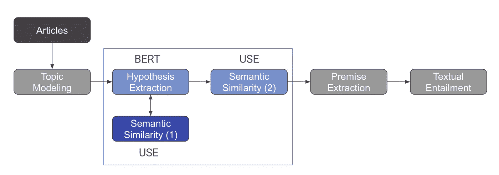
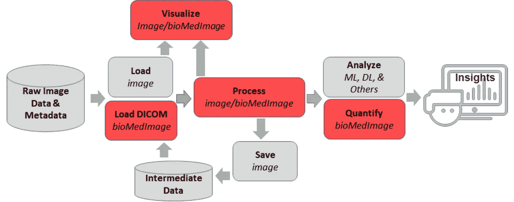
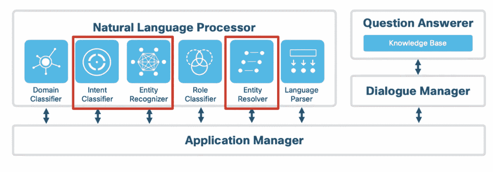
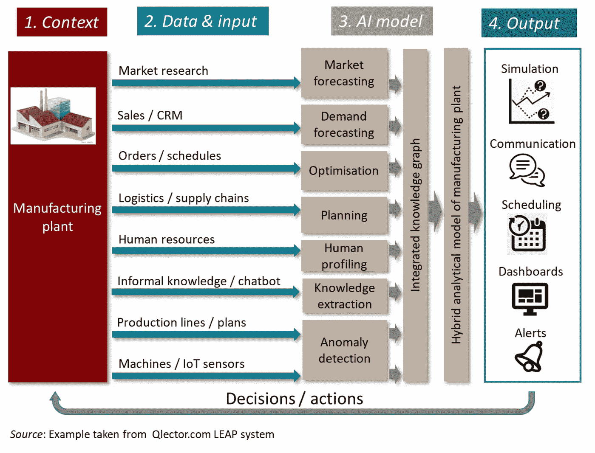

# 复合系统的案例

> 原文：<https://towardsdatascience.com/the-case-for-composite-systems-11632220ffa8>

## AI 系统一起更强吗？

卡尔·阿布伊德在 [Unsplash](https://unsplash.com/@spongzy?utm_source=unsplash&utm_medium=referral&utm_content=creditCopyText) 上的照片

T 何按‘意见’没道理。我困惑地盯着我的屏幕，滚动着一页 2020 年最受欢迎的新闻文章中的句子和不那么微妙的广告:像“有些已经这样了”这样的短语、“在这里看最新一集……”，还有“好莱坞万人迷”。

我微调的机器学习模型提取了几十个这样的“观点”呈现给我。从上下文来看，这些短语本身是有意义的——它们是更大的新闻文章的一部分，处理围绕新冠肺炎疫情、教育和娱乐业的叙事。虽然我的机器学习(ML)模型似乎抓住了一些强烈的情绪，但它对更大的画面没有用处。

为什么？我的团队正在为新闻分类构建一个 ML 模型管道。我负责使用 BERT 模型来查找个别文章中表达强烈观点的句子。然后，这些意见将被传递给第二个模型，即 USE，以计算来自 BERT 的意见和相关新闻文章的**聚类**之间的**相似度**。

但是 BERT 的输出对于使用模型来说不够相关。

抓耳挠腮，就在那一刻，我意识到我们不只是在寻找强有力的观点——我们在寻找强有力的观点，这些观点**有意义**。

然后来了一个*哈！*瞬间。如果我们在将 BERT 模型的输出发送到主使用模型之前，使用一个更小的使用模型对其进行后处理，会怎么样呢？我们将使用这个更小的使用模型来测量由 BERT 模型*识别的观点与文章本身的相似性，并且*丢弃那些与文章本身*语义不相似*的观点。所有这些都可以在保持原有管道完好无损的情况下完成。

我们的新闻聚合模型使用复合人工智能来处理我们的假设提取模型的输出——修改自[来源(第 3 页)](https://aclanthology.org/2020.argmining-1.7.pdf)

通过这个小小的技巧**使用一个机器学习模型来增强另一个**，我开始从我的模型中提取的观点中看到更多的意义:受访者的语录、怀疑和喜悦的表情以及个人轶事。诸如“我在社交媒体上看到了无数的帖子……这是一种特别渴望的逃避现实的方式”“……有人担心他们对……的信仰。”，还有“‘你不可能…’”说…”。

复合系统帮助我的团队从我们的[硕士项目](https://aclanthology.org/2020.argmining-1.7.pdf)的模型中挖掘更多的意义。

这些类型的系统，有时被称为 **ML 反馈回路**，在学术界和工业界都很流行——事实上，Gartner 最近将[复合人工智能](https://www.gartner.com/en/documents/4010110)确定为一种新兴的技术趋势。但是，对于坐在方向盘后面的数据科学家来说，这些工作流是什么样的呢？

# 野外的复合人工智能

复合系统并不新鲜。当我们谈到这一点时，有许多相邻的 ML 子空间浮现在脑海中，包括[集合模型](https://machinelearningmastery.com/tour-of-ensemble-learning-algorithms/)(例如:随机森林🌳🌳🌳)甚至[多任务学习](https://ruder.io/multi-task/)！看到这些方法论如何与复合人工智能交叉将是令人兴奋的。

这里有几个案例研究，说明复合系统是如何在今天的生产中使用的。

## **案例研究 1:医疗保健**

复合人工智能系统并不局限于组合多个人工智能模型。这类人工智能技术还可以包括使用多种*数据处理*技术和额外的操作，以帮助实现供应链管理和个性化等目标。

SAS 与阿姆斯特丹大学医学中心分享了一个有趣的[用例:使用计算机视觉、数据可视化和机器学习过程的组合来确定化疗对患者是否有效！](https://blogs.sas.com/content/sascom/2021/05/20/see-how-composite-ai-benefits-retailers-doctors-and-bankers/)

医学研究人员引用说，能够从统计分析和可视化开始，然后深入到患者扫描的细节，是使用复合人工智能的一个关键好处。下图阐明了使用 CT 扫描进行结直肠癌肝转移形态测量的处理流程。

“SAS Vita 中用于端到端生物医学图像分析的处理管道”——[来源](https://www.sas.com/content/dam/SAS/support/en/sas-global-forum-proceedings/2019/3341-2019.pdf)(第 3 页)

## **案例研究二:语音助手**

为了消费、处理和生成对命令的响应，语音助理应该能够有效地执行多项任务。

Webex 团队为 Webex Assistant (如下)展示了一个自然语言处理[管道示例，包括语音到文本、实体识别、问题回答等 ML 模型。](https://blog.webex.com/engineering/robust-nlp-for-voice-assistants/)

这些模型中的每一个都可能需要它们自己的数据清理元素和健壮性评估。正如作者所演示的，如果第一个语音到文本组件错误地转录了语音命令，整个管道都会受到糟糕的数据质量的影响！

用于 Webex 助手的语音助手管道示例— [来源](https://blog.webex.com/engineering/robust-nlp-for-voice-assistants/)

## **案例研究 3:制造业**

[OECD 人工智能系统分类框架](https://www.oecd.org/publications/oecd-framework-for-the-classification-of-ai-systems-cb6d9eca-en.htm)引用了一个令人兴奋的制造领域复合人工智能系统的例子，取自 [Qlector LEAP](https://qlector.com/) 解决方案。

作为这个用例的一部分，多个人工智能模型消耗与制造工厂相关的和源自制造工厂的数据。这些模型适用于不同的任务，如人类特征分析、市场预测、异常检测等。然后将输出汇总为用于不同类型决策的**知识图**的一部分。

帮助管理制造工厂的复合人工智能系统— [来源(第 61 页)](https://www.oecd-ilibrary.org/docserver/cb6d9eca-en.pdf?expires=1662871471&id=id&accname=guest&checksum=6CD62D74D5C547E2D8776FF913C7CE9E)

随着这些系统的研究和使用的继续，我期待着看到我们如何回答围绕“一个为所有”和“所有为一”应用于机器学习的问题。

有一点是肯定的:复合系统的定义正在继续扩展到数据和人工智能工作流的不同元素(就像复合和分布式人工智能的交集！)，证明人工智能系统在一起更强大。